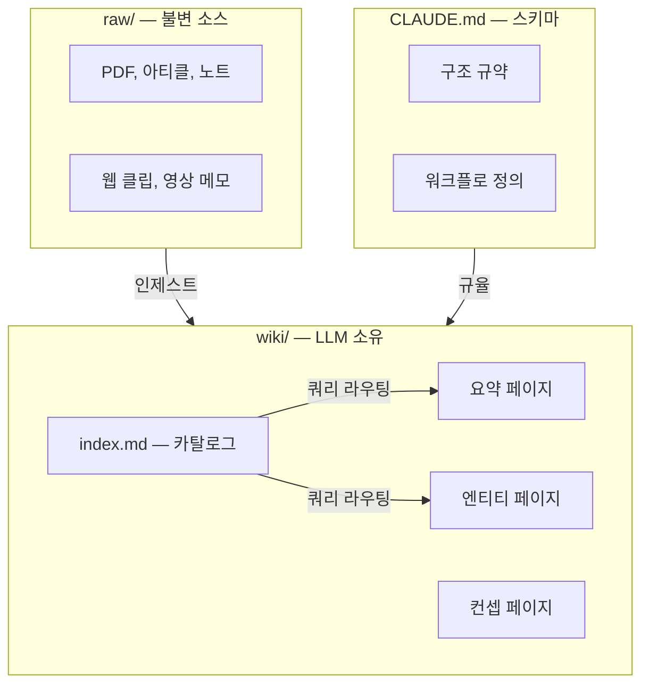

## 왜 지금 이 주제인가

2026년 4월, Andrej Karpathy가 트윗 + [GitHub Gist](https://gist.github.com/karpathy/442a6bf555914893e9891c11519de94f)로 "LLM Knowledge Bases" 패턴을 공개했다. 16M+ 뷰, 5000+ 스타를 4일 만에 달성. 핵심 메시지: **"지식을 매번 검색(retrieve)하지 말고 컴파일(compile)하라."**

이 위키(ai-study)는 이미 LLM-First 원칙으로 119 엔트리를 운영 중이지만, Karpathy 패턴과 비교하면 **인제스트 시 크로스 레퍼런스 자동 업데이트**와 **위키 품질 lint**가 약하다. 이 갭을 메우면 Compound Engineering의 복리가 더 빨라진다.

---

## 핵심 개념 — Compilation > Retrieval

### RAG의 한계

RAG(Retrieval-Augmented Generation)는 질문할 때마다 원본에서 관련 청크를 검색하고 답변을 생성한다. 이 방식의 문제:

- **매번 재합성** — 5개 문서를 교차해야 답이 나오는 질문이면 매번 5개를 찾아서 조합
- **축적 없음** — 어제 합성한 통찰이 오늘 검색에 반영 안 됨
- **연결 미발견** — 임베딩이 잡지 못하는 간접 연결은 영원히 발견 안 됨

### LLM Wiki의 전환

LLM Wiki는 **인제스트 시점에 합성**한다:

1. 새 소스를 읽는다
2. 기존 위키의 관련 페이지를 찾는다
3. 요약 페이지를 생성하거나 기존 페이지를 업데이트한다
4. 크로스 레퍼런스를 추가한다
5. 모순이 있으면 플래그한다
6. index.md를 갱신한다

**한 소스 인제스트 = 10~15 페이지 동시 업데이트.** 합성이 한 번 일어나고 결과가 위키에 축적된다. 다음 쿼리는 이미 컴파일된 지식에서 답을 가져온다.

---

## 3층 구조

| 레이어 | 소유자 | 규칙 |
|---|---|---|
| **raw/** | 사람 | 불변 — LLM이 절대 수정 안 함 |
| **wiki/** | LLM | 완전 소유 — 생성/수정/삭제 자유 |
| **index.md** | LLM | wiki/ 변경 시 자동 갱신. 한 줄 요약 카탈로그 |
| **CLAUDE.md** | 사람 | 위키 규약 + 워크플로 정의 |

### index.md의 역할

벡터 DB 대신 **한 줄 요약 카탈로그**를 LLM이 먼저 읽고, 관련 페이지만 drill-down. 100~수백 페이지 규모에서는 이것만으로 충분하다 (ANN/임베딩 불필요).

---

## 3 워크플로

| 워크플로 | 트리거 | 동작 |
|---|---|---|
| **인제스트** | URL/파일 투입 | 소스 읽기 → 요약 페이지 생성 → 기존 페이지 10~15개 크로스 업데이트 → index 갱신 → log 기록 |
| **쿼리** | 질문 | index.md 읽기 → 관련 페이지 로드 → 합성 답변 (출처 인용) → 가치 있으면 wiki에 재박제 |
| **린트** | 주기적 | 모순 탐지 / 고아 페이지 / 누락 연결 / 데이터 갭 / stale 클레임 점검 |

---

## ai-study 위키와의 비교

| 차원 | Karpathy LLM Wiki | ai-study 위키 | 갭 |
|---|---|---|---|
| **컴파일 철학** | "매 인제스트에 10~15 페이지 업데이트" | `/ingest` → 1 엔트리 생성 + connections 수동 | 크로스 업데이트 자동화 부족 |
| **불변 소스** | raw/ 디렉토리 | 없음 (원본 URL만 출처에 기록) | raw/ 레이어 부재 |
| **인덱스** | index.md (한 줄 카탈로그) | content-manifest.json (프로그래매틱) | 기능적 동등 |
| **린트** | 모순/고아/갭 탐지 | `validate-content.mjs` (MDX/Mermaid 문법만) | **위키 품질 린트 부재** |
| **JIT 검색** | index.md → drill-down | Layer 3 POC (임베딩 + 라우터) | ai-study가 더 진보 |
| **자동 박제** | `/compound` 개념 없음 | `/compound` (CHANGELOG + 회고 + 솔루션) | ai-study 우위 |
| **LLM-First** | 암시적 (markdown 중심) | 명시적 (AI Agent Directive 섹션) | ai-study 우위 |

**ai-study가 Karpathy 패턴보다 강한 점**: Compound Engineering 루프, AI Agent Directive, JIT 검색 인프라, 13 카테고리 구조화.

**ai-study가 약한 점**: 인제스트 시 크로스 업데이트 자동화, 위키 품질 린트, raw/ 소스 보존.

---

## 실전 팁 / 안티패턴

### 적용할 것

1. **인제스트 크로스 업데이트** — `/ingest` 실행 시 새 엔트리뿐 아니라 관련 기존 엔트리의 connections + 출처 섹션도 자동 업데이트. 이미 Journal 006/007에서 수동으로 역링크 보강을 했는데, 이를 자동화
2. **위키 린트 확장** — `validate-content.mjs`에 추가: 고아 엔트리(connections 0), 일방향 연결 탐지, AI Agent Directive 누락 경고
3. **index.md 대응물** — `content-manifest.json`에 이미 한 줄 description이 있으므로, 이를 LLM이 직접 읽을 수 있는 `wiki-index.md` 형태로도 생성

### 안티패턴

- **Obsidian으로 전환하려는 충동** — ai-study는 Next.js 웹앱으로 이미 배포 중. Obsidian은 로컬 도구. 핵심은 도구가 아니라 **컴파일 패턴**
- **raw/ 디렉토리에 모든 원본 저장** — 저작권 이슈. URL + 메타데이터만 보존하는 현재 방식이 안전
- **벡터 DB 도입 시도** — 100~수백 엔트리 규모에서 brute-force 1~2ms면 충분 (Journal 025 실측)

---

## 내 프로젝트에 적용하기

1. **`/ingest` 크로스 업데이트 Phase 추가** — 새 엔트리 생성 후 기존 엔트리 connections 자동 스캔 + 역링크 추가. "교훈→도구→사례 3단 연결"([Journal 006](/wiki/harness-engineering/aidy-journal-006-ios-ci-self-hosted-runner-migration))을 자동화
2. **`validate-content.mjs` 위키 린트 확장** — 고아 엔트리 경고 / AI Agent Directive 누락 경고 / 일방향 connections 탐지. Phase 1은 warning-only (N=3 승격 원칙)
3. **`wiki-index.md` 자동 생성** — prebuild에서 content-manifest.json과 함께 "카테고리별 한 줄 요약" 마크다운도 생성. 에이전트가 검색 전 이것부터 읽으면 drill-down 효율 상승
4. **Karpathy 패턴 핵심 3가지를 `/ingest`에 통합** — (a) 인제스트 시 크로스 업데이트 (b) log.md 대응 (이미 CHANGELOG가 있음) (c) lint 주기 실행
5. **AI Agent Directive 커버리지 70%+ 달성** — 현재 52%. Karpathy 패턴의 "위키가 LLM의 실행 가능한 입력"이려면 Directive 섹션이 핵심

---

## 자기 점검

1. RAG와 LLM Wiki의 근본 차이를 "compilation vs retrieval"로 설명할 수 있는가?
2. raw/ 레이어가 불변이어야 하는 이유를 출처 추적 관점에서 설명할 수 있는가?
3. ai-study 위키가 이미 Karpathy 패턴과 겹치는 부분 3가지를 즉시 나열할 수 있는가?
4. 인제스트 시 10~15 페이지 업데이트가 왜 단일 엔트리 생성보다 복리 효과가 큰지 설명할 수 있는가?
5. (열린 질문) Karpathy 패턴의 lint 워크플로를 ai-study의 `validate-content.mjs`에 어떻게 통합할 것인가?

### 실습 과제

1. `npm run search -- "모순 탐지"` 실행 — 현재 JIT 검색이 "모순" 관련 엔트리를 찾을 수 있는지 확인
2. `content-manifest.json`에서 connections가 0인 엔트리를 스크립트로 추출 — 고아 엔트리 목록 확인
3. `/ingest` 실행 후 수동으로 역링크를 추가한 경험을 떠올리고, 자동화할 지점을 3개 나열

---

## AI Agent Directive

### Trigger
- 사용자가 "지식 관리", "second brain", "Karpathy", "LLM Wiki" 언급 시
- 위키 엔트리 간 연결이 약하다고 느낄 때
- `/ingest` 후 크로스 업데이트를 자동화하고 싶을 때
- 위키 품질 린트를 확장하고 싶을 때

### Prerequisites
- [LLM-First Wiki 설계 원칙](/wiki/harness-engineering/llm-first-wiki-principles)
- [Compound Engineering 철학](/wiki/harness-engineering/compound-engineering-philosophy)
- [JIT Retrieval POC](/wiki/harness-engineering/harness-journal-025-jit-retrieval-poc-phase1)

### Actionable Steps
1. **인제스트 크로스 업데이트 구현** — `/ingest` Phase 4 이후, 새 엔트리의 tags/connections와 매칭되는 기존 엔트리를 스캔하여 connections 역링크 자동 추가
2. **위키 린트 확장** — `validate-content.mjs`에 고아 엔트리 / AI Agent Directive 누락 / 일방향 연결 경고 추가
3. **`wiki-index.md` 자동 생성** — prebuild 스크립트에서 카테고리별 한 줄 요약 마크다운 생성
4. **Karpathy 패턴의 "compilation" 원칙을 Compound Engineering과 통합** — 인제스트 = 컴파일, /compound = 박제, lint = 품질 유지의 3 루프

### Anti-patterns
- **Obsidian 전환 시도** — 도구가 아니라 패턴이 핵심. Next.js 웹앱 유지
- **벡터 DB 도입 서두르기** — 수백 엔트리 규모에서 brute-force로 충분
- **raw/ 디렉토리에 원본 전체 저장** — URL + 메타데이터가 안전
- **한 번에 모든 기존 엔트리 크로스 업데이트** — 점진적으로. 새 인제스트부터 적용

---

## 출처

- 원본: [Karpathy LLM Wiki Gist](https://gist.github.com/karpathy/442a6bf555914893e9891c11519de94f) (2026-04-04, 5000+ stars)
- 보강 자료:
  - [How I Took Karpathy's LLM Wiki and Built an AI-Powered Second Brain in Obsidian](https://aimaker.substack.com/p/llm-wiki-obsidian-knowledge-base-andrej-karphaty) — 3층 구조 + Obsidian 통합 상세
  - [What Is Andrej Karpathy's LLM Wiki? — MindStudio](https://www.mindstudio.ai/blog/andrej-karpathy-llm-wiki-knowledge-base-claude-code) — 배경 맥락 + Claude Code 연동
  - [The Andrej Karpathy LLM Wiki Idea: Knowledge as "Compiled Code"](https://reliabilitywhisperer.substack.com/p/the-andrej-karpathy-llm-wiki-idea) — compilation 철학 분석
- 영상 (이 엔트리의 트리거): [카파시가 모두의 Claude Code를 10배 향상 시켰습니다](https://www.youtube.com/watch?v=H9Wml5xDLLY) — freAiner AI & Automation 채널

### 검증 메모

- Karpathy Gist 원문은 WebFetch로 직접 확인. 3층 구조 / compilation vs retrieval / 인제스트 10~15 페이지 업데이트 등 핵심 개념 교차 검증 완료
- "16M+ 뷰, 5000+ stars" 수치는 WebSearch 검색 결과 3개 소스에서 일치
- 영상(freAiner)은 트랜스크립트 미확보 — 본문 내용은 Gist 원문 + 블로그 2개에서 교차 확인. 영상 고유 주장은 인용하지 않음
- ai-study 위키와의 비교는 현재 프로젝트 상태(`content-manifest.json` 119 entries, JIT Phase 2b/2c 완료) 기준
