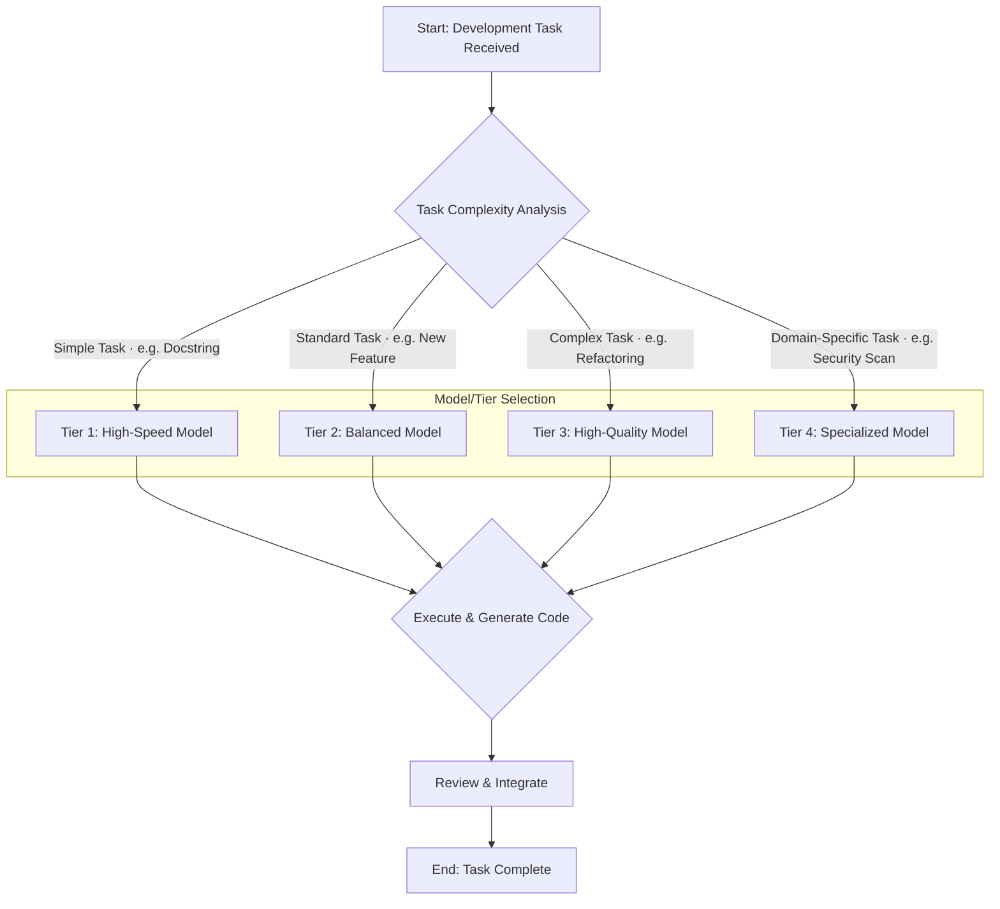

> **출처 검증 노트:** 긱뉴스 자동 큐레이션 (#124, 2026-05-10) 초안 기반. 원본 URL 미캡처. 원본 소스가 "GPT-5.5"를 언급했으나 이는 실재하지 않는 모델명 — 본 엔트리는 해당 수치를 직접 인용하지 않고 개념적 프레임워크로 재구성했습니다. Tier 분류 자체는 일반적인 비용-성능 최적화 접근이며, 대표 모델명은 2026-05 기준 실제 모델(Gemini 2.5 Flash-Lite / Haiku 4.5 / Sonnet 4.6 / Opus 4.7)로 갱신되었습니다.

> **본인 메모:** ai-study Gemini 과외 파이프라인에서 이미 이 프레임워크를 실천 중 — 초안 생성은 Flash, 검증은 Sonnet, 아키텍처 판단은 Opus. [[claude-code-session-ctx-stateful-workflow]], [[api-contract-as-3-client-source-of-truth]]

LLM의 성능이 상향 평준화되면서, 이제 모든 개발 작업에 가장 강력하고 비싼 모델(예: GPT-4o)을 사용하는 것은 명백한 낭비가 되었습니다. 이는 단순한 비용 문제를 넘어, 불필요한 지연 시간(latency)을 발생시켜 사용자 경험을 저해하고, 간단한 작업에 과도한 자원을 소모하는 기술적 부채로 이어집니다. 진짜 과제는 주어진 개발 작업의 복잡성과 중요도에 맞춰, 마치 자동차 기어를 바꾸듯, LLM의 '추론 티어'를 동적으로 선택하여 품질, 속도, 비용의 최적 균형점을 찾는 것입니다. "최고의 모델"이 아닌 "최적의 모델"을 선택하는 것이야말로, AI를 프로덕션 레벨에서 지속 가능하게 활용하기 위한 핵심 역량이 되었습니다.

## 개발 작업을 위한 LLM 추론 티어(Tier) 정의

'추론 티어'는 특정 LLM 제공자가 공개한 API 파라미터가 아니라, 현실에서 사용 가능한 모델들을 성능·비용 축으로 분류한 **개념적 프레임워크**입니다. 각 티어는 특정 유형의 개발 작업에 대한 비용-효율성을 나타냅니다. 아래 예시 모델은 시점에 따라 갱신되므로 어디까지나 일러스트레이션입니다.

*   **Tier 1 (Low-Cost / High-Speed):** 경량화·소형 모델. (예: Gemini 2.5 Flash-Lite, GPT-5 Mini, Haiku 4.5, 양자화된 오픈소스 모델).
*   **Tier 2 (Balanced):** 비용·성능 균형형. (예: GPT-4o, Claude Sonnet 4.6).
*   **Tier 3 (High-Quality):** 복잡한 추론·고정확도 작업용 플래그십. (예: GPT-4 Turbo, Claude Opus 4.7).
*   **Tier 4 (Specialized / Fine-tuned):** 특정 도메인(예: 코드 리팩토링, 보안 취약점 분석)에 미세 조정된 전문가 모델.

이러한 티어 구분은 절대적이지 않으며, 모델이 계속 발전함에 따라 특정 모델이 속한 티어는 변경될 수 있습니다. 중요한 것은 각 작업의 요구사항을 분석하고 그에 맞는 티어를 선택하는 체계적인 접근 방식입니다.

### 추론 티어별 선택 기준 비교

성공적인 LLM 통합의 핵심은 모든 작업에 단일 모델을 고수하는 것이 아니라, 작업의 특성에 따라 모델을 유연하게 전환하는 것입니다. 다음 표는 각 티어별 특성과 주요 트레이드오프를 요약하여, 언제 어떤 모델을 선택해야 할지에 대한 구체적인 가이드라인을 제공합니다.

| 티어 (Tier) | 대표 모델/설정 예시 | 비용 (토큰당) | 속도 (Latency) | 코드 품질 (정확도) | 최적 사용 사례 (Best Use Case) | 사용하면 안 되는 경우 |
| :--- | :--- | :--- | :--- | :--- | :--- | :--- |
| **Tier 1** | Gemini Flash, Haiku 4.5 | 매우 낮음 | 매우 빠름 | 보통 | 단순 스니펫 생성, 주석/문서화 초안 작성, 커밋 메시지 생성, 간단한 포맷 변환 | 복잡한 알고리즘 구현, 시스템 전체 리팩토링, 미묘한 버그 디버깅 |
| **Tier 2** | GPT-4o, Sonnet 4.6 | 중간 | 빠름 | 높음 | 일반적인 기능 개발, 유닛 테스트 케이스 생성, API 클라이언트 코드 생성, 코드 리뷰 초안 | 최고 수준의 정확성이 요구되는 보안·금융·의료 핵심 로직 |
| **Tier 3** | GPT-4 Turbo, Opus 4.7 | 높음 | 느림 | 매우 높음 | 복잡한 시스템 아키텍처 설계, 레거시 코드 리팩토링, 어려운 버그에 대한 다각도 분석 | 실시간 사용자 인터랙션, 단순 반복 작업 자동화 |
| **Tier 4** | 도메인 특화 Fine-tuned 모델 | 매우 높음 (훈련 비용 포함) | 가변적 | 최상 (특화 영역) | 특정 프레임워크(예: SwiftUI) 마이그레이션, 코드 보안 취약점 정밀 분석 | 범용적인 코딩 작업, 해당 도메인 지식이 불필요한 간단한 작업 |

이 표에서 볼 수 있듯, "더 비싼 모델이 항상 좋다"는 등식은 성립하지 않습니다. 예를 들어, 실시간 코드 자동 완성과 같이 지연 시간이 사용자 경험에 치명적인 영향을 미치는 기능에는 Tier 3 모델이 오히려 해가 될 수 있습니다.

## 실제 워크플로우에 티어 개념 적용하기

이론적인 티어 구분을 실제 개발 프로세스에 통합하기 위해서는, 작업의 복잡도를 먼저 평가하고 그에 따라 적절한 LLM을 동적으로 라우팅하는 시스템이 필요합니다.

### 워크플로우: 작업 복잡도 기반 LLM 라우팅

다음 Mermaid 다이어그램은 이 워크플로우를 시각적으로 보여줍니다.



이 워크플로우의 핵심은 `Task Complexity Analysis` 단계입니다. 이 단계에서는 작업의 종류, 코드베이스에 미치는 영향 범위, 요구되는 정확도 수준 등을 기준으로 티어를 결정합니다.

### Swift를 활용한 추론 티어 추상화

iOS 개발 환경에서는 이 라우팅 로직을 코드 레벨에서 추상화하여 관리할 수 있습니다. 특정 모델 이름에 종속되지 않고, 작업의 '의도'에 기반한 코드를 작성하는 것이 중요합니다.

```swift
// 추론 작업의 복잡도 수준을 정의
enum ReasoningTier {
    case instant // Tier 1: 실시간 응답이 중요
    case standard // Tier 2: 일반적인 개발 작업
    case complex // Tier 3: 깊은 분석과 추론이 필요
    case specialized(domain: String) // Tier 4: 특정 도메인
}

// 각 티어에 실제 LLM 모델 식별자를 매핑하는 전략
struct ModelSelectionStrategy {
    func modelIdentifier(for tier: ReasoningTier) -> String {
        switch tier {
        case .instant:
            // 가장 빠르고 저렴한 모델 (실제 식별자로 대체 필요)
            return "gemini-3.1-flash-lite"
        case .standard:
            // 균형 잡힌 모델 (예: GPT-4o)
            return "gpt-4o"
        case .complex:
            // 가장 성능이 좋은 모델 (예: 과거의 GPT-4)
            return "gpt-4-0613"
        case .specialized(let domain):
            // 도메인에 따라 특화된 모델을 반환
            return "fine-tuned-model-for-\(domain)"
        }
    }
}

// LLM 서비스 클라이언트
class LLMClient {
    private let strategy = ModelSelectionStrategy()

    func generateCode(prompt: String, forTier tier: ReasoningTier) async throws -> String {
        let modelId = strategy.modelIdentifier(for: tier)
        print("Using model '\(modelId)' for tier \(tier)...")
        
        // 여기에 실제 API 호출 로직 구현
        // let response = await callOpenAI(model: modelId, prompt: prompt)
        // return response
        
        return "/* Generated code from \(modelId) for prompt: '\(prompt)' */"
    }
}

// 사용 예시
let client = LLMClient()
// let commitMessage = try await client.generateCode(prompt: "git diff 요약", forTier: .instant)
// let newFeature = try await client.generateCode(prompt: "SwiftUI 뷰 생성", forTier: .standard)
// let refactoring = try await client.generateCode(prompt: "기존 클래스를 MVVM 패턴으로 리팩토링", forTier: .complex)
```
이 Swift 코드는 `ReasoningTier` 열거형을 통해 개발 작업의 추상적인 요구사항을 정의합니다. `ModelSelectionStrategy`는 이 추상적인 티어를 실제 OpenAI나 Google API의 모델 식별자로 변환하는 역할을 담당합니다. 이를 통해 나중에 더 좋은 모델이 출시되거나 비용 정책이 변경되었을 때, 비즈니스 로직을 건드리지 않고 `ModelSelectionStrategy`만 수정하여 유연하게 대응할 수 있습니다.

## ai-study 위키의 AI 과외 파이프라인에 적용한다면

ai-study 위키의 AI 과외 선생님 파이프라인(Gemini가 매일 학습 주제 추천 → 사용자가 선택 → MDX 자동 생성)에 추론 티어 전략을 적용하면 비용과 응답 속도를 함께 챙길 수 있습니다.

1.  **주제 추천 / 카탈로그 메타데이터 추출 (Tier 1):** 카테고리 분석, 빈 항목 감지, dangling connection 검사 같은 정형 작업은 복잡한 추론이 필요 없습니다. Gemini Flash 같은 Tier 1 모델로 충분합니다.
2.  **MDX 초안 생성 / 요약 (Tier 2):** 학습 엔트리 본문 초안과 quiz 3문항 생성은 문맥 이해가 필요하지만, 깊은 분석까지는 필요하지 않습니다. Sonnet 4.6 / GPT-4o 같은 Tier 2가 합리적입니다.
3.  **연결성·아키텍처 결정 (Tier 3):** 새 엔트리와 기존 위키 간 양방향 connection 설계, 시리즈 그룹핑, 카테고리 재분류 같이 그래프 전체를 보는 작업은 Opus 4.7 같은 Tier 3로 위임할 가치가 있습니다.
4.  **iOS Harness Journal 같은 도메인 특화 (Tier 4):** Swift Concurrency, Xcode 빌드 시스템 등 특정 도메인의 정밀 분석은 사내 fine-tuned 모델이 있다면 가장 정확합니다.

이처럼 각 하위 작업의 성격에 맞춰 추론 티어를 다르게 적용함으로써, 전체 파이프라인의 총비용은 줄이면서도 결과물의 품질이 중요한 부분에서는 타협하지 않는 '지능적인' 시스템을 구축할 수 있습니다.

## 자기 점검

- 이 글에서 설명한 '추론 티어'는 LLM 제공업체가 공식적으로 제공하는 API 등급인가요, 아니면 개발자가 작업을 분류하기 위해 사용하는 개념적 프레임워크인가요?
- Swift 코드 예제에서 `ReasoningTier`를 추상화 계층으로 도입한 주된 이유는 무엇이며, 이것이 향후 모델 변경에 어떻게 도움이 되나요?
- Tier 1 모델을 사용하여 복잡한 알고리즘을 구현하려고 시도할 때 발생할 수 있는 가장 큰 문제는 무엇일까요?
- 현재 진행 중인 당신의 프로젝트에서 LLM을 사용하고 있다면, 어떤 작업을 더 낮은 비용의 티어로 옮길 수 있을지, 반대로 어떤 작업에 더 높은 품질의 티어를 적용하여 핵심 가치를 높일 수 있을지 구상해보세요.