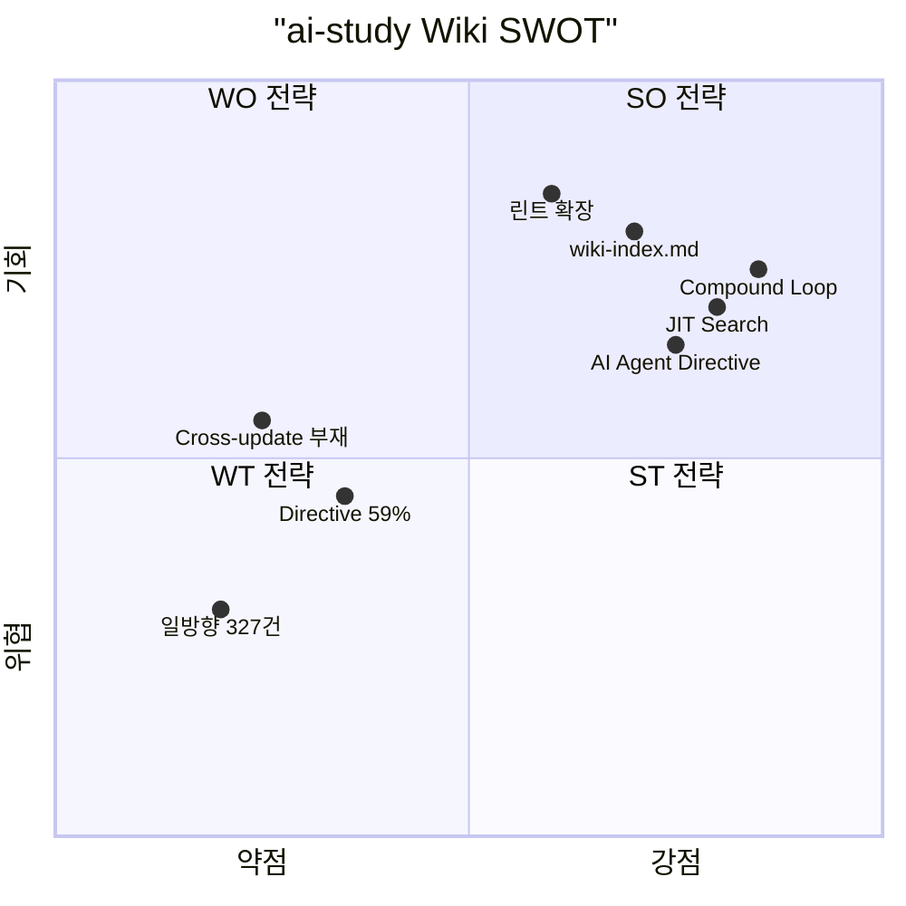

## 왜 지금 이 분석인가

[Karpathy LLM Wiki 패턴](/wiki/context-engineering/karpathy-llm-wiki-pattern-compilation-over-retrieval) 엔트리를 박제한 직후, **우리 위키에 실제로 적용**할 수 있는 부분과 이미 앞서 있는 부분을 구분해야 한다. 감이 아니라 **실측 데이터 기반** SWOT으로 판단한다.

---

## 실측 데이터 (2026-04-17 기준)

| 항목 | ai-study 위키 | Karpathy LLM Wiki |
|---|---|---|
| 엔트리 수 | **120** (13 카테고리) | 100+ articles, 400K+ words (본인 언급) |
| 지식 그래프 | **411 edges** (bidirectional connections) | wikilink 기반 (양 수 미공개) |
| JIT 검색 | **1~2ms** (multilingual-e5-small, 1287 청크) | index.md 기반 drill-down (임베딩 없음) |
| 자동 박제 | `/compound` (CHANGELOG + 회고 + 솔루션) | 없음 |
| 인제스트 크로스 업데이트 | 1 엔트리 생성 (역링크 수동) | **10~15 페이지 동시** |
| 위키 린트 | **방금 추가** — Directive 59%, 일방향 327건 | 모순/고아/갭 탐지 (lint 워크플로 내장) |
| AI Agent Directive | **59%** (46/78 non-journal) | 없음 (implicit LLM-friendly markdown) |
| 도구 | Next.js 웹앱 (배포 가능) | Obsidian (로컬) |
| 퀴즈 | 3문항 자가 점검 + SM-2 SRS | 없음 |
| 시리즈/Journal | 3 시리즈, 42 에피소드 | 없음 (flat structure) |
| 배포 | Vercel auto-deploy (public) | 로컬 only |

---

## SWOT 분석

### Strengths (강점) — 이미 앞서 있는 것

| # | 강점 | 실측 근거 |
|---|---|---|
| **S1** | **Compound Engineering 루프** | `/compound`가 CHANGELOG + 회고 + 솔루션을 한 커맨드에 강제. Karpathy에 없는 "매 사이클 박제 자동화" |
| **S2** | **AI Agent Directive 표준** | 78개 non-journal 중 46개(59%)에 명시적 Trigger/Steps/Anti-patterns. Karpathy 위키는 LLM-friendly markdown이지만 *에이전트 실행 지시문*은 없음 |
| **S3** | **JIT 벡터 검색** | multilingual-e5-small + 쿼리 라우터. 1287 청크에서 1~2ms. Karpathy는 index.md 텍스트 매칭만 |
| **S4** | **구조화된 카테고리 + 시리즈** | 13 카테고리 × 3 시리즈(Harness/iOS/Aidy Journal). Karpathy는 flat wiki |
| **S5** | **퀴즈 + SRS** | 120 엔트리에 3문항 자가 점검 + SM-2 스케줄. 학습 검증 레이어 |
| **S6** | **공개 배포** | Vercel auto-deploy. 포트폴리오로 기능. Karpathy는 로컬 Obsidian |

### Weaknesses (약점) — 개선 필요

| # | 약점 | 실측 근거 |
|---|---|---|
| **W1** | **인제스트 크로스 업데이트 부재** | `/ingest` → 1 엔트리만 생성. 기존 엔트리 역링크는 수동 (Journal 006/007에서 체감) |
| **W2** | **일방향 연결 327건** | 위키 린트 실측. SPEC.md 양방향 원칙 59% 미달 |
| **W3** | **AI Agent Directive 59%** | 32건 누락. LLM-First 표준의 핵심인데 절반만 달성 |
| **W4** | **raw/ 소스 보존 없음** | URL + 메타데이터만 출처에 기록. 원본 변경/삭제 시 검증 불가 |
| **W5** | **린트 이제 막 시작** | 모순 탐지 / stale 클레임 탐지 미구현 (고아/Directive/일방향만) |

### Opportunities (기회) — 잡을 수 있는 것

| # | 기회 | 구체적 액션 |
|---|---|---|
| **O1** | **인제스트 크로스 업데이트 자동화** | `/ingest` Phase에 기존 엔트리 connections 자동 스캔 + 역링크 추가. W1 해소 |
| **O2** | **위키 린트 고도화** | 모순 탐지(같은 주제 다른 주장), stale 클레임(날짜 기반), 카테고리 밸런스 경고. Karpathy 패턴 흡수 |
| **O3** | **wiki-index.md 활용** | 방금 생성. 에이전트가 검색 전 카탈로그를 먼저 읽는 Karpathy 패턴의 index.md와 동일 역할 |
| **O4** | **Compound + Compilation 합류** | ai-study의 /compound(박제)와 Karpathy의 compilation(인제스트 시 통합)을 결합하면 *두 방향 모두* 자동화된 유일한 시스템 |
| **O5** | **Directive 커버리지 70%+** | 32건 중 참조 빈도 높은 10건만 추가해도 59% → 72%. ROI 높음 |

### Threats (위협) — 주의할 것

| # | 위협 | 대응 |
|---|---|---|
| **T1** | **일방향 연결 누적** | 새 엔트리마다 connections 추가하지만 역링크 안 넣으면 gap 확대. O1로 자동화 |
| **T2** | **Karpathy 생태계 급성장** | 오픈소스 구현체 10+개 등장. 차별화 안 하면 "또 하나의 LLM Wiki"로 묻힘 |
| **T3** | **엔트리 수 증가 → 린트 부하** | 120 → 300+ 시 모순 탐지 비용 증가. 현재 brute-force 린트는 O(N^2) |
| **T4** | **Directive 누락 방치** | 32건이 계속 쌓이면 LLM-First 표준이 형해화 |

---

## 전략 매트릭스

### SO 전략 (강점 × 기회) — 공격

**Compound + Compilation 합류 시스템** 구축:
- `/compound`의 매 사이클 박제 + Karpathy의 인제스트 시 크로스 업데이트를 결합
- 결과: 인제스트할 때도, 작업 끝낼 때도 위키가 자동으로 강화되는 **양방향 컴파일 루프**
- **어디에도 없는 차별화**: Karpathy에도 Obsidian 구현체에도 이 조합은 없음

### WO 전략 (약점 × 기회) — 개선

1. **인제스트 크로스 업데이트 자동화** (W1 → O1) — `/ingest` Phase 4 이후 자동 역링크
2. **Directive 커버리지 집중 투입** (W3 → O5) — 참조 빈도 Top 10 엔트리부터
3. **wiki-index.md 세션 시작에 활용** (W4 → O3) — NEXT.md 체크리스트에 추가

### ST 전략 (강점 × 위협) — 방어

- **차별화 강화** (S1+S2+S5 × T2): Compound Loop + AI Agent Directive + 퀴즈/SRS는 Karpathy 생태계에 없는 3종 세트. 이걸 더 강화
- **배포 포트폴리오** (S6 × T2): 로컬 Obsidian과 달리 공개 웹앱으로 시연 가능

### WT 전략 (약점 × 위협) — 회피

- **린트 자동화 투자** (W5 × T3): 엔트리 300+ 되기 전에 린트 고도화. O(N^2) → 인덱스 기반으로 전환
- **일방향 연결 자동 해소** (W2 × T1): 인제스트 크로스 업데이트가 W2와 T1을 동시에 해결

---

## 핵심 인사이트 — 왜 이 비교가 가치 있는가

| Karpathy LLM Wiki | ai-study Wiki | 합류 시 |
|---|---|---|
| **Input 컴파일** (인제스트 시 10~15 페이지) | **Output 박제** (/compound 시 3 문서) | **양방향 컴파일** |
| 모순/갭 린트 | MDX/Mermaid 린트 + 위키 린트(신규) | **전 레이어 린트** |
| index.md (텍스트 카탈로그) | JIT 벡터 검색 (1~2ms) | **하이브리드 검색** |
| Obsidian (로컬 편집) | Next.js (공개 배포) | **로컬 편집 + 공개 배포** |

**두 시스템의 합류가 만드는 것**: 인제스트할 때도 지식이 컴파일되고, 작업할 때도 지식이 박제되며, 린트가 전 레이어를 커버하고, 검색이 텍스트+벡터 하이브리드로 작동하는 **완전한 지식 복리 엔진**.

---

## 내 프로젝트에 적용하기 (우선순위 순)

1. **SO: `/ingest` 크로스 업데이트** — 인제스트 시 기존 엔트리 connections 자동 역링크. 가장 큰 갭이자 가장 큰 기회
2. **WO: Directive Top 10 추가** — `context-engineering-fundamentals` (8 refs), `multi-agent-pipeline` (7 refs), `tool-use` (7 refs) 등 참조 빈도 높은 엔트리부터
3. **SO: wiki-index.md를 세션 시작에 활용** — 에이전트가 NEXT.md 다음에 wiki-index.md를 읽도록 체크리스트 추가
4. **WO: 린트 고도화** — 모순 탐지 (같은 개념에 대한 서로 다른 주장 감지), stale 클레임 경고
5. **ST: 차별화 강화** — Compound + Directive + Quiz/SRS 3종 세트를 위키 첫 페이지에서 어필

---

## 자기 점검

1. ai-study가 Karpathy 패턴 대비 앞서 있는 강점 3가지를 즉시 나열할 수 있는가?
2. 일방향 연결 327건이 왜 위협인지, SPEC.md의 어느 원칙과 충돌하는지 설명할 수 있는가?
3. Compound + Compilation 합류가 "양방향 컴파일"을 만든다는 것이 구체적으로 무슨 뜻인지 예시를 들어 설명할 수 있는가?
4. 위키 린트 실측 데이터(Directive 59%, 일방향 327건)를 다음 세션에서 어떻게 개선할 계획인가?
5. (열린 질문) Karpathy 생태계(오픈소스 10+개)와의 차별화를 한 문장으로 설명한다면?

---

## AI Agent Directive

### Trigger
- 위키 전략 검토, 방향성 논의 시
- "Karpathy 패턴과 비교해줘" 요청
- 위키 품질 메트릭 점검 시
- SWOT 기반 의사결정 필요 시

### Prerequisites
- [Karpathy LLM Wiki 패턴](/wiki/context-engineering/karpathy-llm-wiki-pattern-compilation-over-retrieval)
- [Compound Engineering 철학](/wiki/harness-engineering/compound-engineering-philosophy)
- [LLM-First Wiki 설계 원칙](/wiki/harness-engineering/llm-first-wiki-principles)

### Actionable Steps
1. **SO 전략 우선** — Compound + Compilation 합류가 가장 큰 차별화. 인제스트 크로스 업데이트 자동화부터
2. **실측 기반 판단** — SWOT의 모든 셀이 실측(411 edges, 327 일방향, 59% Directive)에 기반. 다음 점검 시 재측정
3. **차별화 유지** — Karpathy 생태계에 없는 3종(Compound/Directive/Quiz)을 약화시키지 않기
4. **린트 데이터를 KPI로 활용** — Directive %, 일방향 연결 수, 고아 엔트리 수를 매 세션 추적

### Anti-patterns
- **Karpathy 패턴을 그대로 복사** — 우리의 강점(Compound, Directive, JIT)을 버리고 Obsidian으로 전환하는 것
- **SWOT 없이 감으로 방향 전환** — 실측 데이터 없는 전략은 추측
- **약점만 보고 강점 방치** — W1(크로스 업데이트)만 고치다가 S1(Compound)이 약해지면 안 됨
- **린트 결과 무시** — 327건 일방향이 누적되면 위키 그래프가 사실상 단방향

---

## 출처

- [Karpathy LLM Wiki 패턴 엔트리](/wiki/context-engineering/karpathy-llm-wiki-pattern-compilation-over-retrieval) — 이 위키 내부
- [Karpathy Gist 원문](https://gist.github.com/karpathy/442a6bf555914893e9891c11519de94f) — 3층 구조 + compilation 철학
- [Compound Engineering 철학](/wiki/harness-engineering/compound-engineering-philosophy) — 12 원칙 + 4단계 루프
- 위키 린트 실측: `npm run build` 출력 (2026-04-17) — Directive 46/78 (59%), 일방향 327건, 고아 0건

### 검증 메모

- SWOT 데이터는 전부 이 세션에서 실측. 추측 항목 없음
- Karpathy 위키의 엔트리 수(100+ articles, 400K+ words)는 WebSearch 3개 소스에서 교차 확인
- "어디에도 없는 차별화"(Compound + Compilation 합류)는 WebSearch로 구현체 10개를 확인한 결과 해당 조합을 가진 프로젝트 미발견
