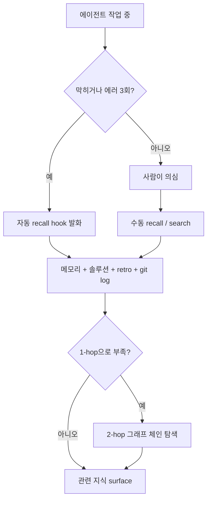

메모리 인덱스에는 오랫동안 **200줄 상한**이 걸려 있었다. 한 RIBs/ReactorKit iOS 개발 하네스의 `MEMORY.md`는 항목이 쌓일수록 길어졌고, 세션 시작 시 자동 주입되는 이 파일이 너무 길어지면 컨텍스트 윈도우 앞부분에서 **truncate**돼 뒤쪽 항목이 통째로 잘려나갈 것을 우려했다. 그래서 "200줄을 넘으면 오래된 항목을 합치거나 지운다"는 정책으로 인덱스를 강제로 짧게 유지했다.

이 글은 그 정책을 **폐기**한 결정과, 그 자리에 들어선 **Discovery Map + 무한 축적** 구조를 정리한다. 핵심은 단순하다: *검색 레이어가 있으면 인덱스의 완전성은 더 이상 필요 없다.* 인덱스가 truncate돼도 search/recall이 전체를 커버하기 때문이다. 우리는 **인덱스 완전성을 포기하고 검색 가능성에 베팅했다.**

## 1. 기존 정책: 200줄 상한과 truncate 우려

원래 `MEMORY.md`는 "이 메모리에 무엇이 있는지"의 완전한 목록을 자처했다. 각 줄이 하나의 학습 항목을 가리키고, 에이전트는 세션 시작 시 이 인덱스를 통째로 읽어 "내가 무엇을 알고 있는지"를 파악한다. 인덱스가 곧 지식의 카탈로그였다.

문제는 자동 주입되는 컨텍스트의 토큰 예산이 유한하다는 것이다. 메모리 항목이 40개, 60개를 넘어가면 인덱스가 길어지고, 시스템 프롬프트·CLAUDE.md·rules와 함께 주입될 때 뒷부분이 잘릴 위험이 커진다. 게다가 truncate는 **조용히** 일어난다. 60번째 항목이 잘려도 에러는 없다. 에이전트는 그냥 그 지식이 *존재하지 않는다*고 믿고 진행한다. 같은 함정을 다시 밟고, 같은 솔루션을 다시 발명한다.

그래서 우리는 방어적으로 200줄을 상한선으로 잡았다. 하지만 이 정책에는 숨은 비용이 있었다:

- **합치기/삭제 작업이 정보 손실을 강제한다.** 두 항목을 한 줄로 압축하면 뉘앙스가 사라진다. 오래됐다고 지운 항목이 6개월 뒤 정확히 필요한 그 지식이기도 했다.
- **상한이 임의적이다.** 200줄은 측정값이 아니라 직감이었다. 실제 truncate 임계점은 그날 주입되는 다른 컨텍스트 양에 따라 달라진다.
- **메모리가 "쓰기 부담"이 됐다.** "이걸 박제하면 인덱스가 또 길어지는데"라는 마찰이 생기면, 정작 기록해야 할 학습을 안 적게 된다. 메모리의 본래 목적과 정면으로 충돌한다.

## 2. 전환 결정: 검색 레이어가 있으면 인덱스 완전성은 불필요

전환의 방아쇠는 단순한 관찰이었다. **이 하네스에는 이미 메모리·솔루션·retro·git log를 통합 검색하는 recall 레이어가 있었다.** 자연어 트리거(`recall`, `전에 본 적`, `재발`)나 작업 N회 실패 시 자동으로 과거 지식을 JIT로 끌어온다.

그렇다면 질문이 뒤집힌다. 세션 시작 시 자동 주입되는 인덱스가 메모리의 *완전한* 목록일 필요가 있나? 없다. 인덱스의 역할은 "전부를 보여주는 것"이 아니라 **"무엇이든 검색하면 나온다는 사실을 알려주는 것"**으로 충분하다.

이렇게 보면 200줄 상한은 잘못된 문제를 푸는 정책이었다. 우리는 "인덱스가 잘리면 지식을 잃는다"를 두려워했지만, 진짜 잃는 건 *자동 주입된 인덱스가 가리키던 포인터*일 뿐이고 **지식 자체(메모리 파일 본문, 솔루션, retro)는 디스크에 그대로 있다.** 검색은 인덱스 truncate와 무관하게 그 본문에 도달한다.

그래서 결정: **인덱스 상한 폐기, 무한 축적 허용.** 대신 인덱스 상단에 검색을 안내하는 Discovery Map을 둔다. truncate가 일어나도 (a) 상단 Discovery Map은 항상 살아남고, (b) 그 Map이 "검색하라"고 지시하며, (c) 검색이 잘린 영역을 커버한다.

## 3. Discovery Map 헤더 구조

Discovery Map은 인덱스 맨 위에 고정된 짧은 헤더다. 세 가지 일을 한다.

```text
## 🔍 Discovery Map — 이 인덱스는 의도적으로 불완전하다

- 여기 안 보인다고 없는 게 아니다. 검색하라.
- 자동 recall: 막히거나 에러 3회 → 과거 메모리/솔루션 자동 surface
- 수동 검색:
    recall "<자연어>"        # 메모리 + 솔루션 + retro + git log 통합
    search "<키워드>"        # 위키/문서 JIT 검색
- 영역별 검색 키워드:
    빌드/CI         → "precommit", "gate", "build fail"
    메모리 자동화    → "memory upsert", "auto-pr", "failfast"
    회사명 누출      → "company name", "anonymize"
    git 안전        → "worktree", "reset", "clean"
```

세 요소를 분해하면:

1. **JIT 안내** — "검색하면 나온다"는 한 줄. 에이전트가 인덱스에서 못 찾았을 때의 다음 행동(검색)을 명령한다.
2. **영역별 검색 키워드** — 자유 텍스트 검색은 좋은 쿼리를 떠올려야 작동한다. 영역별 키워드 힌트를 박아두면 에이전트가 빈손에서 쿼리를 짜낼 필요가 없다. 이게 인덱스 "완전성"의 *대체물*이다 — 전부를 나열하지 않되, 어디를 어떻게 파면 되는지를 알려준다.
3. **"안 보인다고 없는 게 아님"** — 이 한 줄이 가장 load-bearing하다. 이게 없으면 에이전트는 truncate된 인덱스를 **닫힌 세계 가정(closed-world assumption)**으로 읽는다. 즉 "목록에 없으면 존재하지 않는다"고 추론한다. 이 문장은 그 가정을 명시적으로 **열린 세계**로 뒤집는다.

## 4. 사이즈 체크 스크립트의 조건부 skip 분기

전환 전, 메모리를 정리하는 스크립트에는 "200줄 넘으면 경고/실패" 게이트가 있었다. 무한 축적으로 가면서 이걸 그냥 지우는 대신 **조건부 skip 분기**로 바꿨다. 핵심 로직:

```bash
# Discovery Map 헤더가 존재하면 라인 수 게이트를 skip
if grep -q "Discovery Map" "$MEMORY_FILE"; then
  echo "Discovery Map present — unbounded mode, line-count gate skipped"
else
  lines=$(wc -l < "$MEMORY_FILE")
  if [ "$lines" -gt 200 ]; then
    echo "WARN: $lines lines, no Discovery Map — truncate risk"
    exit 1
  fi
fi
```

이 분기가 중요한 이유: 라인 수 게이트를 *통째로 삭제*하면, 누군가 실수로 Discovery Map 헤더를 날려버렸을 때(예: 메모리 파일을 자동 재생성하는 버그) 무한히 길어진 인덱스가 **헤더 없이** truncate되는 최악의 시나리오로 조용히 돌아간다. 조건부 분기는 "무한 축적은 *오직* Discovery Map이라는 안전장치가 있을 때만 허용된다"를 코드로 강제한다. 안전장치가 사라지면 게이트가 부활해서 시끄럽게 실패한다.

이건 정책을 메모리 룰(상기 의존)에서 **행동 레벨 가드(스크립트)**로 끌어올린 사례이기도 하다. "Discovery Map 유지해야 함"을 사람이 기억하는 게 아니라, 스크립트가 매번 검증한다.

## 5. 3중 검색 레이어

무한 축적이 안전하려면 검색이 **신뢰할 수 있어야** 한다. 단일 검색 경로에 의존하면 그게 단일 장애점이 된다. 그래서 세 겹으로 깔았다.



- **레이어 1 — 자동 recall hook**: 작업이 N회 실패하거나 에러 메시지가 잡히면 에이전트가 스스로 과거 지식을 검색한다. 사람이 "검색해봐"라고 시킬 필요가 없다. 무한 인덱스에서 가장 중요한 레이어다 — truncate된 항목은 자동 발화 없이는 영영 안 surface될 수 있기 때문이다.
- **레이어 2 — 수동 recall/search**: 사람이나 에이전트가 의도적으로 쿼리한다. Discovery Map의 영역별 키워드가 여기서 쿼리 시드 역할을 한다.
- **레이어 3 — 2-hop 그래프 체인**: 1-hop 매치로 부족하면 매치된 항목의 outlinks/backlinks를 따라 한 단계 더 들어간다. "전체 맥락"이 필요한 회귀 조사·막힌 작업에서 발화한다.

세 레이어가 같은 코퍼스(메모리/솔루션/retro/git)를 친다. 한 경로가 못 찾아도 다른 경로가 잡을 확률이 올라간다.

## 6. ai-study JIT 검색 철학과 직접 매핑 + 전이 주의점

이 패턴은 ai-study 위키의 운영 철학과 **거의 1:1로 매핑**된다. ai-study는 "MDX 전체를 읽지 말고 `npm run search`로 관련 청크만 JIT 주입"을 규칙으로 둔다 — 전체 위키 331K tokens를 ~800 tokens로 99.8% 절감. 두 시스템의 공통 베팅은 동일하다: **"전부를 컨텍스트에 올린다"가 아니라 "필요할 때 검색으로 끌어온다."** 메모리 무한 축적은 이 철학을 *메모리 인덱스*에 적용한 것뿐이다.

매핑 표:

| ai-study JIT 검색 | 메모리 무한 축적 |
|---|---|
| 전체 위키를 안 읽음 | 전체 인덱스를 안 주입 |
| `search --inject`로 청크만 | recall로 항목만 |
| 검색 가능성에 베팅 | 검색 가능성에 베팅 |
| 인덱스 manifest는 라우팅 힌트 | Discovery Map은 라우팅 힌트 |

**전이 시 주의점** — 이 패턴을 다른 하네스에 옮길 때 함정:

- **검색 레이어가 없으면 적용 금지.** 무한 축적의 전제 조건은 신뢰할 수 있는 검색이다. recall 메커니즘 없이 인덱스 상한만 풀면, truncate된 지식이 *진짜로* 사라진다. 검색 레이어를 먼저 깔고, 그 다음 상한을 푼다. 순서가 뒤바뀌면 안 된다.
- **검색이 단일 장애점이 된다.** 인덱스 완전성을 포기한 대가다. 검색 인덱스가 깨지거나 임베딩이 stale하면 truncate된 뒤쪽 전체가 접근 불가가 된다. 검색 레이어 자체의 건강성 모니터링이 무한 축적의 *비용*이다.
- **Discovery Map은 자동 갱신하지 말 것(혹은 아주 신중히).** Map이 항목 수만큼 길어지면 다시 truncate 문제로 돌아간다. Map은 **영역 단위**(빌드/메모리/git…)로만 키워드를 두고, 항목 단위로는 절대 나열하지 않는다. 영역은 느리게 늘고 항목은 빠르게 는다 — 이 비대칭이 Map을 짧게 유지하는 비결이다.
- **closed-world 오판을 측정하라.** "에이전트가 인덱스에 없는 걸 '없다'고 단정한" 사례를 retro에서 세어보면 Discovery Map의 "안 보인다고 없는 게 아님" 문구가 실제로 작동하는지 검증된다. 측정 없이 작동을 가정하지 말 것.

## 자기 점검

1. 우리 하네스의 메모리 인덱스가 truncate됐을 때, 잘린 영역의 지식에 도달하는 검색 경로가 *실제로* 존재하는가? 아니면 인덱스가 곧 지식의 전부인가?
2. Discovery Map(혹은 그 등가물)이 "여기 안 보인다고 없는 게 아니다 → 검색하라"를 명시하는가? 없다면 에이전트는 인덱스를 닫힌 세계로 읽고 있지 않은가?
3. 무한 축적을 허용했다면, Discovery Map이 사라졌을 때 라인 수 게이트가 자동으로 부활하는가? 아니면 안전장치 소실이 조용히 통과되는가?
4. 검색 레이어가 죽었을 때 잃는 지식의 범위를 알고 있는가? 그 단일 장애점에 대한 모니터링이 있는가?
