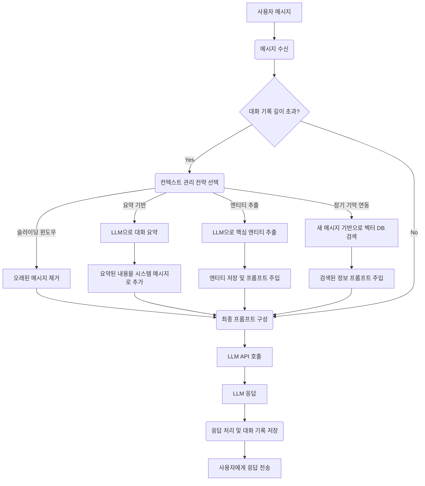

## 왜 멀티턴 컨텍스트 관리가 필수적인가?

LLM(Large Language Model) 기반의 AI 시스템은 놀라운 성능을 보여주지만, 본질적으로 각 API 호출은 독립적인(stateless) 요청입니다. 즉, LLM 자체는 이전 대화 내용을 '기억'하지 못합니다. 우리가 흔히 대화형 AI 에이전트라고 부르는 시스템이 자연스러운 대화를 이어갈 수 있는 것은, 개발자가 명시적으로 이전 대화의 맥락(context)을 다음 요청에 함께 전달하기 때문입니다.

iOS/프론트엔드 개발자로서 AI 시스템을 구축할 때, 이 '기억력'의 설계는 사용자 경험에 직접적인 영향을 미칩니다. 대화의 맥락이 끊기면 사용자는 답답함을 느끼고, AI는 동문서답을 하거나 이전에 제공된 정보를 다시 묻게 됩니다. 이는 사용자 이탈로 이어질 수 있습니다. 효과적인 멀티턴 컨텍스트 관리는 다음을 위해 필수적입니다.

*   **사용자 경험 향상**: AI가 사용자의 의도를 정확히 파악하고, 자연스럽고 일관된 대화를 이어갈 수 있도록 합니다.
*   **작업 연속성 보장**: 복잡한 작업을 여러 단계에 걸쳐 수행할 때, AI가 이전 단계를 기억하여 다음 단계로 원활하게 넘어갈 수 있도록 돕습니다.
*   **개인화 및 맞춤화**: 사용자별 선호도, 이전 대화 내용 등을 기억하여 더욱 개인화된 응답을 제공합니다.
*   **AI 에이전트의 '자아' 형성**: 자율 에이전트가 고유한 페르소나와 목표를 유지하며 일관된 행동을 보일 수 있도록 하는 기반이 됩니다.

하지만 무작정 모든 대화 기록을 LLM에 전달하는 것은 효율적이지 않습니다. 토큰 제한, 높은 API 비용, 느린 응답 속도 등 여러 실무적인 제약이 따릅니다. 따라서 어떤 맥락을, 얼마나, 어떤 방식으로 전달할 것인지에 대한 전략적인 접근이 필요합니다.

## LLM의 기억 메커니즘 이해 및 한계

LLM에 '기억'을 부여하는 기본적인 방법은 대화 기록 전체를 포함한 `messages` 배열을 API 요청의 `prompt` 필드에 전달하는 것입니다. 각 메시지는 `role` (system, user, assistant)과 `content`로 구성됩니다.

```typescript
// 예시: LLM API 호출에 사용되는 메시지 구조
const messages = [
  { role: 'system', content: '당신은 친절한 AI 어시스턴트입니다.' },
  { role: 'user', content: '제 이름은 김민수입니다.' },
  { role: 'assistant', content: '반갑습니다, 김민수님. 무엇을 도와드릴까요?' },
  { role: 'user', content: '오늘 날씨는 어떤가요?' },
];
// 이 messages 배열이 LLM API로 전송됩니다.
```

이 방식은 간단하지만, 다음과 같은 한계가 있습니다.

*   **토큰 제한 (Context Window Limit)**: 대부분의 LLM은 한 번에 처리할 수 있는 토큰 수에 제한이 있습니다. 대화가 길어질수록 이 제한을 초과하기 쉽습니다.
*   **비용 증가**: 전송하는 토큰 수가 많아질수록 API 호출 비용이 증가합니다. 특히 긴 대화에서는 비용이 기하급수적으로 늘어날 수 있습니다.
*   **응답 속도 저하**: 처리해야 할 토큰 수가 많아지면 LLM의 응답 속도가 느려질 수 있습니다. 이는 실시간 대화형 애플리케이션에서 치명적입니다.
*   **환각 (Hallucination) 위험 증가**: 너무 많은, 때로는 관련성이 떨어지는 정보를 제공할 경우 LLM이 혼란을 겪거나 잘못된 정보를 생성할 위험이 커질 수 있습니다.

이러한 한계를 극복하기 위해 다양한 멀티턴 컨텍스트 관리 패턴이 등장했습니다.

## 주요 멀티턴 컨텍스트 관리 패턴

### 1. 슬라이딩 윈도우 (Sliding Window)

가장 간단하면서도 널리 사용되는 전략입니다. 최신 N개의 메시지나 특정 토큰 수 이내의 메시지만 유지하여 LLM에 전달합니다. 오래된 메시지는 자동으로 삭제됩니다.

**장점**:
*   구현이 매우 간단합니다.
*   항상 최신 대화에 집중하므로 즉각적인 관련성이 높습니다.
*   컨텍스트 길이를 예측 가능하게 유지하여 비용과 속도를 제어하기 용이합니다.

**단점**:
*   오래된 대화의 중요한 정보가 손실될 수 있습니다.
*   대화가 길어지거나 주제가 전환될 때 맥락이 끊길 위험이 있습니다.

**코드 예시 (TypeScript)**:

아래 TypeScript 코드는 `ConversationManager` 클래스를 통해 메시지를 추가하고, `maxTokens` 제한에 따라 자동으로 슬라이딩 윈도우를 적용하여 프롬프트에 포함할 메시지 목록을 반환합니다. 토큰 계산은 실제 LLM의 토크나이저를 사용해야 하지만, 여기서는 간단한 단어 수를 사용합니다.

```typescript
import { getEncoding } from 'tiktoken'; // 실제 토큰 계산을 위한 라이브러리 (예: OpenAI)

interface Message {
  role: 'user' | 'assistant' | 'system';
  content: string;
}

class ConversationManager {
  private history: Message[] = [];
  private maxTokens: number;
  private encoding: any; // tiktoken 인코딩 객체

  constructor(maxTokens: number = 4000, modelName: string = 'gpt-4') {
    this.maxTokens = maxTokens;
    // 실제 LLM 모델에 맞는 인코딩 로드
    // 예를 들어, OpenAI 모델의 경우: getEncoding('cl100k_base') 또는 모델명으로
    try {
      this.encoding = getEncoding(modelName);
    } catch (error) {
      console.warn(`Could not load tiktoken encoding for model ${modelName}. Using fallback tokenizer.`, error);
      this.encoding = null; // Fallback to simple tokenizer if tiktoken fails
    }
  }

  private countTokens(text: string): number {
    if (this.encoding) {
      return this.encoding.encode(text).length;
    }
    // Fallback: simple word count as a proxy for tokens
    return text.split(/\s+/).filter(word => word.length > 0).length;
  }

  addMessage(message: Message): void {
    this.history.push(message);
    // 대화가 길어지면 여기에 메시지 압축/요약 로직을 추가할 수 있습니다.
    // 여기서는 일단 모든 메시지를 추가하고, getPromptMessages에서 슬라이딩 윈도우를 적용합니다.
  }

  getPromptMessages(): Message[] {
    let currentTokens = 0;
    const messagesToSend: Message[] = [];

    // 시스템 메시지는 항상 포함되도록 처리
    const systemMessage = this.history.find(msg => msg.role === 'system');
    if (systemMessage) {
      const systemTokens = this.countTokens(systemMessage.content);
      // maxTokens를 시스템 메시지 단독으로 초과하면 경고
      if (systemTokens > this.maxTokens) {
        console.warn('System message alone exceeds maxTokens. Consider shortening it.');
        // 이 경우, 시스템 메시지를 강제로 포함하거나, 더 축약하는 로직 필요
      }
      messagesToSend.push(systemMessage);
      currentTokens += systemTokens;
    }

    // 최신 메시지부터 역순으로 추가하여 슬라이딩 윈도우 구현
    // 시스템 메시지는 이미 처리했으므로 건너뜀
    for (let i = this.history.length - 1; i >= 0; i--) {
      const message = this.history[i];
      if (message.role === 'system') continue;

      const messageTokens = this.countTokens(message.content);

      // 현재 토큰과 새 메시지 토큰의 합이 maxTokens를 초과하면 중단
      if (currentTokens + messageTokens <= this.maxTokens) {
        messagesToSend.unshift(message); // 배열 앞에 추가하여 시간순 유지
        currentTokens += messageTokens;
      } else {
        // 더 이상 메시지를 추가할 수 없음 (슬라이딩 윈도우)
        break;
      }
    }

    // 최종 메시지 배열은 시스템 메시지가 맨 앞에 오도록 정렬 (선택 사항이지만 일관성 유지)
    messagesToSend.sort((a, b) => {
      if (a.role === 'system') return -1;
      if (b.role === 'system') return 1;
      return 0; // maintain original relative order for user/assistant messages
    });

    return messagesToSend;
  }

  // 예시 사용
  static async demo() {
    // 실제 모델명으로 인코더를 로드하거나, 필요시 커스텀 토크나이저 제공
    const manager = new ConversationManager(100); // 100 토큰 제한 (예시)

    manager.addMessage({ role: 'system', content: '당신은 사용자에게 금융 정보를 제공하는 챗봇입니다.' });
    manager.addMessage({ role: 'user', content: '안녕하세요! 제 이름은 김철수입니다.' });
    manager.addMessage({ role: 'assistant', content: '반갑습니다, 김철수님. 무엇을 도와드릴까요?' });
    manager.addMessage({ role: 'user', content: '최근 삼성전자의 주가 흐름이 궁금합니다.' });

    console.log('--- 초기 대화 ---');
    console.log(manager.getPromptMessages());

    // 토큰 제한을 넘어서는 대화 추가
    for (let i = 0; i < 5; i++) {
      manager.addMessage({ role: 'user', content: `추가 질문 ${i}: 어떤 요인들이 주가에 영향을 미칠까요?` });
      manager.addMessage({ role: 'assistant', content: `주가 영향 요인에 대해 설명드리겠습니다 ${i}.` });
    }

    console.log('\n--- 긴 대화 후 (슬라이딩 윈도우 적용) ---');
    console.log(manager.getPromptMessages());
  }
}

// 실제 사용 시 호출
// ConversationManager.demo();
```

`tiktoken`과 같은 라이브러리를 사용하면 LLM이 실제로 인식하는 토큰 수를 정확히 계산할 수 있어, 보다 정밀한 컨텍스트 관리가 가능합니다.

### 2. 요약 기반 컨텍스트 (Summarization-based Context)

대화가 특정 길이 이상 길어지면, 이전 대화 내용을 LLM을 이용해 요약하고, 이 요약된 내용을 시스템 메시지 형태로 다음 대화의 컨텍스트에 포함합니다.

**장점**:
*   컨텍스트 길이를 효율적으로 관리할 수 있어 긴 대화에 적합합니다.
*   중요한 정보 손실을 최소화하면서 대화의 핵심 맥락을 유지합니다.
*   비용 및 응답 속도 측면에서 슬라이딩 윈도우보다 더 효율적일 수 있습니다.

**단점**:
*   요약 과정 자체가 추가적인 LLM 호출을 필요로 하므로 비용과 지연이 발생합니다.
*   요약 품질에 따라 중요한 정보가 누락되거나 왜곡될 위험이 있습니다.

**구현 아이디어**:
1.  대화 기록이 특정 토큰 수 또는 메시지 수를 초과하면, 가장 오래된 부분(예: 상위 70%)을 추출합니다.
2.  해당 부분을 LLM에 `summarize this conversation:`과 같은 프롬프트로 보내 요약을 요청합니다.
3.  LLM이 반환한 요약을 `{ role: 'system', content: '이전 대화 요약: [요약 내용]' }`과 같은 형태로 대화 기록의 맨 앞에 추가하고, 요약된 원본 메시지들은 삭제합니다.
4.  새로운 메시지가 추가될 때마다 이 과정 반복 또는 주기적으로 실행합니다.

### 3. 정보 추출 및 엔티티 저장 (Entity Extraction & Slot Filling)

대화에서 사용자의 이름, 예약 날짜, 구매 상품, 특정 설정 값 등 핵심적인 엔티티나 슬롯 정보를 추출하여 구조화된 형태로 저장합니다. 이 정보는 이후 LLM 프롬프트에 `system` 메시지나 `tool_code` 형태로 주입하여 활용합니다.

**장점**:
*   가장 중요한 정보만을 유지하므로 컨텍스트 길이가 매우 짧고 효율적입니다.
*   LLM이 핵심 정보를 정확하게 파악하고 활용하도록 돕습니다.
*   사용자 의도 파악(Intent Recognition) 및 슬롯 채우기(Slot Filling)에 유용하여 특정 작업을 수행하는 챗봇에 적합합니다.

**단점**:
*   어떤 정보를 추출할지 미리 정의된 스키마가 필요할 수 있습니다.
*   엔티티 추출 로직(LLM 또는 정규 표현식, NLU 모델 등)의 정확성이 중요합니다.

**코드 예시 (개념)**:

```typescript
interface UserProfile {
  name?: string;
  preferredProductCategory?: string;
  // ... 기타 사용자 정보
}

class EntityExtractor {
  private userProfile: UserProfile = {};

  // 대화 메시지에서 엔티티를 추출하고 저장하는 메서드
  async extractAndStoreEntities(message: Message, llmService: any): Promise<void> {
    // LLM에 Function Calling 또는 프롬프트 엔지니어링을 활용하여 엔티티 추출
    const extractionPrompt = `다음 대화에서 사용자 이름과 선호 제품 카테고리를 JSON 형태로 추출하세요. 만약 정보가 없다면 null로 표시하세요. 대화: "${message.content}"
    Expected JSON: { "name": "string | null", "preferredProductCategory": "string | null" }`;

    // 실제로는 LLM 호출을 통해 JSON 응답을 받음
    // const llmResponse = await llmService.generate(extractionPrompt);
    // const extracted = JSON.parse(llmResponse.content);
    
    // 예시 데이터
    const extracted = { name: "김철수", preferredProductCategory: "스마트폰" }; 

    if (extracted.name) this.userProfile.name = extracted.name;
    if (extracted.preferredProductCategory) this.userProfile.preferredProductCategory = extracted.preferredProductCategory;
  }

  // 추출된 엔티티를 프롬프트에 주입할 형식으로 변환
  getEntitiesAsSystemMessage(): Message {
    return {
      role: 'system',
      content: `현재 사용자 정보: ${JSON.stringify(this.userProfile)}`
    };
  }
}
```

### 4. 장기 기억 시스템 연동 (Long-term Memory Integration)

대화에서 얻은 중요하고 영구적인 정보를 벡터 데이터베이스(Vector Database)나 기타 구조화된 저장소에 저장하고, 필요할 때 검색하여 컨텍스트에 주입합니다. 이는 사용자 프로필, 개인화된 설정, 과거 상호작용 기록 등을 포함할 수 있습니다. RAG(Retrieval Augmented Generation) 패턴의 한 형태로 볼 수 있지만, 여기서는 대화 기록 자체의 맥락 관리 측면에 집중합니다.

**장점**:
*   진정한 의미의 '장기 기억'을 구현하여 AI가 일관된 개인화된 경험을 제공할 수 있습니다.
*   대화 길이와 무관하게 특정 정보에 대한 접근성을 높입니다.
*   대규모 지식 베이스를 활용하여 AI의 응답 품질을 높일 수 있습니다.

**단점**:
*   추가적인 인프라(벡터 DB 등)와 검색 로직 구현이 필요하여 복잡성이 증가합니다.
*   검색의 관련성 및 효율성이 중요하며, 잘못된 정보가 검색될 경우 AI 응답에 부정적인 영향을 미칠 수 있습니다.

**구현 아이디어**:
1.  대화 중 중요하다고 판단되는 사실(예: 사용자 이름, 선호 브랜드, 약속 날짜 등)을 추출하여 벡터 형태로 임베딩하고 벡터 DB에 저장합니다.
2.  새로운 사용자 질의가 들어오면, 해당 질의를 임베딩하여 벡터 DB에서 가장 관련성이 높은 과거 대화 기록이나 사용자 정보를 검색합니다.
3.  검색된 정보를 LLM 프롬프트에 `system` 메시지 형태로 주입합니다.

### 5. 하이브리드 전략 (Hybrid Strategies)

위에서 설명한 여러 패턴을 조합하여 사용하는 것이 가장 강력하고 실용적인 방법입니다. 예를 들어:
*   **슬라이딩 윈도우 + 주기적 요약**: 최근 대화는 슬라이딩 윈도우로 유지하고, 오래된 대화는 주기적으로 요약하여 압축합니다.
*   **슬라이딩 윈도우 + 엔티티 추출 + 장기 기억**: 최근 대화는 슬라이딩 윈도우로 유지하되, 대화 중 추출된 핵심 엔티티는 별도로 저장하여 프롬프트에 주입하고, 필요시 장기 기억(벡터 DB)에서 관련 정보를 검색하여 활용합니다.

---

### 컨텍스트 관리 패턴 비교

| 패턴                  | 장점                                                                    | 단점                                                                      | 활용 시나리오                                                    |
| :-------------------- | :---------------------------------------------------------------------- | :------------------------------------------------------------------------ | :--------------------------------------------------------------- |
| **슬라이딩 윈도우**   | - 구현 용이성<br />- 최신 대화에 집중<br />- 컨텍스트 길이 예측 가능          | - 오래된 중요 정보 손실<br />- 긴 대화나 주제 전환 시 맥락 끊김 위험           | - 짧은 대화<br />- 특정 기능 중심 챗봇<br />- 임시적인 질문 응답 봇  |
| **요약 기반**         | - 긴 대화 효율적 관리<br />- 핵심 맥락 유지<br />- 비용/속도 최적화 가능성    | - 추가 LLM 호출 비용/지연<br />- 요약 품질에 따른 정보 손실/왜곡 가능성       | - 긴 대화<br />- 주제 전환이 잦은 대화<br />- 고객 서비스 챗봇         |
| **엔티티 추출/슬롯 채우기** | - 핵심 정보 정확히 유지<br />- 컨텍스트 길이 매우 효율적<br />- 작업 지향 챗봇에 최적 | - 사전 정의된 스키마 필요<br />- 추출 로직의 정확성 중요<br />- 대화의 뉘앙스 포착 어려움 | - 예약/주문 시스템<br />- 정보 입력/수집 봇<br />- 특정 기능 자동화 봇 |
| **장기 기억 연동**    | - 진정한 개인화/일관된 경험<br />- 대화 길이 무관 정보 접근<br />- 대규모 지식 활용 | - 추가 인프라(DB) 필요<br />- 검색 효율성/관련성 중요<br />- 복잡성 증가         | - 개인 비서<br />- 고객 상담/CRM 봇<br />- 추천 시스템<br />- 자율 에이전트 |


**Mermaid 다이어그램 설명:**
사용자 메시지가 들어오면 시스템은 대화 기록의 길이를 확인합니다. 만약 길이가 임계치를 초과하면 여러 컨텍스트 관리 전략 중 하나를 선택하여 적용합니다. 슬라이딩 윈도우는 단순히 오래된 메시지를 제거하고, 요약 기반 전략은 LLM을 통해 대화를 요약하여 시스템 메시지로 추가합니다. 엔티티 추출은 핵심 정보를 뽑아 저장하고 프롬프트에 주입하며, 장기 기억 연동은 벡터 DB 검색을 통해 관련 정보를 가져와 사용합니다. 이렇게 가공된 컨텍스트를 포함한 최종 프롬프트가 LLM에 전달되고, 응답은 다시 대화 기록에 저장된 후 사용자에게 전달됩니다.

## 2026년 최신 트렌드와 미래 전망

멀티턴 컨텍스트 관리는 LLM 기술의 발전과 함께 더욱 정교해지고 있습니다.

*   **온디바이스 LLM 및 엣지 AI**: Apple Intelligence와 같은 온디바이스 LLM의 등장은 클라이언트(iOS/Frontend) 단에서 상당 부분의 컨텍스트 관리를 처리할 수 있는 가능성을 열었습니다. 이는 데이터 프라이버시를 강화하고, 네트워크 지연 없이 빠른 응답 속도를 제공하며, 클라우드 비용을 절감하는 효과를 가져옵니다. 프론트엔드 개발자는 이제 백엔드 API에만 의존하지 않고, 직접 디바이스 내에서 컨텍스트를 관리하고 경량 LLM을 활용하는 아키텍처를 고려해야 합니다.
*   **적응형 컨텍스트 관리 (Adaptive Context Management)**: 대화의 복잡성, 사용자의 의도, 특정 작업의 진행 상황에 따라 동적으로 컨텍스트 관리 전략을 변경하는 방식이 중요해집니다. 예를 들어, 짧고 간단한 질문에는 슬라이딩 윈도우를 사용하고, 복잡한 문제 해결 과정에서는 요약이나 장기 기억 시스템을 적극적으로 활용하는 것입니다. LLM 자체가 현재 대화에 가장 적합한 컨텍스트 관리 방식을 결정하는 '메타 AI' 에이전트의 역할이 커질 수 있습니다.
*   **초개인화된 AI 에이전트**: 장기 기억 시스템은 단순한 정보 저장을 넘어, 사용자 개개인의 성격, 가치관, 과거 경험 등을 심층적으로 학습하여 '자아'를 가진 것처럼 행동하는 AI 에이전트의 기반이 됩니다. 이는 사용자에게 이전과는 차원이 다른 유대감과 만족감을 제공할 것입니다. 프론트엔드에서는 이러한 깊이 있는 개인화 정보를 시각적으로 표현하고, 사용자가 AI의 '기억'을 투명하게 확인하고 관리할 수 있는 UI/UX 설계가 중요해질 것입니다.
*   **멀티모달 컨텍스트**: 텍스트 외에 이미지, 음성, 비디오 등 다양한 형태의 입력에서 맥락을 추출하고 관리하는 기술이 발전할 것입니다. 예를 들어, 사용자가 보낸 이미지에서 특정 객체를 인식하고, 이 정보를 대화 컨텍스트에 포함하여 LLM이 더 풍부한 답변을 생성하도록 돕는 식입니다.

## AI Agent Directive

**Trigger**: 대화형 AI 시스템 구축 시, 사용자와의 장기 대화에서 맥락이 끊기는 현상 발생 시, 또는 LLM API 호출 비용이 급증할 때

**Prerequisites**: 
- `/wiki/context-engineering/context-engineering-fundamentals` — 컨텍스트 설계 4원칙
- `/wiki/context-engineering/context-compression` — 컨텍스트 압축 기법
- `/wiki/tokenomics/claude-code-token-levers-catalog` — 토큰 절감 전략

### Actionable Steps

1. 애플리케이션의 대화 특성 파악: 예상 대화 길이, 주제 전환 빈도, 사용자 개인화 필요 여부
2. LLM 컨텍스트 윈도우 크기 확인 (Claude: 200K, Gemini: 2M 등) 및 현실적인 한계 고려
3. 적절한 패턴 선택:
   - 짧고 독립적인 대화 → **슬라이딩 윈도우** (최신 N개 메시지만 유지)
   - 긴 대화 또는 주제 전환 → **요약 기반** (오래된 부분을 LLM으로 요약 후 압축)
   - 핵심 정보 중심 업무 → **엔티티 추출/슬롯 채우기** (사용자 정보 구조화)
   - 개인화된 경험 필요 → **장기 기억 + 벡터 DB** (사용자 프로필/히스토리 검색)
4. 하이브리드 전략 구성 (예: 슬라이딩 윈도우 + 주기적 요약 + 엔티티 추출)
5. 메트릭 설정 및 측정: 토큰 수, API 호출 비용, 응답 지연, 사용자 만족도
6. 2026년 트렌드 반영: 온디바이스 LLM 가능성 검토, 멀티모달 입력 고려

### Anti-patterns

- 모든 대화 기록을 매번 LLM에 전달하여 토큰 비용이 기하급수적으로 증가하는 상황 방치
- 슬라이딩 윈도우만 사용하면서 중요한 대화 맥락이 손실되는 것을 무시
- 요약 기반 전략에서 요약 품질을 평가하지 않아 정보 왜곡 위험 미인식
- 엔티티 추출 스키마를 정의하지 않고 LLM에만 의존하여 추출 정확도 저하
- 장기 기억 시스템을 구축한 후 검색 품질을 측정하지 않아 잘못된 정보 주입

## 자기 점검

1.  LLM이 본질적으로 '기억'하지 못하는 이유와 이를 해결하기 위한 기본적인 접근 방식은 무엇인가요?
2.  `슬라이딩 윈도우` 전략의 가장 큰 장점과 단점은 무엇이며, 어떤 상황에서 가장 효과적인가요?
3.  `요약 기반 컨텍스트` 전략이 `슬라이딩 윈도우`에 비해 가지는 주요 이점은 무엇이며, 어떤 단점을 감수해야 할까요?
4.  장기 기억 시스템 연동 시 `벡터 데이터베이스`를 사용하는 주된 이유는 무엇이며, 프론트엔드/iOS 개발자 관점에서 어떤 부분을 고려해야 할까요?

**이 개념을 동료에게 설명한다면?**
"LLM은 사실 붕어처럼 건망증이 심해서, 이전 대화를 기억하려면 우리가 일일이 알려줘야 해. 그런데 그냥 모든 대화를 다 알려주면 너무 길어지고 돈도 많이 드니까, 필요한 부분만 똑똑하게 골라서 알려주는 기술이 필요해. 슬라이딩 윈도우처럼 최근 대화만 남기거나, 오래된 대화는 요약해서 압축하거나, 아니면 대화 중에 중요한 정보만 쏙쏙 뽑아서 기억하는 식이지. 이걸 잘해야 AI가 똑똑한 척 연기할 수 있고, 우리 앱 사용자도 답답함을 덜 느낄 거야. 특히 요즘은 기기 자체에서 이런 기억을 관리하는 기능도 생겨서, 우리 프론트엔드 개발자들도 이런 전략을 잘 알아야 해!"

**실습 과제:**
당신이 개발하고 있는 iOS/웹 기반의 챗봇 서비스가 있다고 가정해 봅시다. 이 챗봇은 사용자와의 긴 상담을 통해 특정 금융 상품을 추천하는 기능을 가지고 있습니다. 이 챗봇에 '멀티턴 컨텍스트 관리'를 적용하기 위한 구체적인 아키텍처를 설계해 보세요.

1.  **초기 5턴**: 슬라이딩 윈도우 전략을 사용합니다.
2.  **5턴 이후**: 대화 내용이 특정 토큰 수를 초과하면, LLM을 활용하여 이전 대화의 핵심 요약을 생성하고, 이 요약된 내용을 `system` 메시지로 활용하여 컨텍스트 길이를 최적화하는 전략을 추가합니다.
3.  **사용자 정보 저장**: 대화 중에 사용자의 이름, 관심 금융 상품 종류, 월 수입 등 중요한 개인 정보가 언급되면 이를 추출하여 영구적으로 저장하고(예: 로컬 스토리지, 간단한 백엔드 DB), 이후 대화에서 이를 `system` 메시지에 포함하여 개인화된 응답을 제공하는 방안을 구상해 보세요.
4.  이 세 가지 전략을 조합하여 어떻게 백엔드(혹은 온디바이스)에서 컨텍스트를 관리하고, 프론트엔드에서는 어떤 방식으로 메시지를 주고받아야 할지 간략한 플로우차트나 코드 스케치를 작성해 보세요.
