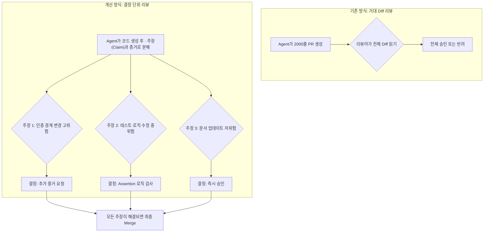

> 이 엔트리는 Blake Crosley의 [AI Coding Agents Need Smaller Review Surfaces](https://blakecrosley.com/blog/ai-coding-agents-smaller-review-surfaces)을 정독하고 핵심을 추출한 것이다.

이 엔트리는 Blake Crosley의 [AI Coding Agents Need Smaller Review Surfaces](https://blakecrosley.com/blog/ai-coding-agents-need-smaller-review-surfaces/)를 정독하고 핵심을 추출한 것이다.

### 왜 중요한가: 리뷰어의 '주의력 예산'이 새로운 병목이다

AI 코딩 에이전트의 진짜 병목은 코드 생성이 아니라, 생성된 코드를 인간이 이해하고 책임질 수 있도록 검증하는 과정이다. 2026년 3월 연구에 따르면, 소프트웨어 엔지니어는 AI가 생성한 작업이 길어질수록 인지적 관여도가 급격히 감소하며, 현재 도구는 성찰, 검증, 의미 파악(sensemaking)을 거의 지원하지 못한다.

과거에는 인간 개발자의 타이핑 속도, 시간 압박 등이 PR(Pull Request)의 크기를 자연스럽게 제한하는 '유용한 마찰'로 작용했다. 하지만 AI 에이전트는 이런 마찰 없이 수천 줄의 코드, 테스트, 문서를 순식간에 생성한다. 이로 인해 리뷰어는 거대한 결과물을 받지만, 그 코드의 모든 부분을 누군가 완전히 이해하고 있다는 확신은 줄어든다.

결국, 검토되지 않은 코드는 위험을 제거한 것이 아니라, Diff의 읽지 않은 부분으로 위험을 이전시킨 것뿐이다. 성공적인 AI 에이전트의 척도는 단순히 '작업 완료 여부'가 아니라 '리뷰 가능성(reviewability)'이 되어야 한다.

### 핵심 패턴: 거대 Diff를 '결정 단위(Decision-Sized Artifact)'로 분할하기

AI가 생성한 2,000줄짜리 Diff를 통째로 리뷰하는 것은 인간의 주의력 예산을 초과한다. 해결책은 리뷰 단위를 '더 작은 요약'이 아닌, 특정 '결정을 내리는 데 필요한 최소한의 증거 묶음'으로 바꾸는 것이다. 요약은 위험을 숨길 수 있지만, 잘게 쪼개진 결정 단위는 증거를 보존하면서 판단을 좁혀준다.

| 검토 대상 (Review Surface) | 나쁜 형태 (Bad Shape) | 더 나은 형태 (Better Shape) |
| :--- | :--- | :--- |
| **Diff** | 2,000줄의 생성된 코드 | 변경 경로 맵 + 위험도순 파일 목록 |
| **요약** | "인증 로직 정리 완료" | 주장, 영향받는 호출부, 테스트, 미해결 과제 |
| **테스트** | "모든 테스트 통과" | 실행 명령어, 결과, 실패 유형, 커버리지 누락 부분 |
| **위험** | "낮은 위험도" | 접근 데이터, 외부 호출, 롤백 경로 |
| **승인** | 초록색 'Approve' 버튼 하나 | 주장 승인, 증거 요청, 분할, 또는 반려 |

핵심은 리뷰어가 전체 Diff를 읽기 전에 어디에 판단력이 필요한지 파악하게 만드는 것이다. 유용한 에이전트는 "웹훅 플로우를 바꾸고 테스트를 업데이트했습니다"라고 말하지 않는다. 대신 다음과 같이 명확한 '주장(Claim)'을 제시한다.

> **주장:** 서명되지 않은 재시도 요청은 이제 본문 파싱 전에 실패합니다.
> **증거:** `test_unsigned_retry_rejected_before_json_read` 테스트는 패치 전에는 실패하고, 후에는 통과합니다.
> **영향 범위:** 웹훅 재시도 엔드포인트에만 해당됩니다.
> **위험:** 서명 엣지 케이스 및 악의적 페이로드 가능성.
> **미해결 과제:** 실제 공급자의 페이로드에 대한 스테이징 리플레이 테스트는 아직 없습니다.

이러한 형태는 리뷰어에게 '결정 객체(decision object)'를 제공하여, 수동적인 스크롤이 아닌 능동적인 판단을 유도한다.



### 실전 적용: `aidy` 프로젝트에 '주장 카드(Claim Card)' 도입하기

`aidy`가 PR을 생성할 때, 단순히 코드 변경사항만 올리는 것이 아니라 PR 설명에 '주장 카드' 배열을 생성하여 첨부하도록 파이프라인을 개선할 수 있다. 이는 MSR 2026 논문에서 지적한 '너무 많은 파일 변경'과 '거대한 변경 사항'이 PR 거절의 주요 원인이라는 점을 정면으로 해결한다.

리뷰어는 'Files changed' 탭을 보기 전에, `aidy`가 생성한 주장 카드 목록을 먼저 검토한다.

TypeScript로 이 '주장 카드'의 인터페이스를 정의하면 다음과 같다.

```typescript
/**
 * aidy가 생성한 코드 변경의 검증 단위를 나타내는 인터페이스.
 * 리뷰어는 이 카드들을 보며 개별적으로 판단을 내린다.
 */
interface AidyClaimCard {
  /**
   * 에이전트가 코드 변경을 통해 달성했다고 주장하는 내용.
   * 예: "unsigned retry requests now fail before body parsing."
   */
  claim: string;

  /**
   * 주장을 뒷받침하는 증거. 테스트 결과, 벤치마크 데이터 등.
   * 예: "test_unsigned_retry_fails_early passes after patch."
   */
  evidence: {
    type: 'test_proof' | 'benchmark' | 'static_analysis';
    details: string; // 테스트 실행 로그, 벤치마크 결과 등
  };

  /**
   * 이 변경으로 인해 직접적인 영향을 받는 코드 경로.
   * 예: ["app/routes/webhooks.py"]
   */
  affectedPaths: string[];

  /**
   * 에이전트가 평가한 변경의 위험 수준과 그 근거.
   */
  riskAssessment: {
    level: 'High' | 'Medium' | 'Low';
    reasoning: string; // 예: "Touches auth boundary", "Public API change"
  };

  /**
   * 문제가 발생했을 경우를 대비한 롤백 절차 요약.
   */
  rollbackNotes: string;

  /**
   * 에이전트가 해결하지 못한 부분이나 인간의 추가 판단이 필요한 영역.
   * 예: "No staging replay against a real provider payload."
   */
  unresolvedGaps: string[];
}

// aidy는 PR 생성 시 이 카드들의 배열을 코멘트로 남긴다.
const prCommentBody = {
  claims: [
    // ...AidyClaimCard[]
  ]
};
```

이 방식을 `aidy`에 도입하면 리뷰어는 위험도가 높은 주장 카드에 주의력을 집중하고, 낮은 위험도의 카드(예: 문서 수정)는 빠르게 승인할 수 있다. 이는 2026년 3월의 다른 연구에서 밝혀진 "AI 생성 코드 리뷰가 인간 코드 리뷰보다 11.8% 더 많은 대화 라운드를 필요로 한다"는 문제를 완화할 수 있다. 각 주장이 명확한 증거와 함께 제시되므로 불필요한 질문-답변 사이클이 줄어들기 때문이다.