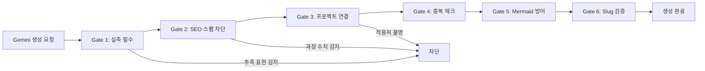

이 엔트리는 2026-05-03 위키 전체 퀄리티 체크에서 발견한 문제를 구조적으로 해결한 실전 기록이다.

## 왜 필요한가: Gemini가 만든 "98% 절감"의 실체

ai-study 위키는 Gemini 2.5 Flash로 매일 학습 엔트리를 자동 생성한다. 194개 엔트리 중 25개(13%)가 AI 자동 생성이었는데, 전수 조사 결과 **3건이 삭제 판정**을 받았다.

삭제된 엔트리들의 공통 패턴:

| 엔트리 | 문제 | 과장된 주장 |
|--------|------|------------|
| sandbox-diff-based-token-reduction | 실측 0, 이론만 | "98% 토큰 절감" |
| ai-agent-persona-engineering | 미검증 스케일 주장 | "100만 스케일 페르소나" |
| sustainable-ai-coding-agent-tenet | 의사코드만, 실행 불가 | "지속 가능한 하네스" |

**핵심 교훈**: AI는 자신감 있게 거짓 수치를 생성한다. "98% 절감"이라는 주장에 출처도 실측도 없었지만, 본문은 마치 검증된 사실처럼 서술되어 있었다.

## 6중 품질 게이트

이 문제를 구조적으로 방지하기 위해 Gemini 프롬프트에 6가지 게이트를 삽입했다.



### Gate 1: 실측 데이터 필수

```
금지 표현: "~할 수 있다", "~가 기대된다", "~가 가능하다"
허용 표현: "X 프로젝트에서 실측한 결과 Y%", "이론적으로 Z (출처: 논문명)"
```

AI가 구체적 수치를 주장하면 반드시 출처를 요구한다. 출처 없으면 "이론적으로"를 붙여야 한다.

**실제 적용**: `generate-lesson.mjs`의 Gemini 프롬프트에 삽입.

### Gate 2: SEO 스팸 차단

```
금지 패턴: "98% 절감", "100만 스케일", "10x 생산성", "완벽한 가이드"
허용 패턴: "토큰 절감 패턴", "대규모 에이전트 관리", "생산성 개선 사례"
```

제목에 검증 안 된 수치를 넣으면 SEO 스팸으로 분류된다. 수치는 본문에서 출처와 함께 제시해야 한다.

### Gate 3: 프로젝트 경험 연결

```
금지: "일반적으로 적용할 수 있다"
필수: "ai-study의 JIT 검색에 적용하면...", "moneyflow의 13-agent 파이프라인에서..."
```

4개 프로젝트(ai-study, moneyflow, tarosaju, aidy) 중 하나에 구체적으로 연결되지 않으면 "교과서 요약"일 가능성이 높다.

### Gate 4: 기존 엔트리 중복 체크

생성 전에 `content-manifest.json`의 엔트리 목록을 프롬프트에 주입하여 이미 다루고 있는 주제를 피한다.

### Gate 5: Mermaid 5대 함정 방어

AI가 가장 자주 만드는 Mermaid 에러 5가지를 프롬프트에 명시:

1. **괄호** — `A[Label (x)]` → `A["Label (x)"]`
2. **`<br/>`** — HTML 태그 금지, `·` 또는 `\n` 사용
3. **콜론** — `D[Step: Run]` → `D["Step: Run"]`
4. **subgraph/node ID 충돌** — 같은 이름 금지
5. **유니코드 화살표** — `→` 금지, `-->` 사용
6. **백틱** — Mermaid 라벨 내 `` ` `` 금지

### Gate 6: Slug 검증

```
금지: sandbox-diff-based-ai-agent-token-reduction (47자, 키워드 나열)
허용: ai-content-quality-gate (23자, 명확)
규칙: 영문 kebab-case, 40자 이내, 한글 금지
```

## 파이프라인 적용 위치

| 파이프라인 | 파일 | 게이트 적용 |
|-----------|------|------------|
| AI 과외 선생님 | `scripts/generate-lesson.mjs` | 6종 전체 |
| Blake Crosley 스카우트 | `scripts/scout-blakecrosley.mjs` | 선별 4종 + 초안 3종 |
| 긱뉴스 자동 큐레이션 | `scripts/curate-geeknews.mjs` | 기존 유지 (별도 검증) |
| 빌드 타임 검증 | `scripts/validate-content.mjs` | Mermaid 자동 수정 |

## 효과 측정

| 지표 | Before (4/8~5/2) | After (5/3~) |
|------|-------------------|-------------|
| 자동생성 엔트리 삭제율 | 3/25 = **12%** | 목표: **0%** |
| Mermaid 빌드 에러 | 월 2~3건 | 프롬프트 가드 + validate 이중 방어 |
| SEO 스팸 제목 | 5건+ | 프롬프트에서 사전 차단 |

## 자기 점검

1. 당신의 AI 파이프라인에서 생성된 콘텐츠를 사후 검증하는 구조가 있는가?
2. "사전 차단"(프롬프트 가드)과 "사후 검증"(validate 스크립트) 중 어디에 더 투자해야 하는가?
3. 자동 생성된 콘텐츠의 삭제율을 추적하고 있는가? 삭제율이 곧 파이프라인 품질 지표다.
