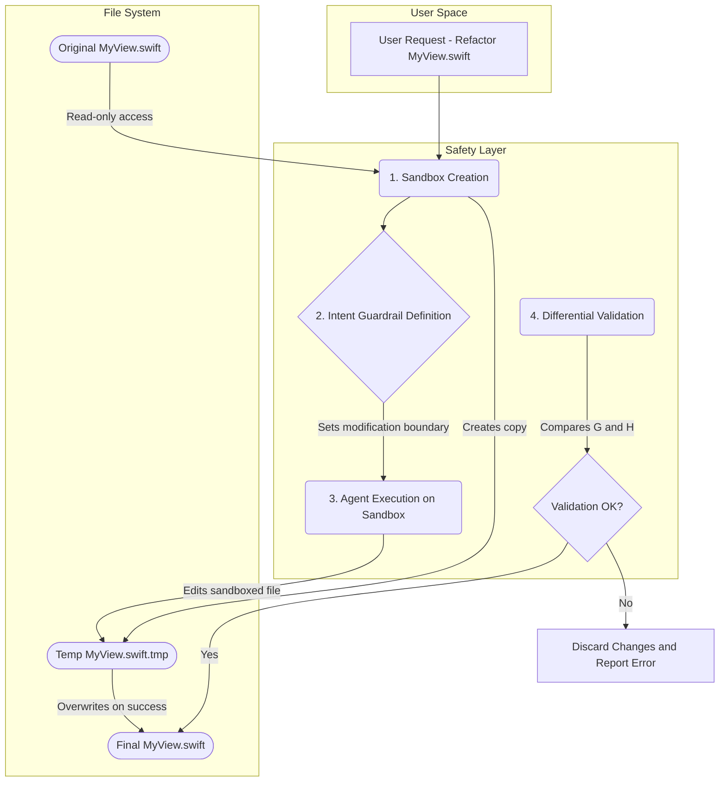

slug: llm-agent-document-corruption-delegate-52

---

LLM 기반 에이전트가 코드 리팩토링, 문서 요약, 설정 파일 수정을 자동으로 처리하는 시대가 열렸습니다. 그러나 단순히 "작업 완료" 여부만 측정하는 기존 방식은 치명적인 부작용을 간과합니다. 에이전트가 주어진 작업을 수행하다가 원본 문서의 구조나 내용을 의도치 않게 훼손하는 '사일런트 커럽션(Silent Corruption)' 문제입니다. 이 문제는 단순한 출력 오류가 아니라, 신뢰할 수 있는 자동화 시스템 구축의 근간을 흔드는 핵심 위협입니다.

2026년 4월 Microsoft Research가 공개한 **DELEGATE-52** 벤치마크(Laban, Schnabel, Neville, arXiv:2604.15597)는 바로 이 문서 훼손 문제를 정량적으로 측정합니다. 코드, 결정학(crystallography) 데이터, 악보 표기, 회계 장부 등 **52개 전문 도메인**의 실제 문서(각 약 15k 토큰)를 두고, 사용자가 LLM에게 장시간 편집을 위임하는 '딜리게이션(delegation)' 상황을 시뮬레이션합니다. 보도된 핵심 결과는 충격적입니다: 프런티어 모델(Gemini 3.1 Pro, Claude 4.6 Opus, GPT 5.4)조차 20회의 위임 편집을 거치면 평균 약 25%의 문서 내용을 훼손했고, 전체 19개 모델 평균으로는 약 50%가 손상됐다고 알려져 있습니다. 이 글은 이 벤치마크가 제기한 문제의식을 출발점으로, *엔지니어링 관점에서 어떤 방어 전략을 조합할 수 있는지*를 다룹니다(방어 전략 부분은 벤치마크가 제시한 것이 아니라 이 글에서 정리한 일반 패턴입니다).

## 사일런트 커럽션: 왜 기존 평가 방식은 부족한가?

지금까지 LLM의 성능 평가는 주로 생성된 결과물의 품질에 초점을 맞춰왔습니다. HumanEval은 코드 생성의 정확성을, MMLU는 방대한 지식을 묻습니다. 하지만 LLM 에이전트가 수행하는 작업은 '무(無)에서 유(有)를 창조'하는 것보다 기존의 컨텍스트(파일, 코드베이스)를 '수정'하는 경우가 훨씬 많습니다. 이 때 발생하는 핵심 리스크는 "명시된 요구사항은 충족했지만, 묵시적인 제약조건을 위반하는" 경우입니다.

예를 들어, "로그인 버튼의 색상을 파란색으로 변경하라"는 작업을 SwiftUI 코드에 위임했다고 가정해봅시다. 에이전트는 `.foregroundColor(.blue)`를 정확히 추가했지만, 실수로 바로 위의 `.padding()` 구문을 삭제할 수 있습니다. 코드는 여전히 컴파일될 수 있지만, UI 레이아웃은 깨져버립니다. 이것이 바로 사일런트 커럽션입니다.

DELEGATE-52 벤치마크는 이러한 문제를 수면 위로 끌어올렸습니다. 이 벤치마크는 단순 정답률(Pass/Fail)을 넘어, 에이전트가 여러 번 편집을 거치는 동안 문서가 얼마나 보존되는지를 측정합니다. 핵심 설계는 **가역적(reversible) 편집 쌍**입니다. 모든 편집 작업은 정방향 지시와 그 역(inverse) 지시가 짝을 이룹니다. 예를 들어 "이 장부를 비용 카테고리별로 분리하라"는 지시에는 "분리된 카테고리 파일들을 하나의 장부로 다시 병합하라"는 역지시가 대응됩니다. 한 환경당 이런 왕복(round-trip)을 10회, 총 20회 상호작용을 돌린 뒤, 포맷을 이해하는 파서로 원본과 비교합니다.

이때 사용하는 지표가 **Reconstruction Score(RS@k)** 입니다. k번의 상호작용 후 도메인 특화 유사도 함수로 문서가 원래 상태로 얼마나 복원되는지를 점수화합니다. 왕복이 손실 없이 가역적으로 설계되었기 때문에, 점수가 떨어진다는 것은 곧 에이전트가 지시받지 않은 무언가를 망가뜨렸다는 뜻이 됩니다.

이 글에서는 실무에서 자주 마주치는 훼손 양상을 다음 세 가지로 정리해 두겠습니다(아래 분류는 본 위키의 정리이며 벤치마크 공식 분류가 아닙니다).

- **형식 훼손 (Format Corruption):** JSON 파일의 괄호를 누락하거나 코드의 들여쓰기를 망가뜨리는 경우.
- **의미 훼손 (Semantic Corruption):** 변수명을 바꾸라는 지시에 엉뚱한 변수까지 변경하여 로직을 깨뜨리는 경우.
- **정보 삭제 (Information Deletion):** 요약을 요청했을 때, 원본의 핵심 내용을 의도치 않게 삭제하는 경우.

DELEGATE-52의 핵심 교훈은 '보존(Preservation)'이라는 차원을 평가에 도입했다는 점입니다. 에이전트는 지시받은 변경을 수행함과 동시에, 그 외의 모든 것을 온전히 보존해야 할 책임이 있습니다. 그리고 이 보존 실패는 한 번의 큰 사고가 아니라, 여러 번의 위임을 거치며 **누적·복리(compounding)** 된다는 것이 벤치마크가 드러낸 가장 위험한 특성입니다.

## 다층 방어 전략 설계

문서 훼손을 방지하기 위해서는 단순히 프롬프트를 개선하는 것만으로는 부족합니다. 시스템 수준의 다층적인 방어 아키텍처가 필요합니다. 이는 LLM의 출력을 사후에 검증하는 것을 넘어, 작업 수행 프로세스 자체에 안전장치를 내장하는 개념입니다. 아래 전략은 DELEGATE-52가 제시한 것이 아니라, 그 문제의식을 받아 일반화한 엔지니어링 패턴입니다.



### 1. 샌드박싱 및 읽기 전용 스캐폴딩 (Sandboxing & Read-Only Scaffolding)

가장 기본적인 방어선은 원본 파일에 대한 직접적인 쓰기 권한을 에이전트에게 부여하지 않는 것입니다.

1.  **파일 복사:** 작업 요청이 들어오면, 원본 파일의 복사본(Sandbox)을 생성합니다.
2.  **읽기 전용 컨텍스트:** 에이전트는 원본 파일에 대한 읽기 권한과 샌드박스에 대한 읽기/쓰기 권한만을 가집니다.
3.  **작업 수행:** 모든 파일 수정 작업은 샌드박스 내에서만 이루어집니다.

이 방식은 설령 에이전트가 샌드박스 파일을 완전히 망가뜨리더라도 원본은 안전하게 보존된다는 장점이 있습니다. 하지만 상태 관리가 복잡해지고, 여러 파일에 걸친 대규모 리팩토링의 경우 샌드박스를 관리하는 비용이 증가하는 트레이드오프가 존재합니다.

### 2. 차등 검증 (Differential Validation)

작업이 완료된 후, 원본과 샌드박스 파일의 차이점(`diff`)을 분석하여 변경의 유효성을 검증하는 단계입니다. 중요한 것은 **변경을 생성한 LLM과 다른, 더 단순하고 결정적인(deterministic) 도구**를 검증에 사용하는 것입니다.

Swift 코드 리팩토링을 예로 들어보겠습니다. 에이전트가 수정한 코드를 검증하기 위해 또 다른 LLM에게 "이 코드 괜찮아?"라고 묻는 것은 같은 종류의 실수를 반복할 위험이 있습니다. 대신 Swift 컴파일러나 정적 분석 도구를 사용해야 합니다.

```swift
import Foundation
import SwiftSyntax
import SwiftParser

// 이 코드는 개념 증명을 위한 의사코드에 가깝습니다.
// 실제로는 더 정교한 AST 비교 로직이 필요합니다.

func validateRefactoring(originalCode: String, modifiedCode: String, intent: String) -> Bool {
    // 1. 컴파일 가능 여부 확인 (가장 기본적인 검증)
    // 실제 구현에서는 SwiftPM을 통해 임시 프로젝트를 생성하고 빌드하는 방식 사용 가능
    guard canCompile(modifiedCode) else {
        print("Error: Modified code does not compile.")
        return false
    }

    // 2. AST(Abstract Syntax Tree) 비교를 통한 변경 범위 검증
    let originalTree = Parser.parse(source: originalCode)
    let modifiedTree = Parser.parse(source: modifiedCode)

    // 'intent'에 따라 허용된 변경 범위(예: 특정 함수 노드)를 벗어나는
    // AST 변경이 있는지 검사하는 로직
    // 예: "addComment" 인텐트였다면, 함수 시그니처나 다른 함수의 내용이 바뀌면 안 됨
    if !isChangeWithinIntendedScope(originalTree, modifiedTree, intent) {
        print("Error: Change detected outside of the intended scope.")
        return false
    }

    print("Validation successful.")
    return true
}

// 이 함수들은 실제 구현이 필요합니다.
func canCompile(_ code: String) -> Bool { /* ... */ return true }
func isChangeWithinIntendedScope(_ oldTree: SourceFileSyntax, _ newTree: SourceFileSyntax, _ intent: String) -> Bool { /* ... */ return true }
```

위 Swift 코드 예시처럼 `SwiftSyntax` 라이브러리를 사용하면 코드의 구조적 변경을 분석할 수 있습니다. "주석 추가"를 요청했는데 함수의 시그니처가 변경되는 AST 레벨의 변화가 감지된다면, 이는 명백한 훼손 시도이므로 작업을 거부해야 합니다.

### 3. 의도 기반 가드레일 (Intent-Based Guardrails)

가장 정교한 방어 전략은 사용자의 작업 요청(Intent)을 명확한 제약 조건으로 변환하여 LLM 에이전트에게 전달하는 것입니다. 이는 프롬프트 엔지니어링과 시스템 설계를 결합한 접근법입니다.

-   **프롬프트 수준:** "이 함수의 내용을 리팩토링해. 단, 함수의 이름과 파라미터는 절대 변경하면 안 돼." 와 같이 명시적인 제약 조건을 프롬프트에 포함합니다.
-   **시스템 수준:** 사용자의 요청 "Extract the network call"을 분석하여, "새로운 함수를 생성하고, 기존 위치에 해당 함수 호출 코드를 삽입하는 것" 외의 다른 `diff` (예: 다른 파일 수정, 기존 로직 삭제)는 허용하지 않도록 규칙을 설정합니다.

### 전략 비교

| 전략 | 장점 | 단점 | 적용하기 좋은 상황 |
| :--- | :--- | :--- | :--- |
| **샌드박싱** | 원본 파일의 안전성 절대 보장 | 상태 관리 복잡도 증가, 대규모 변경 시 오버헤드 큼 | 신뢰도가 낮은 에이전트 사용 시, 되돌릴 수 없는 중요한 파일 수정 |
| **차등 검증** | 구문/의미론적 오류를 정확히 탐지 | 도메인 특화 파서/컴파일러 필요 (예: SwiftSyntax), 계산 비용 높음 | 코드, JSON, YAML 등 구조화된 데이터 수정 |
| **의도 기반 가드레일** | 구현이 간단하고 오버헤드가 적음 | 유연성이 떨어져 복잡하고 유효한 변경을 막을 수 있음 | "변수명 변경", "주석 추가" 등 반복적이고 명확하게 정의된 작업 |

이 세 가지 전략은 상호 배타적이지 않습니다. 가장 강력한 방어 체계는 샌드박스 안에서 의도 기반 가드레일을 적용하여 에이전트를 실행하고, 그 결과를 차등 검증으로 확인한 후 원본에 적용하는 것입니다.

## 프로젝트 적용: `aidy`의 코드 스타일링 에이전트

iOS 개발 생산성 향상 도구인 `aidy`에 LLM 기반으로 Swift 코드 스타일을 자동으로 수정하는 `aidy style` 기능을 추가한다고 가정해봅시다. 이 기능은 문서 훼손 방지 전략의 완벽한 시험대입니다.

1.  **사용자 시나리오:** 개발자가 `aidy style MyViewController.swift` 명령을 실행합니다.
2.  **샌드박싱:** `aidy`는 `MyViewController.swift` 파일의 내용을 메모리로 읽어오거나 임시 파일로 복사합니다. 원본 파일은 잠급니다.
3.  **의도 기반 가드레일:** `aidy`는 LLM에게 전달할 프롬프트에 "다음 Swift 코드를 SwiftLint 규칙에 맞게 수정해. 단, 코드의 로직이나 동작을 변경하는 어떠한 수정도 해서는 안 돼. 주석, 변수명, 함수 호출 순서 등을 바꾸지 마." 와 같은 강력한 제약 조건을 포함합니다.
4.  **에이전트 실행:** LLM 에이전트가 샌드박스 내의 코드를 수정하여 결과물을 생성합니다.
5.  **차등 검증:**
    *   **1차 검증 (컴파일):** 수정된 코드가 여전히 유효한 Swift 코드인지 확인하기 위해 `swiftc -parse`와 같은 명령으로 파싱이 가능한지 검사합니다.
    *   **2차 검증 (AST 비교):** `SwiftSyntax`를 사용해 원본과 수정본의 AST를 비교합니다. 스타일링 변경(들여쓰기, 공백, 개행) 외에 `FunctionCallExprSyntax`나 `IdentifierExprSyntax` 같은 노드 자체에 의미 있는 변화가 생겼다면 '로직 변경'으로 간주하고 작업을 거부합니다.
6.  **적용 또는 거부:** 모든 검증을 통과한 경우에만 원본 파일을 수정된 내용으로 덮어씁니다. 실패 시, `diff` 결과와 함께 사용자에게 위험을 알리고 원본 파일을 그대로 둡니다.

이러한 다층 방어 구조를 통해 `aidy style`은 편리함을 제공하면서도 사용자의 코드를 망가뜨릴 위험을 최소화하는 신뢰할 수 있는 도구가 될 수 있습니다.

## 자기 점검

-   DELEGATE-52 벤치마크는 HumanEval 같은 기존 코드 생성 벤치마크와 근본적으로 어떤 차이가 있습니까?
-   '차등 검증(Differential Validation)' 전략에서 변경을 수행하는 주체와 검증을 수행하는 주체를 분리하는 것이 왜 중요한가요?
-   '샌드박싱' 접근법이 안전성을 높이지만, 여러 파일에 걸친 대규모 리팩토링 작업에서는 어떤 트레이드오프가 발생할 수 있나요?
-   `tarosaju` 프로젝트에서 사용자가 입력한 사주 정보를 바탕으로 운세 풀이(Markdown 파일)를 자동으로 생성 및 업데이트하는 에이전트를 만든다고 가정해봅시다. 이 에이전트가 기존 운세 파일의 특정 섹션만 업데이트하면서 양식을 망가뜨리거나 다른 사람의 데이터를 훼손하지 않도록 하려면 어떤 방어 전략을 어떻게 조합하여 적용하겠습니까?

## 출처

- Laban, Schnabel, Neville, *LLMs Corrupt Your Documents When You Delegate*, Microsoft Research, arXiv:2604.15597 (2026). 데이터셋: `microsoft/delegate52` (Hugging Face / GitHub).
- 벤치마크의 정량 수치(프런티어 모델 약 25% 훼손, 전체 평균 약 50%)는 보도·논문 요약 기준이며, 정확한 조건은 원문을 확인하세요. 본문의 방어 전략 3종(샌드박싱·차등 검증·의도 기반 가드레일)은 벤치마크가 제시한 항목이 아니라 이 위키에서 정리한 일반 엔지니어링 패턴입니다.