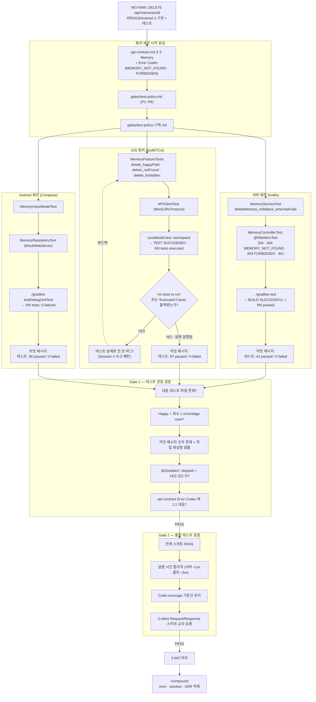

## 한 줄 요약

Flow Map 시리즈 **7편**. iOS 개발자가 회사에서 몸에 익은 "`xcodebuild test` 가 `BUILD SUCCEEDED` 면 안전" 관성을 벗어나, aidy 3-client (Server Kotlin + iOS Swift/TCA + Android Compose) 가 **공통 universal 정책 P1~P6 위에서 각 스택 고유 규율** 을 지키는 구조를 "한 WO 의 테스트 여정" 으로 관통한다. 핵심 장치 4가지 — (1) 실행 증거 제출 강제 (숫자까지), (2) 빌드 성공과 테스트 통과의 분리, (3) api-contract Error Code 100% 커버리지, (4) 외부 의존성 완전 격리. 실제 사고 사례 "iOS 테스트가 Session 4 까지 한 번도 안 돈 버그" 를 곁들여 왜 이 정책들이 존재하는지 이해한다.

---

## 갭 / 맥락 — iOS 개발자의 흔한 실패 패턴

풀스택·멀티 클라이언트 프로젝트 테스트에서 반복되는 실패:

- **"`xcodebuild test` 가 녹색이면 끝"** — 실제로는 Test Suite 가 한 번도 실행 안 됐을 수 있음 (Tuist/SPM 설정 함정)
- **"CI 녹색 = 안전"** — CI 가 실제로 테스트를 돌렸는지, 단순 컴파일만 했는지 구별 안 함
- **Error Code 선언만 하고 테스트 누락** — `APIError.RATE_LIMITED` enum 정의만 있고 실제로 이 코드가 생성되는 경로를 타는 테스트는 0건. 유령 에러 코드
- **View 로직이 View 에 섞여서 "테스트 불가"** — 구조적 문제를 정책 예외로 회피
- **AI API 를 실호출하는 테스트** — flaky · 비용 · Circuit Breaker 트리거 등 연쇄 장애
- **@Disabled 로 실패 회피** — 망가진 테스트를 고치지 않고 스킵해서 커버리지 숫자만 유지
- **"빌드만 통과하면 PR 올려도 돼" 관행** — 서버 통합 테스트 생략 → 프로덕션에서 발견

**공통 원인**: "테스트가 실제로 실행됐는가" 와 "코드가 컴파일됐는가" 를 **구조적으로 분리** 하는 장치가 없다.

---

## aidy-architect 의 `gates/test-policy*.md` 가 학습 재료로 좋은 이유

### 스택 개요

| 파일 | 스코프 | 줄수 |
|------|-------|------|
| `gates/test-policy.md` | **Universal P1~P6** — 3-client 공통 | 94 |
| `gates/test-policy-server.md` | Kotlin/Spring Boot · JUnit5 · MockK | 109 |
| `gates/test-policy-ios.md` | Swift/TCA · TestStore · Tuist | 126 |
| `gates/test-policy-android.md` | Kotlin/Compose · JUnit · Robolectric/Espresso | ~100 |

### 왜 이 정책 패키지인가

1. **실제 사고가 낳은 정책** — iOS 테스트가 Session 4 까지 안 돌고 있었다는 사고 발견 후 4 파일이 동시 신설됨 (HANDOFF.md 기록)
2. **Universal + 스택 고유 레이어 분리** — P1~P6 은 공통, 각 스택은 도구 · 실행 증거 캡처 방법만 따로
3. **금지 탈출구 명시** — "빌드가 통과했으니 OK" · "테스트는 나중에" · "이 변경은 UI 만이라 불필요" 같은 변명을 정책으로 차단
4. **Gate 검증과 직결** — Gate 1 (스펙 준수) 과 Gate 2 (통합) 가 테스트 관점 체크리스트를 포함
5. **3-client 일관성** — 같은 정책 틀 위에서 각 스택이 독립 검증됨 → 한 스택 통과가 다른 스택 품질을 오염시키지 않음

---

## 1단계: "WO 한 건의 테스트 여정" 따라가기

### 'Memory 삭제 API 추가' WO 가 테스트 정책을 관통하는 흐름



### 각 단계가 하는 일 (한 줄씩)

| 단계 | 역할 | iOS 팀 대응 |
|------|------|-----------|
| **워커 시작 로딩** | api-contract · test-policy 의무 로드 | 주니어 개발자 온보딩 문서 + 팀 테스트 가이드 |
| **서버 단위 테스트** | Service · Util · Validator MockK 로 격리 | 서비스 레이어 단위 테스트 (JUnit) |
| **서버 컨트롤러 @WebMvcTest** | 모든 엔드포인트 200 + 4xx/5xx + 인증 401 | MockMvc 통합 |
| **iOS Feature 테스트** | TestStore 로 Reducer state/action 시퀀스 검증 | 회사에서 익숙한 패턴 (TCA 경험자) 또는 MVVM ViewModel 단위 테스트 |
| **iOS APIClient 테스트** | URLSession 실호출 금지 → MockURLProtocol | 회사 앱의 네트워크 모킹 패턴 |
| **'no tests to run' 검출** | Test Suite 실제 실행됐는가 line-level 확인 | 흔히 놓치는 함정 — 회사 CI 도 같은 위험 있음 |
| **Android ViewModel · Repository 테스트** | Compose State 검증 + MockWebServer | 회사 Android 팀과 구조 동일 |
| **커밋 메시지 숫자 포함** | "NN passed / 0 failed" 강제 | PR description 에 test 결과 첨부 관행 |
| **Gate 1 테스트 관점** | 파일 존재 · happy+edge · 실행 증거 · @Disabled 없음 · Error Code 1:1 | 시니어 PR 리뷰에서 "테스트 커버리지" 섹션 |
| **Gate 2 통합** | 전체 스위트 PASS + 3-client 교차 호환 | QA + 통합 테스트 + 성능 확인 |

> 💡 **핵심 관찰**: Gate 1 이 "Error Codes 1:1 대응" 을 요구하는 구조가 독특하다. 일반 테스트 정책은 "커버리지 %" 로 말하지만 aidy 는 *"api-contract 가 선언한 에러 코드 = 테스트가 생성할 에러 코드"* 의 집합 동일성으로 말한다. 이게 3-client 일관성의 수학적 근거.

---

## 2단계: 관심사별 훑기

### Universal P1~P6 (공통 원칙 — test-policy.md)

- **P1. 테스트 없는 머지 없음** — 새 public 함수 · Reducer · ViewModel 메서드는 단위 테스트 필수. 버그 수정은 red → green (회귀 테스트 먼저)
- **P2. 실행 증거 제출** — 커밋 메시지 또는 inbox 에 `NN tests · 0 failures` 같은 숫자. **빌드 성공은 증거 아님**
- **P3. 금지 패턴** — @Disabled (예외 외) · assertThrows 없는 예외 경로 · stub-only 가짜 통과 · 프로덕션 경로 안 타는 테스트
- **P4. 외부 의존성 격리** — AI API 는 반드시 Mock · DB 는 영역별 정책 (H2/in-memory/mock) · 네트워크는 MockURLProtocol / MockWebServer
- **P5. 테스트 네이밍** — `<대상>_<동작>_<조건>` 또는 한국어 `~할 때 ~한다`
- **P6. Flaky 테스트 금지** — 시간/순서 의존 발견 시 즉시 수정. 재시도로 가리기 금지

### 서버 (Kotlin/Spring Boot)

- **4 계층**: 단위 (Service) · Repository (@DataJpaTest) · 컨트롤러 (@WebMvcTest) · 통합 (@SpringBootTest)
- **Error Code 커버리지 표** — api-contract 의 `EMPTY_MESSAGE · VALIDATION_ERROR · INVALID_CREDENTIALS · UNAUTHORIZED · FORBIDDEN · MEMORY_NOT_FOUND · PERSON_NOT_FOUND · DUPLICATE_EMAIL · RATE_LIMITED · AI_TIMEOUT · AI_UNAVAILABLE · INTERNAL_ERROR` 12 코드 각각에 대응 테스트 파일 명시
- **DTO Validation** — `@field:NotBlank · @field:Email · @field:Size` 모두 실패 케이스 테스트 + 한국어 메시지 확인
- **외부 격리**: 실제 Anthropic API 호출 금지 (`@MockkBean AiService`) · 실제 PostgreSQL 금지 (H2 테스트 전용)

### iOS (Swift/TCA)

- **Feature(Reducer) 테스트 = 필수** — 모든 `@Reducer` 에 대응 `*FeatureTests.swift`. TestStore 로 액션 send → state 전이 · receive → effect 결과 검증
- **`@Dependency` 규칙** — 모든 I/O (APIClient · Keychain · UserDefaults · 시계 · UUID) 는 Dependency. `testValue` 는 `unimplemented()` 기본 (테스트가 명시적으로 override 요구)
- **Tuist/SPM 설정** — `Tuist/Package.swift` 의 `PackageSettings.productTypes` 에 `.framework` 명시 없으면 `xcodebuild test` 시 **resource bundle copy 실패** (조용히 테스트 0 실행됨 — Session 4 사고 패턴). 연관 : [Tuist SPM Testing Trap](/wiki/ios-ai/tuist-spm-testing-trap)
- **실행 증거 캡처 필수 문구**:
  - `Test Suite 'All tests' passed`
  - `Executed NN tests, with 0 failures`
  - `no tests to run` 또는 `Executed 0 tests` → 심각한 버그 경보
- **View 테스트** — 원칙적으로 Reducer 위임. 복잡한 conditional 은 헬퍼 struct 추출 후 단위 테스트. 스냅샷은 단일 기기 + 단일 OS 만 (flakiness 방지)

### Android (Kotlin/Compose)

- **ViewModel 단위 테스트** — state flow 전이 + coroutine 처리
- **Repository 테스트** — MockWebServer 로 HTTP 레이어 격리
- **Compose UI 테스트** — 중요 화면만 선택적 (전체 커버리지 대신 골든 패스)
- **Robolectric** — Android framework 의존을 JVM 에서 돌릴 때 (선택)

### 금지 탈출구 (공통)

- "테스트는 나중에 추가하겠습니다"
- "빌드가 통과했으니 OK"
- "tuist build 성공 = 테스트 통과"
- "기존 테스트가 있으니 새 테스트는 생략"
- "이 변경은 UI만이라 테스트 불필요"

→ 이 문구들이 PR · inbox · 커밋 메시지에서 발견되면 Gate FAIL 처리.

### 실제 사고 사례 — "iOS 테스트가 한 번도 안 돈 Session 4 버그"

2026-04-16 autoceo 4차 스프린트 (10 라운드) 중 QA 정비 라운드에서 발견:

- 증상: 매 라운드 "테스트 통과" 보고됐는데 실제 iOS 테스트 파일이 0건 실행
- 원인: Tuist/SPM 설정에서 `PackageSettings.productTypes` 에 framework 선언 누락 → `xcodebuild test` 가 resource bundle copy 실패하면서 **BUILD SUCCEEDED 만 뜨고 Test Suite 단계로 안 넘어감**
- 심각도: 4 라운드 × 10 WO = 40 변경이 **테스트 없이 머지됨**
- 수습: test-policy 4 파일 신설 + P2 (실행 증거 제출) 강화 + iOS 의 "no tests to run 검출" 규약 추가

**교훈**: "빌드 SUCCEEDED" 는 "Test Suite ran" 과 다르다. Test Suite 실행 증거 (숫자 · "passed" 문구) 를 line-level 로 확인하는 규약이 없으면 동일 사고 반복.

---

## 3단계: iOS 경험을 레버리지 — 비교 매핑표

### 테스트 정책 · 도구 매핑 (20개)

| aidy 개념 | iOS 팀 경험 | 차이 / 포인트 |
|---------|-----------|-------------|
| **P1~P6 Universal 정책** | 팀 테스트 가이드 문서 | 한 파일 94줄로 압축 · LLM 친화 |
| **P2 실행 증거 숫자** | PR description 에 test 결과 첨부 | **커밋 메시지 강제 포함** — 더 엄격 |
| **Error Code 1:1 커버리지** | 일반적으로 없음 | api-contract 와 테스트 파일 집합 동일성 강제 |
| **단위 (Service) / Repository / Controller / E2E 4계층** | 일반 JUnit 계층 | Spring Boot 의 `@WebMvcTest · @DataJpaTest · @SpringBootTest` 명확 |
| **MockK (Kotlin Mock)** | MockK / mockito | 서버 전용 |
| **TestStore (TCA)** | 회사 RIBs/ReactorKit 의 유사 테스트 | Action send → state 전이 + receive → effect 검증 |
| **`@Dependency` + `testValue = unimplemented()`** | RIBs `Dependency` 프로토콜 Mock 주입 | *호출 안 한 의존성* 이 실수로 호출되면 테스트 즉시 실패 (엄격함 차원이 다름) |
| **MockURLProtocol** | URLSession stub | 회사 패턴과 동일 |
| **@MockkBean** | SpringMock — Anthropic API 격리 | 필수 |
| **H2 테스트 DB** | 회사 SQLite 또는 Docker test containers | 가장 빠른 옵션 |
| **MockWebServer (Android)** | iOS MockURLProtocol 과 동형 | OkHttp 기반 |
| **'no tests to run' 검출** | iOS 개발자가 대체로 놓치는 함정 | xcodebuild 출력 line-level 확인 |
| **Tuist PackageSettings** | 회사 SPM 직접 관리 경험 | .framework 명시 누락 → 테스트 조용한 실패 |
| **@Disabled 금지** | XCTSkip · @Ignore 오용 방지 | 예외는 반드시 주석 + TODO |
| **한국어 에러 메시지 assert** | 회사 i18n 테스트 | Bean Validation 메시지 검증까지 |
| **통합 테스트 (E2E 시나리오)** | 회사 staging 테스트 | signup → login → 기능 사용 1 시나리오 필수 |
| **Gate 1 테스트 관점** | 시니어 PR 리뷰 "테스트 섹션" | Architect 가 라인 대조 · 요약 금지 |
| **Gate 2 통합 테스트 관점** | QA + 스테이징 | 로컬 실측 필수 · CI 위임 금지 |
| **3-client 교차 호환 검증** | Contract testing (Pact) 유사 | Gate 2 에서 Request/Response 스키마 수동 대조 |
| **실행 시간 목표** | 일반적으로 없음 | 서버 1분 이내 · 클라 3분 이내 명시 |

### '단방향 정책 흐름' 관점

iOS 에서 익숙한 TCA 의 단방향성을 테스트 정책에도 적용하면:

```
api-contract.md (스펙)
   ↓
test-policy*.md (정책)
   ↓
구현 + 테스트 (워커)
   ↓
Gate 1 line-by-line (Architect)
   ↓
Gate 2 통합 (Architect)
   ↓
머지 + /compound
```

역방향은 금지 — "테스트 나중에 추가" · "정책 예외 신청" · "Gate 통과했다 치고 머지" 같은 샛길이 구조적으로 차단됨.

---

## 4단계: 실전 학습 로드맵 (Week 1~5)

### Week 1: 정책 문서 4개 관통 읽기
- [ ] `gates/test-policy.md` (94줄) — P1~P6 공통 원칙 흡수
- [ ] 본인 주력 플랫폼 정책 1개 정독 (iOS 개발자는 `test-policy-ios.md`)
- [ ] 다른 2 플랫폼 정책도 훑기 (Server/Android) — 스택이 달라도 **P1~P6 공통** 느낌 확인
- [ ] 금지 탈출구 5문구 숙지

### Week 2: 본인 프로젝트에 P2 (실행 증거) 적용
- [ ] 커밋 메시지 템플릿에 `테스트: NN passed / 0 failed` 섹션 추가
- [ ] Pre-commit hook 또는 slash command 로 테스트 실행 → 결과 숫자 캡처 자동화
- [ ] 기존 CI 파이프라인의 출력에서 "Test Suite passed" · "Executed NN tests" line 을 검증 스크립트로 확인
- [ ] "no tests to run" 검출 assertion 추가 (iOS 의 경우 xcodebuild 출력 grep)

### Week 3: Error Code 커버리지 매트릭스 작성
- [ ] 본인 프로젝트 `api-contract.md` 의 Error Codes 표 → 테스트 파일 매핑 표 작성
- [ ] 누락된 코드 식별 (예: `FORBIDDEN` 이 정의돼 있는데 실제 생성 테스트 없음)
- [ ] 각 누락 코드에 대해 최소 1 테스트 추가
- [ ] 매트릭스를 Gate 1 체크리스트에 포함

### Week 4: 외부 의존성 격리 검증
- [ ] AI API 호출 테스트 전수 조사 — 실호출이 있으면 MockKBean / MockURLProtocol 로 전환
- [ ] DB 테스트 분류 — H2 / test containers / mock 중 어느 것인지 명확화
- [ ] Network 테스트 — MockWebServer · MockURLProtocol 일관성 확인
- [ ] `@Dependency testValue = unimplemented()` 패턴 도입 (iOS 한정)

### Week 5: Gate 1/2 테스트 관점 자동화
- [ ] `.claude/commands/gate-1.md` 에 테스트 검증 프로시저 명시 (파일 존재 · Happy+edge · 실행 증거 숫자 · @Disabled 검색 · Error Code 매트릭스)
- [ ] `.claude/commands/gate-2.md` 에 전체 스위트 실행 + 실행 시간 확인 + 3-client 교차 호환 체크
- [ ] 첫 WO 1건으로 dry-run — 정책 위반이 실제로 FAIL 처리되는지 확인
- [ ] /cross-session-review 로 "메타데이터 신뢰 금지" 검증 (워커 완료 보고와 실제 diff 비교)

---

## 자주 막히는 지점

| 증상 | 원인 / 해법 |
|------|-----------|
| iOS `BUILD SUCCEEDED` 만 나오고 테스트 안 돈다 | Tuist `PackageSettings.productTypes` 에 `.framework` 명시 누락. [Tuist SPM Testing Trap](/wiki/ios-ai/tuist-spm-testing-trap) 참조 |
| `./gradlew test` 통과인데 실제 테스트 0개 | 테스트 클래스가 `src/test/kotlin/` 경로 밖. 또는 `@Test` 어노테이션 누락 |
| Error Code 가 정의만 있고 생성 안 됨 | DTO validation · exception handler 경로 미완성. 대응 테스트부터 작성하면 구현 누락 자동 드러남 |
| `@Disabled` 로 망가진 테스트 덮음 | 정책 위반. 테스트를 고치거나 삭제. 덮기 금지 |
| 실제 Anthropic API 호출 테스트 | 비용 · flaky · CI 실패. `@MockkBean` 또는 WireMock |
| Tuist 설정 변경 후 `xcodebuild test` 동작 안 함 | `tuist clean && tuist install && tuist generate --no-open` 필수 |
| `-project` 로 xcodebuild 실행 | `-workspace Aidy.xcworkspace` 로 변경 (SPM 모듈 해석) |
| View 에 로직 있어서 테스트 불가라고 주장 | Reducer 로 추출 → TestStore 로 테스트. UI "스킵" 아님 |
| 스냅샷 테스트가 flaky | 단일 기기 · 단일 OS · 단일 locale 기준 고정 |
| `Thread.sleep()` 으로 async 대기 | Awaitility (server) · `await store.receive` (iOS) · TestCoroutineScheduler (Android) |
| 커스텀 JPA 쿼리 테스트 누락 | `@DataJpaTest` + 커스텀 쿼리 1:1 매핑 강제 |
| CI 만 녹색이고 로컬은 안 돌림 | Gate 2 가 "로컬 실측" 을 명시적으로 요구. CI 위임 금지 |
| 테스트 실행 시간 10분+ | 외부 의존성 · 실 DB · sleep 이 섞였을 가능성. 격리 점검 |
| 여러 스냅샷 테스트가 한 PR 에서 한 번에 깨짐 | 도구·OS·폰트 버전 변경이 동시에 일어났을 가능성. 하나씩 재생성 |

---

## AI Agent Directive

### Trigger
- 3-client (server/ios/android) 프로젝트에서 테스트 정책 일관성 문제가 있을 때
- "빌드 통과 = 테스트 통과" 오신이 팀/본인에게 있을 때
- Error Code enum 은 있는데 실제 생성 경로 테스트가 없는 유령 코드 존재
- iOS 에서 `BUILD SUCCEEDED` 만 확인하고 테스트 결과는 안 보는 습관
- AI API · DB 를 실호출하는 테스트가 있을 때 (flaky · 비용)
- @Disabled / XCTSkip 사용이 늘고 있을 때

### Prerequisites
- [Flow Map 4편 — Architect 멀티 세션 오케스트레이션](/wiki/harness-engineering/architect-flow-map-via-aidy-architect)
- [Flow Map 6편 — API 계약이 코드보다 먼저](/wiki/context-engineering/api-contract-as-3-client-source-of-truth) — Error Code 표의 역할 이해
- [Tuist SPM Testing Trap](/wiki/ios-ai/tuist-spm-testing-trap) — iOS 테스트 조용한 실패 원인

### Actionable Steps
1. **Universal 정책 94줄 작성** — P1~P6 을 본인 프로젝트에 맞게 조정. 금지 탈출구 문구 포함
2. **스택별 정책 파일 분리** — server / ios / android 각각 실행 명령 · 실행 증거 문구 · 스택 고유 함정 명시
3. **P2 (실행 증거) 자동화** — 커밋 메시지에 테스트 결과 숫자 강제. Pre-commit hook 또는 slash command
4. **Error Code 커버리지 매트릭스** — api-contract Error Codes 표와 테스트 파일 1:1 매핑. Gate 1 체크리스트 포함
5. **외부 의존성 격리 감사** — AI API · DB · Network 실호출 전수 조사 · 모두 Mock 전환
6. **"no tests to run" 검출** (iOS) — xcodebuild 출력에서 이 문구 grep · 발견 시 CI 실패 처리
7. **Tuist/SPM 설정** (iOS) — `PackageSettings.productTypes` 에 `.framework` 명시 · `-workspace` 사용
8. **Gate 1/2 슬래시 커맨드** — 테스트 관점 체크리스트를 프로시저로 구체화 (요약 금지 · line-by-line)
9. **dry-run 1회** — 일부러 정책 위반 PR 작성 → Gate 가 실제 FAIL 처리하는지 검증

### Anti-patterns
- **"빌드 통과했으니 OK"** — 공식 정책 위반 문구. 즉시 Gate FAIL
- **@Disabled 로 망가진 테스트 덮음** — 고치거나 삭제, 덮기 금지
- **커버리지 숫자 위장** — stub-only · `assertTrue(true)` · 프로덕션 경로 안 타는 테스트
- **AI API 실호출 테스트** — flaky · 비용 · Circuit Breaker 트리거
- **Thread.sleep() 비동기 대기** — Awaitility · deterministic clock 으로 전환
- **한 스냅샷을 여러 기기에 걸쳐 테스트** — 단일 기기 · 단일 OS 기준 고정
- **View 로직을 View 에 섞음** — "UI 라 테스트 불가" 주장은 설계 문제 증상
- **CI 녹색만 확인하고 로컬 실측 스킵** — Gate 2 는 로컬 실측 필수 요구
- **`-project` 로 xcodebuild 실행** — `-workspace` 필수 (SPM 모듈 해석)

---

## 다음 학습 연결

- [Flow Map 4편 — Architect 오케스트레이션](/wiki/harness-engineering/architect-flow-map-via-aidy-architect) — Gate 검증의 상위 구조
- [Flow Map 6편 — api-contract source of truth](/wiki/context-engineering/api-contract-as-3-client-source-of-truth) — Error Code 커버리지가 도출되는 원류
- [Backend Flow Map](/wiki/backend-ai/backend-flow-map-via-aidy-server) · [iOS Flow Map](/wiki/ios-ai/ios-flow-map-via-aidy-ios) · [Android Flow Map](/wiki/android-ai/android-flow-map-via-aidy-android) — 각 스택의 실구현 맥락
- [Tuist SPM Testing Trap](/wiki/ios-ai/tuist-spm-testing-trap) — iOS 의 조용한 실패 사고 깊이
- [Aidy Journal 000 — Baseline](/wiki/harness-engineering/aidy-journal-000-architect-worker-baseline) — Gate 검증 + Compound 상위 관점
- [Aidy Journal 002 — Stability·Observability·Test Integrity](/wiki/harness-engineering/aidy-journal-002-stability-observability-test-integrity) — Session 4 사고 회고 원전
- [Context Scaling 3-레이어](/wiki/context-engineering/context-scaling-3-layer-architecture) — test-policy 파일 자체는 Layer 1 캐시 대상

---

## 출처 / 검증 메모

- 정책 원전:
  - `~/Develop/aidy-architect/gates/test-policy.md` (Universal P1~P6, 94줄)
  - `~/Develop/aidy-architect/gates/test-policy-server.md` (109줄)
  - `~/Develop/aidy-architect/gates/test-policy-ios.md` (126줄)
  - `~/Develop/aidy-architect/gates/test-policy-android.md`
- 사고 기록: `~/Develop/aidy-architect/HANDOFF.md` — Session 4 QA 정비 라운드 "iOS 테스트 실제 미실행" 발견
- 실제 Gate 1 샘플: `gates/reviews/gate-1-WO-004-server.md`
- 관련 Journal: `content/harness-engineering/aidy-journal-002-stability-observability-test-integrity.mdx`
- 시리즈 기획: `~/Develop/ai-study/docs/series-flow-map-for-ios-devs.md`
