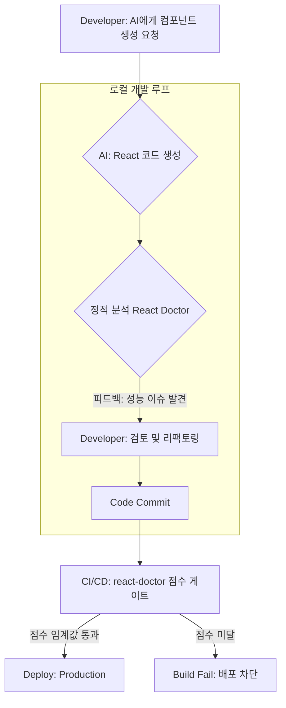

AI 코딩 어시스턴트가 개발 워크플로우의 표준이 되면서, 프론트엔드 개발자는 그 어느 때보다 빠른 속도로 코드를 작성하고 있습니다. GitHub Copilot이나 ChatGPT를 활용해 컴포넌트의 보일러플레이트를 만들고, 복잡한 로직의 초안을 잡는 것은 이제 일상입니다. 하지만 이 과정에서 새로운 종류의 기술 부채가 쌓이고 있습니다. AI가 생성한 코드는 구문적으로는 완벽하지만, React의 미묘한 렌더링 최적화 원칙을 무시하거나, 프로젝트의 아키텍처 컨텍스트를 이해하지 못한 채 잘못된 패턴을 제시하는 경우가 빈번합니다. 이는 곧 미세한 버그, 성능 저하, 그리고 유지보수 비용의 증가로 이어집니다. 지금 우리에게 필요한 것은 속도의 이점을 누리면서도 코드의 신뢰도를 잃지 않게 해줄 'AI 코드 품질 게이트'입니다.

## AI 시대, ESLint만으로 충분하지 않은 이유

기존의 린팅 도구인 ESLint나 타입 체커인 TypeScript는 코드의 일관성과 타입 안정성을 보장하는 데 매우 효과적입니다. 하지만 이들은 AI가 생성한 코드의 '의도'나 '효율성'까지 판단하지는 못합니다. 예를 들어, AI는 다음과 같은 코드를 쉽게 생성할 수 있습니다.

```typescript
// AI-generated component example
import React, { useState, useEffect } from 'react';

interface UserProfileProps {
  userId: string;
}

const UserProfile: React.FC<UserProfileProps> = ({ userId }) => {
  const [user, setUser] = useState(null);

  useEffect(() => {
    const fetchUser = async () => {
      const response = await fetch(`/api/users/${userId}`);
      const data = await response.json();
      setUser(data);
    };

    fetchUser();
    // AI가 흔히 빠뜨리는 useEffect 의존성 배열
  }, []); // userId가 변경되어도 재실행되지 않음

  if (!user) {
    return <div>Loading...</div>;
  }

  return (
    <div>
      <h1>{user.name}</h1>
      <p>{user.email}</p>
      {/* AI가 생성한 불필요한 인라인 스타일 객체는 매 렌더링마다 재생성됨 */}
      <div style={{ padding: 20, backgroundColor: 'white' }}>
        ...
      </div>
    </div>
  );
};

export default UserProfile;
```

위 코드는 구문적으로 유효하며 TypeScript 검사도 통과합니다. 하지만 두 가지 잠재적인 문제가 있습니다.
1.  `useEffect`의 의존성 배열이 비어있어 `userId` prop이 변경되어도 새로운 사용자 정보를 가져오지 않습니다.
2.  `style` prop에 인라인으로 전달된 객체는 매 렌더링마다 새로운 참조로 생성되어 불필요한 리렌더링을 유발할 수 있습니다.

이러한 문제들은 전통적인 린터가 '에러'로 분류하기 어려운 '안티패턴'의 영역에 속합니다. AI는 방대한 코드 데이터베이스를 학습했지만, 특정 프로젝트의 성능 요구사항이나 React의 깊은 동작 원리까지 고려하지는 못하기 때문에 이런 코드를 생성할 가능성이 높습니다. 바로 이 지점에서 'React Doctor'와 같은 AI 코드 진단 도구의 필요성이 대두됩니다.

## React Doctor: AI 코드 검증을 위한 진단 도구

React Doctor([millionco/react-doctor](https://github.com/millionco/react-doctor))는 million.js를 만든 Aiden Bai 팀이 공개한 오픈소스 CLI로, React 코드베이스에 대해 정적 분석을 수행하여 잠재적인 문제를 진단하는 도구입니다. 단순한 코드 스타일 검사를 넘어, React 애플리케이션의 성능, 안정성, 유지보수성에 영향을 미칠 수 있는 안티패턴을 탐지하는 데 중점을 둡니다. 슬로건이 "Your agent writes bad React. This catches it" 인 데서 드러나듯, 코딩 에이전트가 양산하는 저품질 React 코드를 잡는 것을 명시적 목표로 삼습니다.

설치 없이 프로젝트 루트에서 바로 실행할 수 있습니다.

```bash
npx -y react-doctor@latest .
```

동작 방식은 두 패스를 병렬로 돌리는 구조입니다. 하나는 Rust 기반 린터인 [Oxlint](https://oxc.rs/docs/guide/usage/linter.html)를 사용한 린트 패스이고, 다른 하나는 데드 코드 탐지 패스입니다. 두 결과를 합산해 **0~100 사이의 health score**와 "Great"/"Critical" 같은 정성 라벨을 출력합니다. Oxlint가 Rust로 작성된 덕분에 수만 줄 코드도 밀리초 단위로 처리하므로, PR마다 돌려도 파이프라인 지연이 거의 없습니다.

규칙은 60여 개가 state/effects, performance, architecture, bundle size, security, correctness, accessibility, framework(Next.js·React Native) 카테고리로 묶여 있습니다. 또한 분석 결과를 코딩 에이전트(Claude Code, Cursor, Codex, OpenCode 등)에 스킬로 설치해, 에이전트가 동일한 문제를 다음부터 스스로 피하도록 학습시키는 통합 경로를 제공합니다 — 이것이 "talks to coding agents"라 불리는 차별점입니다.

### 주요 분석 영역과 실제 적용 패턴

React Doctor의 규칙 카테고리(state/effects, performance, architecture, security, correctness, accessibility 등)를 프론트엔드 개발자가 AI 생성 코드를 검토할 때의 체크리스트로 풀어 쓰면 다음과 같습니다. 오른쪽 칸은 `moneyflow` 같은 프로젝트에서 마주칠 법한 가상의 적용 시나리오입니다(실제 도구 출력 그대로가 아니라 카테고리 적용 예시).

| 분석 영역 | 탐지 대상 안티패턴 | `moneyflow` 적용 시나리오 |
| :--- | :--- | :--- |
| **성능 (performance)** | 불필요한 리렌더링 (`props`로 익명 함수/객체 전달), 거대 컴포넌트, `useMemo`/`useCallback`의 부적절한 사용 | AI가 생성한 차트 컴포넌트에서 `data` prop을 가공하는 로직이 매 렌더마다 새 배열을 만드는 경우를 성능 카테고리에서 짚어줄 수 있음. |
| **state/effects** | `useEffect` 의존성 배열 누락/오류, 조건부 Hook 호출, 커스텀 Hook 이름 규칙 위반 | 자산 데이터를 불러오는 `useFetchAssets` 커스텀 Hook에서 의존성 배열에 `accountId`가 누락된 코드를 effects 규칙으로 감지. |
| **correctness** | 명백히 잘못된 React 사용, 깨지기 쉬운 패턴 | 렌더 도중 setState 호출이나 key 누락처럼 런타임 버그로 이어질 패턴을 correctness 카테고리로 분류. |
| **접근성 (accessibility)** | `img` 태그의 `alt` 속성 누락, 부적절한 ARIA 속성, 키보드 접근성 | `div` + `onClick`으로 구현한 버튼처럼 시맨틱·키보드 접근성이 빠진 패턴을 a11y 규칙으로 경고. |

> 주의: 위 표의 오른쪽 칸은 "이 카테고리라면 이런 코드가 걸릴 것"이라는 설명용 예시다. 특정 prop 이름이나 정확한 경고 메시지는 실제 실행 결과를 확인해야 한다. AI 환각 API 호출 자체는 린트 규칙보다 타입 체커(TypeScript)나 빌드 단계에서 더 확실히 걸리는 경우가 많다.

### 개발 워크플로우에 통합하기

React Doctor와 같은 정적 분석 도구는 개발의 여러 단계에 통합하여 그 효과를 극대화할 수 있습니다. 이는 단순한 코드 검사를 넘어, 개발자와 AI 간의 생산적인 피드백 루프를 형성합니다.



1.  **로컬 개발 환경**: 개발자가 AI로 코드를 생성한 직후 `npx -y react-doctor@latest .` 를 실행해 즉각적인 피드백을 받습니다. 마치 페어 프로그래머가 옆에서 코드 리뷰를 해주는 것과 같습니다.
2.  **CI/CD 파이프라인**: Pull Request 생성 시 또는 프로덕션 빌드 전에 자동화된 분석을 실행합니다. React Doctor에는 단일 `--fail-on-critical` 류의 플래그 대신 `--score` 옵션으로 0~100 점수를 출력하는 경로가 있으므로, 이 점수를 임계값과 비교해 빌드를 통과/실패시키는 식으로 품질 게이트를 구성합니다. 또한 GitHub Action의 `diff` 옵션을 쓰면 PR에서 변경된 파일만 스캔해, 기존 코드의 누적 문제가 아니라 이 PR이 *새로 들여온* 문제만 막을 수 있습니다.

```bash
# CI 예시: 점수가 임계값(예: 80) 미만이면 비정상 종료
score=$(npx -y react-doctor@latest . --score)
[ "$score" -ge 80 ] || { echo "React Doctor score $score < 80"; exit 1; }
```

## React Doctor vs. ESLint vs. TypeScript

이 세 가지 도구는 서로를 대체하는 관계가 아니라, 각기 다른 영역을 책임지며 상호 보완하는 관계입니다.

| 도구 | 주요 목적 | 강점 | 한계 |
| :--- | :--- | :--- | :--- |
| **ESLint** | 코드 스타일 일관성, 명백한 구문 에러 방지 | 높은 커스터마이징, 방대한 플러그인 생태계 | 코드의 런타임 동작이나 성능, 아키텍처 패턴 분석에는 한계가 있음. |
| **TypeScript** | 타입 안정성 확보, 런타임 타입 에러 사전 방지 | 코드 자동완성 및 리팩토링 지원, 대규모 프로젝트에서의 안정성 확보 | 타입 정보가 없는 런타임 로직 오류나 React 고유의 성능 안티패턴은 잡지 못함. |
| **React Doctor** | React 특화 안티패턴, 성능 병목, AI 생성 코드의 잠재적 결함 진단 | React의 동작 원리에 기반한 깊이 있는 분석 제공, AI 코드의 신뢰도 확보에 특화 | 일반적인 JavaScript 코드 스타일이나 타입 에러는 다루지 않음. 설정이 과도하면 생산성을 저해할 수 있음. |

## 트레이드오프와 한계

React Doctor와 같은 깊은 정적 분석 도구의 도입이 항상 긍정적인 것만은 아닙니다.

*   **초기 설정 비용**: 프로젝트의 특성에 맞게 규칙을 설정하고, 기존 코드베이스에 적용하는 데 시간이 소요될 수 있습니다.
*   **오탐(False Positives)**: 분석 도구가 때로는 의도된 코드 패턴을 문제로 진단할 수 있습니다. 이는 개발자의 작업을 방해하고 도구에 대한 불신으로 이어질 수 있습니다. 따라서 규칙을 점진적으로 도입하고 팀과 합의하는 과정이 필수적입니다.
*   **분석 속도**: 특히 대규모 프로젝트에서는 정적 분석 자체가 CI/CD 시간을 늘리는 요인이 될 수 있습니다. 치명적인 규칙만 CI 단계에서 실행하고 나머지는 로컬 환경에서 확인하도록 분리하는 전략이 필요합니다.

이러한 도구는 빠르게 프로토타입을 만들거나 아이디어를 검증하는 초기 단계에서는 오히려 개발 속도를 저해하는 '족쇄'가 될 수 있습니다. 팀의 성숙도와 프로젝트의 생명주기를 고려하여 도입 시점과 강도를 조절하는 지혜가 필요합니다.

## 자기 점검

*   AI가 생성한 React 코드에서 `useEffect`의 의존성 배열 누락 외에 어떤 흔한 안티패턴을 발견한 경험이 있나요?
*   정적 분석 도구가 '성능 문제'를 경고했을 때, 그것이 실제 사용자 경험에 영향을 미치는 유의미한 문제였는지, 아니면 사소한(minor) 최적화에 불과했는지 어떻게 판단할 수 있을까요?
*   현재 참여 중인 프로젝트의 CI/CD 파이프라인에 React Doctor와 같은 '품질 게이트'를 추가한다면, 어떤 종류의 버그를 가장 효과적으로 예방할 수 있을 것이라 생각하나요?
*   당신의 프로젝트(`ai-study`, `moneyflow` 등)에 AI 코드 정적 분석을 도입한다고 가정했을 때, 가장 먼저 추가하고 싶은 커스텀 규칙은 무엇이며 그 이유는 무엇인가요?