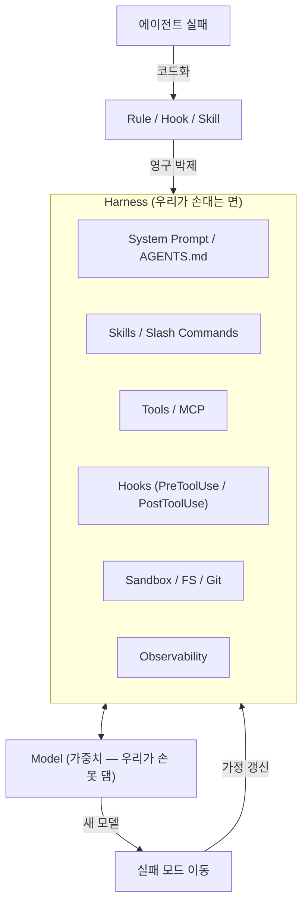

## 왜 지금 이 주제인가

Addy Osmani가 2026년 4월 19일 자기 블로그에 ["Agent Harness Engineering"](https://addyosmani.com/blog/agent-harness-engineering/)을
올렸다. 내가 1년 가까이 위키에서 굴려온 "하네스 엔지니어링" 카테고리의 핵심 주장이 — 구글 엔지니어이자 프런트엔드 커뮤니티에서 영향력이 큰
Osmani의 입을 통해 — 거의 같은 말로 정리됐다는 점이 흥미로워서 한국어로 옮긴다.

특히 본 위키의 [하네스 엔지니어링 5가지 레버](/wiki/harness-engineering/five-levers-of-harness-engineering)와 비교하면,
Osmani의 글은 *왜* 이 5가지 레버가 모두 같은 방향을 가리키는지에 대한 상위 narrative를 제공한다. 내 프로젝트(ai-study, moneyflow,
tarosaju, aidy)에서 이미 적용 중인 패턴들이 어디에 위치하는지 좌표를 다시 잡기 위해 정리한다.

## 핵심 개념

### 1. "Agent = Model + Harness"

Osmani가 제시하는 가장 단순한 등식이다. 그리고 한 줄 더:

> If you're not the model, you're the harness.

모델 가중치를 만들지 못하는 우리에게 손댈 수 있는 표면은 결국 **하네스 한 면뿐**이라는 정리. 하네스의 구성요소는 다음과 같다.

- 시스템 프롬프트와 스킬 파일
- 도구·MCP 서버와 그 설명
- 번들된 인프라 (파일시스템, 샌드박스, 브라우저)
- 오케스트레이션 로직과 후크
- 관측 가능성·모니터링

이는 본 위키의 [하네스 엔지니어링 5가지 레버](/wiki/harness-engineering/five-levers-of-harness-engineering)에서 정리한
시스템 프롬프트 / 스킬 / 서브에이전트 / MCP / 후크 5축과 거의 일대일 대응한다.

### 2. "Skill Issue" 리프레임

핵심 통찰: **설정 문제(configuration problem)가 모델 한계로 위장한다.**

> it's not a model problem. It's a configuration problem. — HumanLayer

더 좋은 모델을 기다리는 대신, *에이전트가 같은 실수를 반복하지 않도록* 환경을 엔지니어링한다. 본 위키의
[AI 네이티브 시스템: 결정론적 통제](/wiki/harness-engineering/ai-native-system-deterministic-control)와 같은 정신이다.

### 3. The Ratchet — 모든 실수는 규칙이 된다

> every component in a harness encodes an assumption about what the model can't do on its own

래칫(ratchet)은 한 방향으로만 조여지는 톱니바퀴다. 에이전트가 한 번 실패하면, 그 실패는 **추적 가능한 규칙**으로 코드화돼 다시 발생하지 않게 한다.
거꾸로 말하면 *추적 가능한 실패 사례가 없는 규칙은 노이즈*다 — 폐기 후보다.

내가 운영 중인 솔루션 카테고리(`docs/solutions/`)의 N=3+ 승격 게이트가 정확히 이 래칫의 한국어 버전이다.
[promote-solution 커맨드](/wiki/harness-engineering/skillify-failure-to-skill-practice)와 결을 같이한다.

### 4. Working Backwards from Behaviour

원하는 행동에서 거꾸로 하네스 부품을 도출한다.

| 원하는 행동 | 필요한 하네스 부품 |
|---|---|
| 세션 간 영속 상태 | Filesystem + Git |
| 범용 도구 사용 | Bash + 코드 실행 |
| 안전 | 샌드박스 + 기본값 잠금 |
| 지속 학습 | 메모리 파일 + 검색 |
| 긴 호라이즌 | Ralph Loop, planner/executor 분리, 검증 단계 |
| 강제력 | 후크 + AGENTS.md |

### 5. 모델-하네스 공진화 루프

> 모델은 *설계자가 강조하는 프리미티브*에서 더 좋아진다.

새 모델이 나와도 하네스가 사라지진 않는다 — 실패 모드가 *이동*할 뿐이다. 그래서 하네스 안에 박혀 있는 가정들도 **계속 진화해야 한다.**
2026-04 시점의 데이터 포인트로 Osmani가 인용한 것:

- Claude Opus 4.6를 Claude Code 안에서 돌릴 때 점수와, 동일 모델을 커스텀 하네스에 넣었을 때 점수가 크게 다르다.
- 어떤 팀은 *모델은 그대로 두고 하네스만 바꿔서* 코딩 에이전트 순위를 Top 30에서 Top 5로 올렸다.

### 6. Harness-as-a-Service

업계 흐름: LLM API(완성을 반환)에서 → **하네스 API(런타임을 반환)**로.
루프, 도구, 컨텍스트 관리, 후크, 샌드박스가 *기본 탑재*된 형태로 팔린다. Claude Code, Cursor Background Agents, Codex CLI 등의 수렴 양상이다.

## 구조 / 프레임워크 / 다이어그램

> 핵심: 새 모델이 와도 하네스는 사라지지 않는다. 실패 모드가 *이동*하고, 그에 따라 하네스 안의 가정이 갱신될 뿐이다.

## 실전 팁 / 안티패턴

### 팁 1: 후크 출력은 비대칭으로

성공 시 침묵, 실패 시 verbose. 이유는 둘 다 컨텍스트 경제 문제다 — 성공 로그는 토큰 낭비, 실패 시 정보 부족은 자기 교정 루프 단절.
본 위키의 [bash-watcher-zero-token-polling](/wiki/harness-engineering/bash-watcher-zero-token-polling) 패턴과 정확히 같은 정신.

### 팁 2: AGENTS.md 컨벤션 고정

Osmani는 AGENTS.md(=CLAUDE.md)를 *행동 헌법*으로 다룬다. 본 위키의 [Frozen Snapshot 원칙](/wiki/harness-engineering/harness-engineering-overview)과
일치 — 활성 세션 중 CLAUDE.md를 수정하지 말고, 변경은 `/compound` 단계에서 일괄 반영.

### 팁 3: 긴 작업은 풀 컨텍스트 리셋

Osmani가 인용한 Anthropic의 패턴: 세션이 너무 길어지면 *컴팩션이 아니라* 후크가 세션을 통째로 부수고 압축된 핸드오프 파일로 다시 빌드한다.
"compaction alone wasn't sufficient for long tasks; sometimes you need to start fresh with a structured brief."

### 안티패턴: "더 큰 모델이 해결할 거야"

Osmani의 핵심 반박: 더 큰 모델이 와도 *실패 모드가 이동*할 뿐 사라지지 않는다. 하네스 투자를 미루는 정당한 이유가 아니다.

### 안티패턴: 실패 사례 없는 규칙

추적 가능한 실패 인시던트가 없는 규칙은 노이즈다. CLAUDE.md가 점점 부풀어 오르면 — 각 줄에 "어떤 실패가 이걸 만들었나?"를 물어 비워라.

## 내 프로젝트에 적용하기

- **CLAUDE.md 헤이즈 감사**: 각 섹션에 추적 가능한 실패 인시던트가 있는지 점검. 없으면 후보 삭제. ([compound-engineering-philosophy](/wiki/harness-engineering/compound-engineering-philosophy)와 묶어서 다음 `/compound` 사이클 때 실행)
- **후크 출력 비대칭 감사**: `.claude/hooks/no-company-names.sh` 같은 가드들이 성공 시 침묵하는지 점검 (이미 그렇긴 한데 신규 후크 추가 시 체크리스트로 박제)
- **Harness-as-a-Service 관점에서 ai-study 재포지셔닝**: 위키의 "방법론 카테고리"를 *내가 배포 가능한 하네스 컴포넌트 카탈로그*로 재서술 (NEXT.md 백로그)
- **moneyflow / tarosaju 워커에 ratchet 게이트 검증**: 두 프로젝트의 `docs/solutions/`가 N=3+ 승격 게이트로 실제 작동하는지 다음 `projects-sync`에서 측정
- **Osmani의 "harness benchmark" 인용을 검증할 미니 실험**: ai-study에서 시스템 프롬프트만 바꿔 동일 작업을 두 번 돌려, 토큰/품질 차이를 측정 ([benchmark-models](/wiki/harness-engineering/skillify-failure-to-skill-practice) 활용)

## 자기 점검

1. 내 CLAUDE.md의 각 줄을 "어떤 실패가 이걸 만들었나?"로 환원할 수 있는가?
2. 내 후크들은 success-silent / failure-verbose 비대칭을 지키는가?
3. 모델이 한 단계 좋아지면 내 하네스의 어느 부품이 *불필요해질* 후보인가?
4. 새 워커 프로젝트(예: aidy 계열)에 내 하네스 5축을 옮길 때, 가장 *옮기기 어려운* 축은 무엇이고 왜 그런가?
5. (열린 질문) Harness-as-a-Service가 보편화되면, 개인 위키 수준의 하네스 정리 작업은 5년 뒤에도 가치가 있을까? 가치가 있다면 어떤 형태로 남아야 하나?

### 실습 과제

- ai-study CLAUDE.md를 처음부터 끝까지 한 줄씩 읽으며, 각 줄 옆에 *추적 가능한 실패 인시던트 ID*(`docs/solutions/<slug>` 또는 retro 날짜)를 코멘트로 붙여본다. 짝이 없는 줄은 "노이즈 후보" 리스트로 별도 정리하고, 다음 `/compound` 사이클에서 일괄 처리.

## 출처

- 원본: [Agent Harness Engineering — Addy Osmani](https://addyosmani.com/blog/agent-harness-engineering/) (2026-04-19)
- 보강 자료:
  - [The 3rd Generation of Agents: How "Harness Engineering" Changed Games Again — Lizhong (Medium)](https://medium.com/@lizhong1990/the-3rd-generation-of-agents-how-harness-engineering-changed-games-again-3a0cb7dd5e19)
  - [addyosmani/agent-skills (GitHub)](https://github.com/addyosmani/agent-skills) — 동일 저자의 후속 스킬 카탈로그
