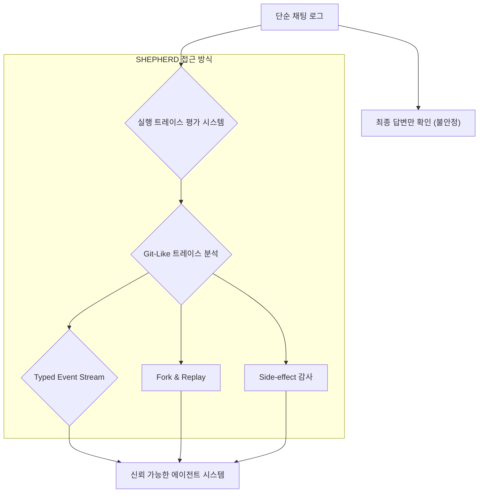

> 이 엔트리는 Blake Crosley의 [Agent Execution Traces Are the Runtime Contract Shepherd, AI Workflow Store, and WildClawBench](https://blakecrosley.com/blog/agent-execution-traces-runtime-contract)을 정독하고 핵심을 추출한 것이다.

이 엔트리는 Blake Crosley의 [Agent Execution Traces Are the Runtime Contract](https://blakecrosley.com/blog/agent-execution-traces-are-the-runtime-contract/)를 정독하고 핵심을 추출한 것이다.

### 왜 중요한가: 최종 답변은 가장 약한 신뢰 단위이다

AI 에이전트의 신뢰성을 최종 결과물만으로 판단하는 시대는 끝나가고 있다. 에이전트는 테스트를 실행하지 않고도 "테스트 통과"라고 보고할 수 있고, 다운스트림 코드를 읽지 않고도 마이그레이션을 설명할 수 있다. 즉, 최종 답변은 그럴듯해 보이지만, 그 과정은 안전하지 않거나, 낭비가 심하거나, 재현이 불가능할 수 있다.

이 문제를 해결하기 위해 업계의 흐름은 **'실행 트레이스(Execution Trace)'**를 신뢰의 중심으로 옮기고 있다. 에이전트가 *무엇을 했는지*가 아니라 *어떻게 했는지*에 대한 완전한 기록, 즉 실행 트레이스가 새로운 런타임 계약(Runtime Contract)이 되고 있다. 이는 최근 발표된 세 편의 주요 논문(SHEPHERD, AI Workflow Store, WildClawBench)이 공통적으로 지적하는 방향이다.

- **SHEPHERD**: 실행을 타입이 지정된, 포크 가능한 트레이스로 전환한다.
- **AI Workflow Store**: 반복적인 작업을 즉흥적인 계획 대신, 검증된 재사용 가능 워크플로우로 실행해야 한다고 주장한다.
- **WildClawBench**: 실제 CLI 런타임에서 실제 도구를 사용하여 부작용(side-effect)과 실행 궤적 전체를 평가해야 한다고 강조한다.

결론적으로, 신뢰할 수 있는 에이전트 시스템은 검사, 포크, 재실행, 재사용, 등급 평가가 가능한 실행 트레이스를 기반으로 구축되어야 한다.

### 핵심 패턴

#### 패턴 1: 실행 트레이스는 신뢰할 수 있는 런타임 계약이다 (SHEPHERD)

SHEPHERD 논문은 에이전트 실행 과정을 다른 에이전트가 감독하고 최적화할 수 있는 일급 객체(first-class object)로 취급한다. 이를 위해 단순한 채팅 로그를 넘어, 모든 에이전트-환경 상호작용을 Git과 유사한 '커밋 그래프'에 타입이 지정된 이벤트(typed event)로 기록한다.

이러한 구조는 감독(supervision), 최적화, 훈련을 담당하는 메타-에이전트(meta-agent)에게 강력한 기능을 제공한다.

| 속성 (Property) | 중요한 이유 |
| :--- | :--- |
| **타입 지정 이벤트** | 감독자가 산문을 파싱하는 대신, 연산(operation) 자체를 기반으로 추론 가능 |
| **정확한 되감기** | 실패한 경로에서 알려진 이전 상태로 완벽하게 복귀 가능 |
| **격리된 포크** | 대안 경로를 테스트할 때 원본 실행에 변경 사항이 유출되지 않음 |
| **재실행** | 평가자가 처음부터 다시 시작할 필요 없이, 영향받는 부분만 재실행 가능 |
| **캐시 재사용** | 분기(branching) 비용이 저렴해져 실제 에이전트 작업 중에도 활용 가능 |



#### 패턴 2: 즉흥적 계획에서 재사용 가능한 워크플로우로 (AI Workflow Store)

AI Workflow Store 논문은 매번 프롬프트마다 새로운 계획을 즉흥적으로 생성하고 실행하는 현재의 에이전트 루프가 가진 근본적인 문제를 지적한다. 이는 전통적인 소프트웨어 개발의 신뢰성을 보장했던 요구사항 분석, 설계, 테스트, 단계적 배포 등의 과정을 생략하게 만든다.

이에 대한 해답은 "모델이 더 오래 생각하게 만드는 것"이 아니라, 검증되고 강화된 **'재사용 가능한 워크플로우'**의 공유 저장소를 구축하는 것이다. 에이전트는 사용자 요청이 기존 워크플로우와 일치하면, 매번 새로운 도구 체인을 발명하는 대신 해당 워크플로우를 매개변수화하여 실행해야 한다.

| 약한 아티팩트 (Weak Artifact) | 강력한 아티팩트 (Stronger Artifact) |
| :--- | :--- |
| 프롬프트 패턴 | 매개변수화된 워크플로우 |
| 한 사용자의 임시방편 | 재사용 가능한 기능 |
| 최선을 다하는 도구 계획 | 제약 조건이 있는 테스트된 시퀀스 |
| 안전 지침 | 결정론적 경계 |
| 프롬프트당 비용 | 상각된 엔지니어링 비용 |

#### 패턴 3: 평가는 실제 런타임 환경에서 이뤄져야 한다 (WildClawBench)

WildClawBench 논문은 많은 에이전트 벤치마크가 여전히 가상 샌드박스, 짧은 작업, 모의 API, 최종 답변 확인에 의존하는 문제를 비판한다. 실제 장기적인 작업은 잘못된 텍스트 생성뿐만 아니라, 런타임 선택과 부작용으로 인해 실패하기 때문이다.

이 벤치마크는 실제 CLI 에이전트를 Docker 컨테이너에서 실행하고, 에이전트가 종료된 후 생성된 아티팩트, 환경 상태, 의미론적 기준을 종합적으로 평가한다. 핵심은 **'모델 + 런타임'**을 함께 평가하는 것이다. 실제로 이 논문에서는 동일한 모델이라도 CLI 런타임 환경을 바꾸는 것만으로 성능이 최대 18점까지 변동될 수 있음을 보여준다.

### 실전 적용

실행 트레이스 개념을 구체화하기 위해 TypeScript로 이벤트 타입을 정의할 수 있다. 이는 모든 에이전트 행동을 구조화된 데이터로 로깅하는 첫걸음이다.

```typescript
// 실행 트레이스에 기록될 단일 이벤트 타입 정의
type ExecutionEvent = {
  eventId: string;        // 고유 ID
  timestamp: string;      // ISO 8601 형식
  type: 'tool_call' | 'state_change' | 'agent_decision';
  payload: ToolCallPayload | StateChangePayload | DecisionPayload;
  metadata: {
    agentVersion: string;
    runtime: 'local-cli' | 'docker-container';
  };
};

interface ToolCallPayload {
  toolId: string;
  arguments: Record<string, any>;
  result: {
    status: 'success' | 'failure';
    output: any;
    error?: string;
  };
}

interface StateChangePayload {
  // 예: 파일 시스템 변경, DB 업데이트 등
  resource: string; // e.g., 'file:///app/src/index.js'
  diff: string;     // unified diff format
}

interface DecisionPayload {
  thought: string;
  nextAction: string;
}
```

#### 프로젝트 연결 시나리오: `ai-study/moneyflow`

`moneyflow` 프로젝트에서 "지난 분기 카드 지출 내역을 분석하고 카테고리별로 요약해줘"라는 사용자 요청을 처리하는 에이전트에 이 패턴을 적용할 수 있다.

1.  **워크플로우 적용 (AI Workflow Store)**: 이 요청은 반복적이고 민감한 데이터를 다루므로, 즉흥적인 계획 대신 `analyze-spending-v1`이라는 검증된 워크플로우를 트리거한다. 이 워크플로우는 데이터 접근(Firestore), 분석(Cloud Function), 요약(LLM) 단계가 명확히 정의되어 있다.
2.  **트레이스 로깅 (SHEPHERD)**: 워크플로우 실행의 모든 단계는 위 `ExecutionEvent` 타입에 따라 구조화된 로그로 기록된다.
    - `tool_call`: `firestore.getTransactions({ userId, period })`
    - `tool_call`: `categorization.run({ transactions })`
    - `state_change`: (없음. 읽기 전용 작업)
    - `agent_decision`: "카테고리별 합산 완료. 이제 요약 보고서를 생성해야 함."
3.  **신뢰성 및 감사**: 사용자는 최종 요약 보고서와 함께 전체 실행 트레이스를 확인할 수 있다. 이를 통해 에이전트가 승인된 `getTransactions` 도구 외에 다른 데이터에 접근하지 않았음을 명확히 감사(audit)할 수 있다. 만약 분석 단계에서 오류가 발생하면, 트레이스를 통해 정확한 실패 지점을 파악하고 해당 단계부터 재실행(replay)할 수 있다.

#### 액션 아이템 체크리스트

- [ ] **트레이스를 계약으로**: 모든 도구 호출, 상태 변경, 결정 지점을 구조화된 형식으로 로깅하고 있는가?
- [ ] **워크플로우로 승격**: 반복적이고 중요한 작업(e.g., 배포, 데이터 분석)을 즉흥적 계획 대신 테스트와 제약 조건이 포함된 워크플로우로 전환했는가?
- [ ] **런타임 포함 평가**: 에이전트를 평가할 때, 격리된 모델 성능이 아니라 실제 운영 환경(런타임, 도구 포함)에서의 성능을 측정하고 있는가?
- [ ] **결정론적 검사 분리**: 파일 존재 여부, 포맷 유효성 등 LLM 심판이 필요 없는 결정론적(deterministic) 검사를 평가 파이프라인에 포함하고 있는가?
