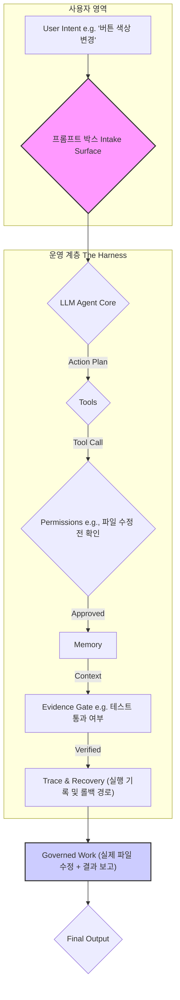

> 이 엔트리는 Blake Crosley가 [agent harness 시리즈](https://blakecrosley.com/blog/codex-hooks-make-the-harness-real)에서 전개한 "에이전트 인터페이스는 곧 하네스다" 논지를 정독하고 핵심을 추출한 것이다.

### 왜 중요한가: 프롬프트 박스는 인터페이스가 아니다

AI 에이전트 제품을 만들 때 우리는 프롬프트 입력창의 UX에만 집중하는 실수를 저지른다. 그러나 사용자가 엔터 키를 누른 후 에이전트가 어떻게 행동하는지를 결정하는 것은 프롬프트 창이 아니라, 그 주변을 감싸는 "운영 계층(Operating Layer)" 또는 "하네스(Harness)"다.

OpenAI의 Codex나 Anthropic의 Tool-use hook 문서가 암시하듯, 진짜 제품은 모델 자체가 아니라 모델의 행동을 제어하는 프레임워크에 있다. 이 운영 계층은 에이전트가 무엇을 보고, 무엇을 할 수 있으며, 무엇을 증명해야 하고, 언제 인간의 개입을 요청해야 하는지를 규정한다.

Microsoft의 [Human-AI Interaction 가이드라인](https://www.microsoft.com/en-us/research/publication/guidelines-for-human-ai-interaction/)과 [NIST AI Risk Management Framework](https://www.nist.gov/itl/ai-risk-management-framework)는 신뢰 가능한 AI가 단일 상호작용이 아닌, 설계, 개발, 사용, 평가 전반에 걸쳐 통합되는 특성임을 강조한다. 즉, 에이전트 UX는 대화 디자인을 넘어 권한, 메모리, 도구 경계, 증거, 복구 경로를 명시적으로 설계해야 한다. 이 '하네스'가 없으면 에이전트는 제약조건을 스스로 "즉흥적으로 만들어내고" 이는 예측 불가능한 결과를 낳는다.

### 핵심 패턴: 에이전트 인터페이스는 '운영 계층'이다

사용자의 '의도(Intent)'는 프롬프트 박스를 통해 수집되지만, 실제 '작업(Work)'은 운영 계층을 통과하며 구체화된다. 이 계층은 다음과 같은 핵심 요소로 구성된다.



1.  **도구 (Tools) & 권한 (Permissions)**: 에이전트가 수행할 수 있는 행동의 범위를 정의한다. 파일을 읽기만 하는 에이전트와 셸 명령을 실행하는 에이전트는 사용자에게 완전히 다른 수준의 신뢰 계약을 요구한다. 모든 도구 호출은 그 파괴력에 맞는 '의전(ceremony)'을 거쳐야 한다. Anthropic의 `PreToolUse` hook은 이를 구현하는 원시적인 형태를 보여준다. 위험이 낮은 읽기 작업은 조용히 통과시키고, 파괴적인 파일 수정은 명시적인 사용자 승인을 요구해야 한다.

2.  **메모리 (Memory)**: 단순히 컨텍스트 창이 아니다. 사용자가 검사하고 개입할 수 있는 제품의 일부여야 한다. 인터페이스는 최소한 4가지 메모리 상태를 구분해서 보여줘야 한다.
    *   **Active**: 현재 에이전트가 직접 사용하는 컨텍스트
    *   **Available**: 필요시 검색하여 가져올 수 있는 정보
    *   **Compacted**: 요약되어 일부 디테일이 소실되었을 수 있는 정보
    *   **Stale**: 오래되어 신뢰도가 낮은 기록

3.  **증거 (Evidence)**: "유창한 문장은 실패를 숨길 수 있다(Fluent prose can hide failure)." 에이전트의 최종 답변("완료했습니다")은 가장 약한 증거 단위다. 작업 완료의 증거는 인터페이스 표면에 명확히 드러나야 한다.
    *   **코드 변경**: 파일 경로와 diff
    *   **테스트 통과**: 실행 명령어, 종료 상태, 관련 로그
    *   **릴리즈 성공**: 실제 라이브 URL의 상태 코드, 캐시 상태
    *   증거 제출을 강제하면, 에이전트는 마지막에 자신감 있는 요약을 쓰는 대신 작업 중에 증거를 찾기 위해 노력하게 된다.

4.  **추적 (Trace) & 복구 (Recovery)**: 사용자가 결과에 책임을 지려면, 에이전트가 무엇을 보고, 변경하고, 건너뛰었는지 검사할 수 있어야 한다. 모든 행동은 기록되어야 하며, 실패 시 작업을 되돌릴 수 있는 경로가 보장되어야 한다.

### 실전 적용: aidy 디자인 시스템 에이전트 시나리오

`aidy` 프로젝트에서 "오래된 컬러 토큰을 새 토큰으로 교체하는" 에이전트를 만든다고 가정하자.

*   **사용자 의도**: `"Button 컴포넌트에서 blue-500을 모두 primary-500으로 바꿔줘"`

*   **나쁜 설계 (프롬프트 중심)**: 에이전트가 바로 파일 시스템을 스캔하고, 정규식으로 코드를 찾아 바꾼 뒤, `"작업을 완료했습니다."`라고 보고한다. 사용자는 어떤 파일이 어떻게 바뀌었는지, 사이드 이펙트는 없는지 알 수 없다.

*   **좋은 설계 (하네스 중심)**:

    1.  **수집 (Intake)**: 사용자의 프롬프트를 받는다.
    2.  **계획 (Planning)**: 에이전트는 `readFile`, `editFile`, `runTest` 도구를 사용해 작업을 계획한다.
    3.  **실행과 통제 (Execution with Harness)**:
        *   **권한 (Permission)**: `readFile`은 자동으로 실행하지만, `editFile` 도구를 호출하기 전, 운영 계층의 hook이 트리거된다. 이 hook은 사용자에게 변경될 코드의 `diff`를 보여주며 승인을 요청한다.

            ```typescript
            // 예시: TypeScript로 구현한 Tool-Use Hook
            interface ToolCall {
              toolName: 'readFile' | 'editFile' | 'runTest';
              payload: any;
              riskLevel: 'low' | 'high';
            }

            async function executeTool(call: ToolCall, user: User): Promise<any> {
              // '하네스'의 권한 확인 레이어
              if (call.riskLevel === 'high') {
                const isApproved = await user.confirm(`위험한 작업: ${call.toolName}. 변경 사항을 적용할까요?`, {
                  diff: call.payload.diff, // 사용자에게 diff를 보여줌
                });
                if (!isApproved) {
                  throw new Error("User rejected the high-risk operation.");
                }
              }
              // 실제 도구 실행 로직...
            }
            ```

        *   **메모리 (Memory)**: 에이전트는 `aidy`의 디자인 원칙 문서를 'Available' 메모리에서 로드하여 'Active' 메모리에 추가한다. `primary-500`이 해당 컴포넌트에 적합한 토큰인지 검토한다.

        *   **증거 (Evidence)**: 파일 수정 후, 에이전트는 `runTest` 도구를 실행한다. 최종 보고서는 단순한 텍스트가 아니라, 아래와 같은 증거 객체(Evidence Object)를 포함해야 한다.

            ```json
            {
              "summary": "Button 컴포넌트의 컬러 토큰을 primary-500으로 성공적으로 업데이트했습니다.",
              "evidence": [
                {
                  "type": "CODE_CHANGE",
                  "filePath": "src/components/Button.tsx",
                  "diffUrl": "https://github.com/your-repo/pull/123/files"
                },
                {
                  "type": "TEST_PASS",
                  "command": "npm run test -- --testPathPattern=Button.test.tsx",
                  "status": "PASSED",
                  "outputLog": "..."
                }
              ]
            }
            ```

    4.  **결과 (Output)**: 프론트엔드는 이 증거 객체를 렌더링하여 사용자에게 변경 내역과 테스트 통과 여부를 명확히 보여준다. 사용자는 이를 보고 최종적으로 작업을 승인하거나 되돌릴 수 있다. 이것이 바로 '의도를 통제된 작업으로' 바꾸는 과정이다.