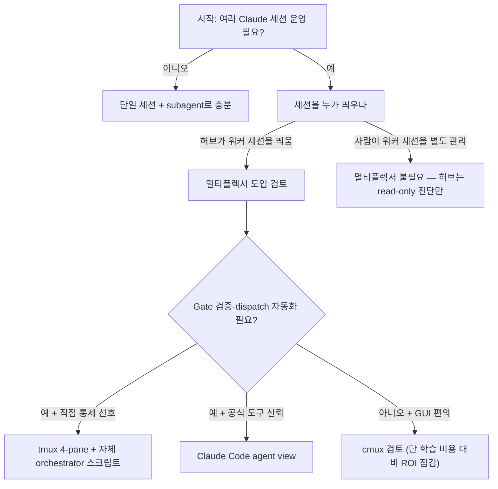

# 에이전트 멀티플렉서 선택 가이드 — tmux vs cmux vs Claude Code agent view

## AI Agent Directive

### Trigger
- 여러 Claude Code 세션을 동시에 띄워서 병렬 작업을 시도할 때
- "tmux로 풀스택 멀티에이전트를 짜야 하나? cmux 어때?" 류 질의
- Claude Code의 새 background agent / agent view 기능 도입 검토
- aidy 같은 1-Architect-N-Worker 모델 vs 1-허브-N-워커 모델 비교

### Prerequisites
- Claude Code 단일 세션 사용 경험
- 멀티플렉서/터미널 개념 (window·pane·session)
- Claude Code subagent와 background agent의 차이가 모호한 상태에서 출발해도 됨

### Decision Frame
1. *멀티플렉서 자체가 필요한가?* 워커 세션을 사람이 따로 띄우는 모델이면 답은 "필요 없음"
2. *세션 격리가 OS 수준이어야 하는가?* (예: 한 세션이 폭주해도 나머지 보호) → 그렇다면 tmux
3. *세션 재시작 복구가 중요한가?* → Claude Code agent view (`respawn`)
4. *GUI 편의(PR 뱃지, 브라우저 자동화)가 가치 있는가?* → cmux 검토. 단 도구 학습 비용과 비교

---

## 한 줄 요약

| 도구 | 카테고리 | 한 마디 |
|---|---|---|
| **tmux** | OS-level 터미널 멀티플렉서 | "1990년대 모델인데 2026년 AI 에이전트 팀 워크플로우의 표준 런타임으로 부활" |
| **cmux** (manaflow-ai/cmux) | Ghostty 기반 macOS GUI 터미널 | "터미널 + 알림 + 내장 브라우저를 AI 에이전트용으로 묶은 GUI 셸. tmux 대체가 아닌 GUI 레이어" |
| **Claude Code agent view** | Claude 관리형 background session 대시보드 | "여러 독립 Claude 세션을 한 CLI에서 모니터/peek/respawn하는 공식 통제 패널" |

---

## 1. 본질적 차이 — 같은 카테고리가 아니다

### tmux
- *Session → Window → Pane*의 1990년대식 계층 구조
- pane 별로 OS 프로세스 격리, 세션 detach/attach
- AI 컨텍스트에서의 가치: pane 하나당 `claude` 프로세스 하나를 박아 *완전 독립 세션*을 N개 운영 가능
- 비용 0 (도구 자체), 학습 곡선 3-5일

### cmux (manaflow-ai/cmux)
- Swift/AppKit으로 만든 *GUI 터미널 애플리케이션*
- libghostty를 GPU 렌더러로 쓰고, 그 위에 수직 탭/알림/내장 브라우저/스크립터블 API를 얹음
- README 자체가 "not prescriptive"임을 명시 — Claude Code/Codex/OpenCode 어느 에이전트와도 동작
- macOS 한정, 학습 곡선 30분

### Claude Code agent view (background agents)
- 공식 문서 기준 *독립 세션 N개*를 한 CLI 패널에서 관리
- 각 세션이 자체 context window + 자체 worktree + 자체 quota
- subagent와 다름: subagent는 *한 세션 내부 위임*(같은 대화 안의 sub-window). background agent는 *별도 대화*
- 머신 종료 후 `respawn`으로 복구 가능

---

## 2. 비교 표

| 축 | tmux 4-pane | Claude Code agent view | cmux |
|---|---|---|---|
| 컨텍스트 격리 | OS pane + worktree | supervisor + worktree | GUI 탭 |
| 토큰 비용 | 세션 N개 = N배 | background session N개 = N배 | 0 (도구 자체) |
| 통신 자동화 | *직접 구축 필요* (예: aidy의 architect-cli.sh 1004줄) | CLI 표준 (peek/attach/respawn) | 없음 (사람이 탭 전환) |
| 머신 재시작 복구 | ❌ 세션 잃음 | ✅ `respawn` | ❌ |
| 디버깅 가시성 | `tmux capture-pane -p` | `claude logs <id>` | devtools 통합 |
| 플랫폼 | 모든 Unix | macOS/Linux (CLI) | macOS only |
| 학습 곡선 | 3-5일 | 1시간 (단축키 + 개념) | 30분 |

---

## 3. 의사결정 트리



---

## 4. 시나리오별 결론

### A. 단일 사용자 + 1 프로젝트
**결론**: 멀티플렉서 불필요. Claude Code subagent로 충분.
- 근거: 한 세션의 컨텍스트 보호만 필요. background agent도 quota 1배만 쓸 거면 의미 적음
- 예외: 머신 재시작이 잦으면 background agent의 `respawn`이 가치

### B. 1 허브 + N 워커 프로젝트 (관찰자 모델)
**결론**: 단일 세션 + `/projects-sync` 류 read-only 진단 커맨드로 충분. 멀티플렉서 도입 ROI 낮음. (**agent view 적합도 6.5/10** — 아래 6장 참조)
- 근거: 워커 세션은 사람이 각 macOS 창에서 따로 띄움. 허브는 띄우는 주체가 아니므로 N개를 한 화면에 묶을 이유 없음
- 실측: 허브가 워커 PR 상태/diverge/worktree 감지하는 데 필요한 건 `git fetch + gh pr list`이지 멀티플렉서가 아니다
- 단, 허브의 역할이 "관찰자 → 능동 dispatcher"로 변하면 agent view가 진가를 발휘. 현재 모델에서는 오버스펙

### C. 1 Architect + N Worker (aidy 모델)
**결론**: tmux 4-pane이 정답. cmux/agent view로 갈아탈 ROI 없음. (**갈아타기 점수 4/10** — 아래 6장 참조)
- 근거: 이미 [[architect-flow-map-via-aidy-architect]]에 박제된 1004줄 `architect-cli.sh`가 sequential dispatch + watch + 429 backoff + inbox 메시징 + Gate 1/2 자동화까지 끝낸 상태. agent view로 옮기려면 이 자동화를 전부 재구축해야 하는데 *agent view에는 그 기능들이 없다*
- 예외: aidy를 다른 머신에서 자주 재시작해야 하는 환경이면 background agent의 `respawn`이 의미

### D. 풀 자동 sprint 루프 (CI/CD에서 도는)
**결론**: tmux + 로그 누적 분석. agent view는 *대화형 모니터링*에 최적화돼 있어 fully headless에는 부분 적합.
- 실측 권장: 1주일 시범 사용 후 quota 부담과 자동화 격차 측정

---

## 5. 무엇을 피해야 하나

1. **"신상 도구가 좋아 보이니 갈아타자"** — aidy처럼 자동화가 이미 구축된 곳에서 멀티플렉서를 바꾸면 *자동화 재구축 비용 > 도구 개선 이득*이 거의 확정
2. **subagent와 background agent를 같은 것으로 취급** — quota 모델이 다르다. background agent는 N배 소비
3. **cmux를 tmux 대체로 오해** — cmux는 GUI 셸이지 멀티플렉서 카테고리가 아니다. tmux를 cmux 안에서 돌리는 것도 가능
4. **허브-워커 모델에 멀티플렉서 도입** — 본질적으로 "여러 세션을 한 사람이 띄우는" 모델이 아니라서 가치 없음
5. **외부 도구 메타데이터(별 수, 출시일) 단일 소스 신뢰** — 메타데이터는 변동성 높음. 도입 직전에 직접 재확인 ([[feedback_external_source_verification]] 룰)

---

## 6. Claude Code agent view 깊이 분석 — 갈아타야 하나?

여기서부터는 *aidy 모델을 agent view로 옮길 가치가 있는가*에 초점을 맞춘 깊이 분석. 공식 문서 + 실사용 후기 기반.

### 6.1 정확한 작동 모델 (공식 문서 기준)

| 측면 | 동작 |
|---|---|
| 컨텍스트 | 각 background session은 독립 context window |
| Worktree | `.claude/worktrees/` 아래 자동 git worktree 생성 (write isolation) |
| Supervisor | per-user supervisor 프로세스. 터미널 detach해도 계속 실행 |
| 상태 저장 | `~/.claude/daemon/roster.json` |
| Idle 정책 | **1시간 이상 idle 시 프로세스 자동 중지**. 단 transcript와 state는 disk 유지 → `claude respawn`으로 fresh process 복구 |
| 머신 sleep | sleep/shutdown 시 stop. 재시작 후 `claude respawn --all` 필요 |
| PR 추적 | row 끝에 status dot — Yellow=waiting / Green=passed / Purple=merged / Grey=draft·closed |
| **세션 간 통신** | **불가능**. background session끼리 직접 메시징 안 됨. 사람이 peek/reply로 매개 |

> 세션 간 직접 메시징이 필요하면 별도 *agent teams* 기능 (실험 단계, 비용 ~7배). 이건 또 다른 카테고리.

### 6.2 Quota 모델

- 각 row의 status summary 갱신 = Haiku-class 호출 1회 / 약 15초마다
- N개 동시 실행 = ~N배 quota 소비 (선형)
- Max plan(5x usage) 기준: **추정** 4개 동시 background session ≈ Max plan 1개 거의 풀로 소비
- Agent teams 사용 시 ~7배 — 빠르게 quota 한계
- `ccusage --instances`로 background session별 분리 측정 가능 여부는 **정보 없음** (공식 문서 미언급)

### 6.3 aidy 기능 → agent view 매핑 (Gap 분석)

| aidy 기능 | agent view 대응 | Gap | 자동화 보존율 |
|---|---|---|---|
| `send-seq server "..." ios "..." android "..."` | 사람이 3번 prompt 입력 | **자동 순서 보장 없음** | 60% |
| `watch-workers` (10초 폴링) | UI row 실시간 상태 | ✅ 동등 | 100% |
| 429 backoff (architect-cli.sh:152-192) | supervisor 자동 처리 | ✅ | 100% |
| `inbox/{worker}-request.md` 비동기 큐 | peek 패널 → reply (동기) | **파일 기반 비동기 큐 미지원** | 40% |
| Gate 1 (스펙 준수 검증) | `/batch` 또는 commit hook | **approval gate 없음** — 별도 구축 필요 | 30% |
| Gate 2 (통합 검증) | 동상 | 동상 | 30% |
| `gates/reviews/gate-{1,2}-WO-N.md` 자동 박제 | 없음 | **결과물 박제 자동화 부재** | 0% |
| PR 생성 추적 | PR status dot 자동 | ✅ 더 좋음 | 100%+ |

**핵심 손실 3가지**:
1. **Sequential dispatch 자동 순서**: aidy의 `send-seq`는 worker A가 idle 될 때까지 기다려서 B를 보냄. agent view는 "동시에 N개 시작" 모델이라 순서 보장하려면 사람이 손수 dispatch
2. **비동기 inbox 큐**: 워커가 막혔을 때 `inbox/server-request.md` 파일을 던지고 자기 일 계속하다가 답이 오면 재개하는 *비동기 패턴*을 agent view는 지원 안 함. peek/reply는 사람이 능동적으로 열어야 하는 동기 모델
3. **Gate 자동화**: aidy의 핵심 가치인 Gate 1/2 검증 + 결과 박제는 architect-cli.sh 안에 박혀있음. agent view에는 *그런 hook 자체가 없다*

### 6.4 알려진 이슈 (실사용 후기)

- **Research preview 단계**: 인터페이스/단축키 변경 가능
- **Machine sleep 후 stop**: "항상 켜진 워커" 워크플로우 불가능
- **/resume orphaned sessions**: in-process teammates `/resume` 후 고아 세션 발생 사례 보고
- **Parallel rate limit spike**: 5시간 limit reset 직후 동시 다중 세션 시작 시 처음 3-4개만 성공, 나머지 실패
- **Agent teams file conflict**: 동일 파일 편집하는 두 teammate가 overwrites 가능 (분할 필수)
- **Task coordination lag**: agent teams의 task completion marking 실패 → dependent task 영구 block 위험
- **Windows 제약**: Agent view 자체는 크로스 플랫폼이지만 split-pane 모드는 macOS/Linux only

### 6.5 점수와 결론

#### aidy 내부 (1 Architect + 3 Worker): **갈아타기 점수 4/10 — 도입 안 함**
- (+) UI 가시성 ↑, PR status dot 자동, worktree 자동 격리(architect-cli ~200줄 감축 가능)
- (-) sequential dispatch 자동화 손실, 비동기 inbox 큐 손실, Gate 1/2 분리 재구축 필요
- (-) 4개 동시 background session ≈ Max plan 풀로 소비 → 추가 실험 작업 quota 부족
- **순이익**: 코드 200줄 감소 < 핵심 자동화(dispatch + 큐 + Gate) 후퇴. 음수.

#### 허브-워커 모델: **적합도 6.5/10 — 1주 시범 후 결정**
- (+) 자동 worktree 격리는 현재 `wt-branch` 패턴과 정렬
- (+) 도메인 병렬(서버/클라이언트/인프라)에 이론적으로 잘 맞음
- (-) 현재 허브는 "관찰자"이지 "dispatcher"가 아님 → 역할 자체를 바꿔야 진가
- (-) tips/ MDX append-only 비동기 큐 패턴이 agent view sync 모델과 충돌
- **순이익**: 역할 전환 비용 > 도구 이득. 1주 시범으로 직접 측정 권장

### 6.6 1주 시범 시나리오 (만약 해본다면)

```bash
# 워커 1개에만 적용 — moneyflow가 적합 (도메인 단순, agent 다수)
claude agents
# → "[market-analyst] Layer 1+2 리팩토링, Sonnet 사용"
# → 1주간 운영하며 측정:
#   - quota 소비량 (ccusage)
#   - 비동기 큐 부재로 인한 사람 개입 횟수
#   - Gate 검증을 별도로 어떻게 했는가
#   - 머신 sleep 후 respawn 빈도
# → 1주 후 판정: 계속 / aidy 모델로 회귀 / 폐기
```

### 6.7 지금 결정하지 말아야 할 이유

- agent view는 *research preview* (2026-05 출시) — 6개월 안에 인터페이스/quota 모델 변경 가능성 높음
- agent teams는 *실험 단계* (`CLAUDE_CODE_EXPERIMENTAL_AGENT_TEAMS=1` 플래그) — 안정화 대기
- aidy 자동화는 이미 *작동 중*. "더 좋은 도구를 위해 작동하는 시스템 폐기"는 [[compound-engineering-philosophy]]의 12 원칙 중 1번 위반

---

## 7. 진짜 레버는 따로 있다

이 비교의 결론은 "도구 선택은 부차적"이라는 것이다. 멀티에이전트 워크플로우의 진짜 비용 절감 레버는:

- **모델 라우팅**: Architect=Opus, Worker=Sonnet/Haiku → [[multi-agent-sprint-optimization-patterns]]
- **Sequential dispatch + idle 대기**: 동시 4-way 폭주 대신 순차 → 429 회피 + quota 효율
- **Gate 검증 자동화**: 사람 개입 지점 4개로 압축 → [[architect-flow-map-via-aidy-architect]]

도구는 이 레버를 *담는 그릇*일 뿐이다.

---

## 출처

### 공식 문서 (직접 확인)
- cmux: https://github.com/manaflow-ai/cmux (검증일 2026-05-13, v0.64.4 / 16.8k stars / Ghostty 기반 README 명시)
- Claude Code subagents: https://code.claude.com/docs/en/sub-agents (subagent ↔ background agent ↔ agent teams 구분 Note 박스)
- Claude Code agent view: https://code.claude.com/docs/en/agent-view (research preview, 작동 모델 + supervisor + roster.json)
- Claude Code agent teams: https://code.claude.com/docs/en/agent-teams (실험 단계, mailbox + ~7배 비용)
- Claude Code 비용 관리: https://code.claude.com/docs/en/costs (background session quota = N배)

### 실사용 후기 (교차 검증용)
- Anthropic 공식 블로그: https://claude.com/blog/agent-view-in-claude-code
- Joe Njenga (Medium, 2026-05): https://medium.com/@joe.njenga/i-tried-claude-code-agent-view-new-way-to-see-your-agents-working-e8c132aea112
- Addy Osmani — Claude Code Swarms: https://addyosmani.com/blog/claude-code-agent-teams/
- Worktree 패턴 가이드: https://claudefa.st/blog/guide/development/worktree-guide

### 알려진 이슈
- anthropics/claude-code Issues (parallel session rate limit, in-process orphan resume): https://github.com/anthropics/claude-code/issues

### 사내 검증
- aidy-architect: `scripts/tmux-setup.sh:14-23`, `architect-cli.sh:152-192` (429 backoff), `inbox-watcher.sh` (워커→Architect 메시징), Gate 1/2 박제 위치 `gates/reviews/gate-{1,2}-WO-N.md`

> **Confidence 2 사유**: cmux와 Claude Code agent view는 *직접 운영 경험 없는* 리서치 기반. tmux 부분과 aidy 4-pane은 직접 검증 (confidence 4 수준). 1주 시범 후 confidence 3로 승격 가능. 외부 메타데이터(별 수, 출시일, quota 비율)는 변동성 높으므로 도입 직전 재확인 — [[feedback_external_source_verification]] 룰 준수.
