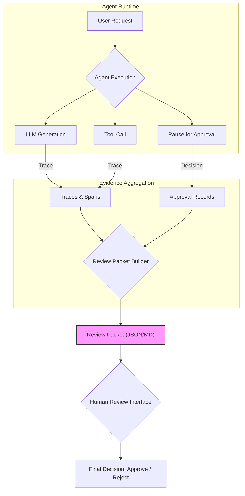

> 이 엔트리는 Blake Crosley의 [AI Agent Review Packets Are the New Final Answer](https://blakecrosley.com/blog/review-packets-are-the-new-final-answer)을 정독하고 핵심을 추출한 것이다.

### 왜 중요한가: "최종 답변"의 시대는 끝났다

과거의 AI는 질문에 대한 "최종 답변(Final Answer)"을 텍스트로 제공하는 것만으로 충분했다. 하지만 오늘날의 AI 에이전트는 파일 수정, 코드 배포, 데이터베이스 변경 등 실제 세계에 영향을 미치는 복잡한 작업을 수행한다. "번역을 완료하고 배포했습니다"라는 에이전트의 마지막 한 문장은 더 이상 신뢰의 근거가 될 수 없다. 작업의 *결과*가 아니라, 그 결과를 만들기까지의 *과정*을 증명해야 하기 때문이다.

OpenAI의 Codex 론칭 포스트에서 이미 "터미널 로그와 테스트 결과라는 검증 가능한 증거(verifiable evidence)"를 강조했듯, 신뢰할 수 있는 에이전트는 자신의 모든 행동을 증명할 책임을 진다. 이 책임을 이행하는 구체적인 산출물이 바로 '리뷰 패킷(Review Packet)'이다.

### 핵심 패턴: 증거 묶음으로서의 '리뷰 패킷'

리뷰 패킷은 에이전트의 작업에 대한 구조화된 증거 묶음(structured evidence bundle)이다. 이는 단순한 로그 덤프가 아니며, 인간 검토자가 의사결정을 내릴 수 있도록 정보를 구조화한 감사 추적(audit trail)이다.

리뷰 패킷은 다음 7가지 질문에 답해야 한다.

1.  **사용자 목표 (Goal):** 무엇을 요청했는가?
2.  **작업 산출물 (Artifacts):** 무엇을 변경했는가? (파일 diff, DB row, 생성된 이미지 등)
3.  **실행 추적 (Trace):** 어떤 명령과 도구를 실행했는가? (API 호출, 셸 명령어, 종료 코드)
4.  **인간 승인 (Approval):** 어떤 위험한 작업을 인간이 승인했는가?
5.  **결과 검증 (Verification):** 결과가 올바르다는 증거는 무엇인가? (테스트 통과, 렌더링된 UI 스크린샷, 라이브 URL 상태 체크)
6.  **미해결 과제 (Gaps):** 여전히 인간의 판단이 필요한 부분은 무엇인가?
7.  **다음 행동 (Next Steps):** 이제 무엇을 해야 하는가? (Merge, Reject, Escalate)

이러한 구조는 에이전트의 런타임에서 발생하는 이벤트를 인간이 소비할 수 있는 형태로 가공하는 과정이다.



이 패턴의 핵심은 **서술과 증거의 분리**다. 에이전트가 "테스트 통과함"이라고 서술하는 것은 '약한 완료(Weak Completion)'다. 리뷰 패킷은 실행한 테스트 명령어, 종료 코드, 실패한 테스트 목록 등 구체적인 증거를 첨부하여 '강력한 완료(Strong Completion)'를 증명한다.

### 실전 적용

리뷰 패킷은 JSON, Markdown, 데이터베이스 row 등 다양한 형태로 존재할 수 있다. 중요한 것은 형식이 아니라 구조다. TypeScript로 리뷰 패킷의 인터페이스를 정의하면 다음과 같다.

```typescript
// AI Agent의 작업 결과를 담는 구조화된 증거 묶음
interface ReviewPacket {
  // 1. 목표 (Goal)
  goal: {
    userPrompt: string;
    acceptanceCriteria: string[];
  };

  // 2. 작업 요약 및 산출물 (Work Summary & Artifacts)
  summary: {
    proseSummary: string; // 에이전트가 생성한 요약
    changedFiles: Array<{ path: string; diff: string; }>;
    generatedArtifacts: Array<{ type: 'IMAGE' | 'DB_ROW'; identifier: string; }>;
  };

  // 3. 실행 추적 (Trace)
  trace: {
    meaningfulToolCalls: Array<{ tool: string; args: any; output: string; exitCode: number; }>;
    fullTraceUrl?: string; // 상세 로그 링크 (선택)
  };

  // 4. 인간 승인 (Approval)
  approvals: Array<{
    actor: string; // ex: 'user:john.doe'
    decision: 'APPROVED' | 'DENIED';
    timestamp: string;
    reason?: string;
  }>;

  // 5. 결과 검증 (Verification)
  verification: {
    tests: Array<{ command: string; passed: boolean; outputSummary: string; }>;
    liveChecks: Array<{ url: string; status: 'OK' | 'FAILED'; checkType: 'HTTP_200' | 'CONTENT_MATCH'; }>;
  };

  // 6. 미해결 과제 (Gaps)
  reviewState: {
    machineChecked: boolean;
    humanSignoff: { [role: string]: 'PENDING' | 'APPROVED' | 'REJECTED'; }; // ex: { 'LEGAL': 'PENDING' }
    unresolvedClaims: string[];
  };
  
  // 7. 다음 행동 (Next Steps)
  nextSteps: Array<'MERGE_PR' | 'PUBLISH_ARTICLE' | 'RETRY_FAILED_TESTS'>;
}
```

#### `ai-study` 프로젝트 적용 시나리오

`ai-study` 위키에 "새로운 논문을 요약하고, 관련 이미지를 생성하여 위키 페이지 초안을 작성하라"는 작업을 에이전트에게 맡겼다고 가정하자. 에이전트는 "완료했습니다"라고 말하는 대신 아래와 같은 리뷰 패킷을 생성하여 Pull Request 코멘트로 남긴다.

- **Goal**: "Attention Is All You Need 논문 요약 및 `attention-is-all-you-need.mdx` 초안 생성"
- **Artifacts**:
    - `files`: `_wiki/attention-is-all-you-need.mdx` (diff 첨부)
    - `images`: `assets/transformer-architecture.png` (생성된 이미지)
- **Trace**:
    - `tool: 'web_search'` | `query: "Attention Is All You Need PDF"` | `exit: 0`
    - `tool: 'summarize_text'` | `input_length: 8000` | `exit: 0`
    - `tool: 'dalle_3'` | `prompt: "Transformer architecture diagram"` | `exit: 0`
- **Approval**: (없음. 위험 작업이 아니므로 자동 실행)
- **Verification**:
    - `source_check`: `arxiv.org/abs/1706.03762` (HTTP 200 OK)
    - `schema_check`: MDX frontmatter 유효성 검사 (통과)
- **Gaps**:
    - `humanSignoff`: `{ 'tech_reviewer': 'PENDING', 'editor': 'PENDING' }`
    - `unresolvedClaims`: "논문의 '결론' 섹션 요약이 원문 뉘앙스를 정확히 반영했는지 검토 필요"
- **Next Steps**: "리뷰어 승인 후 `main` 브랜치에 병합"

이러한 리뷰 패킷은 단순한 결과물을 넘어, 인간과 AI가 협업하는 인터페이스이자 신뢰의 기반이 된다. 이 접근법은 OpenAI의 [Agents SDK 트레이싱 문서](https://platform.openai.com/docs/assistants/overview)나 Anthropic의 [Claude Code 훅](https://docs.anthropic.com/claude/docs/tool-use)에서 제시하는 이벤트 기반 아키텍처와도 일맥상통하며, 에이전트가 수행한 행동을 검토 가능한 사실(reviewable facts)로 전환하는 업계 표준으로 자리 잡고 있다.