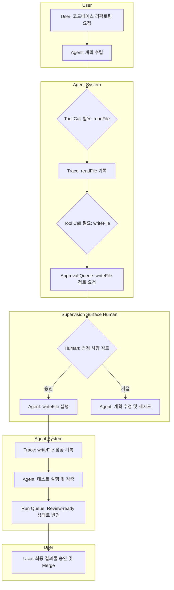

> 이 엔트리는 Blake Crosley의 [Agents Need Supervision Surfaces](https://blakecrosley.com/blog/agents-need-supervision-surfaces)을 정독하고 핵심을 추출한 것이다.

## 왜 중요한가: Chat UI의 한계와 감독(Supervision)의 부상

AI 에이전트 개발의 핵심 과제는 "에이전트가 행동할 수 있는가?"에서 "인간이 에이전트의 대규모 작업을 감독할 수 있는가?"로 전환되었다. OpenAI가 Codex 앱을 '여러 에이전트를 관리하고, 작업을 병렬 실행하며, 팀을 감독하는 커맨드 센터'로 재정의한 것이 이 변화의 증거다.

단순한 채팅 인터페이스는 의도(intent)를 전달하는 데는 유용하지만, 자율적으로 진행되는 작업의 운영 화면(operating surface)으로는 실패한다. 에이전트의 실행 과정에는 도구 호출, 권한 요청, 실패한 분기, 메모리, 최종 결과물 등 복잡한 상태가 포함되며, 이를 선형적인 대화 스크롤로 파악하고 제어하는 것은 불가능하기 때문이다.

따라서 에이전트가 수행하는 작업을 책임감 있게 관리하기 위한 별도의 UI, 즉 **감독 화면(Supervision Surface)** 이 필수적이다. 감독은 단순한 마찰이 아니라, 올바른 맥락에서 올바른 결정을 내리게 하여 인지 부하를 줄이는 핵심 기능이다.

## 핵심 패턴: 에이전트 감독을 위한 5가지 UI 컴포넌트

Blake Crosley는 성공적인 감독 화면이 갖춰야 할 핵심 컴포넌트들을 제시한다. 이는 OpenAI Agents SDK, Anthropic Claude Code Hooks, Microsoft의 인간-AI 상호작용 가이드라인 등 업계 표준에서 공통적으로 발견되는 패턴이다.

### 1. 실행 큐 (Run Queue)
단순한 활동 로그가 아니라, **인간의 주의(attention)가 필요한 작업**을 보여주는 대시보드다. 운영자는 어떤 에이전트가 어떤 상태에 있는지 한눈에 파악할 수 있어야 한다.

- **Planning**: 목표, 범위, 사용할 도구, 수락 기준을 정의하는 단계
- **Acting**: 현재 실행 중인 도구, 대상, 예상되는 부수 효과
- **Waiting**: 인간의 승인, 외부 입력, 자격 증명 등을 기다리는 상태
- **Verifying**: 테스트 실행, 소스 코드 검사, 결과물 검토 등 검증 단계
- **Repairing**: 검증 실패 후 가설을 수정하고 재시도하는 단계
- **Review-ready**: 최종 산출물, diff, 증거 자료가 생성되어 검토 준비 완료
- **Blocked**: 명확한 이유로 작업이 중단된 상태

### 2. 승인 큐 (Approval Queue)
모달 창으로 사용자의 흐름을 계속 방해하는 대신, 검토가 필요한 **'검토 객체(Review Object)'** 들을 큐에 쌓아두는 방식이다. 이를 통해 저위험 작업은 조용히 통과시키고, 고위험 작업만 선별하여 인간의 결정을 구할 수 있다.

OpenAI Agents SDK의 `human-in-the-loop` 워크플로우와 Anthropic의 `PreToolUse`, `PermissionRequest` 훅이 바로 이 패턴을 구현한 사례다.

### 3. 검토 객체 (The Review Object)
"메시지가 아닌 객체를 디자인하라." 승인 요청은 단순한 텍스트가 아니라, 결정에 필요한 모든 맥락을 담은 구조화된 데이터여야 한다.

```typescript
// 승인 큐에 표시될 검토 객체 예시
interface ReviewObject {
  id: string;
  agentId: string;
  runId: string;
  status: 'pending' | 'approved' | 'rejected';
  
  toolName: string;         // 예: 'FileSystem.writeFile'
  arguments: any;           // 예: { path: './src/main.ts', content: '...' }
  target: string;           // 예: 'production-server:/app/src'
  riskTier: 'low' | 'medium' | 'high'; // 위험 등급
  
  agentReason: string;      // "요구사항을 반영하기 위해 메인 로직 수정"
  expectedSideEffect: string; // "파일 쓰기", "API 호출", "DB 변경"
  
  // 사용자가 내릴 수 있는 결정
  nextActions: ('approveOnce' | 'alwaysApprove' | 'reject' | 'rewrite')[];
}
```

### 4. 추적 화면 (Trace Surface)
작업의 **순서, 원인, 결과**를 증명하는 화면. LLM 생성, 도구 호출, 에이전트 간 핸드오프, 가드레일 작동 등 모든 이벤트를 시각화하여 디버깅과 모니터링을 지원한다. 단순 로그가 아니라, 각 단계가 어떻게 연결되었는지 인과 관계를 보여주는 것이 핵심이다.

### 5. 상태 고도 (State "Altitude")
모든 에이전트 활동을 동일한 비중으로 표시해서는 안 된다. 각 작업의 중요도에 따라 4가지 '고도'를 부여하여 시각적으로 구분해야 한다.

- **Silent**: 읽기 전용 작업 등 사용자에게 알릴 필요 없는 활동
- **Summarized**: 여러 단계의 작업을 하나의 요약된 상태로 표시
- **Interrupting**: 되돌릴 수 없는 작업(예: 프로덕션 배포) 시 즉시 사용자 확인 요구
- **Blocked**: 진행이 불가능하여 반드시 인간의 개입이 필요한 상태

## Mermaid 다이어그램: 감독 화면을 통한 에이전트 워크플로우



## 실전 적용: `ai-study` 위키 콘텐츠 생성 에이전트

`ai-study` 프로젝트에서 "Mixture-of-Experts 최신 논문 5개를 요약하고 위키 페이지 초안을 작성하라"는 태스크를 에이전트에게 맡기는 시나리오를 가정해보자.

1.  **실행 큐 (Run Queue)**:
    - 대시보드에 "MoE 최신 동향 요약" 카드가 `Acting` 상태로 표시된다.
    - 하위 상태로 "ArXiv 검색 중", "PDF 다운로드 중" 등이 표시된다.

2.  **승인 큐 (Approval Queue)**:
    - 논문 5개를 요약하기 위해 OpenAI API 호출이 필요할 때, 승인 큐에 검토 객체가 생성된다.
    - **객체 내용**:
        - **Tool**: `OpenAI.summarize_text`
        - **Target**: 논문 5개 (총 120,000 토큰)
        - **Risk Tier**: Medium (비용 발생)
        - **Agent Reason**: "핵심 내용을 추출하여 초안을 작성하기 위함"
        - **Expected Side Effect**: "API 비용 약 $1.50 발생"
    - 운영자는 이 정보를 보고 API 호출을 승인하거나 거절할 수 있다.

3.  **추적 화면 (Trace Surface)**:
    - 에이전트가 어떤 키워드로 ArXiv를 검색했는지, 어떤 논문 10개를 후보로 올렸다가 최종 5개를 선택했는지, 각 논문 요약 결과는 어땠는지 전 과정을 추적할 수 있다. 이는 결과물의 신뢰도를 검증하는 데 필수적이다.

4.  **최종 검토 (Review-ready)**:
    - 최종적으로 생성된 MDX 초안이 `Review-ready` 상태로 큐에 올라온다.
    - 운영자는 원문과 요약문을 비교(diff)하고, 일부 표현을 수정한 뒤 최종적으로 `ai-study` 리포지토리에 커밋하는 것을 승인한다.

이처럼 채팅은 초기 지시를 내리는 데 사용하고, 실제 작업의 감독과 책임은 감독 화면을 통해 수행함으로써 복잡한 AI 에이전트 워크플로우를 안정적으로 운영할 수 있다.

---
*이 엔트리는 Blake Crosley의 [Agents Need Supervision Surfaces](https://blakecrosley.com/blog/agents-need-supervision-surfaces)를 정독하고 핵심을 추출한 것이다.*