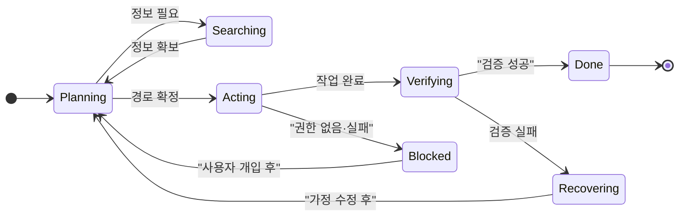

> 이 엔트리는 Blake Crosley의 [Agentic Design Is Control Surface Design](https://blakecrosley.com/blog/agentic-design-control-surface)을 정독하고 핵심을 추출한 것이다.

이 엔트리는 Blake Crosley의 [Agentic Design Is Control Surface Design](https://www.latent.space/p/agentic-design)을 정독하고 핵심을 추출한 것이다.

## 왜 중요한가: 사용자는 프롬프터가 아닌 '오퍼레이터'다

AI 에이전트 인터페이스 디자인은 단순히 더 똑똑한 챗봇 UI를 만드는 것이 아니다. 에이전트가 자율적으로 파일을 수정하고, 돈을 쓰고, 프로덕션 상태를 변경하는 시대에는 디자인의 패러다임이 **컨트롤 서페이스(Control Surface)** 설계 문제로 전환된다.

기존 소프트웨어는 사용자가 직접 상태 변경을 유발하므로(예: '전송' 버튼 클릭) 내부 프로세스를 숨길 수 있다. 하지만 에이전트는 사용자의 '의도'와 시스템의 '행동' 사이에 자율적인 의사결정 런타임을 삽입한다. 이로 인해 실패의 양상도 달라진다. 폼은 제출 시점에 실패하고, 대시보드는 낡은 데이터를 보여줄 때 실패하지만, 에이전트는 잘못된 경로를 선택하거나, 엉뚱한 도구를 사용하거나, 컨텍스트를 잃는 등 **움직임(motion)을 통해 실패한다.**

따라서 사용자는 단순히 질문하는 '프롬프터(prompter)'에서, 프로세스를 감독하는 '오퍼레이터(operator)'로 역할이 바뀐다. 오퍼레이터는 결과물의 문체뿐만 아니라, 시스템이 올바른 파일을 건드렸는지, 정확한 소스를 사용했는지, 제약조건을 지켰는지 등을 감독해야 한다.

이러한 변화는 Microsoft의 [Human-AI Interaction 가이드라인](https://www.microsoft.com/en-us/research/publication/guidelines-for-human-ai-interaction/)이나 Google PAIR의 [AI 디자인 가이드](https://pair.withgoogle.com/guidebook/)에서도 강조하는 인간 중심 설계의 연장선이며, 에이전트가 추천을 넘어 실제 행동을 수행하게 되면서 그 중요성이 더욱 커졌다.

## 핵심 패턴: 상태, 권한, 트레이스를 디자인하라

### 1. 패턴: 상태를 디자인하라 (Design for State)

좋은 에이전틱 디자인은 신뢰를 요구하기 전에 **상태를 가시화**한다. 대부분의 챗봇 UI가 '생각 중'을 의미하는 스피너 하나로 모든 중간 과정을 퉁치는 것은 오퍼레이터에게 아무런 정보를 주지 못한다. 에이전트의 상태는 훨씬 더 복잡하며, 각 상태에 맞는 시각적 표현이 필요하다.

- **Planning**: 의도된 경로, 가정, 사용할 도구
- **Searching**: 검색 쿼리, 소스, 찾지 못한 정보
- **Acting**: 호출할 도구, 인자값, 예상되는 부수 효과
- **Blocked**: 권한 부족, 인증 실패, 불분명한 요구사항
- **Verifying**: 테스트 커맨드, 증거 소스, 통과 기준
- **Recovering**: 실패한 단계, 재시도 경로, 변경된 가정
- **Done**: 최종 결과물, 증거, 해결되지 않은 문제

이러한 상태를 명확히 보여주는 것만으로도 사용자의 불안감을 줄이고, 시스템의 미스터리를 검사 가능한 움직임으로 바꿀 수 있다.



### 2. 패턴: 권한을 디자인 재료로 삼아라 (Permission as a Design Material)

권한은 설정 페이지의 옵션이 아니라, 에이전틱 디자인의 핵심 재료다. 파일 쓰기, 셸 명령어 실행, API 호출 등 각기 다른 위험도를 가진 작업을 에이전트가 수행할 때, UI는 그 위험도를 사용자가 **결정 시점에 인지**할 수 있도록 설계해야 한다.

Anthropic Claude Code의 `PreToolUse` 훅은 이 아이디어의 원시적인 형태를 보여준다. 이 훅을 사용하면 위험한 Bash 명령어가 실행되기 전에 가로채서 실행을 거부할 수 있다.

핵심은 권한 요청을 일회성 '방해(interruption)'가 아닌, 검토 가능한 **'큐(queue)'**로 만드는 것이다. 오퍼레이터는 이 큐에서 위험도가 낮은 작업들을 일괄 승인하고, 위험도가 높은 작업은 잠시 보류하며 전체적인 위험 프로파일을 한눈에 검토할 수 있어야 한다.

```typescript
// Claude Code의 PreToolUse 훅에서 영감을 받은 인터페이스
interface ToolCallRequest {
  toolName: 'bash' | 'file_write' | 'api_call';
  arguments: { command?: string; path?: string; };
  estimatedRisk: 'low' | 'medium' | 'high' | 'critical';
}

type HookDecision = {
  decision: 'approve' | 'deny' | 'defer';
  reason?: string;
};

function onBeforeToolUse(request: ToolCallRequest): HookDecision {
  // 위험도 높은 작업은 사용자 승인 큐에 추가 (defer)
  if (request.estimatedRisk === 'critical' && request.arguments.command?.includes('rm -rf')) {
    return {
      decision: 'defer',
      reason: 'Critical file deletion detected. Requires manual review.',
    };
  }
  return { decision: 'approve' };
}
```

### 3. 패턴: 트레이스를 새로운 정보 아키텍처로 구축하라 (Trace as the New IA)

챗봇의 대화 기록은 정보 아키텍처가 아니라 그냥 스크롤에 불과하다. 에이전틱 디자인은 **트레이스(trace)**, 즉 에이전트가 수행한 모든 작업의 순차적 기록을 새로운 정보 아키텍처로 삼아야 한다.

잘 설계된 트레이스 서페이스는 다음 네 가지 질문에 신속하게 답할 수 있어야 한다.

1.  **무슨 일이 일어났는가? (What happened?)**
    - 이벤트 유형(툴 호출, 파일 읽기 등)으로 필터링 가능한 타임라인
2.  **왜 그 일이 일어났는가? (Why did it happen?)**
    - 각 행동에 첨부된 에이전트의 추론 과정
3.  **무엇이 바뀌었는가? (What changed?)**
    - 코드 diff, 생성된 파일, 변경된 경로 등 부수 효과
4.  **결과를 뒷받침하는 근거는 무엇인가? (What supports the result?)**
    - 증거 링크, 명령어 출력, 인용, 해결되지 않은 문제점

## 실전 적용: `aidy`에 컨트롤 서페이스 도입하기

`aidy`가 레거시 코드 리팩토링 작업을 수행하는 시나리오에 에이전틱 디자인 패턴을 적용할 수 있다.

1.  **상태 시각화**: 사용자가 "이 모듈 리팩토링해줘"라고 요청하면, `aidy` UI는 단순한 스피너 대신 명확한 상태 바를 표시한다.
    - `[Planning] 의존성 분석 및 리팩토링 전략 수립 중...`
    - `[Acting] 'UserService.js' 파일에 타입 정의 추가 중...`
    - `[Verifying] 생성된 코드에 대해 Jest 테스트 실행 중 (3/5 통과)...`
    - `[Blocked] 'config.yaml' 파일에 쓰기 권한이 없습니다. 권한을 부여해주세요.`

2.  **권한 큐**: 리팩토링 과정에서 `aidy`가 `node_modules` 삭제, `git push --force` 실행 등 위험한 작업을 시도할 경우, 즉시 실행하지 않고 '액션 검토 큐'에 추가한다.
    - `[낮음] npm install 실행` (일괄 승인 가능)
    - `[높음] 2개 파일 삭제` (펼쳐서 파일 목록 확인 가능)
    - `[치명적] git push --force to 'main' 브랜치` (빨간색으로 강조, 명시적 승인 필요)

3.  **트레이스 제공**: 리팩토링 완료 후, `aidy`는 최종 코드와 함께 작업 트레이스를 제공한다. 사용자는 단순히 결과물만 받는 것이 아니라, 전체 과정을 감사(audit)할 수 있다.
    - `1. 의도 파악: '결제 로직 단순화' 확인`
    - `2. 파일 스캔: 'legacy_payment.js', 'utils.js' 2개 파일 분석`
    - `3. 툴 호출: 'create-test-scaffold' (성공)`
    - `4. 상태 변경: 'legacy_payment.js' 파일 수정 (Diff 보기)`
    - `5. 검증: 모든 테스트 통과 (테스트 리포트 보기)`
    - `6. 근거: 최종 코드는 'Stripe 최신 API 명세'를 따름 (링크)`

이렇게 컨트롤 서페이스를 도입하면, `aidy`는 '마법 같은 코드 생성기'가 아니라, 개발자가 신뢰하고 통제하며 협업할 수 있는 강력한 '오퍼레이터 툴'로 거듭날 수 있다.