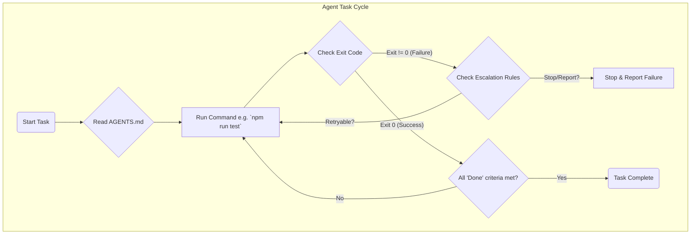

> 이 엔트리는 Blake Crosley의 [AGENTS.md Patterns](https://blakecrosley.com/blog/agents-md-patterns)을 정독하고 핵심을 추출한 것이다.

## AI 에이전트 지침, 왜 대부분 실패하는가?

LLM 기반의 AI 코딩 에이전트에게 `AGENTS.md` 파일로 프로젝트 규칙을 알려주어도 대부분 무시된다. 이는 에이전트의 기술적 한계 때문이 아니다. 우리가 **인간을 위한 문서(Documentation)**를 작성하기 때문이다. 에이전트에게 필요한 것은 사람이 읽는 설명서가 아닌, 즉시 실행 가능한 **기계적 운영 정책(Operational Policy)**이다.

GitHub가 2,500개 이상의 `AGENTS.md` 파일을 분석한 결과, 실패의 주된 원인은 기술적 제약이 아닌 "지침의 모호함"이었다. 효과적인 `AGENTS.md`는 에이전트를 모호한 해석에서 벗어나 예측 가능한 엔지니어링 파트너로 만든다.

## 핵심 패턴: 무엇이 에이전트의 행동을 바꾸는가

에이전트의 행동을 실질적으로 변화시키는 패턴과 무시되는 패턴은 명확히 구분된다. 핵심은 **"이 지시가 완료되었음을 어떤 명령어로 증명할 수 있는가?"** 라는 질문에 답할 수 있는지 여부다.

### 실패하는 패턴 (Anti-Patterns)

아래 패턴들은 에이전트의 행동에 관찰 가능한 변화를 만들지 못했다.

1.  **명령어 없는 산문(Prose Paragraphs)**: "우리는 깔끔하고 잘 테스트된 코드를 지향합니다."와 같은 문장은 에이전트에게 모호한 선호도로만 인식될 뿐, 아무런 행동으로 이어지지 않는다. 실행할 명령, 충족할 기준, '완료'의 정의가 없기 때문이다.
2.  **모호한 지시어(Ambiguous Directives)**: "데이터베이스 마이그레이션은 신중하게 하세요", "가능한 경우 쿼리를 최적화하세요"와 같은 지시는 제약조건, 트리거, 행동 사양이 아니다.
3.  **모순된 우선순위(Contradictory Priorities)**: "빠르게 배포"와 "포괄적인 테스트 커버리지 확보"를 동시에 지시하면, 에이전트는 명시적 우선순위가 없어 검증 단계를 건너뛰고 코드 생성으로 직행한다. ICLR 2026의 `AMBIG-SWE` 연구에 따르면, 이런 모호한 상황에서 에이전트는 질문하는 대신 비대화형으로 조용히 작업을 진행하여 해결률이 48.8%에서 28%로 급락했다.
4.  **강제성 없는 스타일 가이드(Style Guides without Enforcement)**: "Google Python 스타일 가이드를 따르세요"라고만 하면, 에이전트는 자신이 규정을 준수했는지 검증할 방법이 없다. `eslint --fix .` 와 같이 스타일을 강제하고 검증하는 명령어가 없다면 단순한 제안에 불과하다.

### 성공하는 패턴 (Effective Patterns)

아래 패턴들은 일관되고 측정 가능한 행동 변화를 이끌어냈다.

1.  **명령어 우선 원칙 (Command-First Instructions)**
    모든 지침은 실행 가능한 명령어로 제공되어야 한다. 에이전트는 명령어를 통해 무엇을 실행하고, 어떤 인자를 전달하며, 종료 코드(exit code)로 성공 여부를 판단한다.

    ```typescript
    // GOOD: AGENTS.md의 빌드/테스트 섹션 예시
    ## Build and Test Commands
    - Install: `npm install`
    - Lint: `npm run lint`
    - Format: `npm run format`
    - Test: `npm run test`
    - Type check: `npm run type-check`
    - Full verify: `npm run lint && npm run test && npm run type-check`
    ```

2.  **완료 조건 명시 (Closure Definitions)**
    '완료(Done)'의 의미를 에이전트가 추측하게 두지 말고, 구체적인 명령어들의 성공적인 종료(exit 0)로 정의해야 한다. 이는 에이전트가 스스로 검증 없이 작업을 끝냈다고 보고하는 가장 흔한 실패를 막는다.

    ```typescript
    // GOOD: AGENTS.md의 완료 정의 예시
    ## Definition of Done
    A task is complete when ALL of the following pass:
    1. `npm run lint` exits 0
    2. `npm run test` exits 0 with no failures
    3. `npm run type-check` exits 0
    4. Changed files have been staged and committed
    5. Commit message follows conventional format: `type(scope): description`
    ```

3.  **작업 단위 구성 (Task-Organized Sections)**
    `언제(When)` 키워드를 사용해 작업을 문맥별로 그룹화하면 에이전트가 현재 수행 중인 작업과 관련된 지침만 선택적으로 참조할 수 있다.

    ```typescript
    // GOOD: AGENTS.md의 작업별 구성 예시
    ## When Writing Code
    - Run `npm run format` after every file change
    - Add type hints to all new functions
    - Test command: `jest --findRelatedTests "src/module/path.ts"`

    ## When Reviewing Code
    - Verify test coverage: `npm run test -- --coverage --coverageReporters="text" --testLocationInResults`
    - List changed files: `git diff --name-only HEAD~1`
    ```

4.  **에스컬레이션 규칙 (Escalation Rules)**
    에이전트가 막혔을 때 어떻게 행동해야 할지, 그리고 절대 해서는 안 될 행동이 무엇인지 명시한다. 이를 통해 파일 삭제, 테스트 건너뛰기 등 파괴적인 방식으로 문제를 해결하려는 시도를 막을 수 있다.

    ```typescript
    // GOOD: AGENTS.md의 예외 처리 규칙 예시
    ## When Blocked
    - If tests fail after 3 attempts: stop and report the failing test with full output.
    - If a dependency is missing: check `package.json` first, then ask.
    - Never: delete files to resolve errors, force push, or skip tests.
    ```

## 실전 적용: `moneyflow` 프로젝트 `AGENTS.md`

`moneyflow` 프로젝트에 AI 에이전트를 도입하여 코드베이스를 관리한다고 가정해보자. 아래는 위 패턴들을 적용한 `AGENTS.md` 파일의 예시이다.

```markdown
# AGENTS.md for moneyflow project

## Definition of Done
A task is complete when ALL of the following pass:
1. `npm run lint` exits 0
2. `npm run test` exits 0 with no failures
3. `npm run type-check` exits 0
4. Commit message follows conventional format: `feat(billing): add new invoice model`

## Build and Test Commands
- Install: `npm install`
- Lint: `npx eslint "src/**/*.ts" --fix`
- Test (Unit): `npx jest --testPathPattern=src`
- Test (E2E): `npx playwright test`
- Type Check: `npx tsc --noEmit`
- Full Verify: `npm run lint && npm run test && npm run type-check`

## When Writing Code (TypeScript)
- After changing a file, run `npx eslint "src/**/*.ts" --fix`
- New functions MUST include JSDoc comments.
- For new backend logic, add a corresponding unit test in the same directory with a `.test.ts` extension.
- Test command: `npx jest "path/to/your/new/file.test.ts"`

## When Creating a Pull Request
1. Priority 1: Run full verification: `npm run lint && npm run test && npm run type-check`. It must pass.
2. Priority 2: Update the PR description with a summary of changes.
3. Priority 3: Assign reviewers from the `backend-dev` team.

## When Blocked
- If `npm install` fails: delete `node_modules` and `package-lock.json`, then run `npm install` again (max 2 attempts).
- If unit tests fail after 3 attempts: stop, report the failing test with full output, and assign the PR back to the author.
- Never: force push to `main` or `develop` branches.
```

### 에이전트 작업 흐름 다이어그램



---

이 엔트리는 Blake Crosley의 [AGENTS.md Patterns: What Actually Changes Agent Behavior](https://blakecrosley.com/blog/agents-md-patterns-what-actually-changes-agent-behavior/)를 정독하고 핵심을 추출한 것이다. 글에서 인용된 GitHub 분석 및 ICLR 2026(`AMBIG-SWE`) 연구 결과는 `AGENTS.md` 작성 시 모호함을 제거하고 기계가 해석 가능한 운영 절차를 제공하는 것이 얼마나 중요한지 뒷받침한다.
