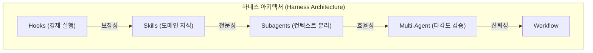

> 이 엔트리는 Blake Crosley의 [agent@harness:~$ █████╗ ██████╗ ███████╗███╗ ██╗████████╗ ██╔══██╗██╔════╝ ██╔════╝████╗ ██║╚══██╔══╝ ███████║██║ ███╗██](https://blakecrosley.com/guides/agent-architecture)을 정독하고 핵심을 추출한 것이다.

AI 코딩 에이전트를 단순한 대화형 챗봇으로 취급하면 그 잠재력의 일부만 활용하는 것입니다. 진정한 생산성 향상은 에이전트를 프롬프트 엔지니어링의 대상이 아닌, **LLM을 커널로 사용하는 프로그래밍 가능한 런타임**으로 바라보는 인프라적 관점에서 시작됩니다.

nginx에 직접 요청을 입력하는 대신 설정을 구성하고 모니터링하듯, AI 에이전트도 결정론적(deterministic)인 '하네스(harness)' 내에서 작동하도록 설계해야 합니다. 이 하네스는 당신이 정의한 정책을 모델이 절대 우회할 수 없도록 강제하며, 반복적인 작업을 자동화하고, 여러 에이전트 간의 협업을 조율하여 결과물의 신뢰도를 극대화합니다.

### 왜 중요한가: AI 에이전트의 근본적 한계

Andrej Karpathy가 'claws'라고 명명한 LLM 주변 인프라가 필수적인 이유는 모델 자체의 내재적 한계 때문입니다.

1.  **컨텍스트 창의 성능 저하**: 컨텍스트가 길어진다고 성능이 유지되지 않습니다. Microsoft Research와 Salesforce의 연구에 따르면, 20만 건 이상의 대화를 분석한 결과, 단일 턴(single-turn)에 비해 다중 턴(multi-turn) 상호작용에서 LLM의 성능이 평균 **39%** 저하되었습니다. 이는 토큰 수의 문제가 아니라, 대화의 '턴(turn)' 경계 자체가 성능 저하의 원인임을 시사합니다. 즉, 긴 대화는 필연적으로 에이전트의 초기 지시 이해도를 떨어뜨립니다.

2.  **확률론적 행동**: "파일 수정 후에는 항상 Prettier를 실행해"와 같은 프롬프트 기반 지시는 약 80%의 확률로만 작동합니다. 모델은 이를 잊거나, 속도를 우선시하거나, 변경이 사소하다고 판단하여 건너뛸 수 있습니다. 보안, 규정 준수, 팀 표준과 같이 100%의 실행이 보장되어야 하는 작업에 확률론적 모델의 행동은 적합하지 않습니다.

3.  **단일 관점의 맹점**: 단일 에이전트는 자신의 가정을 스스로 검증하지 못합니다. API 엔드포인트 검토 시, 한 에이전트는 인증, 입력 값 검증 등을 확인하고 '이상 없음' 결론을 내릴 수 있습니다. 하지만 침투 테스터 관점을 부여받은 두 번째 에이전트는 첫 번째 에이전트가 놓친 구조적 취약점을 발견할 수 있습니다.

### 핵심 패턴: 결정론적 하네스 구축하기

이러한 한계를 극복하기 위해 Blake Crosley는 Hooks, Skills, Subagents, 그리고 Multi-Agent 오케스트레이션을 조합하는 '하네스 패턴'을 제안합니다. 이 구성 요소들은 독립적인 기능이 아니라, 모델과 개발자 사이에 예측 가능한 계층을 만드는 시스템으로 작동합니다.



#### 1. Hooks: 모델이 건너뛸 수 없는 강제 규칙

훅(Hook)은 모델의 모든 액션 전후에 실행되는 셸 스크립트 또는 커맨드입니다. 모델은 이 실행을 건너뛸 수 없으므로, 결정론적 실행을 보장하는 가장 강력한 장치입니다.

-   **핵심**: `exit 2`는 액션을 차단하고, `exit 1`은 경고만 표시합니다.
-   **용도**: 민감 정보 유출 방지, 코드 포매팅, 린팅, 보안 스캔 등 반드시 실행되어야 하는 모든 작업.

```typescript
// 예시: TypeScript로 구현한 PreToolUse 훅
// Claude가 bash 명령어를 실행하기 전에 항상 호출됨
interface ToolInput {
  tool_name: string;
  tool_input: { command: string };
}

function blockSecretsHook(input: ToolInput): { exitCode: 0 | 1 | 2; message?: string } {
  if (input.tool_name !== 'Bash') {
    return { exitCode: 0 }; // Bash 명령어가 아니면 통과
  }

  const command = input.tool_input.command;
  const secretPattern = /(AKIA|sk-|ghp_|password=)/i;

  if (secretPattern.test(command)) {
    // exit 2에 해당: 액션을 완전히 차단
    return {
      exitCode: 2,
      message: "BLOCKED: Potential secret detected in command.",
    };
  }

  // exit 0에 해당: 액션 허용
  return { exitCode: 0 };
}
```

#### 2. Skills: LLM이 추론하여 사용하는 도메인 전문성

스킬(Skill)은 특정 작업에 대한 전문 지식을 담은 문서(마크다운 등)입니다. 핵심은 `description` 필드로, 모델은 단순 키워드 매칭이 아닌 LLM 추론을 통해 언제 이 스킬을 적용할지 결정합니다.

-   **핵심**: "이 코드를 리뷰해줘"라는 요청에, `description`이 "코드의 보안 이슈, 버그, 품질 문제를 검토합니다."로 작성된 스킬이 자동으로 활성화됩니다.
-   **용도**: 코드 리뷰 체크리스트, 리팩토링 가이드라인, API 설계 원칙 등 프로젝트별 도메인 지식 캡슐화.

#### 3. Subagents: 컨텍스트 오염 방지 및 병렬 처리

서브에이전트(Subagent)는 메인 세션과 격리된 컨텍스트 창에서 특정 작업을 수행하는 자식 에이전트입니다.

-   **핵심**: 메인 에이전트의 컨텍스트를 깨끗하게 유지하면서 복잡한 분석이나 탐색 작업을 위임할 수 있습니다.
-   **용도**: 지난 3개의 커밋 분석, 외부 라이브러리 문서 요약, 복잡한 알고리즘 프로토타이핑 등.

### 실전 적용: `aidy` 프로젝트에 하네스 도입하기

`aidy`는 AI 기반 개발 보조 도구이므로, 이 하네스 아키텍처를 도입하여 결과물의 신뢰성과 일관성을 높일 수 있습니다.

1.  **Hook 적용: `PreCommitHook`**
    -   `aidy`가 생성하거나 수정한 코드를 커밋하기 직전에 `PreToolUse` 훅을 트리거합니다.
    -   이 훅은 `eslint --fix`를 강제로 실행하여 모든 코드가 팀의 코딩 스타일을 따르도록 보장합니다.
    -   추가로, 모든 파일 상단에 라이선스 헤더가 있는지 검사하고, 없으면 추가하거나 `exit 2`로 커밋을 막습니다.
    -   **기대효과**: `aidy`가 어떤 코드를 생성하든, 최종 결과물은 항상 팀의 표준을 100% 준수하게 됩니다.

2.  **Skill 적용: `TCA-Refactoring-Skill`**
    -   `aidy` 프로젝트의 핵심 아키텍처인 The Composable Architecture (TCA) 리팩토링 규칙을 담은 `SKILL.md` 파일을 생성합니다.
    -   `description`: "SwiftUI와 TCA 패턴에 따라 코드를 리팩토링합니다. Reducer의 비즈니스 로직과 View의 상태 바인딩을 분리하고, side effect는 Effect 타입을 사용하도록 강제합니다."
    -   **기대효과**: 개발자가 "이 부분 TCA 패턴에 맞게 리팩토링해줘"라고 요청하면, `aidy`는 이 스킬을 자동으로 활성화하여 일관성 있는 고품질의 리팩토링을 수행합니다.

3.  **Subagent 적용: `DependencyAnalyzer`**
    -   개발자가 "결제 모듈에 새로운 기능을 추가해줘"라고 요청하면, 메인 에이전트는 먼저 `DependencyAnalyzer` 서브에이전트를 생성합니다.
    -   이 서브에이전트는 `PaymentModule`과 관련된 모든 파일을 읽고, 내부 의존성 및 외부 API 호출 목록을 분석하여 요약 리포트를 생성합니다.
    -   메인 에이전트는 이 리포트를 받아 전체 구조를 파악한 후, 컨텍스트 낭비 없이 핵심 기능 개발에 집중합니다.
    -   **기대효과**: 대규모 코드베이스에서도 컨텍스트 창의 한계를 극복하고, 정확한 맥락 이해를 바탕으로 작업을 수행할 수 있습니다.

---
이 엔트리는 Blake Crosley의 [Agent Architecture: Building AI-Powered Development Harnesses](https://blakeweb.github.io/agent-architecture/)를 정독하고 핵심을 추출한 것입니다.