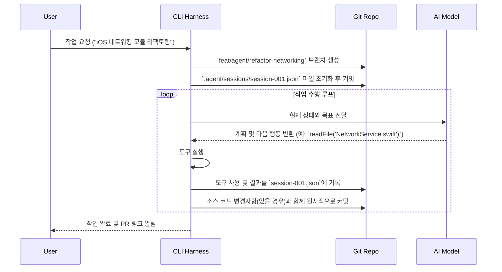

## AI 에이전트 워크플로우를 Git에 기록하기: 레포 기반 로컬 퍼스트 하네스의 추적성과 재현성

AI 코딩 에이전트와의 상호작용은 대부분 터미널 스크롤백이나 웹 UI의 대화 기록처럼 휘발성 데이터로 남는다. 이러한 방식은 개인의 단기 작업에는 유용할 수 있지만, 팀 단위 협업이나 장기적인 유지보수 관점에서는 치명적인 약점을 드러낸다. 에이전트가 어떤 맥락에서 특정 코드를 생성했는지, 어떤 도구를 사용했고 그 결과는 어땠는지, 여러 대안 중 왜 현재의 해결책을 선택했는지에 대한 기록이 없으면, 에이전트가 생성한 코드는 맥락을 잃은 '마법적인' 결과물이 되어버린다. 이는 곧 코드의 신뢰성 하락과 유지보수 비용 증가로 이어진다.

이 문제를 해결하기 위해 에이전트의 모든 작업 흐름을 Git 레포지토리 안에 직접 기록하는 '레포 기반 로컬 퍼스트 하네스(Repo-Based, Local-First Harness)' 접근법이 주목받고 있다. 이 방식은 에이전트의 두뇌 활동, 즉 목표 설정, 계획 수립, 도구 사용, 결과 분석, 자기 수정에 이르는 전 과정을 구조화된 파일(예: JSON, YAML)로 저장하고 Git으로 버전 관리하는 것을 핵심으로 한다. 에이전트가 단순히 최종 코드만 커밋하는 것이 아니라, 그 코드를 만들기까지의 전체 '사고 과정'을 레포지토리의 일부로 남기는 것이다.

### 레포 기반 워크플로우의 핵심 원리

레포 기반 하네스의 중심 철학은 **"레포지토리가 곧 에이전트다"**라는 개념에 있다. 에이전트의 정체성, 스킬, 설정, 그리고 가장 중요하게는 작업 기록까지 모두 파일 기반으로 레포지토리 내에 존재한다. 이는 다음과 같은 구체적인 워크플로우로 구현된다.

1.  **상태 초기화**: 사용자가 CLI를 통해 에이전트에게 작업을 지시하면, 하네스는 `.agent/sessions/`와 같은 특정 디렉터리에 새로운 세션 파일을 생성한다.
2.  **상호작용 기록**: 사용자의 프롬프트, 에이전트의 내부적인 '생각(thought)', 호출한 도구(tool)와 그 인자(arguments), 도구 실행 결과(output), 그리고 최종적으로 생성된 응답(response)이 순차적으로 세션 파일에 기록된다.
3.  **원자적 커밋**: 에이전트의 각 작업 단위(turn)가 끝날 때마다, 변경된 상태 파일과 에이전트가 수정한 소스 코드가 함께 하나의 원자적 커밋(atomic commit)으로 묶여 저장된다. 커밋 메시지에는 해당 작업에 대한 요약이 포함된다.
4.  **브랜치를 통한 격리**: 모든 에이전트 작업은 별도의 Git 브랜치에서 수행된다. 이를 통해 진행 중인 작업을 `main` 브랜치와 격리하고, 작업이 완료되면 Pull Request(PR)를 통해 인간의 검토를 거치게 할 수 있다.

이러한 흐름을 다이어그램으로 표현하면 다음과 같다.



### 기존 방식과의 트레이드오프

레포 기반 로컬 퍼스트 하네스는 모든 상황에 적합한 만능 해결책이 아니다. 클라우드 기반 오케스트레이터나 간단한 스크립트 방식과 비교했을 때 명확한 장단점이 존재한다.

| 특징 | 레포 기반 (Local-First) | 클라우드 오케스트레이터 | 단순 스크립트 (Ephemeral) |
| :--- | :--- | :--- | :--- |
| **추적성 및 재현성** | **우수 (Git History)**: `git log -p` 만으로 모든 과정을 완벽히 재현 가능 | 보통 (서비스 UI/로그): 벤더 종속적이며 데이터 보관 기간에 제한이 있을 수 있음 | **나쁨 (터미널 기록)**: 세션이 종료되면 모든 맥락 소실 |
| **팀 협업** | **우수 (Git Branch/PR)**: 기존 개발 워크플로우에 완벽하게 통합 | 제한적: 벤더가 제공하는 공유 기능에 의존 | 불가능 |
| **오프라인 및 속도** | **높음**: LLM 호출 외 모든 작업이 로컬에서 실행되어 빠름 | 낮음: 모든 상호작용이 네트워크를 거쳐 지연 발생 | 높음: 완전 로컬 실행 |
| **셋업 비용** | 낮음: CLI 도구 설치 및 레포지토리 내 설정 파일 추가 | 중간: 서비스 가입, 환경 설정, 인프라 연동 필요 | 매우 낮음: 스크립트 작성 외 비용 없음 |
| **단점** | 레포지토리 용량 증가, 상태 파일의 머지 충돌 가능성 | 벤더 종속성, 비용, 데이터 프라이버시 문제 | 기능 확장의 어려움, 상태 관리 부재 |

### iOS 개발 환경에서의 구체적인 적용 (Swift 예제)

시니어 iOS 개발자가 `aidy-ios` 프로젝트의 특정 모듈을 리팩토링하는 작업을 에이전트에게 위임하는 시나리오를 가정해보자. 하네스는 에이전트의 작업 흐름 중 iOS 프로젝트의 빌드 및 테스트를 검증하는 단계를 포함해야 한다.

에이전트 워크플로우 상태가 다음과 같은 `session.json` 파일에 기록된다고 가정하자.

```json
{
  "sessionId": "refactor-user-profile",
  "history": [
    {
      "turn": 3,
      "thought": "I have modified the user profile view model. Now I need to ensure the project still builds and all tests pass.",
      "tool_call": {
        "name": "run_ios_tests",
        "args": {
          "scheme": "Aidy-iOS",
          "destination": "platform=iOS Simulator,name=iPhone 15"
        }
      }
    }
  ]
}
```

하네스는 `run_ios_tests` 도구 호출을 감지하고, 로컬 환경에 설치된 Swift 스크립트를 실행하여 실제 검증을 수행한다.

**`run_ios_tests.swift` (도구 구현 예시)**
```swift
import Foundation

// 이 스크립트는 하네스에 의해 호출되며, JSON 출력을 통해 결과를 반환한다.
struct TestResult: Codable {
    let success: Bool
    let output: String
    let error: String?
}

// 스크립트 인자 파싱 (실제 구현에서는 더 견고한 방식 사용)
let scheme = CommandLine.arguments[1]
let destination = CommandLine.arguments[2]

let process = Process()
process.executableURL = URL(fileURLWithPath: "/usr/bin/xcodebuild")
process.arguments = [
    "test",
    "-scheme", scheme,
    "-destination", destination
]

let outputPipe = Pipe()
let errorPipe = Pipe()
process.standardOutput = outputPipe
process.standardError = errorPipe

do {
    try process.run()
    process.waitUntilExit()

    let outputData = outputPipe.fileHandleForReading.readDataToEndOfFile()
    let errorData = errorPipe.fileHandleForReading.readDataToEndOfFile()
    let output = String(data: outputData, encoding: .utf8) ?? ""
    let errorOutput = String(data: errorData, encoding: .utf8) ?? ""

    let result = TestResult(
        success: process.terminationStatus == 0,
        output: output,
        error: errorOutput.isEmpty ? nil : errorOutput
    )

    let encoder = JSONEncoder()
    encoder.outputFormatting = .prettyPrinted
    let resultData = try encoder.encode(result)
    print(String(data: resultData, encoding: .utf8)!)

} catch {
    let result = TestResult(success: false, output: "", error: error.localizedDescription)
    let encoder = JSONEncoder()
    let resultData = try! encoder.encode(result)
    print(String(data: resultData, encoding: .utf8)!)
    exit(1)
}
```

하네스는 이 Swift 스크립트의 실행 결과를 다시 `session.json`에 추가하고 커밋한다.

```json
{
  "sessionId": "refactor-user-profile",
  "history": [
    {
      "turn": 3,
      "thought": "...",
      "tool_call": { ... }
    },
    {
      "turn": 4,
      "tool_output": {
        "tool_name": "run_ios_tests",
        "result": {
          "success": true,
          "output": "Test Succeeded...",
          "error": null
        }
      },
      "thought": "Tests passed successfully. I can now proceed to commit the changes and finalize the task.",
      "response": "iOS 테스트를 성공적으로 통과했습니다. 변경 사항을 커밋하고 작업을 마무리하겠습니다."
    }
  ]
}
```

이처럼 에이전트의 작업 기록과 실제 프로젝트의 검증 결과가 Git 히스토리에 명확하게 남게 되어, 다른 개발자는 `git blame`과 세션 파일을 통해 코드 변경의 모든 맥락을 파악할 수 있다.

### 언제 이 접근법을 피해야 하는가

-   **대규모 병렬 작업**: 수백 개의 에이전트가 동시에 독립적인 작업을 수행해야 하는 경우, Git 레포지토리는 병목 현상과 수많은 머지 충돌의 원인이 될 수 있다. 이 경우, 클라우드 기반의 중앙 집중식 오케스트레이터가 더 적합하다.
-   **매우 큰 바이너리 파일 처리**: 에이전트가 비디오나 대용량 데이터셋과 같은 큰 바이너리 파일을 생성하고 수정하는 경우, Git LFS를 사용하더라도 레포지토리 용량이 기하급수적으로 커질 수 있다.
-   **실시간 협업 요구**: 여러 명의 사람과 에이전트가 문서를 동시에 편집하는 것과 같은 실시간 상호작용이 필요하다면 Git의 커밋 기반 모델은 너무 느리고 투박하다.

결론적으로, 레포 기반 로컬 퍼스트 하네스는 AI 코딩 에이전트를 기존의 소프트웨어 개발 워크플로우에 통합하기 위한 가장 자연스럽고 강력한 방법 중 하나다. 이는 에이전트의 작업을 '마법'이 아닌, 추적 가능하고 검토할 수 있는 '엔지니어링'의 영역으로 끌어들인다. "AI가 작성한 코드를 어떻게 믿는가?"라는 질문에 대해, 이 접근법은 "Git 히스토리가 모든 것을 증명한다"는 명쾌한 답변을 제공한다.

## 자기 점검

-   레포 기반 하네스가 기존 클라우드 기반 에이전트 플랫폼에 비해 갖는 가장 큰 장점은 무엇이며, 그 이유는 무엇인가?
-   에이전트의 '작업 단위(turn)'를 '원자적 커밋'으로 만드는 것이 왜 중요한가? 만약 여러 작업 단위를 하나의 커밋으로 묶거나, 코드 변경과 상태 변경을 별개의 커밋으로 분리한다면 어떤 문제가 발생할 수 있는가?
-   세션 상태를 기록하는 파일(예: `session.json`)에 머지 충돌이 발생했을 때, 이를 해결하기 위한 전략에는 어떤 것들이 있을 수 있을까?
-   현재 참여하고 있는 iOS 프로젝트에 레포 기반 하네스를 도입한다고 상상해보자. 기존 CI/CD 파이프라인(예: Jenkins, Github Actions)과 어떻게 연동하여 에이전트가 생성한 코드의 품질을 자동으로 검증하고, 검증 실패 시 에이전트에게 자동으로 피드백을 주는 루프를 만들 수 있을까?