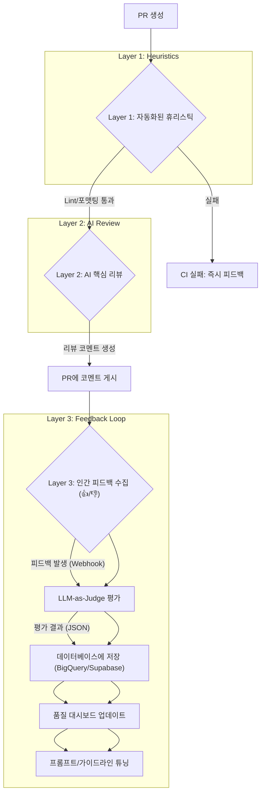

AI 기반 코드 리뷰 도구는 이제 GitHub Copilot Workspace, CodeRabbit 등 다양한 형태로 우리 워크플로우에 깊숙이 들어오고 있습니다. 반복적인 스타일링 지적이나 간단한 로직 오류 검출은 인간 리뷰어의 피로도를 줄여주는 훌륭한 보조 수단입니다. 하지만 AI의 제안을 맹목적으로 신뢰할 때, 우리는 '환각(Hallucination)'이나 미묘한 컨텍스트를 놓친 피상적인 리뷰로 인해 오히려 품질이 저하되는 위험에 직면하게 됩니다.

AI 코드 리뷰의 진정한 가치는 "AI가 리뷰를 수행했다"는 사실이 아니라, "AI의 리뷰가 실제로 코드 품질을 높이는 데 기여했는가"에 있습니다. 이를 위해서는 AI의 리뷰 품질을 지속적으로 측정하고, 그 결과를 바탕으로 시스템을 개선하는 '닫힌 루프(Closed-Loop)'를 구축해야 합니다. 이 글에서는 iOS/프론트엔드 개발자 관점에서 AI 코드 리뷰의 신뢰성을 확보하기 위한 구체적인 측정 지표와 개선 전략을 소개합니다.

## 무엇을 '좋은 리뷰'로 볼 것인가: 평가 지표 정의

AI의 성능 개선은 측정 가능한 지표에서 시작됩니다. 모호하게 "리뷰 품질"을 높이자고 말하는 대신, 좋은 리뷰의 구성 요소를 구체적으로 정의해야 합니다.

| 지표 (Metric) | 설명 | 측정 방법 예시 |
| :--- | :--- | :--- |
| **정확성 (Correctness)** | 제안된 내용이 기술적으로 사실인가? 잘못된 문법이나 로직을 제안하지 않는가? | 인간 리뷰어의 피드백 (e.g., GitHub 코멘트 리액션 👍/👎)을 수집하여 정확/부정확 비율 계산 |
| **관련성 (Relevance)** | 제안이 Pull Request(PR)의 변경 사항 및 목표와 직접적인 관련이 있는가? | PR 제목/설명과 리뷰 코멘트 간의 임베딩 유사도 측정, 또는 인간 평가 |
| **실행 가능성 (Actionability)** | 개발자가 리뷰를 보고 즉시 코드를 수정할 수 있는가? "코드가 복잡하다" 같은 모호한 지적이 아닌, 구체적인 개선안을 포함하는가? | 리뷰 코멘트에 코드 제안 블록(` ```suggestion `)이 포함된 비율 측정 |
| **깊이 (Depth)** | 단순 스타일링을 넘어 성능, 보안, 아키텍처 등 심층적인 문제를 지적하는가? | 리뷰 내용을 키워드(performance, memory leak, race condition, accessibility) 기반으로 분류하여 분포 분석 |

이러한 지표는 AI 리뷰 시스템의 현재 상태를 진단하고, 어떤 방향으로 개선해야 할지 알려주는 나침반이 됩니다.

## 3-Layer 신뢰성 확보 전략

단일 AI 모델에 모든 리뷰를 맡기는 것은 위험합니다. 대신, 여러 단계의 검증 장치를 결합하여 신뢰성을 점진적으로 높이는 계층적 접근법이 효과적입니다.



### Layer 1: 자동화된 휴리스틱 (Automated Heuristics)

비싼 LLM API를 호출하기 전에, 저비용의 결정론적 도구로 명백한 오류를 걸러냅니다. 이는 AI가 더 중요한 문제에 집중하도록 만드는 필터 역할을 합니다.

-   **Linter & Formatter:** SwiftLint, ESLint, Prettier 등으로 코드 스타일과 기본적인 안티패턴을 검사합니다.
-   **정적 분석:** SonarQube, Clang Static Analyzer 등을 이용해 잠재적인 버그나 보안 취약점을 탐지합니다.

이 단계에서 문제가 발견되면 AI 리뷰를 진행하지 않고 즉시 CI를 실패시켜 개발자에게 빠른 피드백을 제공합니다.

### Layer 2: AI 핵심 리뷰 (AI Core Review)

Layer 1을 통과한 코드에 대해서만 LLM을 호출합니다. 여기서 핵심은 **컨텍스트가 풍부하고 구체적인 프롬프트**를 사용하는 것입니다.

#### TypeScript 예제: GitHub Actions에서 AI 리뷰 스크립트 실행

`.github/workflows/ai-review.yml`
```yaml
name: AI Code Review

on:
  pull_request:
    types: [opened, synchronize]

jobs:
  review:
    runs-on: ubuntu-latest
    steps:
      - uses: actions/checkout@v4
      - uses: actions/setup-node@v4
        with:
          node-version: '20'
      
      - name: Install dependencies
        run: npm install

      - name: Run AI Review Script
        run: npx ts-node ./.github/scripts/ai-reviewer.ts
        env:
          GITHUB_TOKEN: ${{ secrets.GITHUB_TOKEN }}
          OPENAI_API_KEY: ${{ secrets.OPENAI_API_KEY }}
```

`./.github/scripts/ai-reviewer.ts`
```typescript
import { Octokit } from "@octokit/rest";
import OpenAI from "openai";

const octokit = new Octokit({ auth: process.env.GITHUB_TOKEN });
const openai = new OpenAI({ apiKey: process.env.OPENAI_API_KEY });

async function main() {
  const { GITHUB_REPOSITORY, GITHUB_PULL_REQUEST_NUMBER } = process.env;
  if (!GITHUB_REPOSITORY || !GITHUB_PULL_REQUEST_NUMBER) {
    console.error("Missing GitHub context environment variables.");
    return;
  }
  const [owner, repo] = GITHUB_REPOSITORY.split("/");
  const pull_number = parseInt(GITHUB_PULL_REQUEST_NUMBER, 10);

  // 1. PR diff 정보 가져오기
  const { data: diff } = await octokit.pulls.get({
    owner,
    repo,
    pull_number,
    mediaType: { format: "diff" },
  });

  // 2. iOS/SwiftUI 특화 프롬프트 작성
  const systemPrompt = `
You are an expert Senior iOS Engineer specializing in SwiftUI and performance.
Review the following code diff. Provide your feedback in Markdown.
Focus on:
1.  **SwiftUI Performance:** Are there any redundant view updates? Is \`@StateObject\` used correctly?
2.  **Memory Management:** Any potential retain cycles with closures? Is \`[weak self]\` used where necessary?
3.  **Readability & Maintainability:** Is the code easy to understand? Does it follow our team's conventions (e.g., use of \`Result\` type for async operations)?
4.  **Accessibility:** Are accessibility labels and traits properly used?

Provide specific, actionable feedback using GitHub's suggestion format. If there are no issues, respond with "LGTM!".
  `;

  // 3. LLM API 호출
  const response = await openai.chat.completions.create({
    model: "gpt-4o", // or "claude-3-5-sonnet-20240620"
    messages: [
      { role: "system", content: systemPrompt },
      { role: "user", content: `Review this diff:\n\n${diff}` },
    ],
  });

  const reviewContent = response.choices[0].message.content;

  // 4. PR에 코멘트 게시
  if (reviewContent && !reviewContent.includes("LGTM!")) {
    await octokit.issues.createComment({
      owner,
      repo,
      issue_number: pull_number,
      body: reviewContent,
    });
  }
}

main().catch(console.error);
```
이 스크립트는 PR의 diff를 가져와 SwiftUI와 메모리 관리에 특화된 프롬프트를 사용하여 AI 리뷰를 요청하고 결과를 코멘트로 남깁니다.

### Layer 3: 인간 피드백과 LLM-as-Judge

AI가 코멘트를 남기는 것으로 끝나면 안 됩니다. 이 제안이 유용했는지 반드시 측정해야 합니다.

1.  **피드백 수집:** 개발자는 AI의 제안에 GitHub 이모지 리액션(👍: 유용함, 👎: 부정확함, 🤔: 흥미롭지만 수정 안 함)으로 간단히 피드백을 남깁니다.
2.  **Webhook 트리거:** 이모지 리액션 이벤트를 감지하는 Webhook을 설정합니다.
3.  **LLM-as-Judge 평가:** Webhook은 평가를 담당하는 별도의 LLM(Judge)을 호출합니다. Judge는 원본 코드, AI 리뷰어의 제안, 인간의 피드백(👍/👎)을 모두 입력받아, 미리 정의된 JSON 스키마에 따라 리뷰의 품질을 평가합니다.

**LLM-as-Judge 프롬프트 예시:**
```
You are an evaluation system for an AI code reviewer.
Given the original code, the AI's suggestion, and a human's feedback emoji,
evaluate the AI's suggestion based on the predefined metrics.

- Original Code: `...`
- AI Suggestion: `...`
- Human Feedback: "👍"

Respond ONLY with a JSON object in the following format:
{
  "correctness": "correct", // "correct", "incorrect", "partially_correct"
  "relevance": 5, // 1-5 scale
  "actionability": 5, // 1-5 scale
  "depth_category": "performance", // "style", "performance", "security", "logic_error", "other"
  "evaluation_notes": "The AI correctly identified a potential retain cycle and provided a valid solution."
}
```
4.  **데이터 축적 및 시각화:** Judge가 출력한 JSON 데이터를 데이터베이스(e.g., Supabase, BigQuery)에 저장합니다. 이 데이터를 Grafana나 Retool 같은 도구로 시각화하여 AI 리뷰 시스템의 성능 추이를 지속적으로 모니터링합니다. "이번 주에는 `performance` 카테고리 리뷰의 정확도가 10% 하락했다"와 같은 구체적인 인사이트를 얻을 수 있습니다.

## 2026년 트렌드: 자가 개선 및 멀티 에이전트 리뷰

이러한 피드백 루프가 고도화되면 다음과 같은 미래를 기대할 수 있습니다.

-   **프롬프트 자동 튜닝:** 특정 유형의 리뷰(e.g., React 컴포넌트)에 대해 부정확성(👎) 피드백이 지속적으로 누적되면, 시스템이 자동으로 해당 영역의 가이드라인을 보강하여 프롬프트를 업데이트합니다.
-   **멀티 에이전트 리뷰:** 단일 AI가 모든 것을 리뷰하는 대신, 각 분야의 전문 에이전트가 협력합니다. '성능 전문가 에이전트', '보안 전문가 에이전트', 'UX 일관성 에이전트'가 각자의 관점에서 코드를 병렬로 검토하고 종합된 리포트를 제출합니다.
-   **실행 가능한 리팩토링 제안:** 단순한 코드 제안을 넘어, PR 전체의 구조를 개선하는 리팩토링 계획을 제시하고, 개발자가 승인하면 관련 테스트 코드까지 함께 생성하여 새로운 브랜치에 푸시하는 수준으로 발전할 것입니다.

AI 코드 리뷰는 더 이상 "사용할까 말까"의 문제가 아닙니다. "어떻게 하면 더 잘 신뢰하고 활용할까"의 문제입니다. 오늘 소개한 측정 지표와 3-Layer 전략, 그리고 피드백 루프를 통해 AI를 단순한 도구를 넘어, 코드 품질을 함께 책임지는 신뢰할 수 있는 팀 동료로 만들어 가시길 바랍니다.

## 자기 점검

1.  AI 코드 리뷰의 신뢰성을 확보하기 위한 3-Layer 전략의 각 계층은 무엇이며 어떤 역할을 합니까?
2.  'LLM-as-Judge' 패턴이 AI 리뷰 시스템의 장기적인 개선에 왜 중요한가요?
3.  AI 리뷰의 품질을 측정하기 위해 대시보드에서 추적해야 할 핵심 지표 3가지를 설명해주세요.
4.  "우리 팀에 AI 코드 리뷰를 도입하려고 하는데, AI가 엉뚱한 소리를 할까 봐 걱정돼요." 라고 말하는 동료에게 '인간-참여-루프(Human-in-the-Loop)' 기반의 신뢰성 확보 방안을 어떻게 설명하시겠습니까?
5.  **실습 과제:** 현재 참여 중인 iOS 또는 프론트엔드 프로젝트의 코드 리뷰 가이드라인(e.g., "API 에러는 반드시 사용자에게 피드백을 줘야 한다", "SwiftUI View의 body는 3개 이상의 depth를 갖지 않는다" 등)을 3개 이상 정의하세요. 이 가이드라인을 기반으로, 위 본문의 `systemPrompt`를 수정하여 자신만의 AI 리뷰 프롬프트를 작성하고, 실제 코드 스니펫에 적용하여 결과를 확인해보세요.