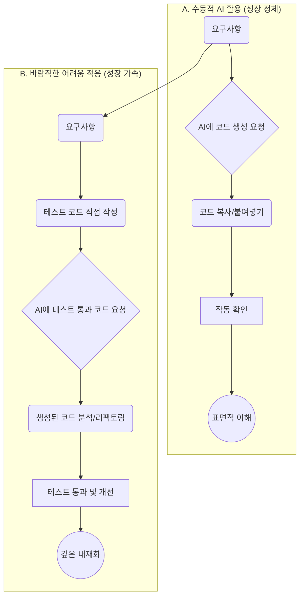

GitHub Copilot, Cursor, Claude와 같은 AI 코딩 도구들은 이제 iOS 및 프론트엔드 개발자에게 필수적인 존재가 되었습니다. 보일러플레이트 코드를 순식간에 생성하고, 복잡한 로직의 초안을 잡아주며, 막혔던 부분의 실마리를 제공합니다. 생산성은 극적으로 향상되었지만, 이 편리함 뒤에는 우리가 간과하기 쉬운 함정이 숨어있습니다. 바로 '성장의 정체'입니다.

우리가 아무런 고민 없이 AI가 생성한 코드를 복사-붙여넣기 할 때, 뇌는 문제 해결 과정에서 경험해야 할 미세한 마찰과 시행착오를 건너뛰게 됩니다. 이는 마치 내비게이션에만 의존해 운전하면 길을 영원히 외우지 못하는 'GPS 효과'와 같습니다. 당장의 목적지에는 빨리 도착하지만, 길에 대한 공간적, 맥락적 이해(mental model)는 형성되지 않습니다. 개발자의 뇌도 마찬가지입니다. 문제 해결의 '근육'을 사용하지 않으면 점차 약해지고, 결국에는 AI 없이는 간단한 문제도 해결하기 어려운 상태에 이를 수 있습니다.

이 문제를 해결할 열쇠는 인지심리학의 '바람직한 어려움(Desirable Difficulties)' 이론에 있습니다. 이는 학습 과정에서 적절한 수준의 어려움과 인지적 노력을 가하는 것이 단기적으로는 비효율적으로 느껴지더라도, 장기적으로는 더 깊은 학습과 기억을 유도한다는 개념입니다. AI 시대의 개발자는 이 '바람직한 어려움'을 의도적으로 설계하여 AI를 단순한 코드 생성기가 아닌, 성장을 위한 스파링 파트너로 활용해야 합니다.

## AI 활용 워크플로우: 성장 정체 vs 성장 가속

AI를 활용하는 두 가지 상반된 워크플로우를 통해 '바람직한 어려움'의 차이를 시각적으로 이해해 봅시다.



A 워크플로우는 즉각적인 결과물을 얻지만, 개발자는 과정에 대한 깊은 고민 없이 '관찰자'로 남습니다. 반면 B 워크플로우는 테스트 코드를 직접 작성하는 '바람직한 어려움'을 추가함으로써, 개발자가 문제의 본질(요구사항, 엣지 케이스)을 먼저 깊이 이해하도록 강제합니다. 그 후 AI의 도움을 받아 구현하더라도, 이미 형성된 탄탄한 맥락 위에서 코드를 분석하고 개선하기 때문에 학습 효과가 극대화됩니다.

## 실무에 적용하는 '바람직한 어려움' 4가지 전략

### 1. 테스트 주도 AI 개발 (Test-Driven AI Development, TD-AID)

가장 강력한 전략입니다. AI에게 코드 생성을 요청하기 전에, 먼저 해당 기능의 요구사항을 명확히 하는 테스트 코드를 직접 작성하는 것입니다.

예를 들어, 프론트엔드 프로젝트에서 ISO 8601 형식의 날짜 문자열을 받아 "방금 전", "5분 전", "3일 전"과 같이 상대 시간으로 변환하는 유틸리티 함수를 만든다고 가정해 봅시다.

**1단계: 테스트 코드 직접 작성 (바람직한 어려움)**

`formatRelativeTime.test.ts` (with Vitest)

```typescript
import { describe, it, expect, vi } from 'vitest';
import { formatRelativeTime } from './formatRelativeTime';

describe('formatRelativeTime', () => {
  // 현재 시간을 고정하여 테스트 일관성 확보
  vi.setSystemTime(new Date('2024-07-15T10:00:00Z'));

  it('should return "방금 전" for less than a minute', () => {
    const input = '2024-07-15T09:59:31Z';
    expect(formatRelativeTime(input)).toBe('방금 전');
  });

  it('should return "5분 전" for 5 minutes ago', () => {
    const input = '2024-07-15T09:55:00Z';
    expect(formatRelativeTime(input)).toBe('5분 전');
  });

  it('should return "1시간 전" for 1 hour ago', () => {
    const input = '2024-07-15T09:00:00Z';
    expect(formatRelativeTime(input)).toBe('1시간 전');
  });

  it('should return "어제" for yesterday', () => {
    const input = '2024-07-14T15:00:00Z';
    expect(formatRelativeTime(input)).toBe('어제');
  });

  it('should handle invalid date string gracefully', () => {
    const input = 'invalid-date';
    expect(formatRelativeTime(input)).toBeNull();
  });

  // 테스트 종료 후 시스템 시간 복원
  vi.useRealTimers();
});
```
이 과정을 통해 우리는 함수의 인터페이스, 다양한 엣지 케이스, 그리고 시간 고정과 같은 테스트 전략까지 스스로 고민하게 됩니다.

**2단계: AI에게 테스트를 통과하는 코드 요청**

이제 이 테스트 코드를 컨텍스트로 제공하며 AI에게 구현을 요청합니다.

> **Prompt:** 아래 Vitest 테스트 코드를 모두 통과하는 TypeScript 함수 `formatRelativeTime`을 작성해 줘. `date-fns`와 같은 외부 라이브러리는 사용하지 마.

**3단계: 생성된 코드 검토, 리팩토링 및 내재화**

AI는 테스트를 통과하는 코드를 생성해 주겠지만, 완벽하지 않을 수 있습니다. 코드를 그대로 사용하지 말고, 직접 검토하며 더 나은 변수명은 없는지, 로직을 더 간결하게 만들 수는 없는지, 주석이 필요한 부분은 없는지 등을 살피며 리팩토링합니다. 이 과정이 바로 지식을 자신의 것으로 만드는 핵심 단계입니다.

### 2. AI-First, Human-Refactor 워크플로우

새로운 SwiftUI 뷰를 만든다고 가정해 봅시다.

1.  **AI에게 초안 요청:** "사용자 프로필 이미지, 이름, 자기소개를 보여주는 간단한 SwiftUI 뷰를 만들어 줘."
2.  **코드 붙여넣기:** Xcode에 코드를 붙여넣고 일단 실행해 봅니다.
3.  **의도적으로 리팩토링 (바람직한 어려움):** 그냥 넘어가지 말고, 의도적으로 개선점을 찾습니다.
    *   "이 `VStack`의 `spacing`을 상수로 관리하는 게 좋겠어."
    *   "이름 텍스트에 적용된 `font`와 `foregroundColor`를 별도의 `ViewModifier`로 추출해서 재사용성을 높여야겠다."
    *   "Preview 코드를 다양한 케이스(이름이 긴 경우, 자기소개가 없는 경우)에 대해 추가해야지."

AI가 만든 뼈대를 가지고 내가 더 나은 구조로 개선하는 과정에서 SwiftUI의 `ViewModifier`나 `Layout`에 대한 이해가 깊어집니다.

### 3. 설명 요구 및 자기화(Elaboration & Self-Explanation)

AI가 복잡한 코드(예: Combine, RxSwift의 연산자 체인)를 생성했을 때, 그냥 넘어가지 마세요.

> **Prompt:** 이 코드의 각 라인이 정확히 어떤 역할을 하는지, 특히 `flatMap`과 `switchToLatest`의 차이점을 중점적으로 설명해 줘.

AI의 설명을 듣고, 그것을 다시 자신의 언어로 PR 설명이나 코드 주석에 요약해서 작성해 봅니다. 이 '자기화' 과정은 학습 내용을 장기 기억으로 전환하는 매우 효과적인 방법입니다.

### 4. 의도적인 '수동 모드' 전환

새로운 라이브러리나 프레임워크(예: SwiftData, Composable Architecture)를 처음 배울 때는 AI의 도움을 잠시 꺼두는 것이 효과적입니다. 공식 문서를 보며 직접 `Hello, World!` 수준의 코드를 작성하며 부딪히는 과정 자체가 개념을 체화하는 데 필수적입니다. 충분히 헤매고 고민한 뒤, 특정 부분에서 막힐 때 AI를 '조언자'로 활용하면 학습 효과가 배가됩니다.

## 성장 경로 비교: AI 시대의 두 개발자

| 활동 | 인지 부하가 낮은 경로 (성장 정체) | 바람직한 어려움 경로 (성장 가속) |
| :--- | :--- | :--- |
| **새로운 기능 구현** | 요구사항을 그대로 AI에 입력하고 코드를 받는다. | 요구사항을 분석해 테스트 코드를 먼저 작성한다. (TD-AID) |
| **버그 수정** | 에러 메시지를 복사해 AI에게 해결책을 묻는다. | 디버거를 사용해 원인을 추적하고, 가설을 세운 뒤 AI와 토론하며 해결한다. |
| **코드 리뷰** | AI에게 "이 코드 리뷰해 줘"라고 요청하고 요약만 본다. | 내가 먼저 코드를 분석하고 개선 의견을 낸 뒤, AI에게 추가적인 관점을 묻는다. |
| **새 기술 학습** | "X 기술로 Y 만드는 법 알려줘"라고 묻고 코드만 받는다. | 공식 문서를 먼저 읽고, 직접 코딩하다 막힐 때 AI에게 질문한다. (의도적 수동 모드) |

## 2026년의 AI 개발 환경: 스파링 파트너로서의 AI

2026년의 AI 개발 도우미는 단순한 코드 생성기를 넘어, '바람직한 어려움'을 능동적으로 제공하는 방향으로 진화할 것입니다.

*   **소크라테스식 튜터 모드:** 개발자가 "이 문제 해결해 줘"라고 하면, "좋은 질문이네요. 이 문제를 해결하기 위해 어떤 데이터 구조가 가장 효율적일까요?" 와 같이 역으로 질문을 던져 사고를 유도합니다.
*   **의도적 힌트 제공:** 정답 코드를 바로 주는 대신, 문제 해결에 필요한 핵심 개념이나 API에 대한 힌트만 제공하여 개발자가 직접 완성하도록 유도합니다.
*   **리팩토링 챌린지:** 개발자가 작성한 코드에 대해 "이 코드는 작동하지만, O(n^2)의 시간 복잡도를 가집니다. O(n log n)으로 개선해 볼 수 있을까요?"와 같은 구체적인 개선 과제를 제시합니다.

이러한 변화에 대비하여 지금부터 의도적으로 AI를 '스파링 파트너'처럼 활용하는 훈련을 시작해야 합니다.

## AI Agent Directive

**Trigger**: AI가 코드를 즉시 생성해주는 방식에 익숙해진 개발자가 디버깅 능력 저하를 느낄 때 / 팀이 AI 생성 코드를 검토 없이 병합하는 패턴이 반복될 때

**Prerequisites**: 없음 (개념적 전략 엔트리)

### Actionable Steps

*코드 리뷰 워크플로우에 통합*:
1. AI에게 코드 생성 요청 전 **테스트 케이스 먼저 작성** (TD-AID)
2. AI 출력을 받으면 직접 읽고 한 줄이라도 수정한 뒤 병합
3. 에러 발생 시 AI에게 묻기 전 **디버거 또는 로그로 원인 1차 추적**

*팀 컨벤션으로 정착 시*:
1. PR 템플릿에 "AI 생성 코드 여부 + 직접 검토 확인" 체크박스 추가
2. 주 1회 "AI 없이 디버깅" 세션 — 특정 버그를 AI 없이 추적

### Anti-patterns

- ❌ AI 출력 그대로 복사-붙여넣기 — 코드를 읽지 않으면 학습 없음
- ❌ 에러 메시지 전체를 AI에 복사해 해결책만 받음 — 원인 이해 없이 패치
- ❌ "AI가 더 잘 아니까" 로 자기 판단 포기 — AI는 컨텍스트를 모름

**적용 범위**: any

---

## 자기 점검

1.  '바람직한 어려움'이 장기적인 학습에 더 효과적인 이유는 무엇인가요?
2.  '테스트 주도 AI 개발(TD-AID)' 방식이 일반적인 AI 코드 생성 요청과 다른 핵심적인 차이점은 무엇인가요?
3.  AI가 생성한 코드를 그냥 사용하지 않고 '리팩토링'하는 과정이 왜 중요한가요?
4.  새로운 기술을 배울 때, 왜 처음부터 AI에 의존하는 것보다 '의도적인 수동 모드'가 더 효과적일 수 있을까요?
5.  이 개념을 동료에게 설명한다면? "AI 코딩 도구를 쓰면 머리가 나빠진다는 말이 있던데, '바람직한 어려움'이라는 개념을 활용하면 오히려 성장의 기회로 만들 수 있어. 예를 들면..." 이라고 어떻게 설명하시겠습니까?

### 실습 과제

최근 1주일 내에 AI의 도움을 받아 해결했던 작은 작업(함수 하나, 컴포넌트 하나 등)을 하나 선택하세요. 이번에는 '테스트 주도 AI 개발(TD-AID)' 전략을 적용하여 처음부터 다시 해보세요.
1. 해당 기능에 대한 테스트 코드를 먼저 작성합니다. (XCTest, Vitest, Jest 등)
2. AI에게 이 테스트를 통과하는 코드를 요청합니다.
3. 생성된 코드를 자신의 스타일과 프로젝트 컨벤션에 맞게 리팩토링합니다.
4. 이전 방식과 비교했을 때, 기능에 대한 이해도와 과정의 만족도에 어떤 차이가 있었는지 회고 노트를 작성해 보세요.