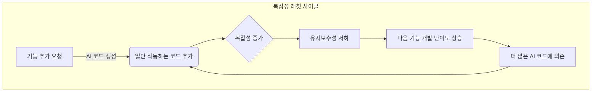

> **출처 검증 노트:** 긱뉴스 자동 큐레이션 (#137, 2026-05-14) 초안 기반. 원본 URL 미캡처. "복잡성 래칫(Complexity Ratchet)"은 진화생물학 유래 개념으로 AI 코딩 맥락에서도 실제로 관찰되는 현상. 90% 커버리지 기준의 구체적 출처는 확인되지 않았으나, 테스트 커버리지를 방어선으로 삼는 접근 자체는 업계에서 폭넓게 지지받는 관행입니다.

> **본인 메모:** moneyflow처럼 AI 생성 코드 비중이 높은 프로젝트일수록 이 함정이 빠르게 온다. `npm test`로 회귀 테스트 유지가 이 위키 자체에도 적용 중. [[agent-execution-traces-runtime-contract]], [[addy-osmani-agent-harness-engineering]]

AI 코드 생성기는 눈부신 생산성 향상을 약속하며 개발 현장에 빠르게 스며들고 있습니다. 하지만 이 편리함 뒤에는 '복잡성 래칫(Complexity Ratchet)'이라는 함정이 숨어있습니다. 래칫이 한쪽으로만 돌아가듯, AI가 생성한 코드는 프로젝트의 복잡성을 되돌리기 어려운 방향으로 계속 증가시킵니다. AI는 종종 미묘한 버그나 숨겨진 가정을 포함한 코드를 '그럴듯하게' 만들어내기 때문에, 한번 시스템에 통합되면 인간 개발자가 그 의도를 파악하고 수정하기 매우 어렵습니다. 이런 코드가 누적되면 코드베이스는 점차 이해하고 유지보수하기 힘든 블랙박스로 변해갑니다. 결국 개발 속도는 다시 느려지고, 시스템은 작은 변화에도 쉽게 무너지는 취약한 구조가 됩니다. 이 문제를 해결하기 위한 방어선이 바로 '90% 테스트 커버리지'라는, 과거에는 과하다고 여겨졌던 기준입니다.

## 복잡성 래칫: AI가 코드베이스에 거는 '되돌릴 수 없는' 족쇄

'복잡성 래칫'은 진화생물학에서 유래한 개념으로, 시스템이 한번 복잡한 상태로 진화하면 다시 단순한 상태로 돌아가기 어려운 현상을 의미합니다. AI 코딩 시대에 이 현상은 더욱 가속화됩니다. 개발자는 AI에게 특정 기능을 요청하고, AI는 즉시 작동하는 것처럼 보이는 코드를 생성합니다. 이 코드는 당장의 문제를 해결하지만, 시스템 전체의 설계 원칙이나 장기적인 유지보수성을 고려하지 않았을 가능성이 높습니다.

문제는 이 과정이 반복되면서 발생합니다. AI가 생성한 코드 위에 또 다른 AI 생성 코드가 덧붙여지면서, 코드베이스는 누구도 전체적인 구조와 의도를 파악할 수 없는 상태로 빠져듭니다. 기술 부채가 복리 이자처럼 쌓이는 것과 같습니다.

이 사이클을 끊기 위해서는 AI가 생성한 모든 코드 조각에 대해 "이 코드가 정말로 우리가 의도한 대로, 모든 엣지 케이스에서 동작하는가?"를 집요하게 검증하는 메커니즘이 필요합니다. 이것이 바로 높은 수준의 테스트 커버리지가 요구되는 이유입니다.

## 90% 테스트 커버리지: '좋은 습관'에서 '최소 방어선'으로

전통적인 소프트웨어 개발에서 80~90%의 테스트 커버리지는 '바람직한 목표' 정도로 여겨졌습니다. 모든 엣지 케이스를 커버하려는 노력보다 핵심 비즈니스 로직을 검증하는 데 집중하는 것이 효율적이라고 봤기 때문입니다. 하지만 AI가 생성한 코드를 다룰 때, 이 관점은 완전히 바뀌어야 합니다.

AI 생성 코드는 인간 개발자가 쉽게 저지르지 않는 종류의 실수를 포함할 수 있습니다. 예를 들어, 특정 라이브러리의 매우 드문 사용법을 활용하거나, 겉보기에는 완벽하지만 특정 입력값에서 치명적인 성능 저하를 일으키는 코드를 만들 수 있습니다. 따라서 "핵심 로직"과 "지엽적인 부분"의 구분이 무의미해집니다. AI가 작성한 모든 줄은 잠재적인 버그의 온상이 될 수 있습니다.

이러한 불확실성 속에서 90% 테스트 커버리지는 더 이상 선택이 아닌 필수 방어선 역할을 합니다. 이는 단순히 코드의 실행 여부를 확인하는 것을 넘어, 개발자가 AI 생성 코드를 깊이 이해하고 그 행동을 명시적으로 검증하도록 강제하는 '규율'로 작용합니다.

### AI 시대의 테스트 전략 비교

| 구분 | 전통적 TDD (Test-Driven Development) | AI 시대의 TDC (Test-Driven Comprehension) |
| :--- | :--- | :--- |
| **코드 작성 주체** | 개발자 | AI 에이전트 |
| **테스트 작성 주체** | 개발자 | AI 에이전트 + 개발자 리뷰/보강 |
| **테스트의 주 목적**| 기능의 정확성 **검증** | 코드의 의도 **이해** 및 행동 **보증** |
| **개발자의 핵심 역할**| 비즈니스 로직을 코드로 번역 | AI 생성 코드와 테스트의 품질을 **감사(Audit)** |
| **주요 리스크** | 불완전한 요구사항 분석 | 그럴듯하지만 잘못된 코드(Subtle Bugs) |
| **커버리지 목표** | 80% (핵심 경로 위주) | 90%+ (신뢰할 수 없는 모든 경로) |

## Swift 프로젝트를 위한 90% 커버리지 달성 전략

iOS 시니어 개발자에게 이 전략은 기존의 개발 워크플로우를 재정의하는 것을 의미합니다. AI를 단순히 코드를 대신 짜주는 도구가 아니라, 테스트와 구현을 함께 제공하는 '페어 프로그래밍 파트너'로 활용해야 합니다.

### 하네스를 이용한 테스트 동시 생성

가장 효과적인 방법은 AI 에이전트를 제어하는 '하네스' 레벨에서 테스트 코드 생성을 의무화하는 것입니다. 프롬프트에 기능 구현뿐만 아니라, 해당 기능에 대한 XCTest 케이스를 반드시 포함하도록 요구해야 합니다.

**예시: AI 에이전트에게 보낼 프롬프트 구조**

> **역할**: Swift 개발 에이전트
> **작업**: 주어진 `Event` 객체 배열에서 특정 태그를 포함하고, 지정된 기간 내에 있는 이벤트를 필터링하여 날짜별로 그룹화하는 함수를 작성하세요.
>
> **요구사항**:
> 1.  `filterAndGroupEvents(events: [Event], tag: String, dateRange: ClosedRange<Date>) -> [Date: [Event]]` 시그니처를 준수하세요.
> 2.  함수 구현부와 함께, 최소 5개 이상의 엣지 케이스를 포함하는 `XCTest` 케이스를 작성하세요.
>     -   엣지 케이스 예시: 빈 이벤트 배열, 일치하는 태그가 없는 경우, 모든 이벤트가 기간에 포함되는 경우, 기간에 포함되는 이벤트가 없는 경우, 날짜가 시간대 경계에 걸쳐있는 경우 등
> 3.  작성된 코드는 Swift 5.9 이상, `async/await`를 사용하지 않는 순수 함수여야 합니다.
> 4.  최종 결과물은 production 코드 파일과 test 코드 파일을 명확히 구분하여 Markdown 형식으로 제출하세요.

이렇게 하면 AI는 기능 코드와 함께 테스트 코드를 생성하게 되고, 개발자의 역할은 '작성'에서 '검증'으로 전환됩니다. 이때, 단순히 커버리지 숫자만 높이는 무의미한 테스트가 생성되지 않도록 주의해야 합니다. AI가 생성한 테스트가 정말로 의미 있는 엣지 케이스를 다루는지, 단언문(assertion)이 충분히 강력한지 리뷰하는 것이 시니어 개발자의 새로운 핵심 역량이 됩니다.

### `aidy-ios` 프로젝트에 적용 시나리오

`aidy-ios` 프로젝트의 CI/CD 파이프라인에 이 전략을 적용한다면 다음과 같은 구체적인 변화가 생길 수 있습니다.

1.  **PR(Pull Request) 게이트 강화**: GitHub Actions 워크플로우에 'Test Coverage Gate'를 추가합니다. Fastlane의 `scan`과 `xcov`를 연동하여, 새로운 코드가 추가된 PR에서 전체 테스트 커버리지가 90% 미만이거나 이전보다 감소할 경우 머지를 자동으로 차단합니다.
2.  **/aidy-gen-feature 커맨드 업데이트**: `aidy` 시스템의 슬래시 커맨드를 수정하여, 피처 코드 생성 시 반드시 `XCTestCase`를 포함한 결과물을 생성하도록 프롬프트를 고정합니다. 테스트 코드가 누락된 AI 응답은 실패로 간주하고 재시도 로직을 태웁니다.
3.  **Mutation Testing 도입 검토**: 단순 커버리지의 함정을 피하기 위해 Stryker-mutator(JavaScript/TypeScript용)와 같은 도구의 Swift 버전을 찾거나(예: `muter`) 도입을 검토합니다. 이는 테스트가 단순히 코드를 실행하는 것을 넘어, 실제로 버그를 잡을 수 있는지 검증하는 강력한 수단이 됩니다.

## 트레이드오프와 한계: 90% 커버리지가 만병통치약이 아닌 이유

물론 이 전략이 모든 상황에 적합한 것은 아닙니다.

*   **초기 개발 속도 저하**: AI가 생성한 코드와 테스트를 리뷰하고 보강하는 데 드는 시간 때문에 단기적인 개발 속도는 오히려 느려질 수 있습니다. 이는 장기적인 유지보수성과 안정성을 위한 의도적인 트레이드오프입니다.
*   **커버리지의 함정**: 90%라는 숫자에만 집착하면, `XCTAssertTrue(true)`와 같이 의미 없는 테스트를 양산하여 실제 코드 품질은 높이지 못하고 개발자에게 거짓 안정감만 줄 수 있습니다. 중요한 것은 커버리지가 아니라 테스트의 '질'입니다.
*   **프로토타이핑 단계에는 부적합**: 아이디어를 빠르게 검증하고 버리는 것이 목적인 프로토타이핑 단계에서 90% 커버리지를 강제하는 것은 혁신을 저해하는 족쇄가 될 수 있습니다. 이 전략은 프로덕션 코드베이스에 적용해야 합니다.

결론적으로, AI 코딩 시대에 90% 테스트 커버리지는 복잡성 래칫에 맞서 코드베이스의 건강성을 유지하기 위한 핵심적인 엔지니어링 규율입니다. 이는 개발자의 역할을 코드 작성자에서 시스템의 신뢰성을 보증하는 감사자로 격상시키며, AI와의 협업을 통해 더 높은 수준의 소프트웨어 품질을 달성하는 길을 열어줄 것입니다.

## 자기 점검

*   AI 생성 코드가 전통적인 코드보다 '복잡성 래칫' 현상을 더 심화시키는 근본적인 이유는 무엇인가요?
*   90% 테스트 커버리지 전략에서 시니어 개발자의 역할은 코드 '작성'에서 어떻게 '감사'로 바뀌게 되나요?
*   단순히 테스트 커버리지 '숫자'만 높이는 것의 가장 큰 위험은 무엇이며, 이를 방지하기 위한 추가적인 검증 방법은 무엇이 있을까요? (예: Mutation Testing)
*   현재 진행 중인 iOS 프로젝트에 90% 테스트 커버리지를 CI 게이트로 도입한다고 상상해보세요. 팀 동료들에게 이 정책의 필요성을 어떻게 설득하시겠습니까? 예상되는 반발과 그에 대한 대응 논리는 무엇일까요?