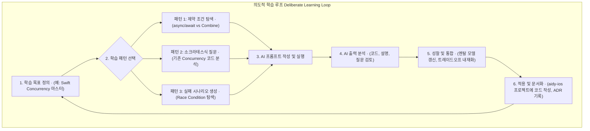

> **출처 검증 노트:** 긱뉴스 자동 큐레이션 (#141, 2026-05-16) 초안 기반. 원본 URL 미캡처. "Learning Opportunities" 프로젝트(Claude Code·Codex 기반 의도적 학습 지원)의 공개 정보를 토대로 작성. 3가지 패턴(제약 기반 탐색 / 소크라테스식 질문 / 실패 시나리오 생성)은 특정 도구에 종속되지 않는 일반 학습 방법론으로, 직접 실험해 검증 가능합니다.

> **본인 메모:** Claude Code로 당장 실천 가능. "X를 짜줘" 대신 "X를 두 가지 다른 방식으로 짜줘, 트레이드오프 비교해줘"가 패턴 1의 핵심. [[addy-osmani-agent-harness-engineering]], [[agent-execution-traces-runtime-contract]]

AI 코딩 어시스턴트는 반복적인 코드 작성을 줄여 개발 속도를 높이지만, 동시에 개발자의 근본적인 문제 해결 능력이나 시스템 설계 역량을 무뎌지게 할 수 있다는 우려도 제기됩니다. 단순히 '정답' 코드를 빠르게 얻는 데만 집중하면, 개발자는 AI가 내놓은 결과물의 작동 원리나 대안적 접근법, 잠재적 실패 가능성에 대해 깊이 사유할 기회를 잃게 됩니다. 이는 시니어 개발자가 새로운 기술 스택(예: iOS 전문가가 AI 엔지니어링을 학습하는 경우)으로 전환할 때 특히 위험한 함정이 될 수 있습니다.

이 글은 AI 코딩 어시스턴트를 단순한 '코드 생성기'가 아닌 '의도적 학습 파트너(Deliberate Practice Partner)'로 활용하는 세 가지 구체적인 패턴을 제시합니다. 목표는 AI의 도움을 받아 더 빨리 '초보자'를 탈출하되, AI 없이는 아무것도 못 하는 '의존적 개발자'가 되지 않고 주도적으로 역량을 강화하는 것입니다. 이러한 접근 방식은 개발자의 역할을 코드 작성자에서 AI가 생성한 결과물을 검증하고 방향을 제시하는 아키텍트로 전환시킵니다.

## '정답'을 넘어 '과정'을 학습하는 패턴들

핵심은 AI에게 최종 결과물을 요구하는 대신, 의사결정 과정을 드러내도록 유도하는 것입니다. 이는 개발자의 멘탈 모델을 정교화하고 특정 기술 선택의 트레이드오프를 체화하는 데 도움을 줍니다.

### 패턴 1: 제약 조건 기반 탐색 (Constraint-Driven Exploration)

가장 일반적인 실수는 "X를 하는 Swift 코드를 짜줘" 와 같이 개방형 질문을 던지는 것입니다. 이는 AI가 가장 확률 높은 '평범한' 해답 하나만 내놓게 만듭니다. 대신, 의도적으로 여러 제약 조건을 부여하여 다양한 해결책을 탐색하도록 강제해야 합니다.

예를 들어, 새로운 네트워크 라이브러리를 학습할 때 다음과 같이 질문할 수 있습니다.

> **Prompt 예시:**
> "iOS 앱에서 사용자 프로필을 가져오는 네트워크 요청을 세 가지 다른 방식으로 구현해 줘.
> 1.  Swift의 네이티브 `async/await`와 `URLSession`을 사용.
> 2.  `Combine` 프레임워크를 사용.
> 3.  오픈소스 라이브러리 `Alamofire`를 사용.
>
> 각 구현에 대해 다음을 비교 분석해 줘:
> -   코드의 간결성과 가독성
> -   에러 처리 방식의 차이점
> -   의존성 관리의 복잡성
> -   예상되는 성능상의 미묘한 차이"

이 패턴은 AI를 단순 코드 생성기에서 순식간에 기술 비교 분석 보고서를 작성하는 아키텍트 보조로 격상시킵니다. 개발자는 생성된 코드를 보며 각 접근법의 장단점을 직접 비교하고, 자신의 프로젝트 컨텍스트에 가장 적합한 기술을 선택하는 근거를 마련할 수 있습니다.

**`tarosaju` 프로젝트 적용:** `tarosaju` 프로젝트에서 외부 금융 API 연동 모듈을 개발할 때, 이 패턴을 사용해 `URLSession` 기반의 순수 구현과 `Get` 라이브러리를 사용한 구현의 장단점을 비교하는 ADR(Architecture Decision Record)을 작성하는 데 활용할 수 있습니다. 이는 단순히 빠른 구현을 넘어, 장기적인 유지보수성을 고려한 기술 선택의 근거를 남기는 효과적인 방법입니다.

### 패턴 2: 소크라테스식 질문 생성 (Socratic Questioning)

소크라테스식 질문법은 직접적인 답을 주는 대신, 질문을 통해 상대방이 스스로 답을 찾도록 유도하는 방식입니다. 이 기법을 AI에 적용하면 매우 강력한 학습 도구가 탄생합니다. 복잡하거나 스스로 작성해서 익숙하다고 생각하는 코드를 AI에게 제시하고, 그 코드에 대해 학습자가 이해해야 할 핵심을 질문하도록 만드는 것입니다.

> **Prompt 예시:**
> "너는 나를 가르치는 시니어 iOS 개발자 멘토야. 아래 Swift 코드는 내가 작성한 `CoreData` 래퍼(wrapper) 클래스야. 이 코드를 분석하고, 주니어 개발자인 내가 이 코드의 핵심 설계 원칙, 잠재적인 경쟁 상태(race condition) 문제, 그리고 메모리 관리의 중요성을 이해하도록 돕는 5개의 소크라테스식 질문을 해줘. 정답은 절대 직접 알려주지 마."

이 프롬프트를 통해 AI는 다음과 같은 질문을 생성할 수 있습니다.
1.  `NSManagedObjectContext`를 왜 `private` 큐에서 초기화했으며, 만약 `main` 큐에서 초기화했다면 어떤 문제가 발생할 수 있을까요?
2.  `saveContext()` 메서드에 `perform`과 `performAndWait` 중 무엇을 사용했나요? 그 선택이 UI 반응성에 어떤 영향을 미칠 수 있을지 설명해 보세요.
3.  만약 여러 스레드에서 동시에 이 래퍼의 인스턴스에 접근한다면 어떤 일이 벌어질까요? 이를 방지하기 위한 어떤 장치가 코드에 마련되어 있나요?
4.  대량의 데이터를 한 번에 가져올 때 발생할 수 있는 메모리 문제는 무엇이며, `fetchBatchSize` 속성은 이 문제와 어떤 관련이 있을까요?
5.  이 클래스를 싱글턴(Singleton)으로 설계한 이유는 무엇이며, 만약 싱글턴이 아닐 경우 어떤 단점이 있을지 생각해 보세요.

이러한 질문들은 개발자가 자신의 코드에 대해 더 깊이 사유하고, 당연하게 여겼던 설계 결정의 이유를 명확하게 언어화하도록 강제합니다. 이 과정은 기술 면접을 준비하거나, 동료에게 코드를 설명하고 문서화하는 능력을 기르는 데 직접적인 도움이 됩니다.

### 패턴 3: 대안적 실패 시나리오 생성 (Alternative Failure Scenario Generation)

시니어 개발자의 역량은 단순히 코드를 잘 작성하는 것을 넘어, 코드가 실패할 수 있는 미묘하고 예상치 못한 방법을 예측하고 방어하는 데서 드러납니다. AI는 방대한 학습 데이터를 기반으로 인간이 놓치기 쉬운 엣지 케이스나 실패 시나리오를 제안하는 데 탁월한 능력을 보일 수 있습니다.

> **Prompt 예시:**
> "다음 Swift 코드는 유효한 이미지 URL을 받아 `UIImage`를 비동기적으로 로드하는 함수야. 현재 모든 유닛 테스트를 통과했어. 이 코드가 프로덕션 환경에서 실패할 수 있는 3가지 현실적인 시나리오를 제안해 줘. 각 시나리오에 대해 근본 원인과 그것을 방지하기 위한 코드 개선안을 제시해 줘. (예: 느린 네트워크, 잘못된 데이터 형식, 캐시 문제 등)"

이 패턴은 개발자의 '방어적 코딩' 능력을 강화합니다. AI는 다음과 같은 시나리오를 제시할 수 있습니다.
*   **시나리오 1 (경쟁 상태):** 같은 URL에 대해 짧은 시간 안에 여러 번 요청이 발생하여 동일한 이미지를 중복으로 다운로드하고 캐시에 여러 번 쓰는 문제. (해결책: 진행 중인 다운로드 작업을 추적하는 딕셔너리 구현)
*   **시나리오 2 (메모리 압박):** 매우 큰 고해상도 이미지를 여러 개 로드하여 앱의 메모리 사용량이 급증하고, OS에 의해 앱이 강제 종료되는 문제. (해결책: 다운샘플링(Downsampling)을 통해 이미지 크기를 디코딩 전에 줄이는 전략)
*   **시나리오 3 (잘못된 서버 응답):** URL은 유효하지만 서버가 `Content-Type` 헤더를 `image/jpeg`가 아닌 `text/html`로 잘못 보내는 경우, 데이터는 수신되지만 이미지 디코딩에 실패하는 문제. (해결책: 응답 헤더를 검증하는 로직 추가)

이러한 시나리오는 일반적인 유닛 테스트로는 발견하기 어려운 문제들로, 프로덕션 환경의 안정성을 높이는 데 결정적인 역할을 합니다.

## 학습 패턴 선택 가이드 및 워크플로우

각 패턴은 뚜렷한 목적과 트레이드오프를 가집니다. 상황에 맞는 패턴을 선택하는 것이 중요합니다.

| 패턴 | 주요 목표 | 적합한 상황 | 주의할 점 (Trade-off) |
| :--- | :--- | :--- | :--- |
| **제약 조건 기반 탐색** | 기술 선택의 근거 및 장단점 파악 | 새로운 라이브러리 도입, 아키텍처 결정 시 | 토큰 사용량이 많고 시간이 더 오래 걸림. 결과물의 깊이는 프롬프트의 구체성에 따라 크게 달라짐. |
| **소크라테스식 질문 생성** | 기존 지식의 명료화 및 문서화 | 코드 리뷰, 주니어 멘토링 준비, 기술 면접 대비 | AI가 핵심을 벗어난 질문을 할 수 있음. 인간의 비판적 사고를 통한 질문 선별이 필수적. |
| **대안적 실패 시나리오 생성** | 프로덕션 안정성 및 예외 처리 능력 강화 | 핵심 로직 배포 전, 테스트 케이스 보강 시 | AI가 비현실적이거나 과장된 실패 시나리오를 생성할 수 있음. 실제 발생 가능성을 판단해야 함. |

이러한 패턴들을 실제 개발 과정에 통합한 워크플로우는 다음과 같이 시각화할 수 있습니다.

## 자기 점검

*   "제약 조건 기반 탐색" 패턴이 일반적인 "코드 생성" 요청과 근본적으로 다른 점은 무엇이며, 이 차이가 개발자의 역량에 어떤 영향을 미친다고 생각하나요?
*   "소크라테스식 질문 생성" 패턴을 사용할 때, AI가 생성한 질문의 질을 어떻게 평가하고, 학습 효과를 극대화하기 위해 어떤 후속 조치를 취할 수 있을까요?
*   이 글에서 제안한 학습 패턴들은 즉각적인 생산성 향상보다 장기적인 역량 강화를 목표로 합니다. 당신의 팀이 단기적인 프로젝트 마감 압박을 받을 때, 이러한 학습 활동을 어떻게 균형 맞출 수 있을까요?
*   현재 작업 중인 iOS 프로젝트(또는 `aidy-ios` 프로젝트)의 특정 코드베이스에 "대안적 실패 시나리오 생성" 패턴을 적용한다면, 어떤 모듈을 대상으로 삼고 어떤 종류의 숨겨진 버그를 찾고 싶으신가요?