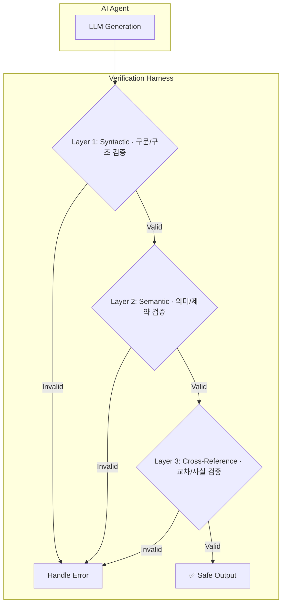

## 유창함의 함정: 전문가는 왜 더 위험한가

Large Language Model(LLM)은 놀라울 정도로 유창한 텍스트를 생성하지만, 그 기반은 통계적 패턴 예측이지 진정한 이해나 추론이 아니다. 이로 인해 모델은 사실이 아니거나 논리적으로 미완성된 내용을 매우 그럴듯하고 확신에 찬 어조로 제시하는 '유창한 확신' 현상을 보인다. 이 문제는 AI에 익숙하지 않은 사용자보다 오히려 해당 분야의 전문가에게 더 위험하게 작용할 수 있다. 전문가는 LLM이 생성한 결과물이 자신의 지식 체계와 유사해 보일 때, 미묘한 오류를 간과하고 무비판적으로 수용할 가능성이 높아지기 때문이다.

이는 마치 숙련된 iOS 개발자가 AI가 생성한 Swift 코드를 검토하는 상황과 같다. 코드는 최신 Swift 관용구를 따르며 완벽하게 컴파일될 것처럼 보인다. 하지만 그 안에는 특정 엣지 케이스에서만 발생하는 치명적인 동시성(concurrency) 버그나, 프로젝트의 전체 아키텍처와 미묘하게 충돌하는 설계 결함이 숨어있을 수 있다. 겉보기의 유창함이 전문가의 비판적 사고를 무장 해제시키는 것이다.

따라서 AI 엔지니어링의 핵심 과제는 LLM의 출력을 맹신하지 않고, 그 '유창한 확신'이 실제 '완성된 사고'에 기반하는지를 체계적으로 검증하는 방어벽, 즉 '하네스(Harness)'를 구축하는 것이다. 이는 단순히 출력이 특정 형식을 따르는지 확인하는 것을 넘어, 내용의 깊이와 정확성까지 파고드는 다층적 접근을 요구한다.

## 방어 전략: 다층 검증 하네스 (Multi-Layer Verification Harness)

LLM의 미완성된 사고에 대응하기 위한 효과적인 전략은 출력을 여러 단계의 필터를 통과시키는 '다층 검증 하네스'를 설계하는 것이다. 각 계층은 서로 다른 종류의 오류를 걸러내도록 전문화되어, 단일 검증 방식으로는 놓치기 쉬운 문제들을 체계적으로 방어한다.



### 1계층: 구문 및 구조 검증 (Syntactic & Structural Validation)

가장 기본적인 방어선은 LLM의 출력이 우리가 기대하는 데이터 구조를 따르는지 확인하는 것이다. 예를 들어, JSON 출력을 요청했다면 해당 문자열이 유효한 JSON인지 파싱하는 단계다.

Swift 환경에서는 `Codable` 프로토콜을 활용하는 것이 대표적이다. LLM에게 특정 `struct`나 `class`에 매핑될 수 있는 JSON 스키마를 명확히 알려주고, 응답을 받았을 때 `JSONDecoder`로 디코딩을 시도하는 것이다.

```swift
// LLM에게 기대하는 출력 구조 정의
struct UserProfile: Codable {
    let name: String
    let age: Int
    let interests: [String]
}

func validateSyntactic(data: Data) -> UserProfile? {
    let decoder = JSONDecoder()
    do {
        // 1. 디코딩을 시도하여 구조적 유효성 검증
        let profile = try decoder.decode(UserProfile.self, from: data)
        return profile
    } catch {
        // 디코딩 실패 시, 구조가 잘못되었음을 의미
        print("Syntactic validation failed: \(error.localizedDescription)")
        return nil
    }
}
```
이 계층은 LLM이 지시를 완전히 무시하고 비정형 텍스트를 쏟아내거나, JSON 구문에 사소한 오류(예: 누락된 쉼표)를 만드는 경우를 효과적으로 막아준다.

### 2계층: 의미 및 제약 검증 (Semantic & Constraint Validation)

구조적으로는 유효하지만 내용이 말이 안 되는 경우를 걸러내는 단계다. 이는 애플리케이션의 비즈니스 로직이나 도메인 지식에 깊이 의존한다.

예를 들어, 앞서 정의한 `UserProfile`에서 `age` 필드가 음수이거나, `interests` 배열이 비어있으면 안 된다는 제약 조건이 있다고 가정해보자. 1계층의 `Codable`만으로는 이를 막을 수 없다.

```swift
// 1계층 검증을 통과한 객체를 대상으로 의미 검증
func validateSemantic(profile: UserProfile) -> Bool {
    // 2. 도메인 제약 조건 검증
    guard profile.age > 0 && profile.age < 150 else {
        print("Semantic validation failed: Invalid age \(profile.age)")
        return false
    }
    
    guard !profile.interests.isEmpty else {
        print("Semantic validation failed: Interests cannot be empty.")
        return false
    }
    
    // ... 기타 비즈니스 로직 검증
    
    return true
}
```
AI가 코드를 생성하는 `aidy-ios` 프로젝트 시나리오에서는 이 계층의 역할이 더욱 중요해진다. 생성된 Swift 코드가 프로젝트의 최소 지원 iOS 버전에 없는 API를 사용하거나, 사내 코딩 컨벤션(예: `force unwrap` 금지)을 위반하는지 정적 분석(Static Analysis)을 통해 검증할 수 있다.

### 3계층: 교차 및 사실 검증 (Cross-Reference & Fact Validation)

가장 복잡하고 비용이 많이 들지만, '유창한 거짓말'을 탐지하는 데 가장 효과적인 계층이다. 이 단계에서는 LLM의 출력을 외부의 신뢰할 수 있는 데이터 소스나 다른 모델과 비교하여 사실 여부를 확인한다.

'LLM-as-Judge' 패턴이 대표적인 예시다. 이는 응답을 생성한 모델(예: Claude 3.5 Sonnet)과 다른, 더 작고 빠른 모델(예: Haiku)이나 아예 다른 회사의 모델을 사용하여 원래 응답의 타당성을 평가하도록 요청하는 방식이다.

```python
# Python 예시: 다른 모델을 이용한 교차 검증
import anthropic

client = anthropic.Anthropic()

def cross_reference_validation(original_prompt: str, original_response: str) -> bool:
    # 3. 검증자(Judge) LLM에게 질문
    judge_prompt = f"""
    Original Prompt: {original_prompt}
    Generated Response: {original_response}

    Is the generated response a factually accurate and logical answer to the original prompt? 
    Analyze step-by-step and answer with only 'true' or 'false'.
    """
    
    try:
        response = client.messages.create(
            model="claude-3-haiku-20240307", # 더 작고 빠른 모델 사용
            max_tokens=10,
            messages=[{"role": "user", "content": judge_prompt}]
        ).content[0].text.lower()

        return "true" in response
    except Exception as e:
        print(f"Cross-reference validation failed: {e}")
        return False
```

이 방식은 단순히 '참/거짓'을 넘어, 여러 개의 응답을 생성하고 그중 다수가 동의하는 내용을 채택하는 '합의 투표(Consensus Voting)' 방식으로 확장될 수 있다.

## 검증 계층별 트레이드오프

모든 계층을 항상 적용하는 것이 정답은 아니다. 각 계층은 신뢰도를 높이는 대신 비용과 지연 시간이라는 명확한 트레이드오프를 가진다.

| 검증 계층 | 목표 | Swift 구현 예시 | 비용 / 복잡성 | 적용 대상 |
| :--- | :--- | :--- | :--- | :--- |
| **1. 구문 (Syntactic)** | 출력이 정해진 형식을 따르는가? | `JSONDecoder().decode(...)` | 낮음 | 구조화된 데이터가 필요한 모든 LLM 호출 |
| **2. 의미 (Semantic)** | 데이터가 도메인 규칙에 맞는가? | `guard user.age > 0` 등 커스텀 로직 | 중간 | 비즈니스 로직, 코드 생성 등 정확성이 중요한 작업 |
| **3. 교차 (Cross-Reference)** | 내용이 사실에 부합하는가? | 다른 LLM API 호출로 응답 검증 | 높음 | 금융 분석, 법률 자문, 의료 정보 등 사실관계가 매우 중요한 작업 |

실시간 채팅과 같이 빠른 응답이 중요한 기능에는 1계층 검증만 적용하고, 비동기적으로 실행되는 리포트 생성이나 코드 리팩토링 에이전트에는 3계층까지 모두 적용하는 등 상황에 맞는 선택이 필요하다.

## 자기 점검

*   LLM의 '유창한 확신'이 초보자보다 전문가에게 더 위험할 수 있는 이유는 무엇인가?
*   '구문적 검증'과 '의미론적 검증'의 핵심적인 차이는 무엇이며, Swift 코드 생성 시나리오에서 각각의 예시는 무엇인가?
*   '교차 검증(LLM-as-Judge)' 패턴을 적용할 때 발생하는 주요 트레이드오프(비용, 지연 시간)는 무엇이며, 어떤 상황에서 이 비용을 감수할 가치가 있는가?
*   현재 진행 중인 iOS 프로젝트에서 LLM이 생성한 코드를 검증 없이 사용할 경우 발생할 수 있는 가장 위험한 시나리오는 무엇이며, 이를 방지하기 위해 어떤 최소한의 '의미론적 검증' 계층을 추가할 수 있을까?