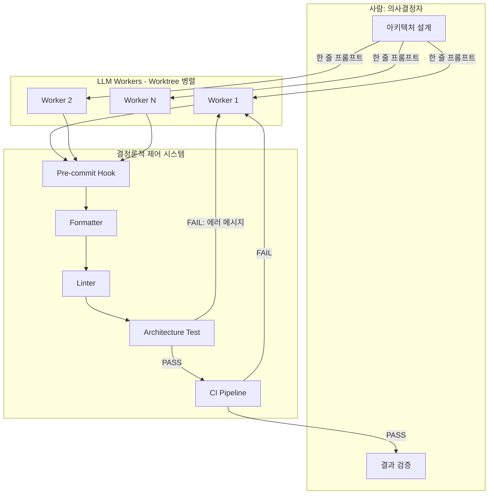
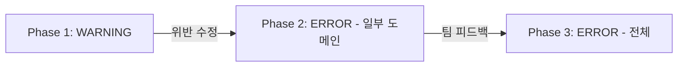

## 왜 지금 이 주제인가

우리 프로젝트(ai-study)는 이미 [Compound Engineering](/wiki/harness-engineering/compound-engineering-philosophy)과 [Architect-Worker 모델](/wiki/harness-engineering/architect-flow-map-via-aidy-architect)을 운용 중이다. pre-commit 빌드 체크, `/compound` 플라이휠, `.claude/hooks/no-company-names.sh` 같은 행동 가드까지 돌리고 있다.

하지만 채널톡 Perry의 2부작을 읽으면서 **우리가 아직 안 당긴 레버 3개**가 선명하게 보였다:

1. **아키텍처 테스트** — 우리는 `npm run build` 통과 여부만 보지, "이 컴포넌트가 허용된 의존성만 import하는가"를 코드로 강제하지 않는다.
2. **점진적 enforcement** — WARNING → ERROR 전환 전략 없이, 규칙은 "있거나 없거나" 이분법이다.
3. **구조 정리 → 테스트 강제 → AI 자율성** 순서 — 우리는 구조가 이미 정리돼 있지만, 그 구조를 "테스트로 잠그는" 단계가 빠져있다.

## 핵심 개념

### "AI의 비결은 AI가 아니라 시스템이다"

Perry는 6개월간 코드 0줄을 직접 타이핑하면서 97만 줄을 수정하고 560+ PR을 머지했다. 핵심은 도구가 아니라 **LLM이 실수해도 시스템이 잡아주는 구조**를 먼저 만든 것이다.

### CLAUDE.md의 한계 (데이터 기반)

| 지표 | 결과 |
|------|------|
| SWE-bench Lite | -0.5% |
| AgentBench | -2% |
| 추론 비용 | +20~23% ↑ |
| 문서 없는 레포 | +2.7% (유일한 개선) |

자연어 규칙의 3대 실패 원인:
1. **모호성** — "가급적"인지 "절대"인지 불명확
2. **위치 효과** — 긴 컨텍스트 후반부 규칙 무시
3. **충돌 해결 불가** — 규칙끼리 모순되면 LLM이 임의 결정

### 제어 우선순위 피라미드

Perry가 제시한 효과 순서:

| 순위 | 메커니즘 | 효과 | 비용 |
|------|----------|------|------|
| 1 | 아키텍처 테스트 + 타입 체크 + 린터 | 위반 100% 감지 | 0 (자동) |
| 2 | 예측 가능한 코드 구조 (DDD/대칭성) | AI 패턴 학습 가능 | 1회 리팩토링 |
| 3 | CLAUDE.md / 컨텍스트 파일 (최후 수단) | -0.5% ~ +4% | +20~23% 토큰 |

### AI 자율 수정 루프 (핵심 메커니즘)

아키텍처 테스트의 진짜 가치는 **피드백 루프**를 만드는 것이다:

```
AI가 코드 작성 → 테스트 실행 → 실패 에러 메시지 → AI가 해석 → 자동 수정 → 재실행
```

CLAUDE.md는 위반해도 **아무 피드백이 없다**. 그래서 "부탁"이다. 테스트는 실패하면 에러 메시지가 나오고, AI는 그걸 읽고 고친다. 그래서 "강제"다.

### 병렬 실행: 컨텍스트 스위칭 비용 = 0

사람이 10개를 동시에 못 하는 이유는 **맥락이 머리에 있기 때문**. LLM은 각 세션마다 컨텍스트 윈도우에 맥락을 독립 보유하므로, Git worktree 물리적 분리 + 결정론적 검증만 있으면 10개 병렬이 가능하다.

### LLM은 작은 워터폴을 애자일보다 잘한다

- **최적**: 설계 → 구현 → 테스트 (한 번에 완결)
- **비효율**: 반복적 피드백, 점진적 개선

우리 WO(Work Order) 시스템이 정확히 이 원칙 위에 설계되어 있다 — 명확한 스펙을 한 번에 주고, 게이트에서 검증.

## 구조 / 프레임워크

### 결정론적 제어의 전체 그림



### Perry의 DDD 리팩토링 Before/After

Perry는 **구조 정리가 먼저**임을 강조한다. God Object가 있으면 규칙 자체를 정의할 수 없다.

| 항목 | Before | After |
|------|--------|-------|
| 모듈 결합도 | 200+ 파일 cross-import | **90% 감소** |
| 변경 영향 범위 | 7개 패키지 | **1개 모듈** |
| 아키텍처 위반 감지 | 불가능 | **100% 자동** |
| AI 자율 리팩토링 | 불가 | **가능** (에러→수정 루프) |

### 점진적 Enforcement 전략



이 전략의 핵심: **기존 코드를 한 번에 깨뜨리지 않으면서** 점진적으로 규칙을 강제한다.

## 실전 팁 / 안티패턴

### Do

- **규칙을 문서로 적지 말고 코드로 강제하라** — AST/테스트 기반 아키텍처 검증
- **CI를 피드백 루프의 핵심으로** — CI가 느리면 병렬의 의미 없음 (Go CI 10분→2분 사례)
- **대칭성(Symmetry) 확보** — 모든 모듈이 동일 패턴이면 AI가 "하나를 보고 전체를 안다"
- **코드 소유권 내려놓기** — 중요한 건 "누가 타이핑했냐"가 아니라 "아키텍처 결정 품질"
- **리팩토링을 병렬 작업 중 하나로** — 별도 스프린트 할당 불필요

### Don't

- ❌ CLAUDE.md에 규칙을 계속 추가하면서 "이번엔 지키겠지" 기대
- ❌ LLM이 못한다고 단정 → "시스템을 어떻게 개선할까"로 전환
- ❌ 구조 정리 없이 테스트만 추가 (God Object에 테스트 붙이면 규칙 정의 불가)
- ❌ 한 번에 모든 규칙을 ERROR로 (점진적 WARNING → ERROR)

## 우리 프로젝트 적용 로드맵

Perry의 원칙을 ai-study Next.js/TypeScript 프로젝트에 번역하면:

### Phase 1: 기존 인프라 위에 규칙 추가 (즉시 가능)

우리에겐 이미 `scripts/__tests__/validate-content.test.mjs`(vitest)와 pre-commit 빌드 체크가 있다. 여기에 규칙만 추가하면 된다.

**CLAUDE.md → vitest 전환 대상 3개:**

| CLAUDE.md 규칙 | 테스트로 전환 | 감지 방식 |
|----------------|--------------|-----------|
| "MDX self-closing 태그 필수" | `validate-content.test.mjs` | `<br>` `<hr>` 패턴 grep |
| "connections는 실존 slug만" | `validate-content.test.mjs` | manifest 대조 |
| "slug 영문 only" | `validate-content.test.mjs` | `/[가-힣]/` 정규식 |

**이미 코드로 강제 중인 것들** (현재 상태 인식):
- `.claude/hooks/no-company-names.sh` — 회사명 유출 차단 (Perry의 pre-commit hook과 동일 패턴!)
- `npm run build` pre-commit — 빌드 깨지면 커밋 차단
- `scripts/lib/mermaid-fix.mjs` — Mermaid 자동 수정

### Phase 2: 아키텍처 테스트 도입 (1주 내)

Next.js 프로젝트의 "의존성 규칙"을 vitest로 강제:

```typescript
// scripts/__tests__/architecture.test.ts (예시 방향)

// 규칙 1: components/는 lib/만 import 가능 (content/ 직접 접근 금지)
// 규칙 2: src/app/ 라우트는 src/components/만 사용 (cross-route import 금지)
// 규칙 3: scripts/는 src/ import 금지 (빌드 도구 독립성)
// 규칙 4: content/ MDX frontmatter는 schema.ts 스키마 100% 준수
```

Perry의 Go AST를 우리에게 번역하면:
- Go `go/ast` → TypeScript **ts-morph** 또는 단순 **glob + regex**
- 의존성 매트릭스 → `src/` 디렉토리 간 import 방향 규칙
- alias.go 패턴 → barrel `index.ts` 패턴으로 진입점 통제

### Phase 3: CI 속도 최적화 (2주 내)

현재 `npm run build` 시간을 측정하고, AI에게 자율 최적화를 위임:
- 빌드 캐시 활용도 분석
- MDX 컴파일 병렬화 가능성
- 목표: 현재 시간 -50% (Perry의 Go CI -78% 벤치마크 참고)

### Phase 4: 병렬 실행 자동화 (장기)

현재 `/wt-branch` 스킬 → 자동 병렬 디스패치로 확장:
- 독립 작업 감지 (connections 그래프에서 겹치지 않는 엔트리군)
- worktree 자동 생성 + 작업 할당
- 각 worktree에서 독립 빌드 검증 후 머지

### 핵심 인사이트: "구조 → 테스트 → AI 자율성" 순서

```
우리의 현재 위치:
✅ 구조 정리됨 (13 카테고리, schema.ts, manifest 시스템)
✅ 일부 테스트 있음 (mermaid validation, build check)
⬜ 아키텍처 테스트로 "잠금" ← 여기가 다음 스텝
⬜ AI 자율 수정 루프 완성
```

Perry의 사례에서 가장 중요한 교훈: **구조가 이미 정리되어 있다면, 테스트를 추가하는 것만으로 AI 자율성이 극적으로 올라간다.** 우리는 이미 1단계를 지났으므로, Phase 1~2만 실행하면 즉시 효과를 볼 수 있다.

## 자기 점검

1. 현재 내 CLAUDE.md 규칙 중 "코드로 강제 가능한데 문서로만 적어둔 것"은 몇 개인가? (힌트: Phase 1 표에서 3개 식별)
2. `npm run build`의 현재 소요 시간은? Perry의 "CI = 피드백 루프 병목" 원칙에서, 우리 빌드가 병목인가?
3. Perry의 "대칭성" 원칙 — 우리 `content/` 디렉토리의 모든 카테고리가 동일 패턴을 따르는가? 예외 카테고리가 있다면 AI 실수의 원인일 수 있다.
4. `.claude/hooks/no-company-names.sh`는 Perry의 pre-commit hook과 동일 패턴이다. 이 훅이 차단한 실제 사례가 있었는가? 있었다면 그것이 "시스템이 강제한다"의 증거다.
5. (열린 질문) Perry는 "리팩토링을 병렬 작업 중 하나로" 했다. 우리가 위키 엔트리 작성과 동시에 아키텍처 테스트를 추가한다면, 그 두 작업은 충돌 없이 병렬 가능한가?

### 실습 과제

`validate-content.test.mjs`에 아래 3개 규칙을 WARNING으로 추가하라:
1. frontmatter `connections`의 모든 slug가 실제 존재하는 파일을 가리키는지 검증
2. MDX 본문에 `<br>`, `<hr>` (self-closing 아닌) 패턴이 있으면 경고
3. frontmatter `date`가 미래 날짜가 아닌지 검증

추가 후, CLAUDE.md에서 해당 규칙 문장을 제거하고, 다음 5개 AI 작업에서 위반이 테스트에 의해 잡히는지 관찰하라.

## 출처

- 원본: [6개월간 코드 한 줄도 안 쓰고, 100만 줄 기여하기 — Perry, Channel Corp.](https://channel.io/ko/team/blog/articles/ai-native-system-69c5a365) (전체 방법론 + 성과 수치 + hollon-ai 비전)
- 보강: [AI가 규칙을 "알잘딱" 지키는 백엔드 레포 만들기 — Perry, Channel Corp.](https://channel.io/ko/team/blog/articles/ai-native-ddd-refactoring-98c23cdb) (DDD 리팩토링 + Go AST 아키텍처 테스트 상세 구현)
