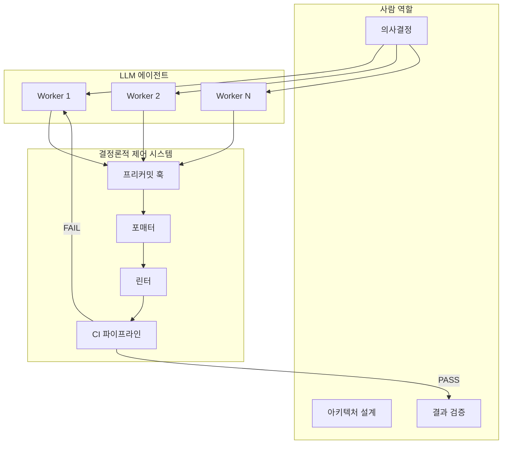

## 왜 지금 이 주제인가

우리 프로젝트(ai-study)는 이미 [Compound Engineering](/wiki/harness-engineering/compound-engineering-philosophy)과 [Architect-Worker 모델](/wiki/harness-engineering/architect-flow-map-via-aidy-architect)을 운용 중이다. pre-commit 빌드 체크, `/compound` 플라이휠까지 돌리고 있다. 하지만 채널톡 Perry의 글을 보면서 **우리가 아직 안 당긴 레버**가 선명하게 보였다:

1. **아키텍처 테스트** — 우리는 `npm run build` 통과 여부만 보지, "이 import가 허용된 의존성인가"를 코드로 강제하지 않는다.
2. **병렬 10개 동시 실행** — 우리는 허브-워커 3프로젝트 병렬이지만, 단일 프로젝트 내 병렬은 아직 worktree 수동 관리 수준이다.
3. **"CLAUDE.md는 부탁, 시스템은 강제"** — 이 프레이밍이 핵심. 우리 CLAUDE.md도 200줄 넘게 규칙을 적어뒀지만, 결국 LLM이 지킬지 말지는 확률적이다.

## 핵심 개념

### "AI의 비결은 AI가 아니라 시스템이다"

Perry는 6개월간 코드 0줄을 직접 타이핑하면서 97만 줄을 수정하고 560+ PR을 머지했다. 핵심은 도구 선택이 아니라 **LLM이 실수해도 시스템이 잡아주는 구조**를 먼저 만든 것이다.

### CLAUDE.md의 한계 (데이터 기반)

| 지표 | 결과 |
|------|------|
| SWE-bench Lite | -0.5% |
| AgentBench | -2% |
| 추론 비용 | +20~23% ↑ |

자연어 규칙의 3대 실패 원인:
1. **모호성** — "가급적"인지 "절대"인지 불명확
2. **위치 효과** — 긴 컨텍스트 후반부 규칙 무시
3. **충돌 해결 불가** — 규칙끼리 모순되면 LLM이 임의 결정

### 4가지 결정론적 제어 메커니즘

| 메커니즘 | 역할 | 위반 시 |
|----------|------|---------|
| **CI** | 아키텍처/유닛/통합 테스트 | PR 머지 불가 |
| **포매터** | 코드 스타일 강제 통일 | 자동 수정 |
| **린터** | 정적 분석, 의심 패턴 탐지 | 경고/에러 |
| **프리커밋 훅** | 커밋 전 자동 검사 | 커밋 차단 |

### 병렬 실행의 비밀: 컨텍스트 스위칭 비용 = 0

사람이 10개를 동시에 못 하는 이유는 **맥락이 머리에 있기 때문**이다. LLM은 각 세션마다 컨텍스트 윈도우에 맥락을 독립 보유하므로, Git worktree로 물리적 분리만 해주면 10개 병렬이 가능하다.

### LLM은 작은 워터폴을 애자일보다 잘한다

- **최적**: 설계 → 구현 → 테스트 (한 번에 완결)
- **비효율**: 반복적 피드백, 점진적 개선

이것은 우리 WO(Work Order) 시스템의 설계 근거와 정확히 일치한다 — 명확한 스펙을 한 번에 주고, 게이트에서 검증.

## 구조 / 프레임워크

### Perry의 8단계 워크플로우

| Step | 행위 | 주체 |
|------|------|------|
| 1 | Git Worktree 생성 | 사람 |
| 2 | 한 줄 프롬프트 | 사람 |
| 3 | 계획 수립 | AI |
| 4 | 계획 검토·승인 | 사람 |
| 5 | 의사결정 개입 (필요 시만) | 사람 |
| 6 | 단계별 커밋 (세이브 포인트) | AI |
| 7 | Self-review + 테스트 | AI |
| 8 | PR → CI → CodeRabbit 반영 | 시스템 |

## 실전 팁 / 안티패턴

### Do

- **규칙을 문서로 적지 말고 코드로 강제하라** — AST 기반 아키텍처 테스트, pre-commit 훅
- **CI를 피드백 루프의 핵심으로** — Go CI 10분→2분 (-78%) 사례. CI가 느리면 병렬의 의미 없음
- **코드 소유권 내려놓기** — "누가 타이핑했냐"가 아니라 "아키텍처 결정 품질"이 경쟁력
- **리팩토링을 별도 작업으로 분리하지 말 것** — 병렬 작업 중 하나로 동시에 진행

### Don't

- ❌ CLAUDE.md에 규칙을 계속 추가하면서 "이번엔 지키겠지" 기대
- ❌ LLM이 못한다고 단정 → "시스템을 어떻게 개선할까"로 전환
- ❌ 애자일식 점진적 피드백을 LLM 작업에 적용 (워터폴이 더 효율적)
- ❌ CI 대기 시간을 방치 (전체 처리량의 병목)

## 내 프로젝트에 적용하기

- **아키텍처 테스트 도입**: `content/` MDX의 frontmatter 규칙, import 제약 등을 vitest로 강제. 현재 `scripts/__tests__/validate-content.test.mjs`가 Mermaid만 검증 중 → frontmatter 스키마 위반도 CI 단계에서 차단
- **CI 속도 측정**: 현재 `npm run build` 시간 벤치마크 → 병목 식별 → 개선 (Perry처럼 AI에게 자율 반복 실험 위임)
- **린터 규칙 강화**: MDX lint (remark-lint) 도입 검토. CLAUDE.md에 적어둔 "self-closing 태그 필수" 같은 규칙을 린터로 전환
- **worktree 병렬 확장**: 현재 `/wt-branch` 스킬이 있지만 수동. 독립 작업 식별 → 자동 worktree 생성 → 병렬 실행 파이프라인 구축
- **hollon-ai 패턴 참고**: 우리의 [Architect-Worker 모델](/wiki/harness-engineering/architect-flow-map-via-aidy-architect)이 이미 같은 방향. Orchestrator + Worker 분리를 더 자동화할 여지 확인

## 자기 점검

1. 현재 내 CLAUDE.md 규칙 중 "코드로 강제 가능한데 문서로만 적어둔 것"은 몇 개인가?
2. `npm run build`의 현재 소요 시간은? 이게 병렬 실행의 병목이 되고 있는가?
3. Perry의 "LLM은 작은 워터폴을 잘한다" 원칙이 우리 WO 시스템에 이미 반영되어 있는가, 아니면 추가 조정이 필요한가?
4. 아키텍처 테스트(import 제약, 의존성 방향 검증)를 Next.js 프로젝트에 적용한다면 어떤 규칙부터 시작할까?
5. (열린 질문) "코드 소유권"을 내려놓는다는 것은 코드 리뷰의 역할을 어떻게 바꾸는가? 리뷰가 "교육"에서 "검증"으로 이동하면 팀 성장은 어디서 오는가?

### 실습 과제

현재 CLAUDE.md에 있는 규칙 중 3개를 골라 pre-commit 훅 또는 vitest 케이스로 전환해보라. 전환 후 해당 규칙을 CLAUDE.md에서 제거하고, 다음 5개 AI 작업에서 위반율이 실제로 0이 되는지 관찰하라.

## 출처

- 원본: [6개월간 코드 한 줄도 안 쓰고, 100만 줄 기여하기](https://channel.io/ko/team/blog/articles/ai-native-system-69c5a365)
- 보강 자료:
  - [AI가 규칙을 "알잘딱" 지키는 백엔드 레포 만들기 — Perry, Channel Corp.](https://channel.io/ko/team/blog/articles/ai-native-ddd-refactoring-98c23cdb) (동일 저자 후속 글, DDD 리팩토링 상세)
