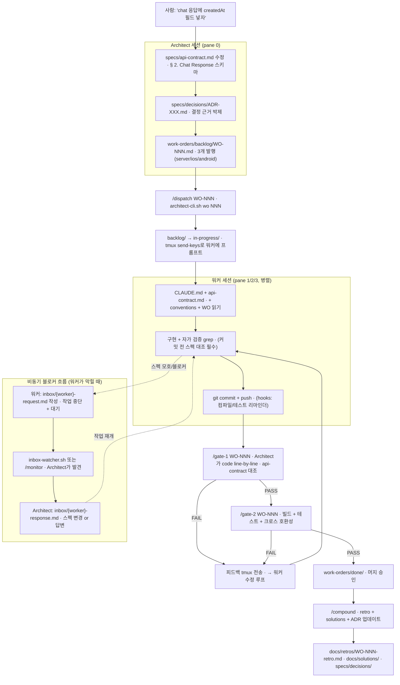

## 한 줄 요약

Flow Map 시리즈 **4편**. iOS 주력 개발자가 `aidy-architect`(tmux 4-pane + Claude Code 세션 분리)로 **Server / iOS / Android 3-client를 혼자 병렬 개발**하는 실전 모델을 "Work Order(WO) 한 건의 여정"으로 관통한다. 핵심은 **Architect 세션은 코드를 쓰지 않는다** — 스펙 결정 · 작업 발행 · Gate 검증 · Compound만 한다. "나 혼자서 PR 리뷰어이자 Tech Lead이자 진행자"를 AI 하네스에 이식한 구조.

---

## 갭 / 맥락 — iOS 개발자의 흔한 실패 패턴

혼자서 풀스택(또는 멀티 클라이언트) 프로젝트를 할 때 반복되는 실패:

- **단일 세션에서 모든 걸 한다** → server 코드 쓰다가 iOS 수정하다가 android 확인하다가, **한 Claude 세션의 컨텍스트가 오염**되어 판단 품질 급락
- **"알아서 해"식 작업 지시** → 워커 세션에 "채팅 기능 만들어줘"라고 던지면, 각 클라이언트가 **서로 다른 필드명**으로 끝남 (server는 `createdAt`, iOS는 `created_at`)
- **PR 리뷰를 스스로 스킵** → "내가 썼는데 내가 리뷰한다"라는 구조 자체가 무의미. 결국 프로덕션에서 버그 발견
- **회고 없이 다음 기능으로 진행** → 같은 삽질을 분기마다 반복. 아키텍처 결정이 어디에도 박제 안 됨
- **튜토리얼을 찾지만 없다** → "혼자서 Claude Code로 3-client 병렬 관리하는 법"은 튜토리얼에 없다. 자기 하네스를 설계해야 함

**공통 원인**: AI 에이전트를 **단일 도구**로만 쓰고, **역할 분리된 다중 세션**으로 쓸 생각을 안 한다.

---

## aidy-architect가 학습 재료로 좋은 이유

### 스택 개요

| 요소 | 역할 | iOS 대응 |
|------|------|---------|
| `aidy-architect` (이 레포) | 스펙 · WO · Gate 박제 저장소 | 팀의 Confluence + Jira + GitHub PR |
| `aidy-server` | Spring Boot + Kotlin 워커 | 백엔드 개발자 |
| `aidy-ios` | TCA + SwiftUI 워커 | iOS 개발자 (본인) |
| `aidy-android` | Compose 워커 | Android 개발자 |
| tmux 세션 `aidy` | 4-pane 레이아웃 (왼쪽 1 architect, 오른쪽 3 워커) | Xcode + 터미널 4개 띄워놓은 상태 |

### 왜 이 레포인가

1. **작지만 실전 요소를 다 갖춤**: api-contract · WO 라이프사이클 · Gate 리뷰 · ADR · 회고 · inbox 메시징 · slash command가 한 레포에 모여 있음
2. **역할 경계가 구조적**: Architect가 코드를 쓸 수 없도록 CLAUDE.md에 명시돼 있고, 워커 CLAUDE.md에는 스펙 대조 자가 검증 명령이 내장돼 있음
3. **박제 파이프라인이 실제로 돌아감**: `work-orders/` 하위 `backlog/` · `in-progress/` · `done/`, 그리고 `gates/reviews/`, `docs/retros/`, `specs/decisions/`가 모두 예시와 함께 살아있음
4. **iOS의 기존 팀 워크플로에 매핑 가능**: Tech Lead + PM + 리뷰어의 역할 분리라는 이미 익숙한 개념을 AI 세션에 이식한 것

---

## 1단계: "WO 한 건의 여정" 따라가기

### Architect가 "채팅 응답에 createdAt 필드 추가" 요청을 받았을 때 일어나는 일



### 각 단계가 하는 일 (한 줄씩)

| 단계 | 역할 | iOS(팀) 대응 |
|------|------|-----------|
| **api-contract 수정** | 3-client가 공통으로 따라야 할 계약의 source of truth 변경 | PM + Tech Lead가 API 스펙 확정 후 `APIProtocol.swift` + OpenAPI YAML 업데이트 |
| **ADR 박제** | "왜 이렇게 정했나"를 별도 마크다운으로 남김 | 아키텍처 결정 기록 (iOS 팀도 이미 쓰는 패턴) |
| **Work Order 발행** | 3개 워커별 개별 WO 생성 (요구사항 · 검증 기준 명시) | Linear/Jira 티켓을 server/ios/android 각각 3장 발행 |
| **/dispatch** | backlog → in-progress로 파일 이동 + tmux로 워커에게 프롬프트 전송 | 티켓 assign + "시작해줘" 슬랙 |
| **워커 구현** | CLAUDE.md + api-contract + conventions + WO 4개 문서를 반드시 읽고 코드 | 주니어 개발자가 스펙 + 코드 컨벤션 + 티켓 읽고 PR 올림 |
| **자가 검증 grep** | 커밋 전 CLAUDE.md에 내장된 grep 명령으로 스펙 필드 존재 확인 | Xcode build phase에 swiftlint + 커스텀 스크립트 |
| **Gate 1 (스펙 준수)** | Architect가 코드를 **line-by-line** api-contract와 대조 | 시니어 iOS가 PR 리뷰 — 단, "스펙 문서 대조"만 임무 |
| **Gate 2 (통합 검증)** | 빌드 + 테스트 + 다른 워커와 스키마 호환성 | QA + Staging 통합 테스트 |
| **/compound** | retro + solutions + ADR 업데이트 (재발 가능 문제만) | 스프린트 회고 + Confluence 박제 |
| **inbox 메시징** | 워커가 막히면 파일로 질문, Architect가 파일로 응답 (비동기) | 슬랙 스레드 — 단, 파일 기반이라 **다른 워커 컨텍스트를 오염시키지 않음** |

> 💡 **핵심 관찰**: 위 흐름은 **iOS 팀의 스프린트 흐름과 본질이 같다**. 차이는 (a) 워커가 사람이 아니라 Claude 세션, (b) 역할 분리가 tmux pane과 CLAUDE.md로 **강제**된다는 것. "느슨한 규약"이 아니라 **행동 레벨 가드**라는 점에서 팀보다 규율이 세다.

---

## 2단계: 관심사별 훑기

각 관심사를 "왜 필요한가?" 한 문장으로 답할 수 있으면 통과.

### Architect 세션 (pane 0)
- **역할**: 스펙 결정 + WO 발행 + Gate 검증 + Compound.
- **금지**: 코드 작성. 쓰는 순간 병렬 관제 구조가 붕괴.
- **CLAUDE.md에 명시**: "이 세션은 설계자(Architect)다. 코드를 직접 작성하지 않는다."

### 워커 세션 (pane 1/2/3)
- **역할**: WO에 명시된 요구사항만 구현. 스펙 변경 금지.
- **필수 로딩**: 자기 레포 CLAUDE.md → api-contract.md → conventions.md → WO 파일 (4개 순서대로).
- **자가 검증**: 커밋 전 CLAUDE.md 내장 grep 명령으로 스펙 필드 존재 확인.

### specs/api-contract.md (절대 스펙)
- **형식**: 마크다운. 섹션별 엔드포인트 + Request/Response 예시 + Error Code 표.
- **Source of truth**: 코드가 아니다. 이 문서가 계약. 코드가 문서와 다르면 Gate 1 FAIL.
- **수정 권한**: Architect만. 워커는 읽기 전용.

### Work Order (WO)
- **라이프사이클**: `backlog/` → `in-progress/` → `done/` (파일 이동으로 상태 관리).
- **포맷**: 목표 · 스펙 참조 · 구현 요구사항 체크리스트 · 테스트 요구사항 · 검증 기준 · 워커 세션 시작 명령 · 완료 보고.
- **번호 체계**: `WO-NNN-{worker}-{kebab-case-title}.md`.

### Gate 1 (스펙 준수)
- **언제**: PR 생성 직후 / 워커 커밋 직후.
- **임무**: api-contract의 엔드포인트 · 필드명 · 에러 코드 · 네이밍이 코드와 **line-by-line** 일치하는지.
- **박제 위치**: `gates/reviews/gate-1-WO-NNN-{worker}.md`.

### Gate 2 (통합 검증)
- **언제**: Gate 1 PASS 이후, 머지 전.
- **임무**: 로컬 빌드 + 테스트 실제 실행 + 다른 워커 프로젝트와 Request/Response 스키마 교차 대조.
- **CI 위임 금지**: 로컬에서 돌려야 함. "CI가 통과했으니 PASS" 는 메타데이터 신뢰 금지 원칙 위배.

### /compound
- **언제**: Gate 2 PASS 후, WO done 직후.
- **산출**: `docs/retros/WO-NNN-retro.md` (잘된 것 · 아쉬운 것 · 다음 적용) + `docs/solutions/` (재발 가능 문제만) + ADR 업데이트 (아키텍처 결정이 있었으면).
- **과대 박제 금지**: 매 WO마다 솔루션을 쓰지 않는다. "재발 가능하고 메모리에 없는 것"만.

### /cross-session-review
- **용도**: 워커가 "완료했습니다"라고 보고해도 **메타데이터 신뢰 금지**. 커밋 메시지 · 테스트 통과 표시 · 완료 보고를 모두 무시하고 **실제 diff만** 본다.
- **근거**: 워커 세션도 컨텍스트가 오염되면 "되는데 안 됨"을 알아차리지 못함. Architect가 외부 검증자 역할.

### 행동 레벨 가드 (settings.json hooks)
- **PreCommit hook**: 워커가 커밋하기 전 컴파일/테스트 자동 실행 리마인더.
- **PostPush hook**: 푸시 후 "/compound 실행하세요" 리마인더.
- **이유**: 기억에 의존하는 가드("잊지 말고 회고 쓰기")는 시간이 지나면 100% 실패한다. 행동 레벨에서 강제.

### inbox 메시징 (워커 → Architect 비동기)
- **왜 파일 기반**: 워커 세션은 독립 프로세스라 Architect에게 직접 말을 걸 수 없음. 또한 파일 기반이라 **다른 워커 세션의 컨텍스트를 오염시키지 않는다**.
- **요청 유형**: 스펙 변경 / 권한 / 터미널 명령 / 질문 / 블로커.
- **파일**: `inbox/{worker}-request.md` (워커 작성) → Architect가 `{worker}-response.md` 작성 → 워커 재개 후 두 파일 삭제.

### tmux 4-pane 레이아웃
- **왼쪽 1 + 오른쪽 3**: Architect 폭 ~135 컬럼, 워커 3개가 오른쪽에 세로 분할.
- **pane 간 이동**: `Ctrl+B → 방향키`. pane 최대화: `Ctrl+B → z`.
- **이유**: 모든 워커 상태를 한 화면에서 볼 수 있어야 Architect가 병목을 즉시 발견.

---

## 3단계: iOS 경험을 레버리지 — 비교 매핑표

### 역할 · 프로세스 매핑 (20개)

| Aidy 오케스트레이션 개념 | iOS 팀 경험 | 차이 / 포인트 |
|--------------------------|-----------|-------------|
| **Architect 세션** | Tech Lead + PM + 리뷰어의 결합 | 코드 작성 권한만 빠진 역할 |
| **워커 세션 (server/ios/android)** | 동료 개발자 (병렬) | 컨텍스트가 레포별로 격리 |
| **api-contract.md** | `APIProtocol.swift` + OpenAPI + Confluence API 페이지 | 문서가 source of truth (코드 아님) |
| **specs/conventions.md** | swiftlint + 팀 코드 컨벤션 문서 | 워커 CLAUDE.md에서 필수 로딩 |
| **specs/decisions/ADR-XXX.md** | iOS 팀의 Architecture Decision Record | 이미 익숙한 패턴 |
| **Work Order** | Linear/Jira 티켓 | **스펙 링크 + 자가 검증 명령이 내장** |
| **work-orders/ 하위 backlog · in-progress · done** | Jira 컬럼 (To Do / In Progress / Done) | 파일 이동 = 상태 변화 |
| **/dispatch** | 티켓 assign + "시작" 메시지 | tmux send-keys로 프롬프트까지 동시 전송 |
| **/gate-1** | PR 리뷰 (스펙 준수 전담) | 오직 api-contract 대조만 |
| **/gate-2** | QA + Staging 통합 테스트 | 로컬 빌드 + 크로스 프로젝트 호환성 |
| **/cross-session-review** | 시니어의 "진짜 된 거 맞아?" 더블 체크 | **메타데이터 신뢰 금지** — diff만 본다 |
| **/compound** | 스프린트 회고 + Confluence 박제 | 매 WO마다. "재발 가능 문제"만 솔루션 |
| **CLAUDE.md (워커)** | 팀 온보딩 문서 + swiftlint + pre-commit hook | AI가 매 세션 시작 시 읽음 |
| **settings.json hooks** | Git pre-commit / pre-push hook | 행동 레벨 가드 (기억 가드 X) |
| **inbox/request.md** | 슬랙 스레드 멘션 | 파일 기반 비동기, 컨텍스트 격리 |
| **inbox-watcher.sh** | 슬랙 봇 알림 | macOS notification 5초 폴링 |
| **templates/work-order.md** | Linear "Feature" 템플릿 | WO 형식 일관성 강제 |
| **CLAUDE.md (Architect)** | Tech Lead의 역할 기술서 | "코드 직접 작성 금지" 명시 |
| **TMX 4-pane 레이아웃** | Xcode + 터미널 4개 띄운 화면 | 물리 공간으로 역할 분리 가시화 |
| **`--dangerously-skip-permissions`** | 주니어에게 승인 없이 커밋 권한 준 것 | 속도 확보. Gate로 품질 보장 |

### 단방향 루프 관점 (iOS의 TCA/MVI 경험 연결)

iOS에서 TCA/Redux를 쓰는 이유가 "상태 변경 경로를 단방향으로 강제"하기 위함이라면, aidy-architect의 WO 라이프사이클도 같은 사상이다:

```
스펙 결정 → WO 발행 → 워커 구현 → Gate 검증 → Compound → (다음 스펙)
```

이 루프에서 **역방향 흐름이 금지**된다 — 워커가 스펙을 바꾸려 하면 inbox로 요청해야 하고 (Architect가 재결정), Gate를 건너뛰고 머지하는 샛길이 없다. TCA Effect가 반드시 Action으로 돌아와야 State를 바꿀 수 있는 것처럼, aidy에서 코드 머지는 반드시 Gate를 통과해야 done/에 들어갈 수 있다.

> 🎯 **본질은 동형**: TCA가 *상태 변경*의 단방향 루프라면, aidy-architect는 *코드 변경*의 단방향 루프다. 방향성을 강제하는 구조가 곧 관제 가능성의 원천.

---

## 4단계: 실전 학습 로드맵 (Week 1~5)

### Week 1: aidy-architect 레포 훑기 (관찰)
- [ ] `CLAUDE.md` + `SYSTEM-GUIDE.md` 읽기 (특히 "2. 핵심 원칙" — 기억 가드 vs 행동 가드)
- [ ] `specs/api-contract.md` 1회독 — 계약 문서가 어떤 수준의 디테일까지 담는지 감 잡기
- [ ] `work-orders/done/` 에서 WO 2~3개 샘플 읽기 (WO-001, WO-004, WO-007 권장)
- [ ] `gates/reviews/gate-1-WO-004-server.md` 읽기 — 실제 Gate 1 검증이 어떤 디테일까지 내려가는지
- [ ] `specs/decisions/ADR-004-multi-agent-pipeline.md` 읽기 — ADR의 깊이

### Week 2: 한 WO 라이프사이클 손으로 따라해보기
- [ ] `templates/work-order.md` 복사해서 작은 WO 하나 발행 (예: "health 엔드포인트에 uptime 필드 추가")
- [ ] `architect-cli.sh wo NNN` 으로 backlog → in-progress 수동 이동
- [ ] 워커 CLAUDE.md를 읽고 어떤 자가 검증 명령이 내장돼 있는지 확인
- [ ] Gate 1 체크리스트를 수동으로 적용 (`gates/gate-checklist.md` 기준)
- [ ] `docs/retros/` 에서 retro 1개 샘플 읽고 본인 WO에 대한 retro 작성

### Week 3: 자기 풀스택 사이드 프로젝트에 2-pane 실험
- [ ] tmux 세션 생성, 2-pane 레이아웃 (Architect + 1 워커)
- [ ] 작은 풀스택 프로젝트 (예: TODO 1-client + 서버) 본인 레포에 aidy 스타일 적용
- [ ] `specs/api-contract.md` 직접 작성 (절대 스펙 1페이지)
- [ ] 워커 CLAUDE.md에 "api-contract 필수 로딩" + "커밋 전 스펙 grep" 명령 내장
- [ ] 첫 WO 발행 → 실제로 워커 세션에서 구현 → /gate-1 수동 적용

### Week 4: 4-pane 확장 + slash command 이식
- [ ] aidy-architect의 `.claude/commands/` 에서 `dispatch.md`, `gate-1.md`, `compound.md` 읽기
- [ ] 본인 프로젝트의 `.claude/commands/` 에 축소판 이식 (먼저 /dispatch와 /gate-1만)
- [ ] 3-client 프로젝트라면 4-pane (architect + server + ios + android) 레이아웃 시도
- [ ] `architect-cli.sh` 스크립트 구조 이해 (send 명령의 `tmux send-keys` 패턴)
- [ ] inbox 메시징 흐름 1회 체험 (워커가 일부러 모호한 스펙을 만나도록 해서 request 파일 작성 연습)

### Week 5: Compound Engineering 흐름 정착
- [ ] 매 WO 완료 후 `/compound` 수동 실행 → retro · solutions · ADR 갱신 습관화
- [ ] 본인의 "재발 가능 문제" 기준 정의 (모든 실수를 솔루션으로 만들지 말 것)
- [ ] settings.json에 pre-commit + post-push hook 추가 (행동 레벨 가드 첫 도입)
- [ ] `moneyflow` 같은 실제 프로덕트에 축소판 적용 시작 — **사이드 프로젝트 → 실제 프로덕트** 이행

### Week 6+: (옵션) 자동 루프 실험
- [ ] `/autoceo` 스크립트 구조 읽기 (`docs/retros/autoceo-*-retro.md` 회고들에서 실패/성공 패턴 파악)
- [ ] 축소된 자동 루프 실험 (3~5 라운드 제한) — Research → Plan → Dispatch → Gate → Compound 자동화
- [ ] **주의**: Stage 3(슬래시 커맨드 안정) 없이 Stage 4(자동 루프) 시도하면 가드가 약해서 이상 동작 누적

---

## 자주 막히는 지점 (환경/설정 함정)

| 증상 | 원인 / 해법 |
|------|----------|
| Architect 세션이 자꾸 코드를 쓰려고 함 | CLAUDE.md 맨 위에 **"이 세션은 설계자다. 코드를 직접 작성하지 않는다."** 를 한 줄로 박아야 함. 묻혀 있으면 컨텍스트 누적 후 무시됨 |
| 워커가 api-contract를 읽지 않고 "대충" 구현 | 워커 CLAUDE.md에 **"시작 전 반드시 읽기"** 목록이 첫 섹션에 있어야 함. 또한 커밋 전 grep 자가 검증 명령 내장 |
| tmux `send-keys` 가 엉뚱한 pane으로 감 | window와 pane 혼동. `tmux send-keys -t aidy:architect.N` 의 N이 pane 인덱스 (0=architect, 1=server, 2=ios, 3=android) |
| WO-NNN 번호 충돌 (동시 발행) | `architect-cli.sh status` 로 현재 in-progress 확인 후 발행. 동시 발행 시 수동 리네임 |
| Gate 1 PASS인데 Gate 2 FAIL | 거의 항상 **크로스 프로젝트 호환성** 이슈. server Response 필드명이 iOS/android expected와 다름. api-contract가 불충분하다는 신호 |
| `/gate-1` 실행했는데 "통과"만 나오고 디테일 없음 | Gate 1은 **line-by-line** 대조가 임무. 요약만 출력되면 프롬프트 다시 점검. 실제 스펙 필드 · 에러 코드 · 네이밍을 하나씩 대조 |
| 워커가 "테스트 통과했습니다"라고 했는데 실제로는 돌린 적 없음 | 메타데이터 신뢰 금지. `/cross-session-review` 로 diff와 실제 테스트 파일만 확인. 없으면 FAIL 처리 |
| inbox 파일을 Architect가 한참 뒤에야 발견 | `./inbox-watcher.sh &` 백그라운드 실행 필수. 또는 `/monitor` 루프에 포함 |
| `--dangerously-skip-permissions` 로 실수로 파일 삭제 | Gate 검증이 곧 안전장치. Gate를 스킵하면 이 속도의 의미가 사라짐 |
| `/compound` 를 건너뛰고 다음 WO로 진행 | post-push hook으로 리마인더 박지 않으면 100% 건너뜀. 행동 레벨 가드 필수 |
| "Architect가 워커에게 말하는 법" 이 어색 | tmux send-keys로 "워커야, WO-NNN 시작해줘. CLAUDE.md + api-contract + WO 읽고 구현." 정도의 짧은 프롬프트. 장문은 dispatch.md 템플릿 사용 |
| 4-pane이 좁아서 코드가 안 보임 | pane 최대화 `Ctrl+B → z`. 검토 끝나면 복원. 또는 폰트 크기 줄이기 |

---

## AI Agent Directive

### Trigger
- 사용자가 "혼자서 풀스택/멀티 클라이언트를 병렬 관리"하고 싶다고 할 때
- "Claude 세션을 여러 개 띄워서 역할 분리"라는 키워드
- "스펙 기반 개발", "Architect-Worker 패턴", "tmux + Claude Code 3-pane" 질의
- PR 리뷰 + 스프린트 진행 역할을 AI 하네스에 이식하려는 요구

### Prerequisites
- tmux 설치 및 기본 조작 숙지 (pane/window 구분)
- Claude Code CLI 인증 + `--dangerously-skip-permissions` 모드 이해
- 대상 프로젝트 3~4개의 레포 분리 구조
- [Aidy Journal 000 — Spec-Driven Multi-Agent Orchestration 베이스라인](/wiki/harness-engineering/aidy-journal-000-architect-worker-baseline) — 이 시스템의 방법론 박제
- [Compound Engineering Philosophy](/wiki/harness-engineering/compound-engineering-philosophy) — Compound 루프가 왜 필요한지

### Actionable Steps
1. **역할 경계를 문서로 먼저 박는다** — Architect CLAUDE.md 첫 줄에 "코드 작성 금지". 워커 CLAUDE.md 첫 섹션에 "시작 전 필수 로딩 목록".
2. **api-contract.md를 코드보다 먼저 쓴다** — 엔드포인트 · Request/Response 예시 · Error Code 표를 계약처럼 확정.
3. **Work Order 템플릿을 하나 만든다** — 목표 · 스펙 참조 · 구현 체크리스트 · 검증 기준 · 완료 보고 섹션. 모든 WO가 이 포맷 따름.
4. **Gate 1/2 slash command를 작성한다** — `.claude/commands/gate-1.md` 에 "api-contract와 코드를 line-by-line 대조하라"는 명시적 프로시저.
5. **tmux 4-pane 레이아웃 스크립트를 만든다** — `orchestrator.sh` 같은 형태로 세션 재구성 자동화.
6. **settings.json hooks로 post-push 리마인더 박는다** — `/compound` 실행 리마인더는 기억 가드가 아닌 행동 가드로.
7. **첫 WO를 작은 것으로 시작한다** — 예: "health 엔드포인트에 uptime 필드 추가". 3-client 모두 1시간 내 완료 가능한 크기.
8. **inbox 메시징 흐름을 1회 실전 검증한다** — 일부러 스펙 모호한 WO를 하나 발행해서 request/response 파일 흐름 체험.

### Anti-patterns
- **Architect가 코드를 쓴다** — 병렬 관제가 구조적으로 붕괴. 한 번만 쓰기 시작해도 컨텍스트 오염 시작
- **Gate를 "이번만 스킵"** — 메타데이터 신뢰 금지 원칙이 곧바로 무너짐. 다음부터 습관적 스킵
- **"알아서 해"식 프롬프트로 워커에게 작업 지시** — 스펙 누락으로 3-client가 서로 다른 구현으로 끝남
- **api-contract 수정 없이 코드부터 바꿈** — 워커가 스펙을 이길 수 있다는 선례가 생기면 계약 구조 붕괴
- **`/compound` 를 2~3 WO 모아서 한 번에** — 재발 가능 문제의 "재발 맥락"이 흐려져 솔루션 품질 저하
- **기억에 의존하는 가드** ("워커야 커밋 전에 테스트 돌려줘") — 시간 지나면 100% 실패. hooks로 행동 강제
- **inbox 파일을 주기적으로 확인 안 함** — 워커가 블로킹된 채 5분, 10분 방치 → 세션 타임아웃 누적

---

## s27 업데이트 — autoceo v2.3~v2.6 4피처 스프린트 (2026-04-19)

s14 종료 이후 **s27에서 autoceo 스프린트가 돌아갔다.** 4개 피처가 한 번의 autoceo 루프로 3-client 동시 배포되었고, Architect의 역할이 더 선명하게 드러난 사례다.

### 스프린트 요약

| 버전 | 피처 | WO 번호 | Server | iOS | Android |
|------|------|---------|--------|-----|---------|
| v2.3 | Anniversary Reminders | WO-085~087 | ✅ | ✅ | ✅ |
| v2.4 | Notification Preferences | WO-088~090 | ✅ | ✅ | ✅ |
| v2.5 | Relationship Nudges | WO-091~093 | ✅ | ✅ | ✅ |
| v2.6 | Gift Suggestions | WO-094~096 | ✅ | ✅ | ✅ |

**빌드 검증 (R9):** server 796 tests, android 663 tests, ios 554 tests — 전부 PASS.

### Architect 관점에서 배울 점

1. **autoceo 루프의 실전 작동**: R1(스펙 정의) → R2~R5(서버 먼저 → 클라 dispatch) → R6(에지 케이스 테스트 보강) → R8(전체 빌드 검증) → R9(cross-session-review). 사람이 개입한 건 autoceo 시작 명령뿐.
2. **"서버 먼저" 원칙 재확인**: 모든 피처에서 서버 API가 먼저 완성되고 Gate-1 통과 후 iOS/Android에 dispatch. 역순은 한 번도 없었음.
3. **Gate-1이 4피처 연속 PASS**: 스펙(api-contract.md)이 충분히 상세하면 워커가 첫 시도에 통과하는 비율이 올라감. WO-092/093은 Gate-1 한 번에 PASS.
4. **WO 넘버링 폭증 (85→96)**: 12개 WO가 하나의 autoceo 루프에서 나옴. WO 관리의 스케일링 한계가 보이기 시작.

---

## 다음 학습 연결

- [Aidy Journal 000 — Spec-Driven Multi-Agent Orchestration 베이스라인](/wiki/harness-engineering/aidy-journal-000-architect-worker-baseline) — 이 글의 방법론적 근거 (WO 라이프사이클 · Gate · Compound Flywheel)
- [Compound Engineering Philosophy](/wiki/harness-engineering/compound-engineering-philosophy) — `/compound` 가 왜 매 WO마다 필요한지의 원리
- [Five Levers of Harness Engineering](/wiki/harness-engineering/five-levers-of-harness-engineering) — Architect/Worker는 "역할 분리"라는 하나의 레버를 최대한 당긴 사례
- [aidy-server Flow Map](/wiki/backend-ai/backend-flow-map-via-aidy-server) / [aidy-ios Flow Map](/wiki/ios-ai/ios-flow-map-via-aidy-ios) / [aidy-android Flow Map](/wiki/android-ai/android-flow-map-via-aidy-android) — 3개 워커 각각의 내부 흐름
- (예정) Part 5 — aidy 풀스택 배포 파이프라인 (Neon/Vercel → 프로덕션)
- (예정) Part 6 — API 계약이 코드보다 먼저: api-contract.md 로 보는 3-client 동기화 깊이

---

## 출처 / 검증 메모

- 코드: `~/Develop/aidy-architect` (CLAUDE.md, SYSTEM-GUIDE.md, HANDOFF.md)
- 구조: `specs/` (api-contract.md · conventions.md · decisions/), `work-orders/` (backlog · in-progress · done), `gates/reviews/`, `docs/retros/`, `templates/`, `.claude/commands/`
- 실제 WO 샘플: `WO-001-server-chat-api.md`, `WO-004-server-ai-resilience.md`, `WO-007-ios-people-tab.md`
- 실제 Gate 리뷰: `gates/reviews/gate-1-WO-004-server.md` (4KB 상세 대조 사례)
- ADR 샘플: `specs/decisions/004-multi-agent-pipeline.md` (단일 호출 유지 vs 2단 파이프라인 검토)
- 관련 회고: `docs/retros/WO-004-retro.md`, `autoceo-s4-*-retro.md` (10 라운드 자동 루프 실측)
- 시리즈 기획: `~/Develop/ai-study/docs/series-flow-map-for-ios-devs.md`
