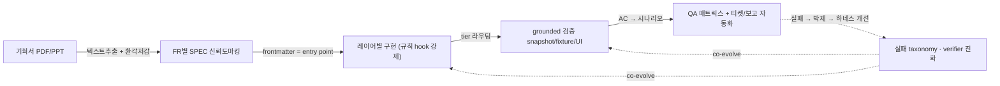

## 들어가며

이 글은 한 iOS 앱의 소프트웨어 개발 전 과정을 에이전트 하네스로 자동화한 두 달여의 **평가와 후기**다. 예시 앱은 moneyflow(RIBs/ReactorKit 기반 크로스플랫폼 앱), 하네스는 team-harness 플러그인으로 익명화한다. 자동화한 파이프라인은 다섯 단계다.

1. **기획**: 기획서(PDF/PPT)에서 요구사항을 구조화
2. **스펙 문서화**: FR(기능 요구사항)별 SPEC 마크다운 생성
3. **개발**: 레이어별(Repository/UseCase/Presentation) 구현
4. **검증**: 시뮬레이터 grounded 확인
5. **QA**: 수용 기준(AC) 기반 시나리오 검증 + 티켓/보고 자동화

이 글은 홍보가 아니라 정직한 평가를 목표로 한다. 무엇이 진짜 이겼고, 어디서 반복해서 실패했으며, 두 달이 우리에게 가르친 **하나의 메타 교훈**이 무엇인지를 적는다. 결론을 미리 말하면 — **자동화는 병목을 없앤 게 아니라 옮겼다. '만들기'에서 '만든 것이 맞는지 확인하기'로.**

## 1. 파이프라인 — 각 단계에서 무엇을 자동화했나

각 단계의 자동화 실체를 요약한다.

**기획 → 스펙.** DRM 해제된 기획서 PDF의 텍스트 레이어를 직접 추출(OCR/비전 금지 — 정확도 때문에)해 FR 경계를 감지하고, FR별 SPEC.md를 생성한다. 핵심은 환각 저감 프로토콜이다 — 원문을 verbatim 인용한 것만 🟢(확정)으로 마킹하고, 애매한 것은 🟡(기권)으로 남기고, 원문·grep으로 확인 안 되는 값은 아예 만들지 않는다(invention-0). 판단이 필요한 값(디폴트/enum→화면 매핑/정렬키/상태코드)은 서버 계약을 SoT로 우선 명세하고 개발자 컨펌 후에만 🟢로 승격한다. 그리고 2-pass 자기검증(작성 후 독립적으로 반증 우선 재검토)을 건다.

**스펙 → 개발.** SPEC의 frontmatter에 RIBs entry point 경로, Figma 링크, 대상 레이어, 공통 모듈 의존을 박아둬서, 개발 에이전트가 광역 grep 없이 화면을 즉시 특정한다. 화면에 보이는 한글 텍스트로 파일을 역인덱스 검색하는 도구, RIBs 풀체인(View→ViewModel→Interactor→UseCase→Repository)을 1회 매핑하는 도구가 진입 비용을 줄인다. 구현은 레이어 규칙(Presentation→UseCase→Repository, 역방향·건너뛰기 금지)과 Swift 안전 규칙(force unwrap/try! 금지 등)을 hook과 스킬로 강제한다.

**개발 → 검증.** 변경 유형에 따라 최소 충분한 검증 tier로 자동 라우팅한다 — UI 1~3줄이면 hot reload, 데이터 시나리오면 스냅샷/번들 fixture([ios-ai-journal-026](ios-ai/ios-ai-journal-026-no-build-fullcycle-verify-inplace-bundle-fixture)), 상호작용이면 UI 자동화, 계약이면 decode-roundtrip. 무거운 cold-verify 남발을 막는 게 tier 라우팅의 핵심이다.

**검증 → QA.** SPEC의 수용 기준(AC-X.Y)을 시나리오로 변환해 실행하고 PASS/FAIL 매트릭스를 낸다. QA 티켓이 여러 건 인입되면 grounded 수집 → 1분 triage → 단일 전담 에이전트 fix → 검증 ladder → 배치 커밋의 SOP를 탄다. 주간보고 컨플루언스 작성, QA→관리 티켓 클론 같은 반복 사무도 자동화했다.

## 2. 진짜 이긴 곳 — 기계적 반복, 진입 비용, 지식 복리

두 달의 평가에서 자동화가 명백히 이긴 영역은 세 부류였다.

**기계적·반복 작업.** 기획서 텍스트 추출과 FR 분할, 화면 텍스트로 파일 특정, 검증 tier 라우팅, 주간보고 작성, QA 티켓 클론 — 이런 것들은 규칙이 명확하고 판단이 적어 자동화 ROI가 압도적이었다. 사람이 하면 지루하고 실수하는 일을 에이전트가 일관되게 처리했다. 특히 "화면에 보이는 한글 라벨 → 코드 파일" 역인덱스는 광역 grep 반복을 없애 진입 비용을 크게 줄였다.

**진입 비용 절감.** SPEC frontmatter를 entry point로 삼는 설계가 컸다. 개발 에이전트가 "이 화면 어디 있지?"로 코드베이스를 헤매는 대신, frontmatter의 RIBs 경로를 첫 Read로 잡고 바로 작업에 들어간다. 이건 자동화가 "사람을 대체"한 게 아니라 "사람이든 에이전트든 매번 치르던 탐색 비용을 구조로 없앤" 사례다.

**지식 복리.** 가장 저평가되기 쉽지만 장기적으로 가장 큰 이득이었다. 실패할 때마다 실패를 분류(failure taxonomy)하고, 재발하면 격상 사다리(박제→inline 룰→CLAUDE.md→hook fix→구조 ADR)로 올려 구조적으로 막았다([harness-as-software-adr-for-agent-harness](harness-engineering/harness-as-software-adr-for-agent-harness)). 검증을 통과해버린 결함(escaped-defect)은 로그에 남겨 verifier를 co-evolve시켰다. 즉 파이프라인이 돌수록 파이프라인 자체가 똑똑해졌다. 개별 작업의 속도보다 이 복리가 더 중요한 자산이 됐다.

## 3. 반복해서 실패한 곳 — 검증이 새는 지점

정직한 평가의 핵심은 여기다. 자동화가 반복해서 실패한 영역은 거의 모두 **검증**에 몰려 있었다. 생성(코드·스펙·시나리오 작성)은 대체로 잘 됐다. 문제는 "생성된 것이 맞는지"를 판정하는 단계였다.

| 실패 유형 | 표면 신호(초록불) | 실제 진실 |
| --- | --- | --- |
| 배선 누락 | 빌드 성공 | 버튼 action이 TODO/빈 body — 런타임 no-op |
| mock parity | mock QA 통과 | 실서버 키 불일치로 조용히 nil ([ios-ai-journal-029](ios-ai/ios-ai-journal-029-dto-silent-nil-fixture-self-confirm-third-oracle)) |
| 시뮬 전용 우회 | 시뮬 PASS | 실기기엔 코드 자체가 없음 ([ios-ai-journal-028](ios-ai/ios-ai-journal-028-simulator-only-bypass-blind-spot)) |
| self-confirm | fixture·DTO 일치 | 둘 다 같은 오해 — 서버와 불일치 |
| 스크립트 녹색 | 검증 스크립트 exit 0 | 스키마 drift로 대상을 silent skip |

이 표의 공통 패턴은 하나다 — **표면 신호와 실제 진실이 어긋난다.** 에이전트(그리고 사람도)는 초록불을 "맞음"으로 읽으려는 강한 경향이 있다. 빌드가 되니 됐겠지, mock이 통과하니 맞겠지, 시뮬에서 되니 실기기도 되겠지. 이 등호가 전부 거짓이었다.

여기에 **환각**이 겹쳤다. 검증/감사 에이전트가 존재하지 않는 함수 이름을 지어내거나, 코드 스니펫을 날조하거나, 예산 제한 하에서 false-positive 판정을 양산했다. 그래서 "판정이 grounded 확정되기 전에는 박제 금지", "cleanup 대상은 ls/grep으로 실재 검증 후에만", "verifier는 반증 우선(falsification-first)" 같은 규율을 계속 추가해야 했다.

## 4. 자율성의 현실 — '100%까지 알아서'는 반증됐다

초기 가정 중 하나는 "충분히 좋은 하네스면 에이전트가 완성도 100%까지 자율 반복한다"였다. 두 달은 이 가정을 반증했다.

에이전트의 자율 루프는 **grounded 신호가 있는 만큼만** 진짜로 수렴한다. 검증 신호(실측 스크린샷, decode-roundtrip, 실기기 동작)가 있는 부분에서는 반복이 실제로 품질을 올린다. 그러나 신호가 없는 부분에서는 **완성 착시**가 생긴다 — 에이전트가 그럴듯한 산출물을 보고 "완성됐다"고 오판한다. §3의 실패들이 정확히 이것이다. 초록불(신호)이 거짓이면 자율 루프는 거짓 신호에 수렴한다.

그래서 현실적 목표는 "끝까지 알아서"가 아니라 **"grounded 신호로 정의된 done-gate에서 멈춤"**으로 바뀌었다. 자율 루프는 신호가 있는 곳까지만 돌리고, 신호가 없는 지점(판단이 필요한 스펙 값, 계약, 실기기 동작)에서는 사람 컨펌 게이트를 둔다. 그리고 풀사이클 에이전트(기획~커밋을 한 번에)의 ROI는 생각보다 좁았다 — 작은 작업엔 over-engineering이라, 경량 빌더나 인라인 직접 처리로 라우팅하는 게 나았다. 긴 세션은 context rot으로 추론이 저하돼([harness-journal-037](harness-engineering/harness-journal-037-verify-context-domino-role-boundary-preemptive-clear)) 단계마다 컨텍스트를 끊어야 했다.

## 5. 메타 교훈 — 병목은 '작성'에서 '오라클'로 옮겨갔다

두 달을 한 문장으로 요약하면 이렇다. **자동화는 병목을 없앤 게 아니라 옮겼다.** 생성이 싸지자 검증이 비싸졌다.

에이전트는 코드·스펙·시나리오를 빠르고 그럴듯하게 뽑는다. 그래서 "만들기"는 더 이상 병목이 아니다. 새 병목은 "만든 것이 맞는지 판정하기"다. 그리고 판정에는 **오라클**이 필요하다 — 산출물과 *독립적으로* 만들어진 진실 기준. 여기서 파이프라인의 가장 안 풀린 부분이 드러난다. **오라클은 자동 생성이 어렵다.**

왜인가. 오라클이 산출물과 독립이어야 하는데, 같은 에이전트가 만든 기준은 self-confirm이라 무의미하다([ios-ai-journal-029](ios-ai/ios-ai-journal-029-dto-silent-nil-fixture-self-confirm-third-oracle) / [api-contract-as-3-client-source-of-truth](context-engineering/api-contract-as-3-client-source-of-truth)). 진짜 오라클은 대개 파이프라인 밖에서 온다 — 서버 규격서, 실서버 응답, 먼저 shipped된 타 플랫폼 구현, 실기기 동작, 그리고 사람의 판단. 이것들을 검증 파이프라인에 끌어와 자동 대조하게 만드는 것(decode-roundtrip, parity grep, 실기기 게이트)이 두 달의 실질적 작업 대부분이었다.

그래서 자동화 투자의 무게 중심도 옮겨야 했다. "더 잘 만드는 에이전트"보다 **"독립 오라클과 자동 대조하는 검증"**에 투자하는 것. verifier co-evolution, escaped-defect log, 반증 우선 프롬프트, 하네스 회귀셋(변경이 진짜 개선인지 통계적으로 판정)이 그 방향이다. 이는 [harness-journal-038](harness-engineering/harness-journal-038-health-metric-recalibration-two-tools-false-penalty)에서 본 "메트릭 자체가 검증 대상"과 같은 정신 — 검증하는 것도 검증받아야 한다.

## 6. 종합 평가 — 무엇을 다시 하고, 무엇을 다르게 할까

**다시 할 것.** SPEC frontmatter를 entry point로 삼는 설계, 검증 tier 라우팅, 실패 taxonomy와 격상 사다리, 하네스를 소프트웨어로 다루는 규율(ADR·회귀셋·버전). 그리고 [harness-journal-039](harness-engineering/harness-journal-039-tmux-worker-pool-to-solo-native-agent-teams)의 SOLO + 느슨한 fan-out — 촘촘히 엮인 워커풀보다 안정적이었다.

**다르게 할 것.** 처음부터 검증에 더 투자했어야 했다. 초기 두 달의 실패 대부분은 "생성을 잘하는데 검증이 못 따라와서" 생긴 escaped defect였다. "자율 100%" 가정을 더 일찍 버리고 grounded done-gate + 사람 컨펌 게이트를 처음부터 명시했어야 했다. 그리고 오라클 확보(규격서·실응답·parity)를 개발 *전에* 세우는 걸 파이프라인의 첫 단계로 넣었어야 했다 — 나중에 붙이니 self-confirm이 이미 파고든 뒤였다.

정직한 총평 — 이 자동화는 **속도의 승리라기보다 일관성과 복리의 승리**다. 개별 작업이 사람보다 극적으로 빠르진 않았다(검증까지 포함하면). 대신 지루한 반복을 일관되게 처리하고, 실패를 자산으로 축적하고, 진입 비용을 구조로 없앴다. 가장 큰 남은 숙제는 여전히 검증의 오라클 문제다 — 만드는 건 싸졌는데, 맞는지 아는 건 여전히 비싸다. 그리고 그 "맞는지 아는 것"의 마지막 한 조각은 아직 사람에게 있다.

## 자기 점검

1. 우리 자동화 투자가 "더 잘 만드는 것"에 쏠려 있진 않은가? 생성이 싸지면서 병목이 "맞는지 확인하기"로 옮겨간 것을 인지하고, 검증에 투자하고 있는가?
2. 검증의 초록불(빌드 성공/mock 통과/시뮬 PASS/스크립트 exit 0)을 "맞음"으로 등치하고 있진 않은가? 표면 신호와 실제 진실이 어긋나는 지점을 목록으로 알고 있는가?
3. "자율 100%까지 알아서"를 목표로 두고 있진 않은가? grounded 신호가 없는 곳의 완성 착시를 bounded done-gate + 사람 컨펌으로 막는가?
4. 검증의 오라클이 산출물과 독립인가? fixture/스펙/기준을 산출물과 같은 출처가 만들어 self-confirm하고 있진 않은가? 독립 오라클(규격서/실응답/타 플랫폼/실기기)을 개발 전에 세우는가?
