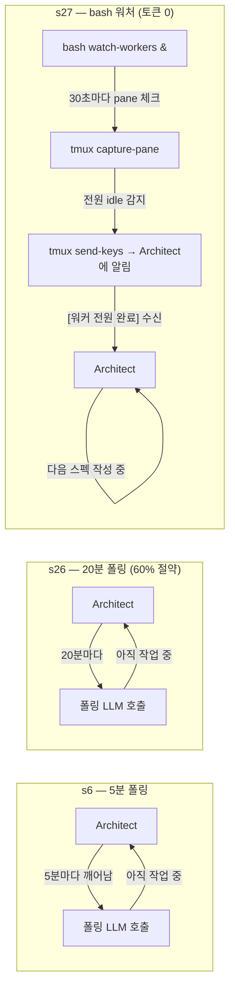

## 왜 지금 이 주제인가

aidy 멀티 에이전트 시스템(Architect + Server/iOS/Android 워커)을 운영하면서 반복된 질문이 있었다: **워커가 작업을 마쳤는지 어떻게 아는가?**

초기엔 Architect Claude가 직접 폴링했다. 5분마다 깨어나 "워커들 다 됐나?" 를 확인하는 방식. s6에서 이걸 구현했을 때 토큰이 예상보다 훨씬 빨리 소진됐다. s26에서 실측해보니 5분 폴링은 실제 작업 시간의 60%를 폴링에 낭비하고 있었다. 20분으로 늘려서 개선했지만, 본질적인 문제는 그대로였다.

**폴링 자체가 AI 호출을 소모한다.** 대기 중에 Claude를 깨우면 컨텍스트가 로드되고, 판단 없이 "아직 작업 중" 이라는 답을 내놓기 위해 토큰을 쓴다. 이 판단에는 AI가 필요하지 않다.

s27에서 이 구조적 문제를 해결했다. bash가 tmux pane을 감시하면 Claude는 폴링을 한 번도 하지 않는다. **폴링 토큰 100% 제거.**

## 3단계 진화



| 단계 | 폴링 주체 | 60분 작업 시 LLM 호출 | 토큰 낭비 |
|---|---|---|---|
| s6 (5분) | Claude | 12회 | ~60% |
| s26 (20분) | Claude | 3회 | ~15% |
| s27 (bash) | bash | **0회** | **0%** |

## 핵심 메커니즘: tmux pane idle 감지

Claude Code는 작업 중일 때와 idle일 때 pane에 다른 텍스트를 표시한다.

```
작업 중 (working):
  ╭─────────────────────────────────╮
  │  ● Bash(npm run build...)       │
  │  esc to interrupt               │  ← 이 패턴이 핵심
  ╰─────────────────────────────────╯

Idle (프롬프트 대기):
  ╭─────────────────────────────────╮
  │  > _                            │
  │  ? for shortcuts                │  ← idle 시그니처
  ╰─────────────────────────────────╯
```

bash는 `tmux capture-pane`으로 각 워커 pane의 마지막 5줄을 캡처해서 이 패턴을 30초마다 체크한다.

```bash
is_pane_idle() {
    local target=$1
    local tmux_target="$TMUX_SESSION:$target"

    local last_lines
    last_lines=$(tmux capture-pane -t "$tmux_target" -p 2>/dev/null \
                 | grep -v "^$" | tail -5)

    # 작업 중 시그니처 → working
    if echo "$last_lines" | grep -q "esc to interrupt\|ctrl+t"; then
        return 1
    fi

    # idle 시그니처 → idle
    if echo "$last_lines" | grep -q "bypass permissions on\|accept edits on\|? for shortcuts"; then
        return 0
    fi

    return 1  # 알 수 없음 → working으로 취급 (안전 기본값)
}
```

불확실할 때 working으로 취급하는 것이 중요하다. idle로 잘못 판단하면 미완성 작업 위에 다음 라운드가 쌓이는 재앙이 생긴다.

## watch-workers 전체 구조

```bash
watch_workers() {
    local timeout="${1:-1800}"  # 기본 30분 timeout
    local poll=30
    local elapsed=0
    local workers=("server" "ios" "android")

    # dispatch 직후 working 진입 대기
    sleep 10

    while [ "$elapsed" -lt "$timeout" ]; do
        local all_idle=true
        local status_line=""

        for w in "${workers[@]}"; do
            if is_pane_idle "$w"; then
                status_line="$status_line [$w:✅]"
            else
                all_idle=false
                status_line="$status_line [$w:⏳]"
            fi
        done

        if $all_idle; then
            # 각 워커의 마지막 커밋 수집
            local report=""
            for w in "${workers[@]}"; do
                local last_commit
                last_commit=$(cd "$HOME/Develop/aidy-$w" \
                              && git log --oneline -1 2>/dev/null)
                report="$report\n  $w: $last_commit"
            done

            # Architect pane에 알림 전송 — Claude가 유저 메시지로 수신
            local msg="[워커 전원 완료] ${elapsed}초 소요${report}"
            tmux send-keys -t "$TMUX_SESSION:0.0" "$msg" Enter
            return 0
        fi

        sleep "$poll"
        elapsed=$((elapsed + poll))
    done

    # timeout 시 경고 알림
    tmux send-keys -t "$TMUX_SESSION:0.0" \
        "[워커 감시 timeout] ${timeout}초 경과. 수동 확인 필요." Enter
    return 1
}
```

### 사용 방법

```bash
# 워커에게 작업 지시 후 즉시 백그라운드로 실행
./architect-cli.sh send server "[R3] feat: Quick Notes API..."
./architect-cli.sh send ios "[R3] feat: Quick Notes UI..."
./architect-cli.sh send android "[R3] feat: Quick Notes UI..."

# bash 워처를 백그라운드로 띄우고
./architect-cli.sh watch-workers 1800 &

# Architect는 폴링 없이 다음 라운드 스펙 작성에 집중
# → 30초 이내에 전원 완료 감지 시 "[워커 전원 완료]" 알림 수신
```

## 파이프라이닝 효과

단순한 토큰 절약보다 더 중요한 부수 효과가 있다.

**이전 (폴링)**: Architect가 대기 → 폴링 → 대기 → 폴링 → 완료 확인 → 다음 스펙 작성

**이후 (bash 워처)**: Architect가 다음 스펙 작성 → (백그라운드에서 bash가 감시 중) → 완료 알림 수신 → 즉시 다음 라운드 dispatch

워커가 작업하는 20~40분 동안 Architect는 다음 2~3 라운드의 WO를 미리 준비할 수 있다. aidy s27에서 이 파이프라이닝 덕분에 8라운드 작업이 실질적으로 더 빨리 완료됐다.

## 일반화: tmux 없는 환경

tmux가 없는 환경에서는 같은 원리를 파일 기반 상태로 구현할 수 있다.

```bash
# 워커가 완료 시 파일 생성
echo "done" > /tmp/worker-server.done
echo "done" > /tmp/worker-ios.done

# bash 워처 (파일 기반)
while true; do
    if [ -f /tmp/worker-server.done ] && \
       [ -f /tmp/worker-ios.done ] && \
       [ -f /tmp/worker-android.done ]; then
        echo "[워커 전원 완료]"
        rm /tmp/worker-*.done
        break
    fi
    sleep 30
done
```

워커 에이전트가 작업 완료 시 파일을 쓰도록 약속하면 동일한 효과를 낼 수 있다. 이 패턴은 aidy의 `messages/` 디렉토리 기반 메시지 큐와도 연결된다.

## 안티패턴

**AI에게 반복 판단 없는 폴링을 시키지 말라.** "워커 완료됐나?" 는 `grep` 수준의 패턴 매칭이다. 이걸 LLM이 하면 매 폴링마다 컨텍스트 로드 비용을 낸다.

일반화하면: **결정 없이 반복 실행되는 작업은 bash에 맡겨라.** AI가 해야 할 일은 판단이지 감시가 아니다.

| bash에 맡길 것 | AI가 해야 할 것 |
|---|---|
| 워커 idle 감지 (패턴 매칭) | 다음 스펙 설계 |
| 파일/디렉토리 변경 감지 | 코드 리뷰 |
| 빌드 성공/실패 체크 | 아키텍처 결정 |
| 타임아웃 카운팅 | 에러 원인 분석 |

## 내 프로젝트에 적용하기

- [ ] aidy-architect의 `architect-cli.sh watch-workers` 패턴을 `ai-study` 허브 세션 워커 감시에도 적용 검토
- [ ] `messages/` 파일 큐와 연동: 워커가 완료 메시지 파일 쓰면 bash 워처가 감지 → 허브에 알림
- [ ] `watch-workers` timeout 값 조정: 라운드 평균 소요 시간의 2배로 설정 (s27 실측: 20~40분 → timeout 1800초)
- [ ] `is_pane_idle` 패턴을 Claude Code 버전 업데이트 시 재검증 (UI 텍스트 변경 가능성)

## AI Agent Directive

**Trigger**: 멀티 에이전트 환경에서 워커 완료 여부를 LLM 호출로 확인하고 있을 때 / 폴링 비용이 전체 토큰의 20% 이상일 때

**Prerequisites**:
- tmux 세션이 Architect + Worker pane으로 분리돼 있을 것 (`architect-cli.sh tmux-setup`)
- `architect-cli.sh`가 프로젝트 루트에 존재할 것

### Actionable Steps

1. 워커에게 작업 dispatch 직후 백그라운드로 워처 실행
   ```bash
   ./architect-cli.sh watch-workers 1800 &
   ```
2. Architect는 폴링하지 않고 다음 스펙/WO 작성에 집중
3. `[워커 전원 완료]` 메시지 수신 시 다음 단계로 진행
4. tmux 없는 환경이면 파일 기반 시그널로 대체
   ```bash
   # 워커가 완료 시: echo "done" > /tmp/worker-server.done
   # 워처: until [ -f /tmp/worker-server.done ]; do sleep 30; done
   ```

### Anti-patterns

- ❌ LLM에게 "워커 완료됐나?" 직접 폴링 — 판단 없는 반복 작업에 AI 호출 낭비
- ❌ `is_pane_idle` 패턴 없이 sleep으로 고정 대기 — 완료 후에도 계속 대기
- ❌ timeout 미설정 — 워커가 멈추면 무한 대기
- ❌ dispatch 직후 즉시 감시 시작 — 10초 대기 없으면 working 진입 전 idle로 오판

**적용 범위**: aidy-architect tmux 환경 / 파일 기반 변형은 any

---

## 자기 점검

1. bash 워처가 "불확실할 때 working으로 취급"하는 이유는 무엇인가?
2. 5분 폴링 → 20분 폴링 → bash 워처의 진화가 가리키는 설계 원칙은?
3. 파이프라이닝 효과가 토큰 절약보다 더 중요할 수 있는 이유는?
4. tmux 없는 환경에서 같은 패턴을 구현하는 방법은?
5. **열린 질문**: `is_pane_idle`의 텍스트 패턴이 Claude Code 업데이트로 바뀌면? 이 취약점을 어떻게 방어할 수 있을까?

### 실습 과제

현재 멀티 에이전트 또는 멀티 세션 작업 중 "완료를 어떻게 알 수 있는가?" 가 LLM 호출로 해결되고 있는 지점을 찾아라. `messages/` 파일 큐, 파일 생성 시그널, 또는 bash 루프 중 하나로 교체하고 토큰 절약량을 측정한다.

## 출처

- 원본: aidy-architect `architect-cli.sh` — `watch_workers()` 구현 (commit `20347c0`)
- 진화 맥락: aidy-architect compound 회고 s6, s26, s27
- 보강 자료:
  - [멀티 세션 AI Ops 패턴](/wiki/harness-engineering/multi-session-ai-ops-patterns)
  - [aidy Architect-Worker 베이스라인](/wiki/harness-engineering/aidy-journal-000-architect-worker-baseline)
