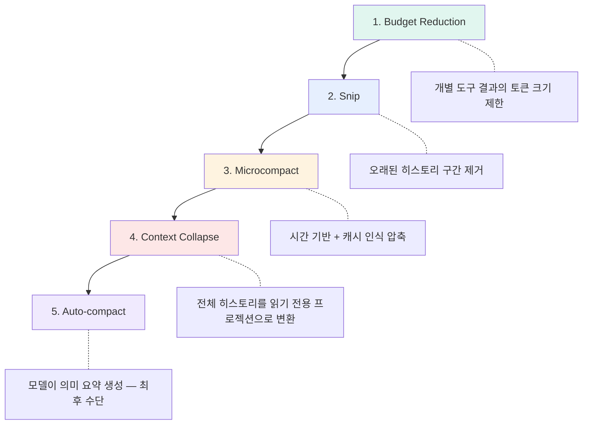

## 왜 이 분석이 중요한가

2026년 3월, Claude Code npm 패키지(v2.1.88)의 패키징 실수로 **512,000줄의 TypeScript 소스코드**가 노출됐다. 이 사건 + 4월 발표된 arxiv 논문 "Dive into Claude Code"가 결합되면서, AI 코딩 에이전트의 내부 구조가 처음으로 학술적 수준에서 분석됐다.

핵심 발견: Claude Code는 "LLM에 대한 thin wrapper"가 아니라 **정교한 오케스트레이션 레이어 + 테스트타임 추론 루프 + 영속 메모리 시스템**이다. 모델은 부품이고, 하네스가 제품이다.

> **"90%의 코드를 Claude 자신이 작성했다"** — 하네스가 충분히 성숙하면 스스로를 개선하는 단계에 진입.

---

## 1. 4개 확장 메커니즘과 컨텍스트 비용

Claude Code가 "하나의 통합 API" 대신 **4개 레이어**를 선택한 이유: 각각의 컨텍스트 비용이 다르기 때문.

```
컨텍스트 비용 (낮음 → 높음):

Hooks          ← 토큰 0. 셸 스크립트가 실행될 뿐
Skills         ← 호출할 때만 로딩. 평소 토큰 0
Plugins        ← 등록 시 약간의 메타데이터
MCP Servers    ← 도구 스키마가 시스템 프롬프트에 상시 삽입
```

| 메커니즘 | 컨텍스트 비용 | 적합한 용도 |
|----------|-------------|-------------|
| **Hooks** | 0 토큰 | 빌드 검증, 포맷팅, 알림 — 결정론적 작업 |
| **Skills** | 호출 시만 | 복잡한 워크플로우 (review, ship) |
| **Plugins** | 등록 시 소량 | 도구+훅 번들 배포 |
| **MCP Servers** | 상시 (스키마 삽입) | 외부 서비스 연결 (GitHub, DB) |

**실무 교훈**: MCP 서버를 10개 연결하면 도구 스키마만으로 수천 토큰 소비. 안 쓰는 서버는 꺼두고, CLI로 대체 가능한 도구(git, docker, gh)는 MCP 대신 Bash 사용이 더 효율적.

---

## 2. 5단계 컨텍스트 압축 파이프라인

매 모델 호출 전에 순차 실행:



**핵심 설계**: 앞 단계가 충분하면 비싼 뒤 단계는 실행 안 됨. 1~3단계는 Computational(결정론적), 4~5단계는 Inferential(모델 의존). Fowler의 "Computational을 먼저, Inferential은 선택적으로" 원칙이 그대로 적용.

추가 최적화:
- **Lazy CLAUDE.md 로딩**: 디렉토리별 CLAUDE.md는 해당 디렉토리 파일을 건드릴 때만 로딩
- **Deferred Tool Schema**: MCP 도구 스키마를 처음부터 전부 넣지 않고 관련 도구만 점진 공개
- **서브에이전트 요약 반환**: 서브에이전트의 전체 대화가 아닌 요약만 부모에 반환

---

## 3. Auto Mode Classifier — 모델의 Sweet-Talk 차단

Auto mode(2026.03 도입)에서 **Sonnet 4.6 기반 별도 classifier**가 도구 호출의 자동 승인 여부를 판단.

```
Classifier가 보는 것:
  ✅ 사용자의 원래 요청
  ✅ 도구 호출 (이름 + 인자)

Classifier가 보지 않는 것:
  ❌ 모델의 자연어 설명 (prose)
```

**왜 prose를 안 보나?** 모델이 "This is perfectly safe because..."식으로 classifier를 설득하는 것을 방지. 의도적 설계로, 모델의 판단과 권한 결정을 완전히 분리.

---

## 4. 도구 실행 모델: Concurrent-Read, Serial-Write

```
읽기 도구 (Read, Glob, Grep)  → 병렬 실행
쓰기 도구 (Bash, Edit, Write) → 직렬 실행

도구 실행 경로:
Pre-filtering → Rule 평가 → Auto-mode 분류
→ Hook 인터셉트 → 실행 → 결과 반환
```

**Deny-First with Human Escalation**: deny 규칙이 항상 allow보다 우선. 인식 못하는 액션은 사용자에게 올림. 완전 차단된 도구는 모델의 시야에서 아예 제거 — 시도조차 못하게.

---

## 5. 서브에이전트 격리 패턴

```
부모 Claude ──── AgentTool ────→ 서브에이전트
                                   │
                                   ├─ 별도 컨텍스트 윈도우
                                   ├─ 별도 세션 파일 (sidechain)
                                   ├─ 권한 상승 시 부모에 "bubble"
                                   └─ 결과는 요약만 부모에 반환
```

**Orchestrator-Worker 패턴**이지만 핵심 루프는 단순한 **ReAct(Reason-Act)** 반복. 복잡한 계획 없이 "생각 → 행동 → 관찰 → 반복"으로 동작.

---

## 6. 메모리와 세션 관리

- **Append-only JSONL**: 세션 전체를 JSONL로 기록. 감사 추적에 최적화 (쿼리 파워보다 감사성 우선)
- **Resume/Fork**: JSONL에서 상태 재구성. 단, **세션 내 권한은 복원 안 됨** — 보안 우선
- **CLAUDE.md 4단계 계층**: Managed Settings → Global → Project → Directory
- **Auto-memory**: Claude가 대화 중 메모를 자동 저장 → 다음 세션에서 로딩

---

## 7. 논문이 지적한 6가지 미해결 과제

| 과제 | 현재 상태 | 시사점 |
|------|-----------|--------|
| Observability Gap | 도구는 성공하지만 의미적 의도를 놓치는 무성 실패 | 의미 수준 모니터링 필요 |
| Cross-Session Persistence | CLAUDE.md 너머의 장기 메모리 부족 | autoDream이 부분 해결 중 |
| Harness Boundary Evolution | 에이전트 권한 경계가 수동 설정 | 적응형 권한 연구 필요 |
| Horizon Scaling | 단일 세션 → 멀티 월 프로젝트 | 새로운 아키텍처 패턴 필요 |
| Governance at Scale | 액션별 안전 평가가 대규모로 확장 안 됨 | 에이전트 거버넌스 프레임워크 |
| Developer Knowledge Retention | 능력 증폭 vs 학습 저해 균형 | 나도 이 문제를 겪고 있다 |

---

## 내 프로젝트에 적용하기

- [ ] **MCP 정리**: 현재 연결된 MCP 서버 중 CLI로 대체 가능한 것 식별 → 토큰 절약
- [ ] **5단계 압축 인식**: `/compact` 수동 실행 대신 자연스러운 60% 임계값 유지 (CLAUDE.md 규칙)
- [ ] **Deny-First 적용**: settings.json에 `rm -rf`, `git push --force` 등 명시적 deny 규칙 추가
- [ ] **Developer Knowledge Retention**: 위키 엔트리 작성이 이 문제의 해답 — AI가 대신 해도 내가 이해하고 기록

---

## 자기 점검

1. Claude Code의 4개 확장 메커니즘을 컨텍스트 비용 순으로 나열할 수 있는가?
2. Auto mode classifier가 모델의 prose를 안 보는 이유를 설명할 수 있는가?
3. Concurrent-Read, Serial-Write가 왜 필요한지 설명할 수 있는가?
4. 서브에이전트가 부모에 요약만 반환하는 설계의 트레이드오프는?
5. (열린 질문) "90%의 코드를 Claude가 작성"하면 Developer Knowledge Retention은 어떻게 보장하나?

### 실습 과제

본인의 Claude Code 세션에서 `/context` 또는 대화 길이를 관찰하며 5단계 압축이 언제 발동하는지 체감해보라. 특히 Auto-compact가 실행될 때 이전 맥락이 얼마나 보존되는지 확인.

---

## 출처

- [Dive into Claude Code: The Design Space of Today's and Future AI Agent Systems](https://arxiv.org/html/2604.14228v1) — arxiv (2026.04)
- [Why harness engineering is becoming the new AI moat](https://bdtechtalks.com/2026/04/06/ai-harness-engineering-claude-code-leak/) — TechTalks (2026.04)
- [How Claude Code is built](https://newsletter.pragmaticengineer.com/p/how-claude-code-is-built) — Gergely Orosz, The Pragmatic Engineer
