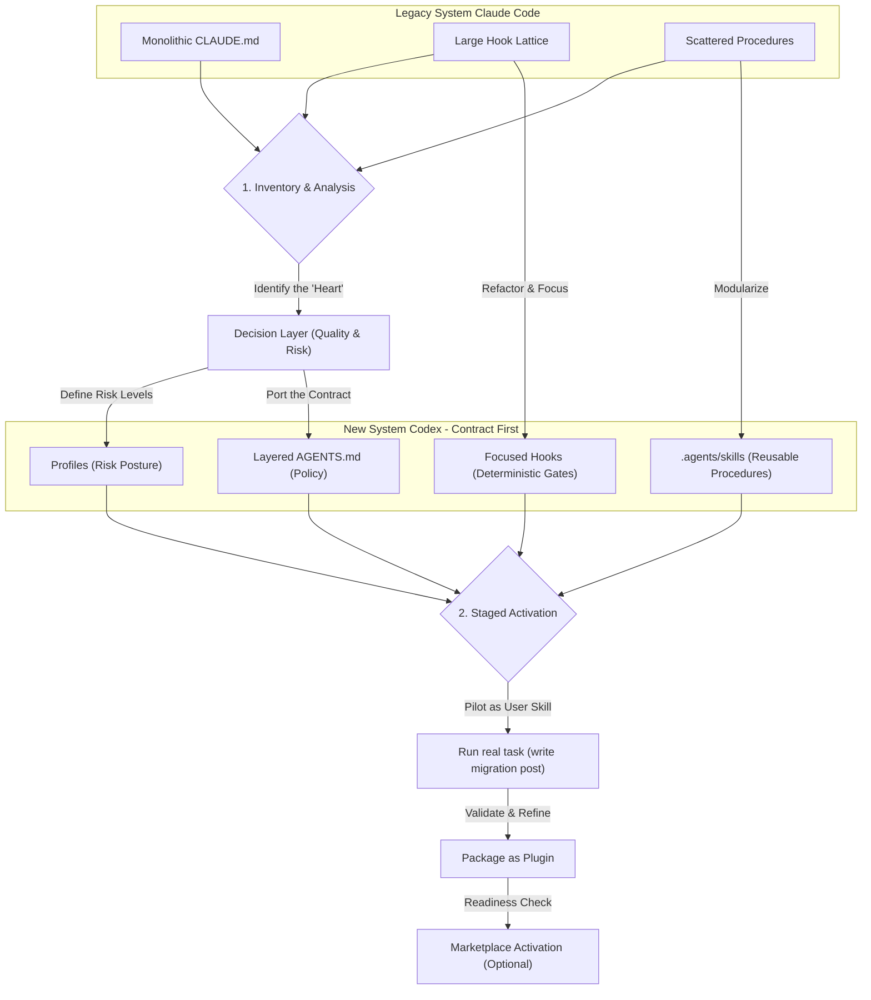

> 이 엔트리는 Blake Crosley의 [Claude Code to Codex Migration Guide 2026](https://blakecrosley.com/blog/claude-code-to-codex-migration)을 정독하고 핵심을 추출한 것이다.

Crosley는 이 글의 배경으로 자신의 이전 글들(예: Claude Code CLI 가이드, Codex CLI 가이드)을 지속적으로 인용하며, 일관된 개념 체계를 구축하고 있음을 보여준다.

### 왜 중요한가: 시스템의 '의도'를 마이그레이션하기

복잡하고 오래된 AI 에이전트 시스템(Claude Code)을 새로운 프레임워크(Codex)로 이전할 때, 단순히 파일 트리를 복사하거나 모든 기능을 1:1로 매핑하는 방식은 실패한다. 이러한 접근은 시스템의 복잡성만 그대로 옮길 뿐, 그 안에 담긴 운영 철학과 핵심 제어 로직을 놓치기 때문이다.

Crosley는 다수의 로컬 설정을 분석한 결과, 시스템의 진짜 '심장'은 가장 긴 파일이나 가장 영리한 스크립트가 아니라, **리스크 수준을 결정하고, 품질 원칙을 주입하며, 증거 기반의 완료를 강제하는 소수의 '의사결정 레이어'**임을 발견했다. 따라서 성공적인 마이그레이션은 코드 구현이 아닌, 이 운영 계약(operating contract)과 증명 의무(proof obligation)를 이식하는 데 초점을 맞춰야 한다.

### 핵심 패턴: 계약 우선 마이그레이션과 점진적 활성화

Crosley가 제시하는 마이그레이션의 핵심은 '단순 복사'가 아닌 '의도적 재설계'에 있다.

1.  **계약 우선 마이그레이션 (Contract-First Migration)**
    시스템의 동작을 규정하는 '계약'을 먼저 정의하고, 그에 맞춰 기존 자산을 재배치한다. 이는 파일 구조가 아닌 책임과 역할을 중심으로 시스템을 재구성하는 방식이다.

    *   **From (Claude Code)**: 흩어진 `CLAUDE.md` 규칙, 거대한 훅(hook) 격자.
    *   **To (Codex)**:
        *   **`AGENTS.md`**: 내구성이 강한 전역 정책과 프로젝트별 정책을 계층적으로 정의.
        *   **`Skills`**: 재사용 가능한 절차(예: 글쓰기, 인용, 평가)를 모듈화.
        *   **`Hooks`**: 결정론적 게이트(예: 민감 경로 차단, 약한 결과물 거부)에 집중된 가드레일.
        *   **`Profiles`**: 리스크 수준(예: 초안 작성용, 공개 발행용)에 따른 동작 모드.

2.  **점진적 활성화 및 자체 검증 (Staged Activation & Self-Verification)**
    마이그레이션된 워크플로우를 처음부터 시스템의 기본값으로 만들지 않는다. 대신, 명시적으로 호출되는 사용자 스킬(user skill)로 먼저 구현하고, 실제 작업을 통해 검증한다.

    *   **1단계 (파일럿):** 마이그레이션할 워크플로우를 명시적으로만 호출 가능한 스킬로 포팅한다.
    *   **2단계 (실전 테스트):** 이 스킬을 사용해 실제 결과물(이 블로그 글 자체)을 생성하며 문제점을 수정한다.
    *   **3단계 (패키징):** 검증된 스킬을 공유 가능한 플러그인 패키지로 만든다.
    *   **4단계 (준비 상태 확인):** 패키지가 마켓플레이스에 활성화되기 전, 자체 준비 상태 검사를 통과해야 한다.
    *   **5단계 (기본값 전환):** 모든 검증이 끝난 후에야 해당 워크플로우를 시스템의 기본 동작으로 전환하는 것을 고려한다.

    이 방식은 실제 사용 사례를 통해 시스템을 학습시키고, 프라이빗한 워크플로우의 세부 구현을 외부에 노출하지 않으면서 안정적으로 전환할 수 있게 한다.

### Mermaid: Claude Code에서 Codex로의 개념적 마이그레이션 흐름



### 실전 적용: `ai-study` 위키 콘텐츠 생성 시스템 고도화

현재 `ai-study` 프로젝트의 콘텐츠 생성 프로세스가 여러 개의 프롬프트 파일과 스크립트로 흩어져 있다고 가정하자. 이를 Crosley의 'Codex' 모델처럼 구조화된 에이전트 시스템으로 마이그레이션하는 시나리오를 구상할 수 있다.

1.  **계약 정의 (`AGENTS.md` 역할)**:
    *   `~/.ai-study/agents.md` (전역): "모든 엔트리는 반드시 출처를 명시해야 한다.", "Mermaid 다이어그램은 5대 함정을 준수해야 한다."
    *   `./moneyflow/agents.md` (프로젝트): "moneyflow 관련 엔트리는 '실전 적용' 섹션에 반드시 TypeScript 코드 예시를 포함해야 한다."

2.  **재사용 스킬 (`Skills` 역할)**:
    *   `summarize_blog_post.ts`: URL을 입력받아 핵심 내용을 요약하는 스킬.
    *   `generate_mdx_entry.ts`: 요약본과 메타데이터를 받아 `ai-study` 형식의 MDX로 변환하는 스킬.
    *   `validate_mermaid.ts`: Mermaid 코드의 구문 오류를 검사하는 스킬.

3.  **결정론적 게이트 (`Hooks` 역할)**:
    마이그레이션의 핵심은 결정론적 품질 검사를 자동화하는 것이다. 예를 들어, 콘텐츠 발행 전 `PrePublish` 훅을 정의할 수 있다.

    ```typescript
    // src/hooks/prePublishHook.ts
    
    interface MdxEntry {
      content: string;
      metadata: {
        sourceUrl?: string;
      };
    }
    
    /**
     * @description A deterministic Stop hook that blocks publication 
     * if critical quality gates are not met.
     * This follows Crosley's pattern of using focused hooks as guardrails.
     */
    export function prePublishCitationCheck(entry: MdxEntry): { success: boolean; message: string } {
      const hasCitation = entry.content.includes("이 엔트리는") && entry.metadata.sourceUrl;
    
      if (!hasCitation) {
        return {
          success: false,
          // Stop hook: Refuse weak completion.
          message: "Publication rejected: Missing mandatory source citation.",
        };
      }
    
      return { success: true, message: "Citation check passed." };
    }
    ```
    이 훅은 복잡한 LLM 판단 없이, '출처 인용문이 있는가'라는 명확한 규칙만 검사한다. 이는 Crosley가 말한 '안전 모델 전체가 아닌, 하나의 가드레일로서의 훅' 철학과 일치한다. 이처럼 작은 단위의 검증을 자동화함으로써, 전체 시스템의 신뢰도를 점진적으로 높일 수 있다.