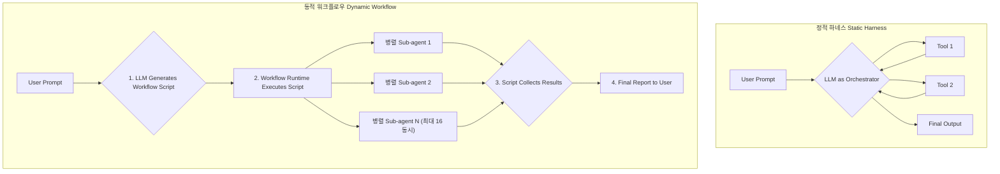

정적(Static) 하네스 엔지니어링은 AI 에이전트에 예측 가능성과 안정성을 부여했지만, 동시에 스스로의 한계를 명확히 했습니다. 미리 정의된 도구와 워크플로우는 익숙한 문제를 효율적으로 해결하지만, 범위가 넓고 복잡하며 예측 불가능한 실제 소프트웨어 엔지니어링 태스크 앞에서는 취약합니다. "수백 개 파일에 걸친 코드 마이그레이션"이나 "코드베이스 전역의 보안 취약점 감사" 같은 작업은 단일 에이전트의 컨텍스트 윈도우와 사전 정의된 능력만으로는 완수하기 어렵습니다. 이 문제를 해결하기 위해 등장한 것이 바로 Claude Code의 '동적 워크플로우(Dynamic Workflows)'입니다. 이는 에이전트가 단순히 도구를 '사용'하는 것을 넘어, 주어진 작업에 최적화된 실행 계획, 즉 '워크플로우' 자체를 즉석에서 코드로 생성하고 실행하는 패러다임의 전환입니다.

## 정적 하네스에서 동적 워크플로우로의 전환

기존의 에이전트 아키텍처는 대부분 '정적 하네스'에 기반합니다. 개발자가 미리 정의한 도구 세트와 실행 로직을 에이전트가 따라가는 구조입니다. 이는 안정적이지만, 에이전트의 지능과 자율성을 '오케스트레이터'인 모델의 컨텍스트 윈도우 안에 가두는 결과를 낳았습니다. 모든 중간 결과와 다음 단계에 대한 결정이 컨텍스트에 누적되면서 복잡한 작업에서는 필연적으로 한계에 부딪힙니다.

Claude Code의 동적 워크플로우는 이 제약을 근본적으로 해결합니다. 오케스트레이션의 책임을 모델의 추론에서 분리하여, 실행 가능한 코드(JavaScript 스크립트)로 옮깁니다.

1.  **계획 수립 및 스크립트 생성**: 사용자가 "전체 코드베이스에서 X 라이브러리를 Y로 마이그레이션하는 워크플로우를 만들어줘"와 같이 복잡한 작업을 요청하면, Claude는 단순히 작업을 시작하는 대신 먼저 전체 계획을 담은 오케스트레이션 스크립트를 작성합니다.
2.  **워크플로우 실행**: 생성된 스크립트는 Claude Code 런타임에 의해 별도의 격리된 환경에서 실행됩니다.
3.  **병렬 서브에이전트(Sub-agent) 실행**: 스크립트는 수십, 수백 개의 서브에이전트를 병렬로 실행하여 작업을 분배합니다. 예를 들어, 각 서브에이전트는 특정 디렉토리나 파일 그룹의 마이그레이션을 책임집니다.
4.  **결과 취합 및 보고**: 각 서브에이전트의 중간 결과는 스크립트 내 변수에 저장되며, 모델의 컨텍스트를 오염시키지 않습니다. 모든 작업이 완료되면, 워크플로우는 최종 결과만을 취합하여 사용자에게 보고합니다.

이 방식은 오케스트레이션 로직을 컨텍스트 윈도우의 제약에서 해방시켜, 더 큰 복잡도의 작업을 수행할 수 있는 기반을 마련합니다.

> **실제 제약 (2026-05 리서치 프리뷰 기준)**: "수백 개를 동시에"라는 표현은 과장이다. Anthropic 문서에 따르면 한 워크플로우는 **총 1,000개까지의 에이전트**를 조율할 수 있지만, **동시 병렬 실행은 최대 16개**로 제한된다 (평균적인 로컬 머신 리소스 안에 머물도록 튜닝된 상한). 즉 "1,000개 분산"은 누적 처리량이고, 순간 병렬도는 16이다. 트리거는 프롬프트에 단어 `workflow`를 포함하는 것이며, 유료 플랜 + Claude Code v2.1.154 이상이 필요하다. 코드베이스 감사, 대규모 마이그레이션, 교차 검증 리서치가 대표 용도다.



### 동적 워크플로우와 기존 접근법 비교

| 항목 | 정적 하네스 (Sub-agents, Skills) | 동적 워크플로우 (Dynamic Workflows) |
| --- | --- | --- |
| **오케스트레이터** | LLM (매 턴마다 추론) | 코드 (생성된 JavaScript 스크립트) |
| **상태 관리** | LLM의 컨텍스트 윈도우 | 스크립트 내 변수 (컨텍스트 절약) |
| **확장성** | 컨텍스트 윈도우 크기에 의해 제한됨 | 총 1,000 에이전트까지 누적 처리 (동시 병렬도는 16 상한) |
| **재현성** | LLM의 비결정성으로 인해 낮음 | 스크립트가 동일하므로 높음 |
| **적합한 작업** | 2-3 단계로 끝나는 간단한 작업 | 수백 개 파일 수정, 코드베이스 전체 감사 등 대규모 작업 |
| **디버깅** | 대화 기록을 통해 추론 과정 분석 | 생성된 워크플로우 스크립트(`~/.claude/projects/`)를 직접 검토 |

## iOS 프로젝트에서의 적용: `aidy-ios` 리팩토링 시나리오

`aidy-ios` 프로젝트가 레거시 `LegacyNetworking` 모듈을 최신 `ModernNetworkKit`으로 마이그레이션해야 하는 상황을 가정해 보겠습니다. 이 작업은 26개의 마이크로피처 모듈 전반에 걸쳐 수백 개의 파일을 수정해야 합니다.

정적 하네스로는 이 작업을 자동화하기 어렵습니다. 한두 개의 파일을 수정하는 것은 가능하지만, 전체 프로젝트의 일관성을 유지하며 작업을 진행하고 검증하는 것은 단일 컨텍스트 윈도우의 능력을 넘어섭니다.

동적 워크플로우를 사용하면 다음과 같은 접근이 가능합니다.

1.  **워크플로우 생성 요청**: `"aidy-ios 프로젝트의 모든 모듈에서 LegacyNetworking import를 찾아 ModernNetworkKit으로 교체하고, API 호출 패턴을 수정한 후 각 모듈의 테스트를 실행하는 워크플로우를 생성해줘."`
2.  **Claude의 워크플로우 스크립트 생성**: Claude는 다음과 같은 논리를 포함한 JavaScript 워크플로우를 생성합니다.
    *   **Phase 1: 분석**: 프로젝트 전체를 스캔하여 `LegacyNetworking`을 사용하는 파일 목록을 생성한다.
    *   **Phase 2: 병렬 변환**: 파일 목록을 10개의 그룹으로 나누고, 10개의 서브에이전트를 병렬 실행하여 각 그룹의 코드를 변환한다.
    *   **Phase 3: 병렬 검증**: 각 서브에이전트는 코드 변환 후 담당 모듈의 유닛 테스트를 실행한다. (`xcodebuild test ...`)
    *   **Phase 4: adversarial 리뷰**: 테스트에 실패한 경우, 별도의 '리뷰어' 에이전트를 실행하여 실패 원인을 분석하고 수정을 제안한다.
    *   **Phase 5: 보고**: 모든 모듈의 테스트가 통과하면, 변경된 파일 목록과 테스트 결과를 요약하여 최종 보고서를 생성한다.
3.  **실행 및 모니터링**: 사용자는 `/workflows` 명령어로 진행 상황을 모니터링하고, 최종적으로 단일 PR로 제출될 결과물을 얻게 됩니다.

이러한 접근은 iOS 개발자가 직접 스크립트를 짜거나 수동으로 리팩토링하는 대신, AI에게 고수준의 목표를 제시하고 실행 계획의 생성과 실행 자체를 위임할 수 있게 합니다.

개념적으로, 워크플로우의 각 단계를 실행하는 Swift 코드는 다음과 같이 구조화될 수 있습니다. AI는 이 구조를 이해하고, 각 단계에 맞는 파라미터를 채운 JSON과 같은 데이터를 생성하여 워크플로우를 구성합니다.

```swift
// 개념 증명을 위한 Swift 의사 코드

// AI가 생성할 워크플로우의 각 단계를 정의하는 프로토콜
protocol WorkflowStep {
    var description: String { get }
    func execute() async throws -> StepResult
}

// 각 단계의 실행 결과를 담는 구조체
struct StepResult {
    let isSuccess: Bool
    let message: String
    let outputFiles: [URL]?
}

// 실제 작업을 수행하는 구체적인 스텝들
struct FindLegacyUsageStep: WorkflowStep {
    let projectRoot: URL
    // ...
    func execute() async throws -> StepResult {
        // `grep`이나 SourceKit을 사용해 레거시 API 사용처 탐색
        print("Executing: \(description)")
        // ...
        return StepResult(isSuccess: true, message: "Found 152 files.", outputFiles: nil)
    }
}

struct RefactorFileStep: WorkflowStep {
    let fileURL: URL
    // ...
    func execute() async throws -> StepResult {
        // LLM을 호출하여 특정 파일의 코드 변환
        print("Executing: \(description)")
        // ...
        return StepResult(isSuccess: true, message: "Refactored \(fileURL.lastPathComponent)", outputFiles: [fileURL])
    }
}

// AI가 생성한 워크플로우 스크립트를 실행하는 실행기
class DynamicWorkflowExecutor {
    // AI는 이 `run` 함수에 전달될 `steps` 배열을 동적으로 생성
    func run(steps: [WorkflowStep]) async {
        for step in steps {
            do {
                let result = try await step.execute()
                if !result.isSuccess {
                    print("Step failed: \(step.description). Reason: \(result.message)")
                    // 실패 시 복구 로직 또는 워크플로우 중단
                    break
                }
            } catch {
                print("Critical error executing step \(step.description): \(error)")
                break
            }
        }
    }
}
```

## 대규모 분산: Fan-out과 조건부 동적 태스크 생성

동적 워크플로우의 진짜 레버리지는 단순 병렬 실행이 아니라 **결과에 따라 후속 작업을 동적으로 만들어내는** 데 있습니다. 정적 DAG는 실행 전 모든 분기를 알아야 하지만, 동적 워크플로우는 중간 결과를 보고 다음 단계를 결정합니다.

대표 패턴은 **Fan-out 후 조건부 Spawn**입니다. "모든 모듈에 SwiftLint를 돌리고, 경고가 10개 이상인 모듈만 리팩토링 에이전트에 넘겨라"를 예로 들면:

1. **계획 생성**: Claude가 모듈 디렉토리를 배열로 수집하는 JavaScript를 생성한다.
2. **Fan-out**: 각 모듈에 대해 lint 서브에이전트를 병렬로 띄운다. 단 순간 병렬도는 런타임이 16으로 캡한다 — 모듈이 50개여도 한 번에 16개씩 배치로 흘려보낸다.
3. **결과 수집 및 분기**: 모든 lint 결과를 스크립트 변수에 모아 경고 수를 순회한다.
4. **동적 태스크 생성**: 임계값(10)을 넘긴 모듈에 대해서만 새 `RefactoringAgent`를 동적으로 생성한다.

핵심은 4단계가 1~3단계의 *런타임 결과*에 의존한다는 점입니다. 이 분기 로직이 LLM 컨텍스트가 아니라 스크립트 변수에 있으므로, 모듈이 몇 개든 컨텍스트 오염 없이 처리됩니다. 개념을 Swift `TaskGroup`으로 옮기면 다음과 같습니다 (실제 런타임은 JavaScript).

```swift
// 개념적 Swift 의사코드 — 실제 Claude Code 런타임은 JavaScript
class LintAndRefactorWorkflow {
    let modules: [String]
    private var lintingResults: [String: Int] = [:] // [모듈명: 경고 수]

    func run() async {
        // Phase 1: Fan-out — 병렬 Lint (런타임이 동시 16개로 배치 분할)
        await withTaskGroup(of: (String, Int).self) { group in
            for module in modules {
                group.addTask {
                    let agent = LintingAgent(moduleName: module)
                    return (module, await agent.execute())
                }
            }
            for await (module, count) in group {
                lintingResults[module] = count
            }
        }

        // Phase 2: 결과 취합 후 조건부 동적 Spawn
        for (module, count) in lintingResults where count > 10 {
            let refactorAgent = RefactoringAgent(moduleName: module)
            await refactorAgent.execute() // 실제로는 별도 배치 큐에 등록
        }
    }
}
```

### 에이전트 라우팅 전략

대규모 작업은 단일 유형 에이전트로 끝나지 않습니다. 분석·수정·테스트·문서화 각각 전문 에이전트가 필요하고, 오케스트레이터는 이들 사이의 작업을 라우팅합니다. 라우팅 모델은 분산 시스템과 동일한 트레이드오프를 가집니다.

| 라우팅 전략 | 장점 | 단점 | `aidy-ios` 적용 예 |
| :--- | :--- | :--- | :--- |
| **중앙 집중형 오케스트레이터** | 일관된 결정, 전체 상태 추적 용이, 디버깅 단순 | 오케스트레이터가 단일 실패 지점(SPOF)·병목이 됨 | `aidy-architect`가 모놀리스 분석 후 추출·의존성수정·테스트 에이전트에 명시적 할당 |
| **분산형 코레오그래피** | 확장성 높음, SPOF 없음, 느슨한 결합 | 전체 상태 파악 어려움, 연쇄 반응 예측 곤란, 디버깅 복잡 | 커밋 에이전트가 푸시하면 빌드·테스트 에이전트가 독립적으로 반응 |
| **하이브리드** | 중앙의 예측 가능성 + 분산의 확장성 | 아키텍처 복잡도 증가, 상호작용 지점 설계 난이도 | `aidy-architect`가 계획·할당(중앙)하되, 테스트 실패 시 수정·리뷰 에이전트가 직접 통신(분산) |

Anthropic의 동적 워크플로우는 현재 **중앙 집중형 오케스트레이터**에 가깝습니다. Claude가 생성한 단일 JavaScript 스크립트가 전체 워크플로우를 통제하고 모든 서브에이전트의 생명주기를 관리합니다. 예측 가능성과 제어가 쉬운 대신, 스크립트가 복잡해질수록 그 스크립트 자체가 유지보수 부담이 된다는 트레이드오프가 있습니다.

### 회복탄력성: 실패를 동적으로 흡수하기

정적 워크플로우는 한 단계가 깨지면 전체가 멈춥니다. 동적 워크플로우는 **실패를 런타임 분기의 입력으로 다룹니다.** 예를 들어 모놀리스를 다수 모듈로 분해하다 `DependencyFixerAgent`가 예상 못 한 컴파일 에러를 만나면, 스크립트는 중단되는 대신 재시도(Retry) 루프를 돌거나 `BugFixerAgent`를 동적으로 호출해 문제를 해결하도록 설계할 수 있습니다. 이 적응성이 정적 워크플로우가 줄 수 없는 핵심 가치입니다. 단, 재시도 루프와 동적 spawn은 비용·무한 루프 위험을 동반하므로 반드시 횟수 상한과 가드레일을 함께 둬야 합니다 (아래 트레이드오프 참조).

## 트레이드오프와 한계

동적 워크플로우는 강력하지만 만능은 아닙니다.

*   **비용**: 수십, 수백 개의 서브에이전트를 병렬로 실행하는 것은 상당한 토큰 비용을 발생시킵니다. 간단한 작업에 사용하는 것은 비효율적입니다.
*   **예측 불가능성**: 워크플로우 스크립트 자체가 LLM에 의해 생성되므로, 때로는 비효율적이거나 잘못된 실행 계획이 만들어질 수 있습니다. 생성된 스크립트를 실행 전에 검토하는 것이 중요합니다.
*   **디버깅 복잡성**: 작업이 실패했을 때, 원인이 모델의 추론 오류인지, 생성된 스크립트의 로직 오류인지, 아니면 서브에이전트의 실행 실패인지 파악하기가 더 복잡합니다.
*   **무한 루프·비용 폭증 위험**: 재시도 루프와 조건부 동적 spawn은 가드레일이 없으면 폭주합니다. 재시도 횟수 상한, 총 에이전트 예산(런타임 1,000 캡 외에 작업 단위 예산), spawn 깊이 제한을 스크립트에 명시해야 합니다.
*   **과잉 엔지니어링**: 모든 문제를 동적 워크플로우로 해결하려는 것은 바람직하지 않습니다. 작업이 2-3단계로 명확하게 정의될 수 있다면, 기존의 스킬(Skill)이나 정적 하네스가 더 비용 효율적이고 예측 가능합니다.

결론적으로, 동적 하네스 엔지니어링은 AI 에이전트의 자율성과 문제 해결 능력의 범위를 한 차원 높였습니다. 엔지니어의 역할은 마이크로매니징에서 벗어나, 복잡한 목표를 설정하고 AI가 생성한 실행 계획을 검토 및 승인하는 거시적인 방향으로 전환되고 있습니다.

## 자기 점검

*   동적 워크플로우가 정적 하네스에 비해 가지는 가장 큰 아키텍처적 차이점은 무엇이며, 이것이 확장성에 어떤 영향을 미칩니까?
*   "LLM의 비결정성"이 동적 워크플로우의 재현성 문제에 어떤 영향을 미치며, 생성된 '스크립트'를 저장하고 재사용하는 것이 왜 중요한 해결책이 될 수 있습니까?
*   Anthropic의 'Constitutional AI' 원칙이, 에이전트가 자율적으로 워크플로우를 생성하고 실행할 때 발생할 수 있는 잠재적 위험을 어떻게 완화할 수 있을까요?
*   현재 진행 중인 iOS 프로젝트에서 반복적으로 발생하는 가장 복잡하고 시간이 많이 소요되는 작업을 하나 선정하세요. 해당 작업을 자동화하기 위한 동적 워크플로우의 주요 단계를 (Phase 1, 2, 3...) 어떻게 설계하시겠습니까?