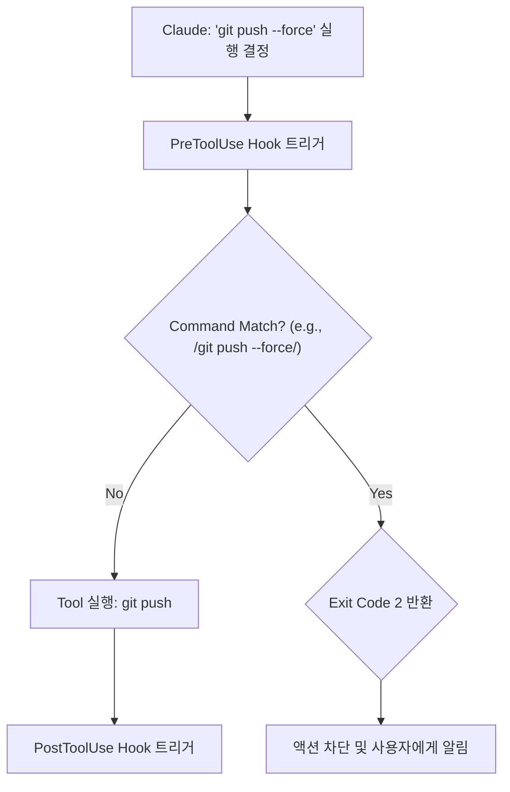

> 이 엔트리는 Blake Crosley의 [Hooks Tutorial: 5 Production Hooks](https://blakecrosley.com/blog/claude-code-hooks-tutorial)을 정독하고 핵심을 추출한 것이다.

## Claude Code Hooks: LLM 에이전트를 위한 결정론적 가드레일

LLM 기반 코딩 에이전트는 놀라운 생산성을 제공하지만, 그 비결정성(non-deterministic) 때문에 때때로 예측 불가능한 실수를 저지릅니다. 예를 들어, 포맷터를 건너뛰거나, 테스트가 실패하는 코드를 커밋하거나, 심지어 `main` 브랜치에 강제 푸시를 시도할 수도 있습니다.

Claude Code Hooks는 이러한 LLM의 "엣지 케이스"를 제거하는 결정론적(deterministic) 안전장치입니다. 프롬프트나 모델의 해석에 의존하지 않고, 에이전트의 특정 작업(tool use) 라이프사이클에 맞춰 예외 없이 실행되는 셸 스크립트입니다. Blake Crosley는 "모든 훅은 과거의 실패가 남긴 흉터(every hook is a scar)"라고 표현하며, 훅이 실제 프로덕션 환경에서 AI 에이전트의 신뢰성을 보장하는 핵심 장치임을 강조합니다.

### 핵심 패턴: 세 가지 보증(Guarantees) 모델

훅을 작성하기 전, 어떤 종류의 보증이 필요한지 정의하는 것이 중요합니다. 이는 Git Hooks의 `pre-commit`, `pre-push` 철학을 AI 에이전트의 모든 행동으로 확장한 개념입니다.

1.  **안전 보증 (Safety Guarantees): 예방**
    - **목적**: 위험한 작업이 실행되기 *전*에 차단합니다.
    - **메커니즘**: `PreToolUse` 훅을 사용해 특정 명령 패턴을 감지하고, `exit 2`를 반환하여 작업을 중단시킵니다. `exit 1`은 경고만 출력하고 작업을 허용하므로, 강제성을 위해서는 반드시 `exit 2`를 사용해야 합니다.
    - **사례**: `git push --force`나 `rm -rf /` 같은 파괴적인 명령어를 원천 차단합니다.

2.  **포맷팅 보증 (Formatting Guarantees): 교정**
    - **목적**: 작업이 완료된 *후*에 일관성을 강제합니다.
    - **메커니즘**: `PostToolUse` 훅을 사용해 파일이 생성되거나 수정될 때마다 포맷터를 실행합니다. 모델이 포맷팅 단계를 잊더라도 훅이 자동으로 교정합니다.
    - **사례**: Claude가 `.ts` 파일을 수정할 때마다 `npx prettier --write`를 실행하여 코드 스타일을 통일합니다.

3.  **품질 보증 (Quality Guarantees): 검증**
    - **목적**: 커밋이나 배포 같은 중요한 결정 지점에서 코드의 상태를 검증합니다.
    - **메커니즘**: `PreToolUse` 훅을 `git commit` 같은 특정 명령어에 연결하여 린터나 테스트 스위트를 실행합니다. 실패 시 `exit 2`로 커밋을 막습니다.
    - **사례**: 커밋 직전에 `eslint`와 `jest`를 실행하여 통과하지 못하면 커밋을 차단합니다.

아래 다이어그램은 '안전 보증' 훅이 어떻게 `git push --force` 명령을 차단하는지 보여줍니다.



### 실전 적용: ai-study 프로젝트의 Pre-Commit 품질 훅

`ai-study` 프로젝트에 기여하는 Claude 에이전트가 린트 규칙을 위반하는 TypeScript 코드를 커밋하는 것을 방지하는 시나리오입니다. 프로젝트 루트의 `.claude/settings.json`에 아래 설정을 추가하여 모든 팀원과 에이전트에게 동일한 품질 게이트를 적용할 수 있습니다.

**1. 훅 설정 (`.claude/settings.json`)**

`Bash` 도구를 사용할 때마다 `pre-commit-check.sh` 스크립트를 실행하도록 설정합니다.

```json
{
  "hooks": {
    "PreToolUse": [
      {
        "matcher": "Bash",
        "hooks": [
          {
            "type": "command",
            "command": "./.claude/hooks/pre-commit-check.sh"
          }
        ]
      }
    ]
  }
}
```

**2. 훅 스크립트 (`.claude/hooks/pre-commit-check.sh`)**

이 스크립트는 Claude 에이전트가 실행하려는 명령어를 `stdin`으로 받아 분석합니다. `git commit` 명령어일 경우에만 린트와 포맷 검사를 실행하고, 실패 시 `exit 2`를 반환하여 커밋을 막습니다.

```bash
#!/bin/bash

# stdin으로부터 JSON 입력을 읽음
INPUT=$(cat)

# jq를 사용해 command 파라미터 추출
COMMAND=$(echo "$INPUT" | jq -r '.parameters.command')

# 명령어가 'git commit'으로 시작하는지 확인
if [[ $COMMAND == "git commit"* ]]; then
  echo "Running pre-commit checks for ai-study..."

  # TypeScript 린트 및 포맷 검사 실행
  npx eslint . --ext .ts && npx prettier --check .
  
  # 위 명령의 종료 코드를 확인
  if [ $? -ne 0 ]; then
    echo "Pre-commit checks failed. Commit aborted."
    exit 2 # 중요: 커밋을 차단
  else
    echo "Pre-commit checks passed."
    exit 0 # 성공: 커밋을 허용
  fi
fi

# git commit이 아닌 다른 모든 명령어는 통과
exit 0
```

이 설정 하나만으로, `ai-study` 프로젝트에 참여하는 모든 AI 에이전트(및 개발자)는 코드 품질 표준을 강제적으로 준수하게 됩니다. 이는 LLM의 비결정성을 제어하고 프로덕션 수준의 안정성을 확보하는 강력한 방법입니다.

---
이 엔트리는 Blake Crosley의 블로그 포스트 [Claude Code Hooks Tutorial: 5 Production Hooks From Scratch](https://www.blakecrosley.com/blog/claude-code-hooks-tutorial/)를 정독하고 핵심을 추출한 것입니다.