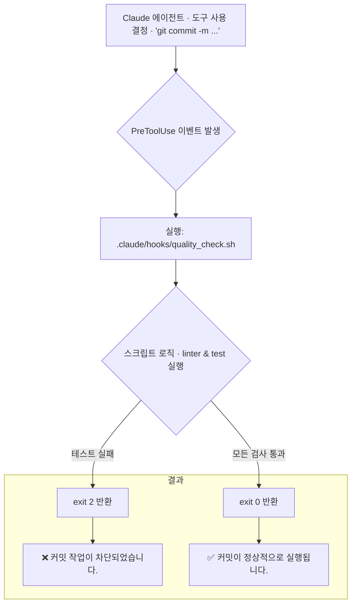

> 이 엔트리는 Blake Crosley의 [Hooks Tutorial: 5 Production Hooks](https://blakecrosley.com/blog/claude-code-hooks-tutorial)을 정독하고 핵심을 추출한 것이다.

## Claude 코드 훅: AI 에이전트를 위한 결정론적 가드레일

LLM 기반 코딩 에이전트는 대부분의 경우 올바르게 작동하지만, `main` 브랜치에 강제 푸시하거나, 포맷터를 건너뛰거나, 린트(lint) 검사를 실패한 코드를 커밋하는 등의 엣지 케이스에서 실수를 저지릅니다. 이런 확률적인 실수는 프로덕션 환경에서 용납될 수 없습니다.

Claude 코드 훅(Hooks)은 에이전트의 워크플로우 17개의 라이프사이클 지점에 결정론적인 게이트(deterministic gate)를 추가하여 이러한 엣지 케이스를 원천 차단합니다. 프롬프트나 모델의 예측 불가능한 동작과 무관하게, 이 훅들은 예외 없이 항상 실행되어 시스템의 안정성과 코드 품질을 보장합니다.

### 핵심 패턴: 세 가지 보증(Guarantees)

훅을 작성하기 전, 어떤 종류의 '보증'이 필요한지 정의해야 합니다. Blake Crosley는 이를 Git 훅의 철학(`pre-commit`, `pre-push`)을 에이전트의 모든 행동으로 확장한 개념으로 설명하며, 세 가지 핵심 보증 패턴으로 분류합니다.

1.  **포맷팅 보증 (Formatting Guarantees)**
    -   **목적**: 일관성 유지. 에이전트가 생성한 코드의 스타일을 프로젝트 표준에 맞춥니다.
    -   **시점**: `PostToolUse` (도구 사용 후). 파일 쓰기(`Write`/`Edit`) 작업이 완료된 직후에 실행됩니다.
    -   **동작**: 모델의 결과물과 상관없이 포맷터(e.g., Prettier, Black)가 모든 것을 정규화합니다. 멱등성(idempotent)이 보장되어야 합니다.

2.  **안전 보증 (Safety Guarantees)**
    -   **목적**: 위험 방지. 파괴적인 액션이 실행되기 전에 차단합니다.
    -   **시점**: `PreToolUse` (도구 사용 전). `Bash`와 같은 도구가 실행되기 직전에 가로챕니다.
    -   **동작**: `git push --force`나 `rm -rf /` 같은 위험한 명령어 패턴을 감지하고 `exit 2`를 반환하여 작업을 즉시 중단시킵니다. 이 훅은 500ms 이내로 매우 빨라야 하며, 경고만 하는 `exit 1`이 아닌 **반드시 `exit 2`를 사용해야** 실질적인 방어막이 됩니다.

3.  **품질 보증 (Quality Guarantees)**
    -   **목적**: 상태 검증. 커밋이나 배포 같은 중요한 결정 지점에서 코드 품질을 검사합니다.
    -   **시점**: `PreToolUse`. `git commit`과 같은 특정 명령어 실행 전에 실행됩니다.
    -   **동작**: 린터나 테스트 스위트를 실행하고, 품질 기준을 통과하지 못하면 커밋을 차단합니다. 매 편집마다 실행되는 포맷팅 훅과 달리, 특정 시점에만 실행되어 오버헤드를 최소화합니다.

### Claude 코드 훅의 생명주기 및 차단 메커니즘



훅은 프로젝트 루트의 `.claude/settings.json` 또는 사용자 홈의 `~/.claude/settings.json`에 설정합니다. `matcher`에 정규식으로 도구 이름(e.g., `Bash`, `Write|Edit`)을 지정하고, 실행할 `command`를 정의합니다.

### 실전 적용: ai-study 프로젝트 품질 보증 훅

`ai-study` 프로젝트는 MDX 파일로 기술 문서를 관리합니다. 새로운 글이 추가될 때 frontmatter에 `title`과 `date`가 누락되는 실수를 방지하기 위해, Claude 에이전트가 `git commit`을 시도할 때 이를 검증하는 품질 보증 훅을 적용할 수 있습니다.

**1. 훅 설정 (`.claude/settings.json`)**

```json
{
  "hooks": {
    "PreToolUse": [
      {
        "matcher": "Bash",
        "hooks": [
          {
            "type": "command",
            "command": "bash .claude/hooks/pre-commit-check.sh"
          }
        ]
      }
    ]
  }
}
```

**2. 훅 스크립트 (`.claude/hooks/pre-commit-check.sh`)**

`git commit` 명령이 아닐 경우 즉시 `exit 0`을 반환해 다른 `Bash` 사용에 영향을 주지 않도록 합니다. 이 스크립트는 `yq`와 같은 도구를 사용하거나 간단한 `grep`으로 frontmatter를 검사할 수 있습니다. 아래는 Node.js와 TypeScript로 작성된 검사 스크립트 예시를 셸에서 호출하는 방식입니다.

```bash
#!/bin/bash

# stdin으로부터 JSON 입력을 읽어옴
INPUT_JSON=$(cat)
COMMAND=$(echo "$INPUT_JSON" | jq -r '.parameters.command')

# git commit 명령이 아니면 훅을 적용하지 않음
if [[ ! "$COMMAND" =~ ^git\ commit ]]; then
  exit 0 # 허용
fi

# 스테이징된 .mdx 파일 목록 가져오기
STAGED_MDX_FILES=$(git diff --cached --name-only --diff-filter=ACM | grep '\.mdx$')

if [ -z "$STAGED_MDX_FILES" ]; then
  exit 0 # 변경된 mdx 파일 없음, 허용
fi

# TypeScript 검증 스크립트 실행
# ts-node가 설치되어 있어야 함
npx ts-node .claude/hooks/validate-frontmatter.ts $STAGED_MDX_FILES
VALIDATION_RESULT=$?

if [ $VALIDATION_RESULT -ne 0 ]; then
  echo "🔥 품질 검사 실패: 일부 MDX 파일의 frontmatter가 유효하지 않습니다."
  exit 2 # 차단
else
  echo "✅ 품질 검사 통과."
  exit 0 # 허용
fi
```

**3. TypeScript 검증 로직 (`.claude/hooks/validate-frontmatter.ts`)**

```typescript
import * as fs from 'fs';
import * as path from 'path';
import matter from 'gray-matter'; // gray-matter 라이브러리 필요

const stagedFiles = process.argv.slice(2);
let allValid = true;

for (const file of stagedFiles) {
  const content = fs.readFileSync(file, 'utf8');
  const { data: frontmatter } = matter(content);

  if (!frontmatter.title || !frontmatter.date) {
    console.error(`❌ [${path.basename(file)}] FAILED: 'title' 또는 'date'가 frontmatter에 없습니다.`);
    allValid = false;
  } else {
    console.log(`✅ [${path.basename(file)}] PASSED`);
  }
}

// 모든 파일이 유효하지 않으면 non-zero exit code 반환
if (!allValid) {
  process.exit(1); // 셸 스크립트에서 2로 변환될 것임
}

process.exit(0);
```

이 훅을 통해 `ai-study` 리포지토리에 기여하는 모든 Claude 에이전트(및 인간 개발자)는 일관된 문서 메타데이터 규칙을 강제적으로 따르게 됩니다. 이는 사소한 실수를 방지하고, 빌드 시스템의 안정성을 높이며, 장기적으로 콘텐츠 품질을 보장하는 강력한 자동화 장치가 됩니다.

---
*이 엔트리는 Blake Crosley의 [Claude Code Hooks Tutorial: 5 Production Hooks From Scratch](https://www.blakecrosley.com/blog/claude-code-hooks-tutorial/)를 정독하고 핵심을 추출한 것이다.*
