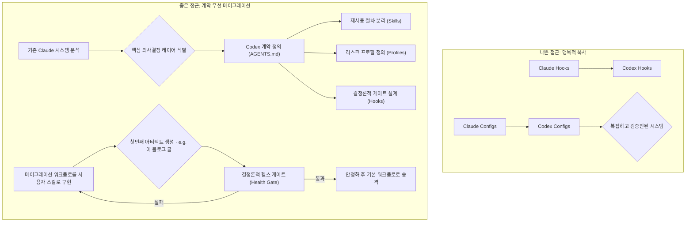

> 이 엔트리는 Blake Crosley의 [Claude Code to Codex Migration Guide 2026](https://blakecrosley.com/blog/claude-code-to-codex-migration)을 정독하고 핵심을 추출한 것이다.

## Claude Code에서 Codex로의 에이전트 시스템 마이그레이션 전략

이 엔트리는 Blake Crosley의 [Claude Code to Codex Migration Guide 2026](https://blakecrosley.com/blog/claude-code-to-codex-migration-guide-2026/)을 정독하고 핵심을 추출한 것이다.

### 왜 중요한가: 시스템의 '영혼'을 이식하는 법

AI 에이전트 시스템을 마이그레이션할 때, 단순히 파일과 스크립트를 복사하는 것은 실패로 가는 지름길이다. 이는 시스템의 암묵적인 운영 원칙, 리스크 관리 정책, 품질 기준을 모두 버리는 행위와 같다. Crosley는 700개가 넘는 로컬 에이전트 설정을 분석한 결과, 시스템의 핵심은 수많은 훅(hook)이나 스크립트가 아니라, **"언제, 어떤 기준으로, 어떤 리스크를 감수하며 작동할지 결정하는 소수의 계약(contract)과 의사결정 레이어"**임을 발견했다.

성공적인 마이그레이션은 코드(skill)를 옮기는 것이 아니라, 시스템의 운영 철학과 검증 책임을 새로운 환경에 맞게 재정의하고 이식하는 과정이다. 이 접근법은 비공개 워크플로가 무분별하게 기본값으로 확산되는 것을 막고, 시스템이 스스로를 설명하고 검증할 수 있는 능력을 갖추게 한다.

### 핵심 패턴: 계약 우선 마이그레이션 (Contract-First Migration)

단순히 `Claude`의 훅을 `Codex`로 1:1 복제하는 대신, 먼저 새로운 시스템의 운영 계약을 정의하는 데 집중해야 한다. 이는 시스템의 행동을 지배하는 명시적인 규칙 체계다.

#### 1. 계약(Contract)의 4가지 구성요소 분리

기존의 복잡한 설정 파일을 기능과 범위에 따라 명확히 분리하여 이식한다.

- **`AGENTS.md` (정책 계층화)**:
  - `~/.codex/AGENTS.md`: 여러 리포지토리에 걸쳐 적용되는 영속적인 최상위 정책.
  - `[repo]/AGENTS.md`: 특정 리포지토리에만 적용되는 정책 및 오버라이드.
- **`Skills` (재사용 가능한 절차)**:
  - `.agents/skills/` 또는 `$HOME/.agents/skills`: 특정 로직을 수행하는 재사용 가능한 코드 조각(프로시저)을 보관.
- **`Profiles` (리스크 관리)**:
  - `public-writing`, `careful-review` 등 작업의 민감도와 리스크 수준에 따라 다른 모델, 규칙, 검증 절차를 적용하는 프로필을 정의.
- **`Hooks` (결정론적 게이트)**:
  - 예측 가능한 특정 조건(예: 파일 저장 전, 커밋 전)에서 실행되는 결정론적 안전장치. 단, 훅은 전체 안전 모델의 일부일 뿐, 전부는 아니다.

#### 2. 마이그레이션 자체를 첫 번째 테스트 케이스로 활용

마이그레이션 가이드 문서를 작성하는 과정 자체가 새로운 시스템의 첫 번째 실증 사례가 되어야 한다.

1.  **초안 작성**: 새로운 Codex 시스템으로 마이그레이션하는 방법을 문서로 작성한다.
2.  **실행**: 작성한 가이드를 **직접 따라하며** 실제 마이그레이션을 수행한다.
3.  **수정**: 실제 과정에서 발견된 문제점, 변경사항을 바탕으로 가이드 문서를 수정한다.
4.  **결과물**: 최종적으로 발행된 문서는 "스스로를 설명하고, 현재 문서를 인용하며, 살균된(sanitized) 로컬 인벤토리를 사용해 결과물을 생성할 수 있음"을 증명하는 **살아있는 증거(artifact)**가 된다.

#### 3. 점진적 활성화 (Staged Rollout)

마이그레이션된 워크플로를 처음부터 시스템의 기본 동작으로 만들지 않는다.

- **사용자 스킬로 시작**: 초기에는 마이그레이션 워크플로를 명시적으로 호출해야 하는 '사용자 스킬'로 유지한다.
- **파일럿 테스트**: 공유 가능한 패키지(플러그인)로 만들더라도, 바로 공개 배포하지 않고 로컬 파일럿 테스트를 통해 스킬 탐지, 의존성, 중복 문제 등을 검증한다.
- **점진적 기본값화**: 실제 작업에서 충분한 가치와 안정성이 입증되었을 때 비로소 시스템의 기본 동작으로 승격시킨다.

#### Mermaid: Contract-First Migration Flow


### 실전 적용: `ai-study` 위키 시스템 고도화

현재 `ai-study`의 위키 엔트리 생성/검증 프로세스가 로컬 스크립트와 암묵적 규칙에 의존하고 있다면, 이를 Crosley의 'Codex' 모델을 적용하여 고도화할 수 있다.

1.  **계약 정의 (`ai-study/AGENTS.md`)**:
    - "모든 엔트리는 외부 권위 자료(논문, 빅테크 블로그 등)를 1개 이상 인용해야 한다."
    - "모든 Mermaid 다이어그램은 'Mermaid 5대 함정' 검사를 통과해야 한다."
    - "모든 코드 예시는 `TypeScript` 또는 `Swift`로 작성하며, 린트(lint)를 통과해야 한다."

2.  **스킬 및 훅 구현**:
    - **Skill (`verify_sources.ts`)**: 엔트리에 포함된 URL이 유효한 권위 자료인지 확인하는 재사용 가능한 스킬.
    - **Hook (`pre-commit-hook`)**: 커밋 직전에 MDX 파일 내 Mermaid 구문을 검사하는 결정론적 게이트.

    ```typescript
    // 예시: .agents/hooks/lintMermaidDiagram.ts
    // Mermaid 5대 함정 중 일부를 체크하는 간단한 훅
    export function lintMermaidDiagram(diagramText: string): { success: boolean; errors: string[] } {
      const errors: string[] = [];
      
      // 함정 2: <br/> 사용 금지
      if (diagramText.includes('<br/>')) {
        errors.push("Mermaid Error: '<br/>' is not allowed. Use newline characters instead.");
      }
      
      // 함정 5: 유니코드 화살표(→) 사용 금지
      if (diagramText.includes('→')) {
        errors.push("Mermaid Error: '→' is not allowed. Use '-->' or '-->' instead.");
      }
      
      // 함정 3: 따옴표 없는 콜론 (간단한 체크)
      const linesWithColon = diagramText.split('\n').filter(line => line.includes(':') && !line.includes('"') && !line.includes("'"));
      if (linesWithColon.length > 0) {
        errors.push(`Mermaid Error: Lines with ':' may need quotes. Problematic lines: ${linesWithColon.join(', ')}`);
      }

      return { success: errors.length === 0, errors };
    }
    ```

3.  **점진적 적용**:
    - 새로운 엔트리 생성 워크플로는 `npm run generate-entry:v2`와 같이 명시적으로 호출하는 명령으로 시작한다.
    - `ai-study` 팀원들이 v2 워크플로를 사용하여 5개 이상의 엔트리를 성공적으로 발행하고, `pre-commit-hook`이 안정적으로 작동함을 확인한 후, 기존의 `generate-entry` 스크립트를 대체한다. 이 과정 자체가 마이그레이션의 성공을 증명하는 아티팩트가 된다.

### 외부 권위 자료에 대한 관점

Blake Crosley의 글은 주로 그 자신의 다른 글들(`AGENTS.md Patterns`, `Static Skills Are Dead Skills` 등)을 인용하며 자체 완결적인 시스템 철학을 구축한다. 외부 학술 논문이나 빅테크의 공식 문서를 직접 인용하기보다는, 다년간의 개인적인 AI 엔지니어링 경험에서 축적된 원칙과 패턴을 제시하는 데 집중한다. 이는 그의 시스템이 특정 외부 기술에 종속되지 않고, 일반적인 원칙에 기반하고 있음을 시사한다. 따라서 그의 글을 참고할 때는 특정 기술의 구현법보다는 **시스템을 설계하고 진화시키는 철학**에 초점을 맞추는 것이 유용하다.