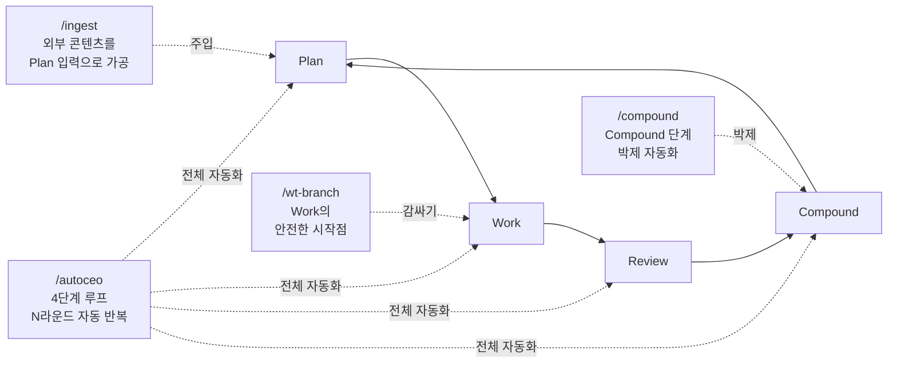

## 왜 슬래시 커맨드인가

[Compound Engineering](/wiki/harness-engineering/compound-engineering-philosophy)의 4단계 루프(Plan → Work → Review → Compound)를 *사람의 기억력*으로 유지하려고 하면 100% 실패. 특히 *Compound 단계*는 가장 자주 빠진다.

해결책: **각 사이클 단계를 슬래시 커맨드로 박는 것**. 사용자가 *명령 하나*를 호출하면 그 단계의 모든 작업이 순서대로 실행된다. 부분 실행 함정 차단.

이 글은 두 프로젝트와 ai-study에 박혀 있는 *4개 슬래시 커맨드*를 정리한다. 4단계 루프와 어떻게 매핑되는지, 각 커맨드의 phase 구조, 이식 가이드.

## 4단계 루프 ↔ 4개 슬래시 커맨드 매핑



각 커맨드는 *서로 다른 부분*에 박혀 있다. 합치면 4단계 전체가 자동화.

## 4개 커맨드 패턴 정리

### `/compound` — Compound 단계 박제 자동화

**위치**: `.claude/commands/compound.md` (양쪽 프로젝트 + ai-study 모두)

**책임**: 매 스프린트/배포 후 *Compound 단계*만. 4단계 루프의 마지막을 *반드시* 끝내도록.

**Phase 구조** (5 phase):

| Phase | 작업 |
|---|---|
| 1. 변경사항 수집 | git log + git diff로 최근 변경 파악, 대화에서 디버깅 과정 추출 |
| 2. 3가지 문서 병렬 생성 | CHANGELOG.md / docs/solutions/ / docs/retros/ |
| 3. CLAUDE.md 동기화 | 새 API/컴포넌트/구조 변경 반영 |
| 4. 메모리 업데이트 | 핵심 교훈을 Claude Code 메모리에 저장 |
| 5. 단일 커밋 | `compound: [날짜] 스프린트 문서화` |

**핵심 결정**: Phase 2를 *병렬* 실행 — 3개 서브에이전트로 동시. 시간 단축 + 각 문서가 독립적으로 생성.

**호출 시점**: `git push` 직후 PostToolUse 훅이 `/compound 실행하세요` 자동 알림. 사람의 기억력 의존 0.

### `/autoceo` — 4단계 루프 N라운드 자동 반복

**위치**: `.claude/commands/autoceo.md`

**책임**: *전체 4단계*를 사람 개입 없이 N라운드(기본 2, 최대 5) 자동 반복. *최고 수준의 자율성*이 필요한 작업에서 사용.

**Phase 구조** (라운드당 4 step):

| Step | 책임 | 4단계 매핑 |
|---|---|---|
| 1. 분석 + 계획 | git log/diff 파악, TODO/FIXME 수집, P0~P3 우선순위 자동 결정 | **Plan** |
| 2. 개발 | 작업 순서대로 구현, Agent tool 병렬 가능, 개별 커밋 | **Work** |
| 3. QA 검증 | 4중 게이트 (test/build/tsc/브라우저), 3회 실패 → 자동 롤백 | **Review** |
| 4. Compound | CHANGELOG + 솔루션 + CLAUDE.md 동기화 + 커밋 | **Compound** |

**6가지 안전장치**:

1. **Git 체크포인트** — 라운드 시작 전 `git tag autoceo-round-N-before` 생성, QA 3회 실패 시 자동 롤백
2. **보호 파일** — tiers.ts(결제), .env*, supabase/migrations/*, package.json deps, .claude/settings.json은 절대 수정 금지
3. **원자적 커밋** — 커밋당 10 파일 이하
4. **3중 QA 게이트** — vitest + next build + tsc --noEmit + 브라우저 검증
5. **커밋 단위 원칙** — `[R1] type: 설명` (롤백 시 cherry-pick 가능)
6. **금지 행동** — git push, git reset --hard, rm -rf, npm install, DB 마이그레이션, 외부 API 키 변경

**핵심 결정**: AskUserQuestion 금지. *모든 판단을 자동으로*. 판단 어려우면 *보수적 옵션*(HOLD SCOPE, 안전한 길) 선택.

### `/wt-branch` — Work 단계의 안전한 시작점

**위치**: `.claude/commands/wt-branch.md` (ai-study 정의 완료, 양쪽 프로젝트 이식 대기 — [Journal 004](/wiki/harness-engineering/harness-journal-004-wt-branch-command) 참조)

**책임**: 새 작업을 시작할 때 *로컬 git 상태와 무관하게* origin/main에서 깨끗한 worktree를 만들어, *AI 자동 squash merge 함정*([Journal 003](/wiki/harness-engineering/harness-journal-003-squash-merge-trap-pattern))을 시스템 차원에서 회피.

**Phase 구조** (6 phase):

| Phase | 작업 |
|---|---|
| 0. 사전 점검 | 인자, 브랜치 이름 valid, 중복 없음 |
| 1. 프로젝트 루트 식별 | `git rev-parse --show-toplevel` (자동 감지로 이식성 100%) |
| 2. origin 동기화 | `git fetch origin` |
| 3. worktree 분기 | `git worktree add -b <branch> /tmp/<project>-<branch> origin/main` |
| 4. 사용자 안내 | 작업 디렉터리 + cleanup 명령 |
| 5. 작업 진행 가이드 | 이후 모든 git 명령이 worktree를 가리키도록 |

**핵심 결정**: project-root *자동 감지* — 한 파일이 어떤 프로젝트에 복사되든 *변경 0*으로 작동. 슬래시 커맨드의 *이식성을 박는* 핵심 패턴.

### `/ingest` — 외부 콘텐츠를 Plan 입력으로 가공

**위치**: `.claude/commands/ingest.md` (ai-study)

**책임**: 외부 URL(YouTube, 블로그, 논문, Twitter)을 *교차 검증*을 거쳐 *학습 엔트리 초안*으로 가공. Plan 단계의 외부 입력 흡수.

**Phase 구조** (8 phase, 가장 길음):

| Phase | 작업 |
|---|---|
| 0. 사전 점검 | URL 중복, 접근 가능성 |
| 1. 메타데이터 확보 | 최소 2회 교차 검증 (의미 모순 체크) |
| 2. 본문 보강 | 최소 2개 독립 소스 (인용구는 원본 직접 확인만) |
| 3. 카테고리 매핑 | 10개 카테고리 중 선택 |
| 4. 초안 작성 | frontmatter + 본문 (1인칭 + 내 해석 필수) |
| 5. 검증 | npm run build → MDX/Mermaid validation |
| 6. 커밋 제안 | 사용자 명시 승인 후 push |
| 7. 보고 | 도구 + 검증 못한 부분 명시 |

**핵심 결정**: *날조 방지가 최우선*. 직접 인용 `"..."`은 *원본에서 글자 단위로 확인된 것만*. 추측으로 인용구 만들면 신뢰도 0이 된다는 메모리 박제([feedback_external_source_verification](#)).

## 4개 커맨드의 *중첩과 분업*

| 작업 종류 | 어느 커맨드 |
|---|---|
| 단일 사이클 일부만 자동화 | `/compound` (Compound 단계만) |
| 여러 사이클 자동화 | `/autoceo` (전체 루프 × N) |
| 새 작업 시작 | `/wt-branch` (Work 단계의 안전한 시작) |
| 외부 콘텐츠 가공 | `/ingest` (Plan 단계의 외부 입력) |

`/autoceo`는 *내부에서* `/compound` 같은 다른 슬래시 커맨드를 *호출하지는 않는다*. 대신 *그 동작을 직접 수행*한다. 이게 슬래시 커맨드 시스템의 한계 — 슬래시 커맨드끼리 *호출 관계*를 만들기 어렵다. 그 빈자리를 [Skill 시스템](/wiki/harness-engineering/skill-system-introduction)이 메울 수 있음.

## 다른 프로젝트로 이식 가이드

### 1단계 — 대상 프로젝트의 git 흐름 베이스라인

이식 *전*에 다음을 확인:

- [ ] 자동 머지인가 수동 머지인가? (`/wt-branch`의 가치가 달라짐)
- [ ] squash merge인가 fast-forward인가? (squash 함정 위험도)
- [ ] branch protection rule이 있는가?
- [ ] PR 템플릿이 있는가?
- [ ] 배포 한도가 있는가? (Vercel 100/day 등)

이게 [Harness Journal 000 베이스라인](/wiki/harness-engineering/harness-journal-000-baseline) 단계와 동일.

### 2단계 — 4개 커맨드 중 어떤 것을 *먼저* 이식할지

권장 순서:

1. **`/compound` 먼저** — 가장 가치 큰 단일 자산. 매 사이클 박제를 강제.
2. **`/wt-branch`** — squash merge 환경이면 즉시. 아니면 후순위.
3. **`/ingest`** — 외부 콘텐츠 학습이 필요하면.
4. **`/autoceo`** — 가장 마지막. 다른 3개가 안정된 후에야 *전체 자동화*가 안전.

### 3단계 — 이식 명령 (4개 커맨드 모두)

```bash
# 1. .claude/commands/ 디렉터리 확인
mkdir -p /your-project/.claude/commands

# 2. 4개 파일 cp
for cmd in compound autoceo wt-branch ingest; do
  cp /Users/jominho/Develop/ai-study/.claude/commands/$cmd.md \
     /your-project/.claude/commands/$cmd.md
done

# 3. CLAUDE.md skill routing 추가
# - 작업 완료, 스프린트 정리, 회고 → invoke compound
# - 자동 스프린트, 풀 자동 개발 루프 → invoke autoceo
# - 새 작업 시작, 안전한 브랜치 분기 → invoke wt-branch
# - 외부 URL 정리, 학습 엔트리로 가공 → invoke ingest

# 4. (autoceo 사용 시) .claude/settings.json에 PreToolUse / PostToolUse 훅 설정
#    test + build + push 자동 검증 + 알림
```

### 4단계 — 첫 dogfooding

이식 직후 *각 커맨드를 한 번씩 호출*해서 작동 확인:

1. `/compound` — 작은 변경 후 호출. CHANGELOG + retro 생성되는지.
2. `/wt-branch test-cmd` — worktree 만들어지는지 + cleanup 명령 안내 정상.
3. `/ingest <test-url>` — 8 phase가 다 도는지.
4. `/autoceo dry` — 드라이런으로 계획만 출력되는지.

이 4가지가 모두 작동하면 *4단계 루프 자동화*가 작동.

## 자기 점검

1. 내가 매 사이클 *반복적으로* 하는 작업이 *슬래시 커맨드*에 박혀 있는가, 아니면 *기억으로* 하는가?
2. 4단계 루프 중 가장 *자주 빠지는* 단계는? (보통 Compound)
3. 슬래시 커맨드와 [Skill](/wiki/harness-engineering/skill-system-introduction)의 차이를 운영에 어떻게 반영할 것인가?
4. *전체 자동화(/autoceo)*를 호출할 신뢰가 생기는 시점은 언제인가?
5. (열린 질문) 슬래시 커맨드들끼리 *호출 관계*를 만들 수 있는 패턴이 있는가? (Skill로 우회 가능?)

### 실습 과제

자신의 프로젝트에 *4개 중 1개*를 골라서 이식:

1. 가장 가치 큰 1개 선택 (권장: `/compound`)
2. ai-study의 `.claude/commands/<cmd>.md`를 cp
3. CLAUDE.md skill routing 한 줄 추가
4. *오늘의 작업 종료 후* 호출
5. 결과를 자신의 첫 *Harness Journal 엔트리*로 박제

## 출처

- 슬래시 커맨드 4개 정의 파일:
  - `.claude/commands/compound.md` (양쪽 프로젝트 + ai-study)
  - `.claude/commands/autoceo.md` (양쪽 프로젝트 + ai-study)
  - `.claude/commands/wt-branch.md` (ai-study, [Journal 004](/wiki/harness-engineering/harness-journal-004-wt-branch-command))
  - `.claude/commands/ingest.md` (ai-study)
- 4단계 루프 출처: [Compound Engineering 엔트리](/wiki/harness-engineering/compound-engineering-philosophy)
- Skill 시스템 비교: [Skill 시스템 도입 엔트리](/wiki/harness-engineering/skill-system-introduction)

### 검증 메모

- 4개 슬래시 커맨드 정의는 *직접 보유한 파일*에서 본 내용. 외부 인용 없음.
- /autoceo의 6가지 안전장치는 양쪽 프로젝트의 autoceo.md에서 직접 확인
- 4단계 루프와 4개 커맨드의 매핑은 *내 해석*이며 [Compound Engineering 원문](/wiki/harness-engineering/compound-engineering-philosophy)에 명시된 매핑은 아님
- 이식 가이드는 *제안*이며, 실제 다른 프로젝트로의 이식 결과 데이터는 없음 (다음 사이클의 입력)
