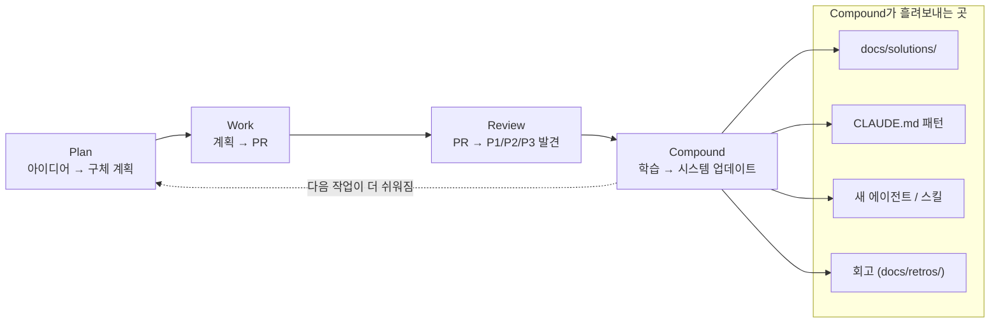

## 왜 지금 이 주제인가

이 위키 프로젝트는 이미 [`/compound` 슬래시 커맨드](#)와 `docs/solutions/`, `docs/retros/` 디렉터리, 그리고 "푸시 후 자동 리마인더"라는 워크플로로 운영되고 있다. CLAUDE.md 안에 그림까지 그려 두었다.

```
코드 작업 → git commit → 빌드 체크 → git push → /compound 리마인더 → CHANGELOG + 회고 + 솔루션
```

그런데 정작 **"compound"라는 단어가 어디서 왔는지**, 그 4단계가 원래 어떻게 정의됐는지를 한 번도 정리해 두지 않았다. 오늘 GeekNews에 올라온 정리글을 보고 원본 every.to 가이드를 직접 읽어, 내가 이미 실천 중인 워크플로의 **원본 정의서**를 위키에 박아두기로 했다.

요지는 단순하다. "복리(compound)"는 비유가 아니라 **설계 목표**다. 모든 작업 단위는 그 다음 작업을 *쉽게* 만들어야 하고, 그렇지 않으면 그것은 그냥 "AI를 곁들인 전통적 엔지니어링"일 뿐이다.

## 핵심 개념

### 한 문장 정의

> The core philosophy of compound engineering is that each unit of engineering work should make subsequent units easier—not harder.
>
> — Kieran Klaassen, *Compound Engineering* (every.to)

기능을 추가할 때 코드베이스의 복잡성·취약성만 늘어나는 게 아니라, 시스템(에이전트·문서·패턴)의 **역량**도 같이 늘어나야 한다는 것. 그래서 N+1번째 기능을 만드는 비용이 N번째보다 낮아진다.

### 4단계 루프

원문에서 정의한 루프는 **Plan → Work → Review → Compound → (다시 Plan)** 의 4단계다. 각 단계는 명확한 입력과 출력이 있고, 한 단계의 출력이 다음 단계의 입력이 된다.

| 단계 | 입력 | 핵심 산출물 | 누가 주로 하는가 |
|---|---|---|---|
| **Plan** | 아이디어/요구 | 데이터 모델·파일 경로·아키텍처 결정이 들어간 구체 계획 | 사람 + 계획 에이전트 |
| **Work** | 승인된 계획 | 코드·테스트·문서가 포함된 PR | 구현 에이전트 |
| **Review** | 구현된 PR | P1/P2/P3로 우선순위가 매겨진 발견사항 | 다중 리뷰 에이전트 |
| **Compound** | 리뷰가 끝난 학습 | `docs/solutions/`, CLAUDE.md 패턴, 새 에이전트 | 사람 + 회고 에이전트 |

원문이 강조하는 핵심은 두 가지다.

1. **"Plans are the new code"** — 코드 한 줄이 아니라 *계획*이 가장 가치 있는 산출물이 된다. 계획이 충분히 구체적이면 AI든 사람이든 질문 없이 실행할 수 있어야 한다.
2. **Compound 단계를 빼지 말라** — 원문 표현 그대로, *"Skip it, and you've done traditional engineering with AI assistance."* 빌드가 되고 PR이 머지된 순간 끝나는 게 아니라, 거기서 배운 것을 시스템에 흘려보내야 다음 작업이 쉬워진다.

### 5단계 ladder — "내가 지금 어디 있는가"

원문은 개발자의 AI 활용 성숙도를 0~5단계로 나눈다. 단순한 능력치 표가 아니라 **"여기서 막히면 그 위로 못 올라간다"** 는 정체점을 짚는 척도다.

| 레벨 | 명칭 | 한 줄 |
|---|---|---|
| 0 | Manual development | AI 없이 한 줄씩 직접 작성 |
| 1 | Chat-based assistance | ChatGPT를 똑똑한 레퍼런스로 사용 |
| 2 | Agentic tools, line-by-line review | 에이전트가 파일을 읽고 고치지만 사람이 줄 단위 게이트키퍼 |
| 3 | **Plan-first, PR-only review** | "여기서 모든 게 바뀐다" — 계획과 PR 단위로 신뢰 입자가 커짐 |
| 4 | Idea → PR (single machine) | 한 머신에서 에이전트가 조사·계획·구현을 모두 처리 |
| 5 | Parallel cloud execution | 클라우드에서 여러 에이전트가 병렬로 실행 |

원문이 가장 길게 할애하는 곳이 Stage 2 → Stage 3 점프다. 표현 그대로 *"Most developers plateau here."* 줄 단위 검토 습관에서 벗어나는 게 정체의 핵심 원인이라는 것.

## 구조 / 프레임워크



이 다이어그램이 핵심이다. **루프가 닫히는 지점은 Review → 다음 Plan이 아니라, Compound → 다음 Plan이다.** Compound가 빠지면 화살표가 닫히지 않고, 학습은 사람 머릿속에만 남는다(=시간이 지나면 사라진다).

## 실전 팁 / 안티패턴

원문에서 직접 명시하거나 강하게 시사하는 안티패턴들:

- **"95% garbage rate"를 못 견디기.** 첫 시도의 95%는 쓰레기라는 걸 받아들이고, 빠르게 던지고 빠르게 버리는 사이클 자체를 시스템화해야 한다. 첫 결과가 마음에 안 든다고 루프를 멈추지 말 것.
- **에이전트에게 안 보여주기.** 원문 표현으로 *"Anything that you don't let the agent handle, you have to do yourself manually."* 보안 핑계로 에이전트의 권한을 좁히면 그만큼 자기 손으로 해야 한다. 권한 설계는 신중하게, 그러나 인색하게는 말 것.
- **줄 단위 검토에 묶이기.** Stage 2의 안전지대에 머무는 한 처리량은 사람 1명 = 사람 1명 비례로 끝난다. PR 단위, 계획 단위로 신뢰 입자를 의식적으로 키워야 한다.
- **"빌드 통과 = 끝"이라는 착각.** Compound 단계를 빼는 순간, 똑같은 버그를 3주 뒤에 또 만난다.

긍정 패턴 쪽:

- **모든 솔루션에 frontmatter를 단다.** 원문은 YAML frontmatter + tags + categories로 *"findable"* 하게 만들 것을 강조한다. 이 위키의 `docs/solutions/`가 카테고리 디렉터리(build-errors, runtime-errors, ai-pipeline 등)로 나뉘어 있는 이유가 여기 있다.
- **CLAUDE.md를 살아 있는 문서로.** 새 패턴은 코드만 건드리는 게 아니라 CLAUDE.md에 한 줄이라도 들어가야 다음 세션에 살아남는다.

## 내 프로젝트에 적용하기

이 위키는 이미 Compound Engineering의 절반은 하고 있다. 빠진 부분을 짚어 본다.

- [ ] **Plan 단계의 산출물이 너무 가볍다.** 지금은 "할 일 한 줄 → 바로 구현"으로 가는 경우가 많다. 새 기능을 시작하기 전에 *"Plans are the new code"* 기준으로 데이터 모델·파일 경로·아키텍처 결정이 들어간 짧은 plan 문서를 `docs/plans/`에 남기는 습관을 만들 것. → [Harness Engineering 5가지 레버](/wiki/harness-engineering/five-levers-of-harness-engineering)에서 본 system prompt 강화와 같은 맥락.
- [ ] **Review 단계에 P1/P2/P3 분류가 없다.** 코드 리뷰가 "고치고 머지"로만 끝난다. 다음 PR부터는 발견사항을 P1(꼭 고침)/P2(고치는 게 좋음)/P3(있으면 좋음)로 라벨링해서 회고에서 P3 누적이 어디서 일어나는지 보일 것.
- [ ] **회고 에이전트를 분리하자.** 지금 `/compound`는 사람이 트리거하지만, 회고 자체는 한 덩어리 프롬프트가 다 처리한다. 회고 전용 서브에이전트를 [agent-architectures](/wiki/agents/agent-architectures) 패턴으로 분리하면 회고 품질이 더 일정해질 것.
- [ ] **Stage 3에서 머물고 있는지 점검.** 5단계 ladder 기준으로 지금 내 위치는 명확히 Stage 3이다. Stage 4(idea → PR 자동화)로 가려면 무엇이 막혀 있는지 — 환경, 권한, 신뢰, 둘 중 어디인지 — 한 번 자문해 볼 것. autoceo 스킬이 그 다리.
- [ ] **Compound 단계가 흘려보내는 4곳을 모두 채웠는지 점검.** `docs/solutions/` ✓, `docs/retros/` ✓, CLAUDE.md ✓ — 그러나 "새 에이전트/스킬"은 자동 생성이 아니라 사람이 가끔 만든다. 회고 단계에서 *"이 패턴은 새 스킬로 만들 가치가 있는가?"* 를 체크리스트화할 것.

## 라이브 사이클 — Harness Journal 시리즈로 직접 검증

이 글을 위키에 박은 직후, 위 4단계 루프와 5단계 ladder를 *내 두 프로젝트(mino-moneyflow, mino-tarosaju)에 어떻게 적용할 것인가*를 묻는 [Harness Journal](/harness-journal) 시리즈를 시작했다. 시리즈는 매 사이클 한 가지 명확한 변화 + 한 가지 명확한 메시지로 운영되며, 매 사이클의 사고가 *다음 사이클의 정확한 입력*이 된다는 Compound Engineering의 핵심 메시지를 라이브로 검증한다.

### 시리즈가 입증한 4가지

1. ***"다음 작업이 더 쉬워진다"*의 라이브 증거** — [Journal 001](/wiki/harness-engineering/harness-journal-001-ci-merge-gate)에서 라이브로 발견한 사고("게이트가 머지를 막지 못함")가 [Journal 002](/wiki/harness-engineering/harness-journal-002-inline-test-gate)의 정확한 입력이 됨. 추측으로 큐를 잡지 않고, *사고가 큐를 만든다*.
2. **각 사이클의 사고가 다음 사이클의 입력이 되는 *체인*** — 002의 부수 사고(squash merge 함정)가 [Journal 003](/wiki/harness-engineering/harness-journal-003-squash-merge-trap-pattern)으로 이어지고, 003의 분석이 [Journal 004](/wiki/harness-engineering/harness-journal-004-wt-branch-command)의 회피 메커니즘 정의로 이어짐. 추측 0, 라이브 100%.
3. **양쪽 프로젝트가 같은 자산을 *0 변경*으로 이식 가능하면 진짜 복리** — Journal 004의 `/wt-branch` 슬래시 커맨드는 `git rev-parse --show-toplevel`로 project-root를 자동 감지해서, *변경 없이* 양쪽 프로젝트로 이식 가능. 이게 Kieran Klaassen이 말하는 *"다음 작업이 더 쉬워진다"*가 *프로젝트 간*에도 작동한다는 첫 사례.
4. **베이스라인은 살아있는 문서** — [Journal 000](/wiki/harness-engineering/harness-journal-000-baseline)에서 정의한 큐가 라이브 사고들로 *세 번 재정렬*됨. 큐 정의가 *예언*이 아니라 *살아있는 가설*이라는 것을 시리즈가 증명.

### 4단계 루프가 라이브에서 *비대칭*으로 작동하는 패턴

원문은 4단계가 *균등하게* 작동하는 것처럼 보인다. 그러나 라이브에서는:

- **Plan**: 가벼움 — Journal 시리즈에서 큐는 *직전 회고*가 만든다. plan 문서를 별도로 길게 쓰지 않음.
- **Work**: 중간 — 한 사이클에 *한 가지 작업*만. inline test gate(60줄), wt-branch 슬래시 커맨드(120줄) 같은 작은 변화.
- **Review**: 라이브 사고가 대신 — 사람의 review가 아니라 *작업이 만든 사고*가 다음 사이클을 정의. PR #91 충돌, PR #93 충돌이 *살아있는 review*.
- **Compound**: *가장 큰 비중* — 매 사이클 끝에 ai-study에 Journal 엔트리를 박는 작업이 작업 자체보다 더 길다. 박제가 곧 자산.

이게 [원문이 말하는 4단계](#4단계-루프)의 *내 운영 환경에 맞춘 비대칭 적용*. 원칙은 그대로지만 *비중이 다르다*.

### 살아있는 큐 운영

[Harness Journal 인덱스](/harness-journal)에 모든 에피소드가 *episode 번호 순*으로 노출된다. 새 에피소드는 `harness-journal-NNN-...` slug prefix만 맞으면 자동 인식 — 별도 페이지 수정 없음. 시리즈 자체가 *행동에 박는 가드*다.

---

## 자기 점검

1. 내가 지난주에 짠 코드 중, "다음에 비슷한 작업을 할 사람을 위한 학습"으로 시스템에 흘려보낸 것은 몇 개인가?
2. 내 마지막 PR의 *Plan 단계* 산출물은 얼마나 구체적이었는가? AI가 질문 없이 실행할 수 있는 수준이었는가?
3. 5단계 ladder에서 내 위치는 어디이고, 다음 단계로 못 올라가는 진짜 병목은 무엇인가?
4. 내 `docs/solutions/`에서 가장 자주 검색되는 카테고리는 무엇인가? 그 카테고리의 문제가 *왜* 반복되는가?
5. (열린 질문) 만약 Compound 단계를 자동화한다면, 사람이 마지막에 *반드시* 개입해야 하는 부분은 어디일까?

### 실습 과제

다음 PR을 만들 때 의식적으로 4단계 루프를 따라 실행하고, 각 단계의 산출물을 한 곳에 모아 보기:

1. **Plan**: 시작 전 `docs/plans/<feature>.md` 한 장 작성 (데이터 모델 + 변경할 파일 + 아키텍처 결정)
2. **Work**: PR 생성
3. **Review**: 발견사항을 P1/P2/P3로 분류한 코멘트 한 덩어리 작성
4. **Compound**: `/compound` 실행 후 — *원문 체크리스트로* 4곳(solutions, retros, CLAUDE.md, 새 스킬 후보) 을 모두 확인했는지 자문

이 한 사이클을 끝내고, 다음 비슷한 작업이 *체감상* 더 쉬워졌는지 회고에 한 줄 남길 것.

## 출처

- 원본: [Compound Engineering — Every (Kieran Klaassen + Claude, 2026-01-17 게시 / 2026-04-09 마지막 수정)](https://every.to/guides/compound-engineering)
- 보강 자료:
  - [GeekNews 한국어 정리 — "Compound Engineering : AI 네이티브 엔지니어링 철학"](https://news.hada.io/topic?id=26560)
  - [Compound Engineering: How Every Codes With Agents — Every](https://every.to/chain-of-thought/compound-engineering-how-every-codes-with-agents)

### 검증 메모

- 메타데이터(제목·저자·게시일·4단계 루프·5단계 ladder)는 every.to 원본을 직접 WebFetch로 확인
- 한국어 정리(GeekNews)와 원본 영어 페이지에서 동일하게 등장하는 개념만 "검증된 사실"로 간주하고 본문에 반영
- 본문 내 직접 인용구(`"..."`)는 every.to 원본에서 직접 글자 단위로 확인된 것만 사용
- 인용 못 한 채 본 내용은 풀어서 서술 처리
