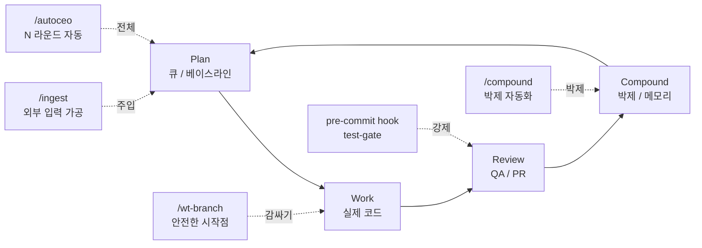

## 한 줄 요약

> *"each unit of engineering work should make subsequent units easier—not harder"*

한 스프린트의 산출물(코드 + 박제)이 다음 스프린트의 *정확한 입력*이 되도록 사이클을 설계한다. 박제를 *매 사이클 끝*에 강제하고, 사고를 *실패*가 아니라 *다음 사이클의 입력*으로 본다. 기억이 아니라 *행동*에 가드를 박는다.

---

## Compound란 무엇인가

*복리(compound interest)* 의 엔지니어링 버전이다. 돈이 매년 원금 + 이자에 다시 이자가 붙듯, 엔지니어링 작업도 한 사이클의 산출물이 다음 사이클을 *더 쉽게* 만들면 축적 속도가 기하급수적으로 빨라진다.

반대 상태: *traditional engineering*. 한 사이클의 끝에서 코드만 머지되고, 회고 / 솔루션 / CHANGELOG / 메모리는 *기억이 휘발되면서* 사라진다. 다음 사이클은 처음부터 다시 시작.

Compound가 성립하려면 2가지가 필요:

1. **모든 사이클 끝에 박제** — 코드 외 *맥락 / 실패 패턴 / 회피 메커니즘*이 파일로 남아야
2. **박제가 다음 사이클 입력** — 단순 기록이 아니라 *정확한 입력*. 큐, 솔루션 검색, 메모리 로드로 자동 전달

이 2가지가 무너지면 바로 traditional. Compound Engineering 시스템 전체가 이 2가지를 지키기 위한 *구조적 가드*의 집합이다.

---

## 12 원칙

### 1. 사이클이 곧 자산

**원칙**: 한 스프린트 = 1 사이클. 사이클 끝에서 *회고 + 솔루션 + CHANGELOG + 메모리*를 모두 박제 → 다음 사이클이 이걸 입력으로 받음.

**왜**: 박제 없이 머지된 사이클은 *복리 계산에서 제외*된다. 축적이 리셋.

**실제 사례**: Journal 000 베이스라인의 "회고 → 솔루션 → 큐" 루프. `docs/retros/`의 마지막 섹션 *"다음에 적용할 것"* 이 다음 사이클의 입력으로 작동한다.

### 2. 행동에 박는 가드 > 기억에 의존하는 가드

**원칙**: *사람의 기억력에 의존하는 가드는 100% 실패한다*. 가드는 행동 자체에 박혀야 한다.

**왜**: 사고 발생 확률은 0이 아니라 *시간 함수*. 시간이 흐르면 반드시 발생. 복리가 쌓이는 동안 같은 사고가 재발하면 축적이 무너진다.

**실제 사례**: `wt-branch-structural-safety` — 새 작업 시작 전 `git fetch && git reset --hard origin/main`을 *사람이 기억해서* 수행하면 반드시 빠뜨림. `/wt-branch`는 *worktree 생성* 자체가 origin/main 분기라서 사고 구조가 없다.

### 3. 사고는 실패가 아니라 다음 사이클의 입력

**원칙**: 라이브 사고가 발생했을 때 그걸 *실패*가 아니라 *다음 사이클의 정확한 입력*으로 본다.

**왜**: 추측으로 만든 큐보다 *라이브 사고*가 다음 사이클의 입력이 될 때 ROI가 가장 높다. 실제 발생한 문제는 *정확한* 문제다.

**실제 사례**: Journal 001 → 002. CI merge gate의 첫 시도에서 라이브 사고 발생 → Journal 002의 inline test gate로 해결 → 그 PR이 자기 자신을 검증하는 dogfooding 성공. 3 PR 만에 게이트가 실효화.

### 4. 박제는 *맥락 + 검증 방법*을 포함해야

**원칙**: 코드만 박제하면 다음 사람이 *왜*를 모른다. 박제는 *맥락(왜 그렇게 했는가) + 검증 방법(어떻게 확인했는가)*을 포함해야 한다.

**왜**: 다음 사이클이 박제를 *입력*으로 쓰려면 *맥락*이 있어야 한다. 코드만 보고는 재사용이 안 된다.

**실제 사례**: Journal 004의 /wt-branch 이식 패치. 슬래시 커맨드 파일만 옮기지 않고 *왜 필요한가(Journal 003 squash merge trap) + 검증 방법(4연속 스프린트 zero conflict)*까지 같이 박았기 때문에 다른 세션이 별도 안내 없이 발견해서 적용할 수 있었다.

### 5. 박제 전이성 — 다른 사람/세션도 입력으로 쓸 수 있어야

**원칙**: 박제는 *같은 사람*뿐 아니라 *다른 세션 / 다른 프로젝트 / 다른 사람*에게도 전이될 수 있어야 한다. 복리가 한 사람에 국한되지 않게.

**왜**: 전이성이 없으면 복리는 *1명 × N 사이클*이 한계. 전이성이 있으면 *M명 × N 사이클*.

**실제 사례**: Journal 005 — 다른 세션이 ai-study의 박제 패치를 *별도 안내 없이 발견해서 적용*. Compound Engineering의 *"다음 작업이 더 쉬워진다"*가 *다른 사람에게도* 확장되는 첫 라이브 검증.

### 6. 사이클 분할 — 한 사이클에 한 박제

**원칙**: 한 사이클에 *여러 박제를 동시에* 시도하지 않는다. 1 → 3 → 9로 점진적 적용.

**왜**: 한 번에 13개를 동시에 만지면 *어느 박제가 어느 효과를 만들었는지* 추적 불가. 다음 사이클 입력의 *정확성*이 무너진다.

**실제 사례**: Journal 011 → 012 → 013 → 015 → 017. 동시 세션 안전성부터 시작해서 한 에이전트씩 runtime validation을 적용, 마지막에 전체 에이전트로 확장.

### 7. 병렬 박제 (3 Agent)

**원칙**: 박제 *내부*에서는 병렬이 가능하다. CHANGELOG / 솔루션 / 회고를 *순차*로 쓰지 않고 3 서브에이전트로 *동시* 생성.

**왜**: 3개 문서는 *서로 독립*이다. 순차로 하면 시간이 3배. 병렬이면 1배 + 품질 유지 (각 에이전트가 한 가지에만 집중).

**실제 사례**: `/compound` 슬래시 커맨드 Phase 2. 3개 서브에이전트로 CHANGELOG + retro + solutions를 동시 실행. compound-automation-slash-commands 엔트리에서 박제됨.

### 8. 부분 실행 불가능 — 큰 워크플로로 묶기

**원칙**: 박제를 *작은 유틸 여러 개*로 쪼개지 않는다. 한 슬래시 커맨드로 묶어서 *부분 실행 자체를 불가능*하게 만든다.

**왜**: Compound 단계가 *가장 자주 빠지는* 단계다. 빠짐을 막는 가장 강력한 방법이 *명령 하나*에 묶어서 일부만 실행할 길을 없애는 것.

**실제 사례**: `/compound`가 5 Phase를 한 커맨드에 묶은 이유. 사용자가 회고만 쓰고 CHANGELOG는 잊는 패턴을 *구조적으로* 막는다.

### 9. 사고 재발률 0 — N=3 승격 트리거

**원칙**: 박제된 패���이 다�� 사이클에 *다시 발생��면 안 된다*. 재발 시 가드를 행동 레벨로 끌어올린다 (메모리 → 훅 → ��크플로).

**왜**: 재발은 *기존 가드가 기�� 레벨*이라는 증거. 원칙 2로 되돌���가서 더 낮은 ���이어��� 박는다.

**N=3 승격 트리거**: `docs/solutions/` 에 동일 패턴이 **3건 이상** 누적되면 *솔루션 문서 레벨*에서 *validator/훅 레벨*로 승격한다. 1~2건은 문서 박제로 충분하지만, 3건부터는 "재발이 시스템화됐다"는 신호다.

승격 시 원칙:
- **warning-only 우선** — auto-fix는 false positive / idempotency 깨짐 위험이 크다. 사람이 보고 수동 수정하도록 경고만 띄우는 게 안전
- **idempotency 별도 vitest 케이스** — 새 정규식이 추가될 때마다 "이미 처리된 입력에 다시 실행해도 결과 동일" 검증 필수

**실제 사례**:
- Journal 003 squash merge trap — 사고가 *두 번* 발생 → `/wt-branch`(행동 레벨)로 박음
- [Journal 024](/wiki/harness-engineering/harness-journal-024-solution-to-validator-promotion) — Mermaid 따옴표 누락 4번째 재발 → `validate-content.mjs` warning으로 승격, 빌드 한 번에 잠재 함정 9건 발견. `mermaid-fix.mjs` 추출 + vitest 16 회귀 테스트

### 10. 메타데이터 신뢰 금지 — 코드 line-by-line

**원칙**: 다른 세션의 PR 메시지 / 커밋 메시지 / 회고 문서를 *있는 그대로* 신뢰하지 않는다. 코드 line-by-line으로 교차 검증.

**왜**: 메타데이터는 *의도*를 기록하지만 *실제 변경*과 괴리될 수 있다. 특히 다중 세션 환경에서 메타데이터와 코드가 어긋나면 다음 사이클 입력이 *오염*된다.

**실제 사례**: Journal 019 mcapp cross-session cleanup — 5단 프로토콜(메타데이터 무시 → diff 전수 → 충돌 후보 추출 → 테스트 수행 → 박제). 다른 세션이 "완료"라고 표시한 작업이 실제로는 미완료였던 케이스 다수.

### 11. LLM-First 박제 — 사람이 아니라 AI를 위해 쓴다

**원칙**: 박제는 *사람이 읽기 위한 문서*가 아니라 *다음 사이클의 AI 에이전트가 입력으로 받기 위한 문서*다. LLM이 즉시 실행 가능한 형태로 쓴다.

**왜**: Compound 루프의 실제 사이클 주기는 분~시간 단위고, 그 주기의 대부분을 *AI 에이전트*가 실행한다. 사람 독자를 위한 서술형 문서는 다음 사이클 입력으로 쓰이지 않는다.

**실제 사례**: `llm-first-wiki-principles` + `ai-agent-start-here`. 모든 엔트리에 `For AI Agents` 섹션을 박아서 *다음 세션의 에이전트가 즉시 로드할 핵심*을 명시. SPEC.md의 AI Agent Contract도 같은 원칙.

### 12. 4단계 루프 + 5단계 Ladder

**원칙**: 모든 사이클을 **Plan → Work → Review → Compound** 4단계로 분해한다. 팀/프로젝트의 성숙도는 **5단계 ladder**로 측정한다 (Stage 1: 수동 → Stage 5: 완전 자율 루프).

**왜**: 4단계 루프는 *Compound 단계*가 빠지는지를 매 사이클 체크 가능. 5단계 ladder는 *어느 단계 박제가 부족한지* 측정 가능.

**실제 사례**: compound-automation-slash-commands의 슬래시 커맨드 매핑 — `/ingest`(Plan 입력), `/wt-branch`(Work 시작), `/compound`(Compound 단계), `/autoceo`(전체 루프 × N 라운드). 이 4개가 4단계 루프의 뼈대. 이후 3개 추가(`/cross-session-review`, `/curate-inbound`, `/projects-sync`)로 총 7개 커맨드가 정착됨.

---

## 4단계 루프 다이어그램

**핵심**: C → P 화살표가 *정확한 입력*이 되어야 복리가 돈다. 박제가 *일반적인 문서*면 그 화살표는 *비어 있다*.

---

## 13 referencing 엔트리 — 어디서 어떻게 인용되는가

| 엔트리 | 어느 원칙을 인용 | 핵심 발췌 |
|---|---|---|
| [harness-journal-000-baseline](/wiki/harness-engineering/harness-journal-000-baseline) | 원칙 1, 5 | *"each unit of engineering work should make subsequent units easier"* 원문 인용. "다음 작업이 더 쉬워진다"가 *프로젝트 간*에도 작동 |
| [harness-journal-001-ci-merge-gate](/wiki/harness-engineering/harness-journal-001-ci-merge-gate) | 원칙 3 | *"첫 사이클에서 라이브 사고가 났을 때, 그게 실패인가 다음 사이클의 입력인가 — 이 차이가 Compound Engineering의 본질"* |
| [harness-journal-002-inline-test-gate](/wiki/harness-engineering/harness-journal-002-inline-test-gate) | 원칙 3 | *"3 PR 만에 게이트가 실효화. Compound Engineering의 진짜 의미: 한 사이클의 사고가 다음 사이클의 정확한 입력이 된다"* |
| [harness-journal-003-squash-merge-trap-pattern](/wiki/harness-engineering/harness-journal-003-squash-merge-trap-pattern) | 원칙 2, 9 | *"사람의 기억력에 의존하는 가드는 반드시 실패한다. 사고 발생 확률이 0이 아니라 시간 함수"* |
| [harness-journal-004-wt-branch-command](/wiki/harness-engineering/harness-journal-004-wt-branch-command) | 원칙 4 | *"박제는 맥락의 컨테이너. 코드만 옮기는 게 아니라 맥락(왜) + 검증 방법(어떻게)까지 같이 옮겨져야"* |
| [harness-journal-005-wt-branch-dogfooding-and-transfer](/wiki/harness-engineering/harness-journal-005-wt-branch-dogfooding-and-transfer) | 원칙 5 | *"박제가 전이성을 가진다는 증명. 다른 세션이 별도 안내 없이 발견해서 적용"* |
| [harness-journal-010-baseline-third-update](/wiki/harness-engineering/harness-journal-010-baseline-third-update) | 원칙 3 | *"사고(또는 발견)가 다음 사이클의 정확한 입력"* 원칙의 구체적 사례. Zod 스키마 → text guards 전환 |
| [harness-journal-bootstrap-guide](/wiki/harness-engineering/harness-journal-bootstrap-guide) | 원칙 1, 7 | *"박제 시간 / 작업 시간 비율이 50:50인가? (Compound 단계가 충분한가)"* |
| [compound-automation-slash-commands](/wiki/harness-engineering/compound-automation-slash-commands) | 원칙 7, 8, 12 | 4단계 루프 × 4개 슬래시 커맨드 매핑. *"Compound 단계가 빠지면 traditional engineering with AI assistance"* |
| [llm-first-wiki-principles](/wiki/harness-engineering/llm-first-wiki-principles) | 원칙 11 | Compound Engineering Philosophy가 "복리 원칙"의 출처로 등록 |
| [skill-system-introduction](/wiki/harness-engineering/skill-system-introduction) | 원칙 8, 경로 의존성 | 슬래시 커맨드가 *큰 워크플로로 통합*되는 경로 의존성. `/compound`에 4가지가 다 들어간 이유 |
| [wt-branch-structural-safety](/wiki/harness-engineering/wt-branch-structural-safety) | 원칙 2 | *"행동에 박는 가드 > 기억에 의존하는 가드"* 원칙을 구조적으로 구현한 가장 순수한 사례 |
| [ai-ops-environment-diagnosis-checklist](/wiki/harness-engineering/ai-ops-environment-diagnosis-checklist) | 원칙 12 | 영역 10 "자율 진행 / Compound Loop"로 50문항 체크리스트에 편입. Stage 3 이상 도달 여부 체크 |

---

## 5단계 Ladder — 성숙도 측정

| Stage | 상태 | 특징 |
|---|---|---|
| **1. 수동** | 모든 박제를 사람이 기억해서 수행 | 사이클 끝 박제 누락률 > 50% |
| **2. 리마인드** | 훅 / 알림이 박제를 상기시킴 | 누락률 20~50%. 여전히 사람이 실행 |
| **3. 슬래시 커맨드** | 박제가 `/compound` 하나에 통합 | 누락률 < 10%. plan-first + PR-only review |
| **4. 자동 루프** | `/autoceo`가 N 라운드 자동 반복 | 사람이 *승인*만. 사이클 실행은 자동 |
| **5. 완전 자율** | 외부 입력 → 실행 → 박제 → 다음 사이클까지 | 사람이 *회고만* 읽음. 운영 0 |

ai-study + 3 프로덕트 현재 상태: **Stage 3~4**. 슬래시 커맨드로 박제 누락률을 거의 0으로 줄였고, `/autoceo`로 N 라운드 자동 실행까지 실험 중.

---

## 왜 이게 이 위키의 철학적 토대인가

ai-study 위키 자체가 Compound Engineering의 *살아있는 구현체*다.

- **사이클 = 엔트리**: 각 Journal 엔트리가 1 사이클의 박제
- **박제가 다음 입력**: 다음 Journal이 이전 Journal의 사고 / 발견을 직접 인용
- **전이성**: 박제가 3 프로덕트(ai-study / moneyflow / tarosaju)로 전이. 패턴이 한 방향이 아니라 *양방향* (Journal 014의 워커 → 허브 역방향 기여)
- **LLM-First**: 모든 엔트리가 *사람의 기억이 아니라 다음 세션 AI 에이전트의 입력*으로 설계됨
- **4단계 루프**: 각 엔트리가 Plan → Work → Review → Compound를 명시적으로 따름

이 엔트리는 그 *토대가 무엇인가*를 12 원칙으로 박제한 것이다. 다른 엔트리는 이 12 원칙 중 *한두 개*를 구체적으로 적용한 실전 사례다.

---

## 체크리스트 — 내 프로젝트는 Compound Engineering인가

- [ ] 매 사이클 끝에 *박제*가 *빠짐없이* 수행되는가 (원칙 1)
- [ ] 가드가 *행동 레벨*에 박혀 있는가, *기억 레벨*에 있는가 (원칙 2)
- [ ] 라이브 사고가 발생했을 때 *다음 사이클의 입력*으로 즉시 활용되는가 (원칙 3)
- [ ] 박제가 *맥락 + 검증 방법*을 포함하는가 (원칙 4)
- [ ] 박제가 *다른 세션 / 다른 사람*에게도 전이되는가 (원칙 5)
- [ ] 한 사이클에 *한 박제* 원칙을 지키는가 (원칙 6)
- [ ] 박제 내부가 *병렬*로 실행되는가 (원칙 7)
- [ ] 박제가 *한 슬래시 커맨드*에 묶여 있어 부분 실행이 불가능한가 (원칙 8)
- [ ] 같은 사고가 *재발*한 적이 있는가 (원칙 9 — 있다면 가드 레벨 상향, N=3이면 validator 승격)
- [ ] 다른 세션의 메타데이터를 *신뢰하지 않고* 코드 line-by-line 검증하는가 (원칙 10)
- [ ] 박제가 *AI가 즉시 로드할 형태*로 쓰여 있는가, *사람용 서술*인가 (원칙 11)
- [ ] **Plan → Work → Review → Compound** 4단계가 *명시적*인가 (원칙 12)

6개 이상 yes면 Stage 2~3. 10개 이상이면 Stage 3~4. 모두 yes면 Stage 4~5.

---

## For AI Agents

다음 세션에서 이 엔트리를 *입력*으로 받을 때 기억할 것:

1. **박제가 아니면 traditional** — 새 엔트리 / 새 솔루션을 만들 때 *맥락 + 검증 방법*을 포함하라 (원칙 4)
2. **사고 = 입력** — 작업 중 발견한 사고를 *실패*로 취급하지 말고 *다음 큐*로 박으라 (원칙 3)
3. **기억 가드는 0** — "다음엔 조심하자"는 0의 가치. 행동 레벨로 끌어올려라 (원칙 2, 9)
4. **한 사이클에 한 박제** — 한 PR에 13개를 동시에 넣지 마라. 1 → 3 → 9 (원칙 6)
5. **LLM-First로 써라** — 모든 엔트리에 `For AI Agents` 섹션을 박아라 (원칙 11)

이 5가지를 지키면 엔트리가 *다음 세션의 정확한 입력*이 된다. 그게 복리다.

---

## 출처

- 12 원칙은 아래 12 referencing 엔트리에서 *반복되는 인용*을 추출해서 일반화
- *"each unit of engineering work should make subsequent units easier"* 원문은 [harness-journal-000-baseline](/wiki/harness-engineering/harness-journal-000-baseline)에서 직접 인용
- 4단계 루프 × 4개 슬래시 커맨드 매핑은 [compound-automation-slash-commands](/wiki/harness-engineering/compound-automation-slash-commands)에서 박제된 해석
- 5단계 ladder는 [ai-ops-environment-diagnosis-checklist](/wiki/harness-engineering/ai-ops-environment-diagnosis-checklist) 영역 10에서 Stage 3 이상 도달 여부 측정 기준으로 참조됨
- 이 엔트리는 *철학적 토대*로, 12 엔트리가 이미 인용하던 원칙을 *한 곳에 박제*한 것. 새로운 주장이 아니라 *추출 + 일반화*
