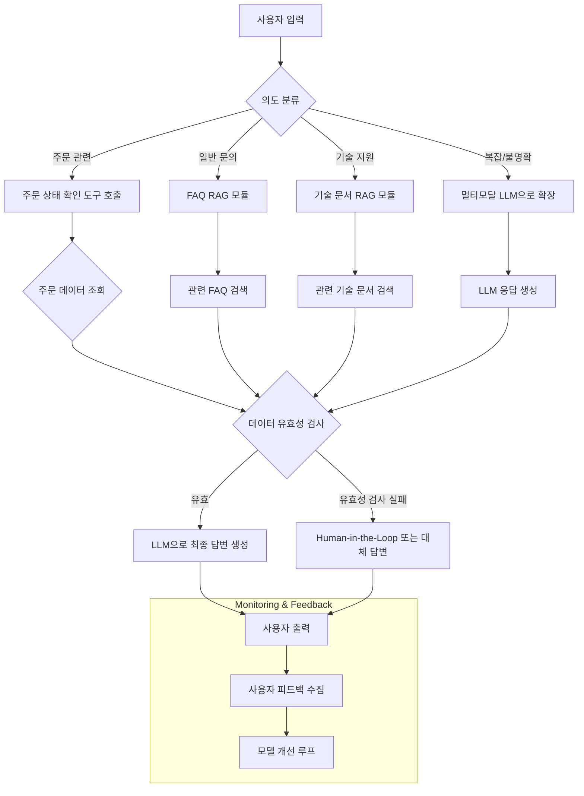

## Compound Engineering: 똑똑한 AI 시스템을 위한 조합의 미학

AI 시스템 개발은 더 이상 단일 LLM 호출에 그치지 않습니다. 복잡하고 신뢰할 수 있으며 비용 효율적인 AI 애플리케이션을 구축하기 위해서는 다양한 AI 모델, 전통적인 로직, 데이터 소스, 그리고 사용자 인터페이스를 유기적으로 조합하고 조율하는 기술이 필수적입니다. 이것이 바로 **Compound Engineering**의 핵심입니다.

Harness Engineering의 한 축으로서, Compound Engineering은 마치 여러 개의 정교한 기계 부품을 조립하여 하나의 거대한 공장을 만드는 것과 같습니다. 각 부품(AI 모델, 도구, 데이터베이스 등)은 특정 작업을 수행하고, 이들이 체인 또는 그래프 형태로 연결되어 최종적으로 사용자에게 가치를 제공하는 복잡한 지능형 시스템을 만들어냅니다. 특히 iOS/프론트엔드 개발자들이 AI를 실무에 적용하려 할 때, 백엔드에서 이러한 복합 시스템을 이해하고 활용하는 것은 물론, 때로는 클라이언트 사이드에서 경량 모델 및 로직과 연동하여 사용자 경험을 최적화하는 데도 필수적인 역량입니다.

### 왜 Compound Engineering이 중요한가?

단일 LLM만으로는 모든 요구사항을 충족하기 어렵습니다. 다음과 같은 이유로 Compound Engineering은 현대 AI 애플리케이션 개발의 핵심 전략으로 부상하고 있습니다.

1.  **제한된 기능 보완**: LLM은 강력하지만, 특정 도메인 지식, 실시간 데이터 접근, 복잡한 계산, 정형화된 데이터 처리에는 한계가 있습니다. Compound Engineering은 Tool Use, RAG(Retrieval-Augmented Generation), 외부 API 연동 등을 통해 LLM의 약점을 보완합니다.
2.  **비용 및 성능 최적화**: 모든 작업을 거대 LLM에 맡기는 것은 비효율적입니다. Compound 시스템은 작업의 복잡도에 따라 더 작고 빠르며 저렴한 전문 모델(예: 분류 모델, 요약 모델) 또는 규칙 기반 로직을 활용하여 전체 시스템의 비용을 절감하고 응답 속도를 향상시킬 수 있습니다.
3.  **견고성 및 신뢰성 증대**: 다단계 검증, Fallback 메커니즘, Human-in-the-Loop(HITL) 설계 등을 통해 시스템의 오류를 줄이고 예측 불가능한 상황에 대한 대응력을 높일 수 있습니다.
4.  **복잡한 사용자 요구 처리**: 실제 사용자의 요구사항은 종종 모호하고 다단계적입니다. Compound Engineering은 여러 단계를 거쳐 사용자의 의도를 정확히 파악하고, 필요한 정보를 수집하며, 최종적인 결과물을 생성하는 과정을 유연하게 설계할 수 있게 합니다.
5.  **새로운 AI 애플리케이션 패턴 창출**: LLM, 이미지/음성 모델, 벡터 DB, 에이전트 등을 결합하여 기존에는 불가능했던 새로운 형태의 지능형 서비스를 구현할 수 있습니다.

### Compound Engineering의 핵심 요소 및 2026년 트렌드

Compound Engineering은 여러 가지 기술과 패턴을 조합합니다. 2026년에는 특히 다음과 같은 요소들의 중요성이 더욱 강조될 것입니다.

| 핵심 요소          | 설명                                                                                                                                                                                                                                                                                        | 2026년 트렌드 반영                                                                                                                                                                                                                                                                                                                                                                                                                    |
| :----------------- | :---------------------------------------------------------------------------------------------------------------------------------------------------------------------------------------------------------------------------------------------------------------------------------------- | :------------------------------------------------------------------------------------------------------------------------------------------------------------------------------------------------------------------------------------------------------------------------------------------------------------------------------------------------------------------------------------------------------------------------------------- |
| **Orchestration Frameworks** | 여러 AI 컴포넌트를 연결하고 실행 순서를 제어하는 프레임워크 (예: LangChain, LlamaIndex, 자체 개발 모듈). 입력 라우팅, 조건부 실행, 병렬 처리 등을 담당합니다.                                                                                                                                 | 복잡한 Directed Acyclic Graph (DAG) 기반의 워크플로우 지원, 분산 환경에서의 상태 관리 및 복구 기능 강화. **Serverless Function** 또는 **Edge Runtime**에서 경량화된 Orchestration이 중요해질 것입니다.                                                                                                                                                                                                                                    |
| **Specialized Models** | 특정 작업(분류, 요약, 감정 분석, 특정 도메인 질문 등)에 최적화된 소형 모델. 거대 LLM 대신 활용하여 비용 및 지연 시간을 최적화합니다.                                                                                                                                                            | **Mixture-of-Experts (MoE) 아키텍처**를 활용한 모델 선택 & 분산 추론. 온디바이스(iOS)에서의 경량 모델(MobileViT, TinyLlama 등) 활용 증가, 클라우드 모델과의 하이브리드 구성으로 개인정보 보호 및 응답 속도 동시 확보.                                                                                                                                                                                                               |
| **Tool Use & Agents** | LLM이 외부 도구(API, 데이터베이스, 검색 엔진 등)를 호출하고 활용할 수 있도록 하는 기능. Agents는 이를 자율적으로 판단하고 실행하여 복잡한 목표를 달성합니다.                                                                                                                               | 멀티모달 도구 사용 (이미지 생성/분석 API 호출, 비디오 처리), 복합 에이전트 시스템 (팀워크 기반의 에이전트들), **Self-Reflection & Self-Correction** 기능을 갖춘 에이전트. 금융/법률 등 규제 산업에서 Human-in-the-Loop(HITL)를 포함하는 Tool Use 패턴이 정교해질 것입니다.                                                                                                                                     |
| **Context Management** | RAG를 포함한 다양한 방식으로 관련성 높은 정보를 LLM에 전달하여 환각(Hallucination)을 줄이고 응답의 정확성을 높이는 기술.                                                                                                                                                                     | 동적인 컨텍스트 업데이트 (실시간 사용자 행동, 외부 이벤트), **Long Context Window** LLM의 활용과 함께 효율적인 컨텍스트 압축/요약 기술 발전. 프론트엔드에서 수집된 사용자 인터랙션 데이터(사용자가 클릭한 버튼, 스크롤 위치 등)를 Context로 활용하는 패턴 증대.                                                                                                                                             |
| **Output Validation & Refinement** | LLM의 출력물을 후처리하고 유효성을 검사하며, 필요에 따라 보정하는 단계. (예: JSON 스키마 검사, 안전성 필터링, 사용자 피드백 반영).                                                                                                                                               | **AI Sentinel/Guardrail** 모델을 통한 실시간 출력 검증 및 수정. 생성된 콘텐츠의 저작권/표절 검사 기능 통합. 사용자 피드백을 활용한 **Reinforcement Learning from Human Feedback (RLHF)**의 자동화된 적용.                                                                                                                                                                                                                     |
| **Multimodal Integration** | 텍스트 외에 이미지, 음성, 비디오 등 다양한 형태의 데이터를 입력으로 받아 처리하거나 출력으로 생성하는 기능.                                                                                                                                                                               | **Visual Grounding**을 통한 프론트엔드 UI 요소와의 연동 (예: 스크린샷을 분석하여 UI 개선 제안), 온디바이스 음성/이미지 처리 후 클라우드 LLM 연동. iOS의 Apple Intelligence API와 같은 플랫폼 레벨의 멀티모달 기능이 Compound 시스템의 필수 요소가 될 것입니다.                                                                                                                                                             |
| **Proactive AI & Adaptive Interfaces** | 사용자의 명시적인 요청 없이도 상황을 분석하여 선제적으로 정보나 기능을 제공하거나, 사용자 행동에 따라 UI를 동적으로 변화시키는 AI.                                                                                                                                              | 사용자의 과거 행동 및 선호를 기반으로 개인화된 Compound workflow 동적 생성. UI 컴포넌트 자동 생성/조정 및 A/B 테스팅 통합. iOS의 Siri Shortcuts이나 위젯 등과 연동하여 사용자 경험을 예측하고 자동화하는 복합 에이전트 시스템이 일반화될 것입니다.                                                                                                                                                                |

### Compound Engineering 동작 원리 예시

다음 Mermaid 다이어그램은 간단한 고객 지원 챗봇이 Compound Engineering 패러다임을 통해 어떻게 여러 구성 요소를 활용하는지 보여줍니다.



위 다이어그램은 사용자의 초기 입력이 먼저 `의도 분류` 모델을 거쳐 각기 다른 AI 컴포넌트(주문 도구, FAQ RAG, 기술 문서 RAG, 멀티모달 LLM)로 라우팅되는 과정을 보여줍니다. 각 컴포넌트의 결과는 `데이터 유효성 검사` 단계를 거쳐 최종 LLM이 답변을 생성하는 데 사용되거나, 필요한 경우 Human-in-the-Loop 시스템으로 넘어갑니다. 이는 단일 모델이 모든 것을 처리하는 것보다 훨씬 유연하고 강력하며, 각 단계에서 최적의 리소스를 활용할 수 있게 합니다.

### 실무 사용 사례 및 코드 패턴 (TypeScript)

프론트엔드 또는 백엔드에서 Compound System을 설계할 때, TypeScript는 타입 안정성과 풍부한 생태계로 강력한 이점을 제공합니다. 다음은 간단한 "스마트 콘텐츠 요약 및 키워드 추출" 시스템의 예시입니다.

이 시스템은 사용자가 긴 텍스트를 입력하면, 다음과 같은 Compound Workflow를 따릅니다.
1.  **입력 검증**: 텍스트 길이가 적절한지 확인합니다.
2.  **핵심 주제 분류**: 텍스트의 핵심 주제를 분류하여 어떤 요약 모델을 사용할지 결정합니다. (예: 뉴스, 기술 문서, 소설)
3.  **전문 요약 모델 호출**: 분류된 주제에 맞는 전문 요약 모델(또는 프롬프트 전략)을 사용합니다.
4.  **키워드 추출**: 요약된 텍스트에서 주요 키워드를 추출합니다.
5.  **출력 형식화 및 검증**: 최종 결과를 JSON 형태로 반환하고, 필요한 필드가 모두 있는지 검증합니다.

```typescript
// src/services/llmService.ts (가상의 LLM API 래퍼)
interface LLMResponse {
  success: boolean;
  data: any;
  error?: string;
}

class LLMService {
  private apiKey: string;
  private baseUrl: string;

  constructor(apiKey: string, baseUrl: string) {
    this.apiKey = apiKey;
    this.baseUrl = baseUrl;
  }

  async call(model: string, prompt: string, options?: any): Promise<LLMResponse> {
    try {
      // 실제 API 호출 로직 (fetch, axios 등)
      // 여기서는 예시를 위해 더미 데이터를 반환
      console.log(`Calling LLM model: ${model} with prompt: ${prompt.substring(0, 50)}...`);
      await new Promise(resolve => setTimeout(resolve, 500)); // Simulate network delay

      if (model === 'classifier-small' && prompt.includes("finance")) {
          return { success: true, data: { category: 'Finance' } };
      } else if (model === 'classifier-small' && prompt.includes("technology")) {
          return { success: true, data: { category: 'Technology' } };
      } else if (model === 'summarizer-finance') {
          return { success: true, data: { summary: '금융 관련 텍스트 요약입니다.', keywords: ['금융', '경제', '투자'] } };
      } else if (model === 'summarizer-tech') {
          return { success: true, data: { summary: '기술 관련 텍스트 요약입니다.', keywords: ['기술', '개발', '혁신'] } };
      } else if (model === 'keyword-extractor') {
          return { success: true, data: { keywords: ['extracted', 'keywords', 'example'] } };
      }
      
      return { success: true, data: { category: 'General', summary: '일반 요약입니다.', keywords: ['일반', '키워드'] } };

    } catch (error: any) {
      return { success: false, error: error.message };
    }
  }

  // Tool Use 예시: 특정 함수 호출 (이름만으로 구분)
  async callTool(toolName: string, args: any): Promise<LLMResponse> {
    console.log(`Calling tool: ${toolName} with args:`, args);
    await new Promise(resolve => setTimeout(resolve, 300));

    if (toolName === 'validateTextLength') {
      const { text, minLength, maxLength } = args;
      const isValid = text.length >= minLength && text.length <= maxLength;
      return { success: true, data: { isValid, message: isValid ? 'Valid length' : 'Invalid length' } };
    }
    return { success: false, error: `Tool ${toolName} not found` };
  }
}

// src/compound_engine.ts
import { LLMService } from './services/llmService'; // 가정

interface ContentAnalysisResult {
  category: string;
  summary: string;
  keywords: string[];
  originalLength: number;
}

class CompoundContentAnalyzer {
  private llmService: LLMService;
  private readonly MIN_TEXT_LENGTH = 50;
  private readonly MAX_TEXT_LENGTH = 5000;

  constructor(llmService: LLMService) {
    this.llmService = llmService;
  }

  async analyzeContent(text: string): Promise<ContentAnalysisResult | null> {
    // 1. 입력 검증 단계 (Tool Use 예시)
    const lengthValidation = await this.llmService.callTool('validateTextLength', {
      text,
      minLength: this.MIN_TEXT_LENGTH,
      maxLength: this.MAX_TEXT_LENGTH,
    });

    if (!lengthValidation.success || !lengthValidation.data.isValid) {
      console.error(`Validation failed: ${lengthValidation.data?.message || lengthValidation.error}`);
      return null;
    }

    // 2. 핵심 주제 분류 (작고 빠른 LLM 활용)
    const categoryPrompt = `주어진 텍스트가 어떤 카테고리에 속하는지 한 단어로 분류하세요: 금융, 기술, 일반. 텍스트: "${text.substring(0, 200)}..."`;
    const categoryResponse = await this.llmService.call('classifier-small', categoryPrompt);

    if (!categoryResponse.success) {
      console.error('Failed to classify category:', categoryResponse.error);
      return null;
    }
    const category = categoryResponse.data.category || 'General';
    console.log(`Detected category: ${category}`);

    // 3. 전문 요약 모델 호출 (카테고리에 따라 다른 모델 또는 프롬프트 사용)
    let summaryResponse: LLMResponse;
    if (category === 'Finance') {
      const summarizePrompt = `다음 금융 텍스트를 200단어 이내로 요약하고 핵심 금융 키워드를 5개 추출하세요 (JSON 형식: {"summary": "", "keywords": []}): "${text}"`;
      summaryResponse = await this.llmService.call('summarizer-finance', summarizePrompt);
    } else if (category === 'Technology') {
      const summarizePrompt = `다음 기술 텍스트를 200단어 이내로 요약하고 핵심 기술 키워드를 5개 추출하세요 (JSON 형식: {"summary": "", "keywords": []}): "${text}"`;
      summaryResponse = await this.llmService.call('summarizer-tech', summarizePrompt);
    } else { // Fallback to general summarizer
      const summarizePrompt = `다음 텍스트를 200단어 이내로 요약하고 핵심 키워드를 5개 추출하세요 (JSON 형식: {"summary": "", "keywords": []}): "${text}"`;
      summaryResponse = await this.llmService.call('summarizer-general', summarizePrompt);
    }

    if (!summaryResponse.success) {
      console.error('Failed to summarize content:', summaryResponse.error);
      // Fallback: Try a generic summarizer if specialized one fails
      summaryResponse = await this.llmService.call('summarizer-general', `텍스트 요약: "${text}"`);
      if (!summaryResponse.success) return null;
    }

    const { summary, keywords } = summaryResponse.data;

    // 4. (선택적) 키워드 추출을 위한 별도 LLM 호출 또는 후처리 (여기서는 요약 모델에서 함께 처리했음을 가정)
    // 만약 요약 모델이 키워드를 주지 않았다면, 여기서 키워드 추출 전용 모델을 호출할 수 있습니다.
    // const keywordExtractionResponse = await this.llmService.call('keyword-extractor', `다음 요약에서 키워드를 추출: ${summary}`);
    // const extractedKeywords = keywordExtractionResponse.data.keywords;

    // 5. 출력 형식화 및 검증
    if (!summary || !Array.isArray(keywords) || keywords.length === 0) {
      console.error('Invalid summary or keywords received.');
      return null;
    }

    const result: ContentAnalysisResult = {
      category,
      summary,
      keywords,
      originalLength: text.length,
    };

    // 추가적인 출력 유효성 검사 (예: 키워드가 요약에 포함되어 있는지 등)
    if (!summary.includes(keywords[0])) {
        console.warn("First keyword not found in summary, potential hallucination or bad extraction.");
    }

    return result;
  }
}

// 사용 예시
async function main() {
  const llmService = new LLMService('YOUR_API_KEY', 'https://api.example.com/llm');
  const analyzer = new CompoundContentAnalyzer(llmService);

  const sampleFinanceText = `글로벌 증시는 인플레이션 압력 완화 기대감과 기업 실적 개선 소식에 힘입어 상승세를 보였다. 특히 기술주의 강세가 두드러졌으며, 연방준비제도(Fed)의 금리 인상 속도 조절 가능성도 투자 심리에 긍정적인 영향을 미쳤다. 에너지 섹터는 중동 지역의 지정학적 리스크로 인해 변동성이 확대되었다. 다음 분기 실적 발표에 대한 시장의 관심이 집중되고 있다.`;
  const sampleTechText = `최근 인공지능 분야에서는 생성형 AI 모델의 발전이 가속화되고 있다. 특히 멀티모달 LLM은 텍스트뿐만 아니라 이미지, 오디오 등 다양한 데이터를 처리하며 새로운 사용자 경험을 제공하고 있다. 프론트엔드 개발자들도 AI 모델을 웹 애플리케이션에 통합하는 다양한 패턴을 연구하며, 사용자 인터페이스와 AI의 상호작용을 개선하는 데 주력하고 있다.`;

  console.log('--- Analyzing Finance Text ---');
  const financeResult = await analyzer.analyzeContent(sampleFinanceText);
  if (financeResult) {
    console.log(JSON.stringify(financeResult, null, 2));
  }

  console.log('\n--- Analyzing Technology Text ---');
  const techResult = await analyzer.analyzeContent(sampleTechText);
  if (techResult) {
    console.log(JSON.stringify(techResult, null, 2));
  }
}

main();

```

위 코드에서 `CompoundContentAnalyzer`는 `LLMService`의 다양한 기능을 조합하여 단일 LLM으로는 달성하기 어려운 복잡한 작업을 수행합니다. 입력 검증을 위한 `callTool` 호출부터, 작은 모델을 통한 분류(`classifier-small`), 그리고 카테고리에 따른 전문 요약 모델 선택(`summarizer-finance`, `summarizer-tech`)에 이르기까지, 각 단계가 유기적으로 연결되어 최적의 결과물을 도출합니다. 에러 처리 및 Fallback 로직도 포함되어 있어 시스템의 견고성을 높입니다.

### 2026년 프론트엔드/iOS 개발자를 위한 Compound Engineering 패턴

1.  **클라이언트-사이드 경량 AI + 서버사이드 대형 AI 연동**:
    *   **패턴**: 사용자 입력 시, 초기 검증/분류/간단한 추천은 클라이언트(iOS 앱, 웹 프론트엔드)의 경량 모델로 처리하여 즉각적인 피드백을 제공. 더 복잡한 추론이나 대규모 지식 기반 접근은 서버사이드의 Compound System에 요청.
    *   **예시**: iOS 앱에서 음성 입력 시, 기본적인 음성-텍스트 변환 및 간단한 명령어 인식은 온디바이스 모델로, 복잡한 질문에 대한 답변은 클라우드의 RAG + LLM + Tool Use 복합 시스템으로 전달. 웹 프론트엔드에서 입력 폼 작성 시 실시간 문법/오타 검사는 경량 모델로, 최종 제출 전 내용 요약/개선은 서버사이드 AI에 요청.
2.  **Adaptive UI with Proactive AI**:
    *   **패턴**: 사용자 행동, 컨텍스트 (시간, 위치, 과거 데이터)를 기반으로 Compound System이 다음에 필요한 UI 요소나 정보를 예측하여 미리 준비하거나, UI 자체를 동적으로 재구성.
    *   **예시**: 여행 앱에서 사용자가 숙소 페이지를 오래 보았을 때, Compound System (사용자 기록 분석 모델 + LLM 기반 추천 엔진 + 할인 정보 조회 도구)이 주변 관광지 정보와 연관 할인쿠폰을 포함한 맞춤형 추천 UI 컴포넌트를 동적으로 생성하여 보여줌.
3.  **Human-in-the-Loop (HITL) 통합 워크플로우**:
    *   **패턴**: AI 시스템이 특정 임계값 이하의 신뢰도로 결과를 생성하거나, 중요한 결정이 필요한 경우, 프론트엔드/iOS를 통해 사용자 또는 전문가의 검토/승인을 요청.
    *   **예시**: AI가 생성한 마케팅 문구가 정책 위반 가능성이 있다고 판단되면, 해당 문구와 AI의 경고 메시지를 UI에 표시하고, 사용자가 직접 검토하고 수정하거나 승인할 수 있는 플로우 제공.
4.  **멀티모달 사용자 경험 확장**:
    *   **패턴**: 텍스트 외에 이미지, 음성, 비디오 등 다양한 모달리티의 입력을 받아들이고, Compound System 내의 여러 멀티모달 모델을 조합하여 처리. 결과 또한 다양한 모달리티로 제공.
    *   **예시**: 사용자가 카메라로 제품 사진을 찍어 올리면 (이미지 입력), Compound System (시각 분석 모델 + 제품 DB 검색 RAG + LLM)이 제품 정보를 제공하고, 관련 사용법 비디오를 추천하며 (비디오 출력), 질문에 대한 답변을 음성으로 전달 (음성 출력).

이러한 패턴들은 Compound Engineering을 통해 AI의 한계를 극복하고, 사용자 중심의 지능형 애플리케이션을 구축하는 데 필수적인 전략이 될 것입니다.

---

## 자기 점검

1.  Compound Engineering이 필요한 가장 주된 이유 3가지를 설명하세요.
2.  단일 LLM 호출 방식과 Compound Engineering 방식의 주요 차이점은 무엇이며, 각각 어떤 상황에 더 적합하다고 생각하나요?
3.  본문에서 제시된 고객 지원 챗봇 Mermaid 다이어그램에서, '데이터 유효성 검사' 단계가 필요한 이유는 무엇이며, 이 단계가 없었을 때 발생할 수 있는 문제점은 무엇일까요?
4.  2026년 트렌드 중 '클라이언트-사이드 경량 AI + 서버사이드 대형 AI 연동' 패턴이 iOS/프론트엔드 개발자에게 특히 중요한 이유는 무엇일까요?
5.  Compound Engineering에서 Fallback 아키텍처나 Human-in-the-Loop (HITL) 통합 워크플로우가 중요한 이유는 무엇일까요?

**이 개념을 동료에게 설명한다면?**
"Compound Engineering이 뭔지 한 문장으로 설명하고, 왜 우리가 이걸 알아야 하는지 우리 팀의 특정 프로젝트에 빗대어 설명해 봐."

**실습 과제:**
당신이 개발하고 있는 iOS 앱 또는 웹 서비스에서 사용자의 피드백을 수집하고 분석하는 기능을 Compound Engineering 원칙에 따라 설계해보세요. 최소 3단계 이상의 컴포넌트(예: 입력 정제, 감정 분석, 키워드 추출, 요약, 적절한 부서로 라우팅)를 포함하고, 각 단계에서 어떤 종류의 AI 모델 또는 로직이 활용될 수 있을지 구체적으로 명시해보세요. 필요하다면 Mermaid 다이어그램으로 흐름을 표현하고, 핵심 API 호출(가상)을 포함한 의사(pseudo) 코드를 작성해보세요.