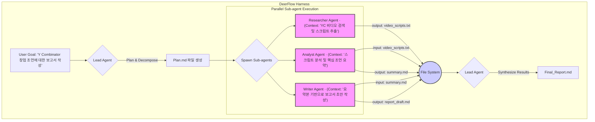

단일 컨텍스트 창(Context Window)의 한계는 AI 에이전트가 복잡하고 긴 작업을 수행할 때 가장 먼저 부딪히는 벽이다. 단순한 ReAct 루프를 넘어서는 에이전트는 수십, 수백 번의 도구 호출과 추론을 거치며 필연적으로 초기 목표를 잊거나, 이전에 해결한 버그를 다시 만들어내는 등 컨텍스트 유실 문제를 겪는다. 이 문제는 단순히 더 큰 컨텍스트 창을 가진 모델로 해결되지 않는다. 비용과 지연 시간, 그리고 긴 컨텍스트에서 모델 성능이 예측 불가능하게 저하되는 근본적인 한계가 있기 때문이다.

ByteDance의 DeerFlow 2.0은 이 문제를 '하네스(Harness)' 레벨에서 해결하려는 시도 중 가장 주목할 만한 접근법을 보여준다. 단순히 LLM을 호출하는 루프가 아니라, 장기 실행(Long-running) 작업을 안정적으로 완수하기 위한 상태 관리와 실행 환경을 제공하는 것에 초점을 맞춘다. DeerFlow의 핵심은 모델의 '기억력'에 의존하는 대신, 작업 상태와 중간 산출물을 외부의 영구 저장소로 분리하고 컨텍스트를 적극적으로 관리하는 '컨텍스트 엔지니어링'에 있다.

## 상태 외부화: 파일 시스템을 제2의 메모리로

DeerFlow는 에이전트에게 격리된 Docker 컨테이너와 함께 영구적인 파일 시스템을 제공한다. 이는 단순한 코드 실행 샌드박스를 넘어, 장기 실행 작업의 상태를 저장하는 핵심적인 역할을 한다.

에이전트는 작업 중 생성되는 중간 결과물, 요약된 정보, 실행 계획 등을 파일 시스템에 기록한다. 이를 통해 현재 LLM 호출에 필수적이지 않은 정보는 컨텍스트 창에서 제거하고, 필요할 때 다시 파일에서 읽어올 수 있다. 이 '요약 및 오프로드(Summarization + Filesystem Offload)' 패턴은 컨텍스트 창을 효율적으로 유지하면서도 작업의 연속성을 보장하는 핵심 메커니즘이다.

이는 iOS 개발자가 메모리 압박이 심한 앱을 개발할 때, 모든 데이터를 메모리에 올리지 않고 필요할 때만 데이터베이스(Core Data, SwiftData)나 파일 시스템에서 불러오는 전략과 유사하다. 메모리(컨텍스트 창)는 현재 UI를 렌더링하거나 계산을 수행하는 데 필요한 최소한의 데이터만 유지하고, 나머지는 영구 저장소에 위임하는 것이다.

### 서브 에이전트를 통한 컨텍스트 분리

DeerFlow의 또 다른 핵심 아키텍처는 리드 에이전트(Lead Agent)가 복잡한 목표를 하위 작업으로 분해하고, 각 작업을 전문화된 서브 에이전트(Sub-agent)에게 위임하는 방식이다. 중요한 것은 각 서브 에이전트가 자신만의 격리된 컨텍스트에서 작업을 수행한다는 점이다.

- **리드 에이전트**: 전체 목표를 분석하고 실행 계획을 수립하며, 여러 서브 에이전트를 병렬 또는 순차적으로 실행하고 결과를 종합한다.
- **서브 에이전트**: "웹 검색", "코드 작성", "보고서 생성" 등 특정 역할에 집중한다. 이들은 전체 작업의 맥락을 모두 알 필요 없이, 자신에게 주어진 명확한 목표와 도구만으로 작업을 수행한다.

이 구조는 전체 작업의 컨텍스트가 비대해지는 것을 막고, 각 LLM 호출이 더 작고 집중된 컨텍스트 내에서 이루어지게 하여 환각(Hallucination)을 줄이고 작업 성공률을 높인다.



## DeerFlow 아키텍처와 일반적인 에이전트 루프 비교

DeerFlow의 접근 방식은 단일 루프에서 모든 것을 처리하는 일반적인 ReAct 에이전트와 근본적인 차이를 보인다.

| 특징 | 일반적인 ReAct 에이전트 | DeerFlow 2.0 하네스 |
| :--- | :--- | :--- |
| **상태 관리** | 주로 인메모리(In-memory) 변수와 대화 기록에 의존. 세션이 재시작되면 상태 유실. | 파일 시스템과 데이터베이스(LangGraph Checkpointing)를 통한 영구적 상태 관리. |
| **컨텍스트** | 단일 컨텍스트. 작업이 길어질수록 이전 정보가 유실되거나 요약 정보로 압축됨. | 작업별로 분리된 다중 컨텍스트. 서브 에이전트는 자신에게 필요한 최소한의 컨텍스트만 가짐. |
| **작업 분해** | 모델의 추론 능력에 의존하여 암시적으로 수행되거나, 간단한 체인(Chain)으로 구성. | 리드 에이전트가 명시적으로 계획을 수립하고, 독립적으로 실행 가능한 서브 태스크로 분해. |
| **오류 회복** | 루프 내에서 재시도(Retry)하는 수준. 프로세스가 죽으면 처음부터 다시 시작해야 함. | 체크포인트를 통해 중단된 워크플로우를 재개할 수 있음 (LangGraph 기반). |
| **복잡성** | 구현이 비교적 간단하며, 짧고 명확한 작업에 적합. | 하네스 자체의 복잡성은 높지만, 길고 복잡하며 중단될 수 있는 작업에 강함. |

## iOS 개발자를 위한 시사점: Swift 액터(Actor) 모델 적용

DeerFlow의 상태 외부화 및 격리 개념은 Swift의 액터 모델과 결합하여 iOS 앱 내에서 강력한 비동기 작업을 구현하는 데 영감을 줄 수 있다. 예를 들어, 여러 단계의 비디오 처리 파이프라인을 구축하는 `aidy-ios` 프로젝트를 상상해보자.

사용자가 비디오를 선택하면, `VideoProcessingCoordinator` 액터가 전체 작업을 총괄한다. 이 코디네이터는 작업을 분해하여 `Downloader`, `Transcoder`, `FilterApplier`, `Uploader` 같은 독립적인 자식 액터들에게 작업을 위임한다.

각 자식 액터는 자신의 상태(예: 다운로드 진행률, 트랜스코딩 설정)만 관리하며, 작업의 중간 결과물(다운로드된 파일, 트랜스코딩된 비디오 청크)을 앱의 캐시 디렉토리(파일 시스템)에 저장한다. 앱이 종료되거나 백그라운드로 전환되어도, 코디네이터는 파일 시스템에 저장된 마지막 상태를 읽어 작업을 재개할 수 있다.

```swift
// Swift 의사코드 예제 (실행 불가)

// 전체 비디오 처리 작업을 조율하는 액터
actor VideoProcessingCoordinator {
    private let videoURL: URL
    private var state: ProcessingState

    // 앱 재시작 시 파일 시스템에서 상태를 복원
    init(videoURL: URL) {
        self.videoURL = videoURL
        self.state = Self.loadStateFromDisk(for: videoURL) ?? .initial
    }

    func startProcessing() async throws {
        // 1. 다운로드 작업 (상태 외부화)
        state = .downloading
        saveStateToDisk()
        let downloader = DownloaderActor()
        let localFileURL = try await downloader.download(from: videoURL)

        // 2. 트랜스코딩 작업 (격리된 컨텍스트)
        state = .transcoding
        saveStateToDisk()
        let transcoder = TranscoderActor()
        let transcodedURL = try await transcoder.transcode(file: localFileURL)
        
        // ... 필터 적용, 업로드 등 후속 작업 진행
        
        state = .completed
        saveStateToDisk()
        cleanupTemporaryFiles()
    }
    
    private func saveStateToDisk() {
        // 현재 진행 상태(state)와 중간 파일 경로 등을 파일 시스템에 저장
    }

    private static func loadStateFromDisk(for url: URL) -> ProcessingState? {
        // 파일 시스템에서 저장된 상태를 읽어와 복원
        return nil
    }
}

// 각 단계를 책임지는 독립적인 액터
actor DownloaderActor {
    func download(from url: URL) async throws -> URL {
        // ... 다운로드 로직 ...
        // 결과물을 파일로 저장하고 그 경로를 반환
        let destinationURL = FileManager.default.temporaryDirectory.appendingPathComponent(UUID().uuidString)
        // ... URLSession 백그라운드 다운로드 등 ...
        return destinationURL
    }
}
```

이 접근법은 DeerFlow의 핵심 원칙을 차용한다. `VideoProcessingCoordinator`는 리드 에이전트처럼 작업을 조율하고 상태를 영속화하며, 각 단계를 처리하는 액터들은 격리된 컨텍스트를 가진 서브 에이전트 역할을 한다. 이를 통해 복잡하고 긴 백그라운드 작업을 더 안정적이고 복원력 있게 만들 수 있다.

## 트레이드오프와 한계

DeerFlow의 아키텍처는 강력하지만 모든 상황에 적합한 만병통치약은 아니다.
1.  **초기 설정 복잡성**: 간단한 작업을 위해 전체 하네스 인프라(Docker, 파일 시스템 마운트, 서브 에이전트 정의)를 구축하는 것은 과도한 투자일 수 있다.
2.  **상태 동기화 오버헤드**: 상태를 지속적으로 파일 시스템에 쓰고 읽는 과정은 순수 인메모리 방식보다 느리다. 잦은 I/O가 성능 병목이 될 수 있다.
3.  **디버깅의 어려움**: 여러 서브 에이전트가 병렬로 실행되고 상태가 여러 파일에 분산되어 있을 때, 문제의 원인을 추적하는 것은 단일 루프 에이전트보다 훨씬 복잡하다. 강력한 로깅과 추적 시스템이 필수적이다.

따라서 "블로그 포스팅 초안 작성"과 같이 수 분 내에 끝나는 짧은 작업에는 이 아키텍처가 오히려 비효율적일 수 있다. 그러나 "여러 소스에서 데이터를 수집, 분석하여 시장 동향 보고서를 작성하고, 그 내용을 기반으로 발표 슬라이드까지 생성"하는 것과 같이 몇 시간 이상 소요될 수 있는 '장기 실행' 작업에서 DeerFlow의 진가가 드러난다.

## 자기 점검

- DeerFlow가 장기 실행 작업의 안정성을 확보하기 위해 사용하는 두 가지 핵심적인 아키텍처 패턴은 무엇인가?
- '요약 및 파일 시스템 오프로드' 패턴이 중요한 이유는 무엇이며, 이것이 LLM의 어떤 근본적인 한계를 해결하는가?
- 리드 에이전트와 서브 에이전트로 작업을 분리하는 것이 단일 에이전트 방식에 비해 갖는 장점과 단점은 무엇인가?
- 현재 진행 중인 iOS 프로젝트에서 가장 길고 복잡한 비동기 작업(예: 데이터 동기화, 파일 업로드/다운로드, 머신러닝 모델 실행)을 DeerFlow의 상태 외부화 원칙을 적용하여 어떻게 리팩토링할 수 있을까?