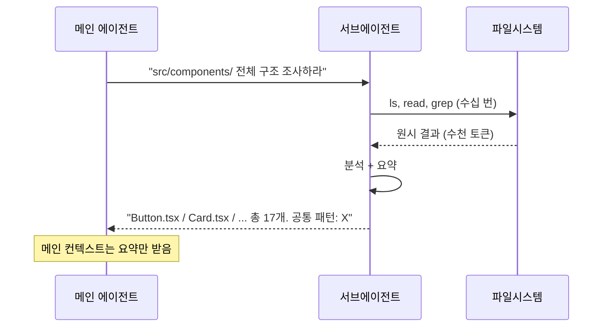
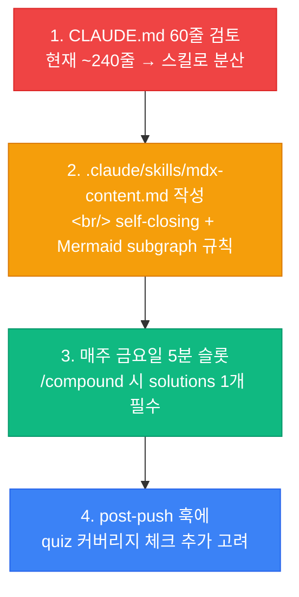

## 왜 지금 하네스 엔지니어링인가

실버개발자 채널의 ["프론트엔드 엔지니어링은 끝났습니다: 이제 '하네스'의 시대입니다"](https://www.youtube.com/watch?v=6gvnDSAcZww) 영상을 보면서 가장 강하게 박힌 한 줄이 있다.

> **"2024년은 프롬프트 엔지니어링, 2025년은 컨텍스트 엔지니어링, 2026년은 하네스 엔지니어링의 해다."**

이 흐름을 그대로 받아들이면 내가 지금 이 위키에 쌓고 있는 개념들이 정확히 그 진화의 궤적과 일치한다. 그래서 이 글은 단순한 영상 정리가 아니라, 내가 위키에 이미 기록한 [Harness Engineering 개요](/wiki/harness-engineering/harness-engineering-overview)의 **다음 단계 — 실전 레버 — 를 한 층 더 쌓는 작업**이다.

### 하네스(Harness)의 본뜻

영상에서 가장 좋았던 비유는 이거다.

> **"하네스는 원래 말에게 채우는 고삐와 안장이다. 이 고삐의 모양에 따라 말의 컨트롤이 달라진다."**

LLM은 야생마 같아서 혼자 두면 멀리 갈 수 있지만, 내가 원하는 방향으로 가지는 않는다. 프롬프트는 채찍에 가깝다 — 순간의 지시. 컨텍스트는 시야를 정해주는 안대에 가깝다. 하네스는 **말과 기수 사이의 물리적 연결 자체**다. 이게 바로 2026년의 관심사가 여기에 집중되는 이유다.

## "보고-잡고-되살리기" — 영상에서 본 3단계 제어

영상에서 가장 실용적이었던 프레임. 하네스가 무엇을 해결하려는지 한 문장으로 표현한다.

```mermaid
flowchart LR
    A[에이전트 실행] --> B[보고<br/>Observe]
    B --> C[잡고<br/>Intercept]
    C --> D[되살리기<br/>Recover]
    D --> A

    B -.SSOT<br/>progress.md.- B
    C -.2-part agent<br/>sub-agent.- C
    D -.checkpoint<br/>git worktree.- D
```

| 단계 | 해결하는 문제 | 구현 |
|---|---|---|
| **1. 보고 (Observe)** | 긴 작업 중 에이전트가 현재 위치를 잊는 컨텍스트 드리프트 | SSOT(Single Source of Truth) 파일 — `progress.md`, `architecture.md` |
| **2. 잡고 (Intercept)** | 에러 발생 시 에이전트가 폭주 | 훅(hooks) + 서브에이전트 분업 |
| **3. 되살리기 (Recover)** | 망친 상태에서 안전하게 복원 | 체크포인트 + git worktree |

영상의 핵심 질문 하나를 그대로 옮긴다.

> **"이 작업이 망했을 때 돌아갈 세이브 포인트가 어디에 있는가?"**

이걸 먼저 정하지 않고 에이전트에게 일을 시키면 안 된다는 것. 바이브 코딩으로 2시간 신나게 달린 뒤 5번째 파일에서 파이프 고장나면 처음부터 다시 해야 한다는 공포를 모두가 한 번쯤 겪었기 때문에 이 말이 뼈에 박힌다.

## 5가지 레버

영상과 관련 레퍼런스를 종합해보면 실전 하네스는 아래 5개 레버로 구성된다. 각 레버는 독립적이고, 작은 것부터 쌓아올릴 수 있다는 점이 중요하다.

### 레버 1 — 시스템 프롬프트 (CLAUDE.md)

**원칙: 60줄 이하로 유지한다.**

영상에서 가장 반복된 숫자가 "60줄"이었다. 처음 이 말을 들었을 때는 납득이 안 됐다. 내가 아는 건 많은데 왜 다 못 적어?

이유는 이거다:

- 시스템 프롬프트는 **매 턴 전체가 입력 컨텍스트에 들어간다.** 길수록 토큰 비용 + 주의 희석.
- 에이전트는 긴 규칙 목록의 **중간을 잘 지키지 못한다** (중간 소실 — lost in the middle).
- 디렉터리 구조를 나열해봐야 파일명이 바뀌면 거짓말이 된다. 코드를 직접 읽게 하는 편이 정확하다.

**들어가야 할 것:**

```markdown
# 프로젝트 이름

한 줄 요약.

## 기술 스택
- Next.js 15 (App Router)
- TypeScript
- Tailwind CSS 4

## 테스트/빌드 명령
- `npm run build` — 프로덕션 빌드
- `npm run test` — 단위 테스트

## 코딩 컨벤션
- 한글 커밋 메시지
- 컴포넌트는 함수형 + TypeScript strict

## 금지 사항
- `git push --force` 금지
- 프로덕션 환경변수 커밋 금지
```

**들어가면 안 되는 것:** 파일 트리, 모든 라이브러리 사용법, "어떻게 생각하세요" 같은 감성.

### 레버 2 — 스킬 (점진적 지식 공개)

시스템 프롬프트가 60줄로 부족할 때 해답은 "늘리기"가 아니라 **"분산시키기"**다. 태스크별 별도 파일에 지식을 쪼개 넣고, 에이전트가 필요할 때만 불러오게 한다.

```
.claude/skills/
├── db-migration.md       # DB 마이그레이션 규칙만
├── api-endpoint.md       # API 라우트 작성 규칙만
├── frontend-component.md # 리액트 컴포넌트 규칙만
└── mdx-content.md        # MDX 작성 규칙만
```

이 글이 올라가는 ai-study 프로젝트에 대입하면:

- `mdx-content.md` — "HTML void 태그는 반드시 self-closing (`<br />`)", "Mermaid subgraph 이름에 공백이 있으면 `id [\"label\"]` 형식"
- `new-entry.md` — 새 MDX 엔트리 작성 시 frontmatter 필드 가이드
- `compound.md` — 스프린트 마무리 시 CHANGELOG/retro/solution 작성 규칙

이게 프롬프트 엔지니어링과 결정적으로 다른 점은, **실패에서 배운 규칙이 체계적으로 축적되는 저장소**가 된다는 것이다. [compound engineering](/projects)의 핵심 아이디어와 정확히 같다.

### 레버 3 — MCP 서버 (도구 확장)

에이전트가 세상에 손을 뻗는 채널. Linear 이슈 읽기, Sentry 에러 조회, DB 쿼리 실행, Figma 디자인 읽기 등. 각각이 하나의 MCP 서버다.

영상에서 나온 조언은 한 줄이다: **"2~3개로 시작해라."**

MCP 서버가 많아질수록:
- 에이전트가 어떤 도구를 언제 쓸지 고민하는 시간이 길어짐
- 각 도구의 설명문이 시스템 프롬프트에 누적됨 (토큰 폭발)
- 디버깅 지옥 — 어느 도구가 잘못 반환했는지 추적 난이도 증가

**시작 세트 추천:**

```typescript
// 프로젝트 초기엔 이 셋만
const essentialMCPs = [
  "filesystem",   // 파일 읽기/쓰기 (기본)
  "git",          // 브랜치/커밋 조회
  "web-fetch",    // 외부 문서 읽기 (이번 영상 정리처럼)
];
```

필요가 생기면 그때 추가. "혹시 모르니까 켜두자"는 하네스 과적합의 첫걸음이다.

### 레버 4 — 서브에이전트 (컨텍스트 방화벽)

긴 작업에서 가장 무서운 건 메인 컨텍스트의 오염이다. 에이전트가 실패한 시도, 디버그 출력, 중간 파일 탐색 결과로 컨텍스트를 다 채워버리면 진짜 중요한 판단을 할 용량이 남지 않는다.

**해결:** 세부 작업을 서브에이전트에 위임하고, **결과만 요약해서 메인에 돌려준다.**



Claude Code의 `Agent` / `Explore` 서브에이전트, Anthropic 프론트엔드 실험에서 한 번의 실행당 5-15회 이터레이션을 서브에이전트에 위임한 사례가 바로 이 패턴이다.

### 레버 5 — 훅 (자동 체크포인트)

가장 저평가된 레버. 훅은 에이전트가 특정 동작을 할 때 **자동으로 실행되는 스크립트**다.

```mermaid
flowchart TD
    A[에이전트 파일 편집] --> B{pre-commit hook}
    B -->|빌드 실패| C[커밋 차단]
    B -->|빌드 성공| D[커밋 통과]
    D --> E{post-push hook}
    E --> F[/compound 리마인더]
```

**이 프로젝트의 실제 훅 구성:**

- `pre-commit`: `npm run build` 자동 실행 → 실패 시 커밋 차단. [AI 생성 MDX의 `<br>` 이슈](/wiki/harness-engineering/harness-engineering-overview)를 여러 번 차단해 준 주인공.
- `post-push`: `/compound 실행하세요` 리마인더 표시 → 스프린트 마무리를 잊지 않게 함.

핵심은 **같은 실수를 두 번 하지 않게 만드는 것**이 사람의 기억이 아니라 시스템 규칙이라는 점이다.

## 매주 금요일 5분

영상에서 가장 인상적이었던 운영 팁:

> **"매주 금요일 5분만 투자해서, 이번 주에 에이전트가 저지른 실수 중 하나를 골라 하네스에 반영하라. 그게 전부다."**

5분이면 세 가지 중 하나:

1. CLAUDE.md에 한 줄 금지 규칙 추가
2. `.claude/skills/` 중 하나의 파일에 경고 블록 추가
3. 훅 스크립트에 체크 하나 추가

나는 여기서 멈추지 않고, 이 원칙을 compound engineering과 결합시켰다. ai-study 프로젝트의 [`docs/solutions/`](/projects)에 쌓이는 솔루션 문서들이 사실상 "그 주의 실패 아카이브"가 되고, `/compound` 슬래시 커맨드가 5분 금요일을 자동화한다.

### 왜 이게 작동하는가

영상에서 이 원리를 이렇게 설명한다.

> **"모델이 더 좋아져서 에이전트가 신뢰할 만해지는 게 아니다. 당신의 시스템이 학습하기 때문이다."**

모델은 Anthropic/OpenAI가 키운다. 하지만 **당신의 하네스는 당신이 키운다.** 1년 뒤 같은 모델을 써도, 하네스가 두꺼워진 당신의 프로젝트는 완전히 다른 생산성을 낸다. 복리 효과.

## 안티패턴 — 하네스 과적합

영상의 후반부 경고가 이거였다. 초보자가 빠지기 쉬운 함정.

| 안티패턴 | 증상 | 해결 |
|---|---|---|
| **CLAUDE.md를 성경처럼 길게 쓴다** | 에이전트가 중간 규칙을 무시하기 시작 | 60줄 원칙 엄수 + 스킬 파일로 분산 |
| **모든 MCP 서버를 다 켠다** | 첫 응답까지 30초+, 도구 선택 실수 증가 | 2-3개로 시작, 필요시 추가 |
| **훅을 너무 많이 건다** | 커밋 한 번에 10초+ 대기 | 진짜 차단해야 하는 것만 (빌드 실패 수준) |
| **스킬 파일을 미리 다 만들어둔다** | 대부분 참조되지 않고 낡은 규칙이 됨 | 실제 실수가 발생한 뒤 작성 |

> **"최소한의 규칙으로 최대 효과 — 이게 하네스 엔지니어링의 진짜 기술이다."**

나는 이 경고가 필요했다. 나는 뭐든지 최대화하는 기질이라, 처음에 CLAUDE.md에 프로젝트의 모든 것을 담고 싶은 충동을 참아야 했다.

## 내 프로젝트에 당장 적용할 수 있는 것

영상을 보고 내가 이 ai-study 프로젝트에 적용할 후속 작업 리스트:



1번이 가장 급한 숙제다. 지금 CLAUDE.md는 60줄의 4배라 분명 중간 규칙이 덜 지켜지고 있을 가능성이 크다. 다음 스프린트에 해야겠다.

## 자기 점검

1. 내 프로젝트의 CLAUDE.md는 몇 줄인가? 60줄 원칙을 위반한다면 무엇을 스킬 파일로 옮길 수 있나?
2. "이 작업이 망했을 때 돌아갈 세이브 포인트는 어디인가?" — 지금 이 순간 질문에 답할 수 있는가?
3. 지난 한 주 동안 에이전트가 같은 실수를 두 번 이상 한 적이 있나? 그 실수는 하네스에 반영되었는가?
4. 내 프로젝트에서 가장 먼저 추가할 MCP 서버 3개는 무엇이고, 왜 그것들인가?
5. **(열린 질문)** 이 개념을 동료 프론트엔드 개발자에게 설명한다면, 어떤 비유를 쓸 것인가? 영상의 "말과 고삐" 비유가 최선인지, 더 나은 것이 있을지 생각해보자.

### 실습 과제

이 위키 프로젝트의 `CLAUDE.md`를 실제로 열어 **60줄 버전의 초안**을 만들어 보자. 지금의 내용 중 무엇이 "진짜 규칙"이고 무엇이 "참고 정보"인지 구분하는 연습 자체가 하네스 엔지니어링의 핵심 근육이다.

## 출처

- 원본 영상: [실버개발자 — "프론트엔드 엔지니어링은 끝났습니다: 이제 '하네스'의 시대입니다"](https://www.youtube.com/watch?v=6gvnDSAcZww)
- 보강 자료:
  - [하네스 엔지니어링 완벽 정리 — 5가지 레버 (GPTers)](https://www.gpters.org/nocode/post/harness-engineering-complete-summary-3knw3BTfdPoX5K0)
  - [초보자도 쉽게 따라하는 하네스 엔지니어링 (GPTers)](https://www.gpters.org/dev/post/harness-engineering-easy-follow-25VIHLOgYq6YGzt)
  - [프롬프트와 컨텍스트를 넘어, AI 에이전트를 위한 하네스 엔지니어링 (madplay)](https://madplay.github.io/en/post/harness-engineering)
