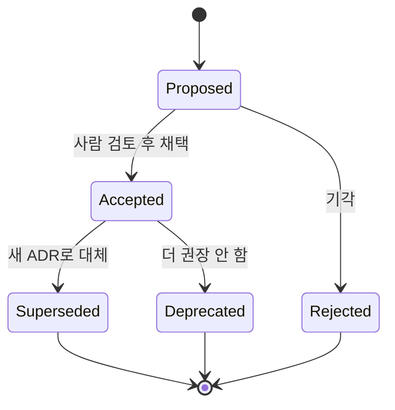

회고에 한 줄, 메모리 파일에 또 한 줄, CLAUDE.md에 슬쩍 추가된 규칙 한 줄. 하네스를 몇 주 굴리다 보면 "왜 워커풀을 3개로 고정했지?", "이 IPC 채널은 왜 파일 큐고 소켓이 아니지?" 같은 질문에 아무도 단번에 답하지 못하는 순간이 온다. 결정의 *결과*는 코드와 설정에 남아 있는데, 결정의 *이유*는 흩어져 증발한다. 이 엔트리는 그 증발을 막기 위해 에이전트 하네스 자체에 **ADR(Architecture Decision Record)**을 도입한 패턴을 익명화해 정리한다. 대상은 한 RIBs/ReactorKit iOS 개발 하네스이고, 예시 앱은 moneyflow, 플러그인은 team-harness로 일반화한다.

## 문제: 하네스 구조 결정이 추적 불가능하게 흩어진다

하네스도 소프트웨어다. 워커를 몇 개 띄울지, 허브와 워커가 어떤 채널로 통신할지(파일 큐 vs 소켓 vs MCP), 메모리·스킬·훅 같은 자산을 로컬 `.claude/`에 둘지 배포된 team-harness 플러그인에 둘지 — 이런 것들은 전부 아키텍처 결정이다. 그런데 코드 결정은 PR과 커밋 메시지에 남는 반면, 하네스 결정은 다음 세 곳에 흩어진다.

- **회고(retros)**: "이번 주 워커풀을 늘렸더니 토큰이 1.4x 증가했다" — 사후 관찰이지 결정의 근거 박제가 아니다.
- **메모리 파일**: "워커는 3개로" — 결론만 있고 *왜 2개도 4개도 아닌 3개인지*가 없다.
- **CLAUDE.md**: 규칙은 명령형으로 박제되지만 그 규칙이 어떤 트레이드오프 위에서 선택됐는지는 빠진다. 게다가 활성 세션 중 CLAUDE.md 수정은 캐시 무효화 + 오버헤드를 유발하므로 결정의 *서사*를 담기에 부적합한 그릇이다.

세 곳 어디에도 "결정 → 대안 → 근거 → 결과"의 완결된 단위가 없다. 그 결과 세 가지 실패 모드가 생긴다. 첫째, **재논의 비용**: 3개월 뒤 새 세션(혹은 새 팀원)이 같은 질문을 다시 처음부터 토론한다. 둘째, **번복 사고**: 이유를 모르니 "이거 왜 이렇게 했지, 바꾸자" 하고 손댔다가 원래 결정이 막고 있던 실패 모드를 그대로 재현한다. 셋째, **에이전트 grounding 실패**: 자율 에이전트가 하네스를 수정하려 할 때 참조할 단일 근거가 없어, 환각으로 "best practice"를 지어낸다.

## ADR을 언제 쓰나: 번복 비용 4조건과 다른 장르의 경계

ADR을 남발하면 또 다른 흩어짐이 된다. 핵심 게이트는 **번복 비용**이다. 다음 4조건 중 2개 이상에 해당하면 ADR 후보다.

1. **되돌리기가 비싼가** — 한번 굳으면 코드·설정·다른 결정이 그 위에 쌓여서 되돌릴 때 연쇄 수정이 필요한가. (예: IPC 채널을 파일 큐에서 소켓으로 바꾸면 모든 워커·허브 코드가 영향)
2. **여러 컴포넌트가 의존하는가** — 워커풀 크기, 자산 소유권 경계처럼 하네스 전반에 파급되는가.
3. **대안이 실재했는가** — "그냥 이게 유일한 길"이 아니라 진짜로 A/B/C를 저울질했는가. 대안이 없으면 박제할 *결정*도 없다.
4. **틀렸을 때 디버깅이 어려운가** — 비동기 메시지 큐 설계처럼 잘못되면 원인 추적이 힘든가.

경계가 헷갈리는 인접 장르와 명확히 구분한다.

| 장르 | 대상 | 예시 |
|------|------|------|
| **ADR** | 번복 비용 큰 구조 결정 | "허브-워커 IPC를 파일 큐로 한다" |
| **solutions/** | 구체적 1회성 문제 해결 | "Mermaid 괄호 라벨 빌드 실패 픽스" |
| **retros/** | 사후 관찰·교훈 | "이번 스프린트 워커 3개는 빡빡했다" |
| **skills/commands** | 반복 실행 절차 | "/ship 워크플로" |

쉬운 리트머스: *"이 결정을 6개월 뒤에 누군가 번복하려 할 때, 막아야 할 이유가 있는가?"* 그렇다면 ADR. 단순히 "어떻게 했는지 기록"이면 solutions, "무엇을 배웠나"면 retros다.

## 디렉토리 구조와 상태 머신

ADR은 `docs/adr/` 한 곳에 모은다. 네 개의 고정 자산을 둔다.

- `README.md` — ADR이 무엇이고 언제 쓰는지(위의 4조건), 상태 머신 설명.
- `INDEX.md` — 번호·제목·상태·날짜의 테이블. 사람과 에이전트 모두의 진입점. 새 ADR 추가 시 갱신은 자동화 대상.
- `TEMPLATE.md` — 빈 골격. 섹션: Context(맥락·문제) / Decision(결정) / Alternatives(검토한 대안과 기각 사유) / Consequences(결과·트레이드오프) / Evidence(grounded 근거: 커밋 해시, 벤치마크 수치, retros 링크).
- `NNNN-<kebab-title>.md` — 4자리 0패딩 번호. 번호는 단조 증가, 재사용 금지(삭제해도 번호는 영구 결번).

상태 머신은 4개다.

핵심 규칙은 **불변성(immutability)**이다. 일단 Accepted된 ADR의 Decision 본문은 고치지 않는다. 결정이 바뀌면 새 ADR을 쓰고 옛 ADR을 `Superseded by NNNN`으로 마킹한 뒤 보존한다. 옛 결정을 지우면 "왜 한때 그렇게 했나"의 맥락이 사라지고, 미래의 누군가가 똑같은 함정에 다시 빠진다. ADR의 가치는 *현재 정답*이 아니라 *결정의 역사*에 있다.

함정 하나: **Evidence를 비워두는 것**. "성능이 더 좋아서 A를 택했다"는 근거가 아니다. "벤치마크에서 A가 1.4x 빨랐다(커밋 `d92bebe34` 벤치 결과)"가 근거다. grounded 근거 없는 ADR은 의견이고, 의견은 번복을 막지 못한다.

## 앱 ADR vs 하네스 ADR: 소유권 경계

가장 흔한 혼선은 "이 결정이 moneyflow 앱 것이냐, 하네스 것이냐"다. 둘은 다른 디렉토리에 산다(앱 레포의 `docs/adr/` vs 하네스/플러그인 레포의 `docs/adr/`). 경계 매트릭스로 라우팅한다.

| 결정 종류 | 소유자 | 위치 |
|-----------|--------|------|
| RIBs 레이어 분리, SPM 모듈 경계 | **앱** | moneyflow 레포 ADR |
| ReactorKit 단방향 흐름 채택 | **앱** | moneyflow 레포 ADR |
| 워커풀 크기, IPC 채널 | **하네스** | team-harness 레포 ADR |
| 메모리/스킬을 로컬 vs 배포 플러그인 | **하네스** | team-harness 레포 ADR |
| pre-commit 게이트 blocking 여부 | **하네스** | team-harness 레포 ADR |

판별 질문: *"이 결정은 앱이 무엇을 하는지에 관한 것인가, 에이전트가 어떻게 일하는지에 관한 것인가?"* 전자는 앱, 후자는 하네스. 회색 지대(예: "테스트를 워커가 자동 생성")는 *주된* 영향 대상으로 귀속시키고, 양쪽에서 보이도록 INDEX에 cross-link만 남긴다. 한 결정을 두 곳에 복제하면 둘이 갈라져(divergence) 더 나쁘다 — 단일 소유자 + 링크가 원칙이다.

## 야간 자율 루프: 초안 양산과 아침 채택의 분업

ADR의 진짜 레버는 자율 루프와의 분업이다. 핵심 통찰은 **생성과 채택의 비용 비대칭**이다. Proposed 초안 작성은 저비용이고 가역적(틀려도 Rejected로 버리면 끝)이지만, Accepted는 번복이 어려운 고비용 행위다. 그래서 비용 구조에 맞춰 둘을 나눈다.

- **야간 루프(저비용·자동)**: 회고·메모리·git log·solutions를 스캔해 "박제 안 된 굵은 결정"을 탐지하고, TEMPLATE에 맞춰 **Proposed** 초안을 grounded 근거와 함께 양산한다. 예를 들어 메모리에 "워커 3개로"만 있고 근거가 없으면, 루프가 git log에서 워커 수를 바꾼 커밋과 그때의 토큰 벤치를 끌어와 Context·Alternatives·Evidence를 채운 초안을 만든다.
- **사람(고비용·게이트)**: 아침에 Proposed 큐를 1건씩 검토한다. 근거가 맞나, 대안 분석이 정직한가, 결정이 실제 현황과 일치하나를 보고 Accepted / Rejected / 수정 요청 한다.

이 분업이 잘 돌아가려면 두 가드가 필요하다. 첫째, **루프는 절대 Accepted를 못 찍는다**. 자동 채택은 검토 없는 결정 박제 = 환각의 영구화다. 둘째, **초안 폭주 방지**. 루프가 매일 밤 20건씩 Proposed를 쏟으면 사람이 압사한다. 하루 N건(예: 3건) 상한 + "이미 Proposed/Accepted된 주제는 중복 생성 금지" 디듀프를 둔다. 이는 다른 비동기 분업 패턴 — 야간에 초안, 아침에 사람 게이트 — 과 같은 골격이며, 멈춤 감지·재주입 루프나 멀티 팀메이트 changelog 컴파운드와도 동일한 "기계가 양산, 사람이 큐레이션" 철학을 공유한다.

## 전이 체크리스트

다른 프로젝트의 에이전트 하네스에 이 패턴을 옮길 때:

- [ ] `docs/adr/`에 README + INDEX + TEMPLATE + 첫 ADR 골격을 만든다.
- [ ] README에 "번복 비용 4조건"과 solutions/retros/skills 경계 표를 박제한다.
- [ ] 4상태 머신(Proposed→Accepted, →Deprecated/Superseded, +Rejected)을 정의하고 **불변성** 규칙을 명시한다.
- [ ] TEMPLATE에 **Evidence(grounded 근거)** 섹션을 필수로 둔다 — 커밋 해시·벤치 수치·retros 링크.
- [ ] 앱 ADR vs 하네스 ADR 소유권 매트릭스를 만들고, 단일 소유자 + cross-link 원칙을 정한다.
- [ ] 기존 회고·메모리·CLAUDE.md를 훑어 박제 안 된 굵은 결정 2~3개를 첫 Proposed로 역추출(backfill)한다.
- [ ] 야간 루프에 "Proposed 초안 생성(상한 N건 + 디듀프)"만 위임하고, Accepted는 사람 게이트로 막는다.
- [ ] INDEX 자동 갱신을 스크립트화해 드리프트를 막는다.

## 자기 점검

- 우리 하네스에서 "왜 이렇게 됐는지" 아무도 단번에 답 못 하는 구조 결정이 지금 몇 개 떠오르는가? 그 중 번복 비용 4조건 2개 이상을 만족하는 건?
- 우리가 ADR로 쓰려는 결정이 사실은 solutions(1회성 픽스)나 retros(사후 관찰)에 더 맞지는 않은가? 6개월 뒤 번복 시도를 막아야 할 이유가 실제로 있는가?
- 야간 루프가 Proposed를 양산하기 시작하면, 초안 폭주를 막을 상한과 디듀프, 그리고 Accepted를 자동화하지 않는 가드가 마련돼 있는가?
- 앱과 하네스에 같은 결정이 복제돼 갈라질 위험은 없는가 — 단일 소유자 + cross-link 원칙이 지켜지는가?
