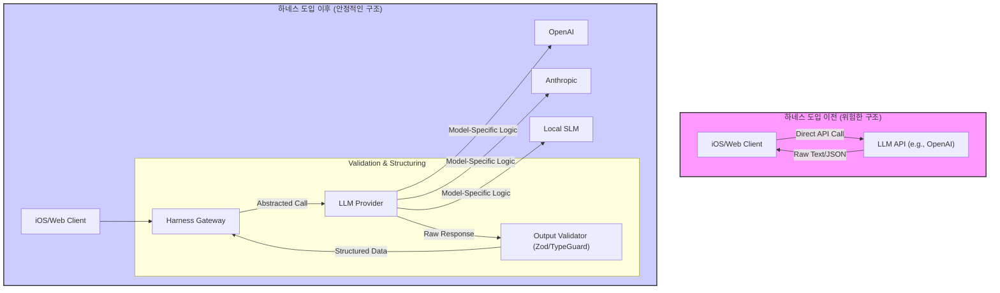

우리는 모델의 성능이 전부인 것처럼 이야기하는 시대에 살고 있습니다. "GPT-5가 출시되면 모든 것이 해결될 거야", "Claude 3.5 Sonnet은 코딩을 더 잘해"와 같은 말들이 오갑니다. 하지만 iOS나 프론트엔드와 같이 사용자 경험의 최전선에서 프로덕트를 만드는 개발자에게 모델 자체에 대한 의존은 치명적인 약점이 될 수 있습니다. 모델은 통제 불가능한 외부 요인입니다. 성능이 예고 없이 저하(degradation)될 수 있고, 비용 정책이 바뀌며, API가 중단될 수도 있습니다.

진정한 경쟁력은 최고의 모델을 '사용'하는 것에서 나오는 것이 아니라, 어떤 모델을 가져와도 우리 시스템 안에서 안정적으로 동작하도록 만드는 '작업 환경'에서 나옵니다. 이것이 바로 **하네스 엔지니어링(Harness Engineering)**의 핵심입니다. 하네스는 마치 강력하지만 예측 불가능한 야생마(LLM)에게 씌우는 '고삐'와 같습니다. 이 고삐를 통해 우리는 AI를 길들이고, 예측 가능하며, 신뢰할 수 있는 프로덕트의 일부로 만들 수 있습니다.

## 왜 모델보다 '하네스'가 중요한가?

iOS/프론트엔드 개발자에게 하네스는 특히 중요합니다. 우리는 사용자에게 직접적인 가치를 전달해야 하며, "AI가 이상한 답변을 했어요"라는 변명은 통하지 않습니다.

1.  **모델 교체 유연성(Model-Agnosticism):** 오늘 최고의 모델이 내일도 최고라는 보장은 없습니다. 더 저렴하고 빠른 로컬 SLM(경량 언어 모델)이 대세가 될 수도 있습니다. 하네스가 잘 설계되어 있다면, 우리는 API 엔드포인트와 요청/응답 형식만 바꾸는 최소한의 노력으로 모델을 교체할 수 있습니다.
2.  **예측 가능성 및 안정성:** LLM은 본질적으로 비결정론적(non-deterministic)입니다. 하네스는 입력과 출력을 제어하고, 응답 형식을 강제하며(e.g., JSON 스키마), 실패 시 재시도나 대체(fallback) 로직을 수행함으로써 시스템 전체의 안정성을 확보합니다.
3.  **관측 가능성(Observability):** 모든 AI 호출에 대한 비용, 지연 시간(latency), 토큰 사용량, 성공/실패 여부를 추적할 수 있는 환경은 필수적입니다. "이번 달 API 비용이 왜 이렇게 많이 나왔지?"라는 질문에 답할 수 없다면, AI 기능을 운영할 수 없습니다.
4.  **테스트 용이성:** 비결정론적인 AI를 어떻게 테스트할까요? 하네스는 AI 모델 자체를 모킹(mocking)할 수 있는 추상화 계층을 제공합니다. 이를 통해 우리는 AI의 응답을 예측 가능한 값으로 고정하고 나머지 비즈니스 로직을 견고하게 테스트할 수 있습니다.

아래 다이어그램은 하네스 유무에 따른 아키텍처 차이를 보여줍니다.



## 하네스 설계를 위한 4가지 핵심 패턴

### 1. 추상화된 모델 제공자(Abstracted Model Provider)

가장 먼저 해야 할 일은 특정 벤더(Vendor)에 대한 직접적인 의존성을 제거하는 것입니다. 이는 프로토콜(Swift)이나 인터페이스(TypeScript)를 통해 쉽게 구현할 수 있습니다.

**TypeScript 예제:**

```typescript
// src/lib/ai/provider.ts
export interface LLMRequest {
  prompt: string;
  systemPrompt?: string;
  maxTokens?: number;
}

export interface LLMResponse {
  content: string;
  usage: {
    inputTokens: number;
    outputTokens: number;
  };
}

export interface LLMProvider {
  generate(request: LLMRequest): Promise<LLMResponse>;
}

// src/lib/ai/openai-provider.ts
import { OpenAI } from 'openai';

export class OpenAIProvider implements LLMProvider {
  private client: OpenAI;

  constructor(apiKey: string) {
    this.client = new OpenAI({ apiKey });
  }

  async generate(request: LLMRequest): Promise<LLMResponse> {
    const response = await this.client.chat.completions.create({
      model: "gpt-4o",
      messages: [
        { role: "system", content: request.systemPrompt || "You are a helpful assistant." },
        { role: "user", content: request.prompt },
      ],
      max_tokens: request.maxTokens,
    });
    
    return {
      content: response.choices[0].message.content || "",
      usage: {
        inputTokens: response.usage?.prompt_tokens || 0,
        outputTokens: response.usage?.completion_tokens || 0,
      },
    };
  }
}
```

이렇게 하면 `OpenAIProvider`를 `AnthropicProvider`나 `LocalModelProvider`로 교체하더라도, 이를 사용하는 서비스 코드는 전혀 변경할 필요가 없습니다.

### 2. 강제된 출력 구조 (Enforced Output Structure)

AI가 생성한 텍스트를 그대로 파싱하는 것은 재앙의 지름길입니다. 우리는 AI가 항상 우리가 원하는 형식의 JSON을 반환하도록 '강제'해야 합니다. 이를 위해 프롬프트에 JSON 스키마를 명시하고, 응답을 받은 후에는 반드시 유효성 검사를 거쳐야 합니다.

**Swift 예제 (iOS):**

```swift
import Foundation

// 1. 응답으로 받을 데이터 구조 정의
struct UserProfileSummary: Decodable {
    let title: String
    let summary: String
    let keywords: [String]
}

// 2. LLM 응답을 검증하고 디코딩하는 서비스
class ProfileSummaryService {
    // 이전 패턴에서 정의한 LLMProvider를 주입받음
    private let llmProvider: LLMProvider 

    init(llmProvider: LLMProvider) {
        self.llmProvider = llmProvider
    }

    func fetchSummary(for userBio: String) async throws -> UserProfileSummary {
        let prompt = """
        사용자 자기소개를 바탕으로 프로필 요약을 생성해줘.
        자기소개: "\(userBio)"
        
        반드시 아래 JSON 형식으로만 응답해줘. 다른 말은 절대 덧붙이지 마.
        {
          "title": "한 줄 요약 제목",
          "summary": "2-3문장으로 구성된 상세 요약",
          "keywords": ["핵심 키워드 1", "핵심 키워드 2", "핵심 키워드 3"]
        }
        """
        
        // LLM 호출 (추상화된 인터페이스 사용)
        let response = try await llmProvider.generate(prompt: prompt)
        
        // 응답 검증 및 디코딩
        guard let data = response.content.data(using: .utf8) else {
            throw MyError.decodingError("Invalid data format")
        }
        
        do {
            let summary = try JSONDecoder().decode(UserProfileSummary.self, from: data)
            return summary
        } catch {
            // 디코딩 실패 시 에러 로깅 및 처리
            logError("Failed to decode LLM response", error: error, rawResponse: response.content)
            throw MyError.decodingError("JSON schema mismatch")
        }
    }
}
```
`JSONDecoder`를 사용한 `try-catch` 블록 자체가 가장 기본적인 하네스의 일부입니다. 환각(Hallucination)으로 인해 AI가 엉뚱한 형식을 반환하더라도 앱이 크래시되지 않고, 에러를 우아하게 처리할 수 있습니다.

### 3. 견고한 관측 가능성 (Robust Observability)

모든 AI 호출은 로깅되어야 합니다. 최소한 아래 항목들을 수집하여 분석할 수 있는 시스템을 갖춰야 합니다.

| 항목                 | 수집 목적                                  | 예시 값                               |
| -------------------- | ------------------------------------------ | ------------------------------------- |
| `requestId`          | 특정 호출을 추적하기 위한 고유 ID          | `uuid()`                              |
| `timestamp`          | 호출 시간 기록                             | `2026-05-20T10:00:00Z`                |
| `modelUsed`          | 어떤 모델을 사용했는지 기록 (A/B 테스트)   | `gpt-4o`, `claude-3-5-sonnet`         |
| `latencyMs`          | 성능 측정 및 병목 현상 분석                | `850`                                 |
| `inputTokens`        | 비용 분석 및 입력 프롬프트 최적화          | `350`                                 |
| `outputTokens`       | 비용 분석 및 출력 길이 제어                | `120`                                 |
| `costUsd`            | 정확한 비용 추적                           | `0.00195`                             |
| `validationStatus`   | 출력 품질 측정 (`success`, `failure`)      | `success`                             |
| `promptHash`         | 프롬프트 내용 (개인정보 보호를 위해 해시)  | `sha256("...")`                       |

이러한 로그는 비용 급증의 원인을 찾거나, 특정 모델의 성능 저하를 감지하거나, 자주 실패하는 프롬프트를 개선하는 데 결정적인 데이터를 제공합니다.

### 4. 결정론적 테스트 환경 (Deterministic Test Environment)

하네스의 추상화 계층은 테스트를 매우 쉽게 만듭니다. 실제 API를 호출하는 대신, 미리 정의된 응답을 반환하는 Mock 객체를 주입하면 됩니다.

**Swift 테스트 코드 예제 (XCTest):**

```swift
import XCTest
@testable import MyAwesomeApp

// 1. Mock LLM Provider 구현
class MockLLMProvider: LLMProvider {
    var cannedResponse: Result<LLMResponse, Error>

    init(cannedResponse: Result<LLMResponse, Error>) {
        self.cannedResponse = cannedResponse
    }

    func generate(prompt: String) async throws -> LLMResponse {
        switch cannedResponse {
        case .success(let response):
            return response
        case .failure(let error):
            throw error
        }
    }
}

// 2. 단위 테스트 작성
class ProfileSummaryServiceTests: XCTestCase {
    func testFetchSummary_WithValidJSON_ShouldDecodeSuccessfully() async throws {
        // Arrange: 성공적인 JSON 응답을 반환하는 Mock 객체 생성
        let validJSON = """
        {
          "title": "소프트웨어 엔지니어",
          "summary": "iOS 개발에 대한 깊은 이해를 가진 개발자입니다.",
          "keywords": ["Swift", "SwiftUI", "Combine"]
        }
        """
        let mockResponse = LLMResponse(content: validJSON, usage: .init(inputTokens: 10, outputTokens: 20))
        let mockProvider = MockLLMProvider(cannedResponse: .success(mockResponse))
        let service = ProfileSummaryService(llmProvider: mockProvider)
        
        // Act: 서비스 메소드 호출
        let summary = try await service.fetchSummary(for: "...")
        
        // Assert: 반환된 객체의 값이 예상과 일치하는지 확인
        XCTAssertEqual(summary.title, "소프트웨어 엔지니어")
        XCTAssertEqual(summary.keywords, ["Swift", "SwiftUI", "Combine"])
    }

    func testFetchSummary_WithInvalidJSON_ShouldThrowDecodingError() async {
        // Arrange: 깨진 JSON 응답을 반환하는 Mock 객체 생성
        let invalidJSON = """
        {
          "title": "소프트웨어 엔지니어",
          "summary": "요약..."
          // 닫는 중괄호가 없음
        """
        let mockResponse = LLMResponse(content: invalidJSON, usage: .init(inputTokens: 10, outputTokens: 20))
        let mockProvider = MockLLMProvider(cannedResponse: .success(mockResponse))
        let service = ProfileSummaryService(llmProvider: mockProvider)
        
        // Act & Assert: 특정 에러가 발생하는지 확인
        do {
            _ = try await service.fetchSummary(for: "...")
            XCTFail("에러가 발생해야 합니다.")
        } catch let error as MyError {
            XCTAssertEqual(error, MyError.decodingError("JSON schema mismatch"))
        } catch {
            XCTFail("예상치 못한 에러 타입: \(error)")
        }
    }
}
```

이제 우리는 LLM의 변덕과 상관없이 우리 앱의 로직이 견고하게 작동함을 100% 확신할 수 있습니다.

## 결론

2026년 이후 AI 개발의 핵심은 더 이상 "어떤 모델을 쓰는가"가 아닐 것입니다. 대신 "얼마나 효과적으로 모델을 제어하고, 교체하고, 측정하는가"가 될 것입니다. 하네스 엔지니어링은 이러한 변화의 중심에 있는 방법론입니다.

iOS 및 프론트엔드 개발자로서 우리의 역할은 화려한 AI 모델을 그저 호출하는 것에서 그치지 않습니다. 사용자가 신뢰할 수 있는 안정적이고 예측 가능한 경험을 만드는 것입니다. 이를 위해 지금 당장 `LLMProvider` 프로토콜을 정의하고, 첫 번째 Mock 객체를 만들어보는 것부터 시작해 보시길 바랍니다. 그것이 바로 모델의 변덕에 휘둘리지 않는, 진정한 AI 네이티브 프로덕트로 가는 첫걸음입니다.

---

## 자기 점검

1.  프로덕션 환경에서 특정 LLM 벤더(e.g., OpenAI)의 SDK를 직접 호출하는 방식의 가장 큰 위험 두 가지는 무엇인가요?
2.  `LLMProvider`와 같은 추상화 인터페이스가 모델 교체 유연성 외에 테스트 관점에서 제공하는 이점은 무엇인가요?
3.  AI 응답으로 받은 JSON을 `JSONDecoder`나 `schema.parse` 같은 도구로 검증하는 과정에서 에러가 발생했습니다. 이 상황을 '실패'로만 볼 수 없는 이유는 무엇이며, 이 실패 로그는 어떻게 활용될 수 있을까요?
4.  이 개념을 동료에게 설명한다면, '모델'과 '하네스'의 관계를 어떤 비유를 들어 설명하시겠습니까? (예: 야생마와 고삐)
5.  **실습 과제:** 현재 작업 중인 프로젝트(혹은 사이드 프로젝트)에 `MockLLMProvider`를 구현해 보세요. 이 Mock Provider는 특정 프롬프트 키워드가 포함되면 미리 정의된 성공 JSON 응답을, 다른 키워드가 포함되면 에러를 반환해야 합니다. 이 Mock을 사용하여 LLM의 응답을 파싱하고 UI에 표시하거나 에러 메시지를 보여주는 로직에 대한 단위 테스트를 2개(성공 케이스, 실패 케이스) 작성하세요.