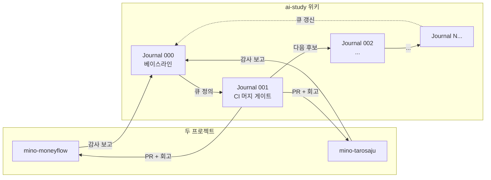

## 시리즈를 시작하며

이 위키의 [Compound Engineering 엔트리](/wiki/harness-engineering/compound-engineering-philosophy)에서 가장 중요한 한 줄은 *"each unit of engineering work should make subsequent units easier—not harder"* 였다. 그 원칙을 *내 두 프로젝트(mino-moneyflow, mino-tarosaju)에 어떻게 적용할 것인가*가 이 시리즈의 출발점이다.

**Harness Journal**은 두 프로젝트의 AI 운영 환경을 한 사이클에 *한 가지씩* 개선하고, 그 과정과 운영 데이터를 박제하는 콘텐츠 시리즈다. 사람이 코드를 직접 치는 비중이 거의 0인 상황에서, 대부분의 시간이 들어가는 곳은 **에이전트가 안전하게 달릴 환경의 조정**이다. 그 조정 과정을 *시리즈로* 기록하면, 두 프로젝트뿐 아니라 다음 프로젝트, 그 다음 프로젝트로 자산이 이식될 수 있다.

이 0번 엔트리는 시리즈의 **베이스라인 정의서**다. 다음 에피소드들이 가리킬 출발점이 없으면 개선 효과를 측정할 수 없고, 첫 갭 식별부터 가짜가 된다.

## 조사 방법

Claude Code의 두 Explore 서브에이전트를 *동시에* 두 프로젝트에 띄워서, 각각 다음 항목을 *추측 없이 실제 파일에서만* 보고하게 했다:

1. Hook 시스템 (`.claude/settings.json`)
2. 슬래시 커맨드 (`.claude/commands/`)
3. Skill 시스템 (`.claude/skills/`)
4. CLAUDE.md, AI-AGENT-GUIDE.md, ENGINEERING.md
5. AI 호출 코드 패턴 (Circuit Breaker, 폴백, 캐싱, 검증)
6. `scripts/` 자동화
7. `docs/retros/` 와 `docs/solutions/`
8. 테스트 / CI / 자동 검증 게이트
9. 메모리 시스템
10. 각 프로젝트의 고유 인프라

코드/문서를 *수정하지 않고* 현황과 갭만 보고하게 한 다음, 두 보고서를 종합해서 공통 패턴과 비대칭을 추출했다.

## 두 프로젝트 공통 강점 (이미 잘 깔린 토대)

| # | 항목 | 어떻게 작동하는가 |
|---|---|---|
| 1 | **Pre-commit QA 게이트** | `.claude/settings.json`의 PreToolUse 훅이 git commit 직전 `vitest run + next build`를 자동 실행. 실패 시 커밋 자체가 차단됨. |
| 2 | **Post-push `/compound` 리마인더** | git push 직후 PostToolUse 훅이 회고 명령 실행을 강제. 사람의 기억력 대신 훅이 다음 단계를 강제. |
| 3 | **`/compound` + `/autoceo` 슬래시 커맨드** | 회고·솔루션·메모리 동기화가 한 명령에 자동화. `/autoceo`는 N라운드 자율 사이클까지 포함. |
| 4 | **AI-AGENT-GUIDE 6+7원칙** | Context Engineering 6원칙 + Harness Engineering 7원칙이 `.md` 파일로 박제. 매 세션 자동 로드. |
| 5 | **회고 → 솔루션 → 큐** 루프 | `docs/retros/`의 마지막 섹션 *"다음에 적용할 것"* 이 다음 사이클의 입력으로 작동. moneyflow에서 v0.9.10 → v0.9.11에서 ROI 한 사이클 만에 검증됨. |

이 5가지가 *베이스라인*이다. 두 프로젝트가 모두 이 토대 위에 서 있다.

## 두 프로젝트 공통 갭

조사 결과 양쪽 모두에서 발견된 갭. 우선순위는 *AI가 더 자율적이면서도 더 안전하게 달릴 수 있는가*를 기준으로 매겼다.

| # | 갭 | 어떻게 보이는가 | 임팩트 |
|---|---|---|---|
| 1 | **CI/CD 머지 전 자동 게이트** | pre-commit 훅은 있지만 GitHub Actions에 머지 전 vitest+build+lint+typecheck 자동 검증 없음. 훅 우회 가능, main branch protection 미설정. moneyflow의 `ai-review.yml`은 *검증 없이* 즉시 squash merge. | **매우 높음** — AI 자율 머지의 가장 큰 차단점 |
| 2 | **AI 출력 Zod 검증** | 입력은 검증하지만 LLM 응답을 schema.parse로 거르지 않음. 환각이 그대로 사용자에게 반환될 수 있음. | 높음 |
| 3 | **Circuit Breaker / Retry / Timeout 비대칭** | moneyflow `ai-client.ts`에 잘 구현. tarosaju의 Anthropic 호출에는 *timeout 없음 + 폴백 없음*. | 높음 |
| 4 | **AI API 비용 추적 0** | 양쪽 모두 호출 로깅·일/월 리포트 부재. *"이번 달 얼마 썼는지 모름"* 상태. 수익화 단계가 가까워서 더 시급. | 높음 |
| 5 | **메모리 시스템 신뢰도 낮음** | moneyflow 회고에 *"메모리에 적힌 이슈는 항상 코드로 재검증, 메모리는 가설로 취급"* 명시. 메모리가 outdated될 수 있음을 인식하지만 동기화 자동화 없음. | 중간 |
| 6 | **`/autoceo` Step 3 Gate 4 수동 모드** | 브라우저 런타임 검증이 자동화 안 돼서 사람 응답 대기. Playwright 통합 가능. | 중간~높음 |
| 7 | **`npm audit` CI 미통합** | 로컬에만. R23(eslint upgrade) 같은 사고가 CI에서 못 잡힘. 작업량 작아서 가성비 좋음. | 중간 |
| 8 | **`.claude/skills/` 미활용** | 양쪽 모두 슬래시 커맨드 2개(`/compound`, `/autoceo`)만(베이스라인 시점). *작은 재사용 단위*인 skill 형식 미사용. → Journal 004~021 진행 후 7개로 확장됨 (`/compound`, `/autoceo`, `/wt-branch`, `/ingest`, `/cross-session-review`, `/curate-inbound`, `/projects-sync`). | 낮음~중간 |

## 비대칭 — 서로의 강점 = 다음 사이클의 큐

두 프로젝트가 서로 다른 길을 가면서 만든 *고유 자산*이 있다. 이걸 교차 이식하는 것만으로도 4-5개 사이클이 나온다. *증명된 패턴을 옮기는* 것이 *처음부터 만드는* 것보다 훨씬 싸다는 게 핵심.

### moneyflow → tarosaju 이식 후보

| 자산 | tarosaju에 부재 | 이식 후 효과 |
|---|---|---|
| `lib/trading/ai-client.ts` Circuit Breaker | Anthropic 호출에 timeout/폴백 없음 | API 장애 시 사용자 경험 보호 |
| 에이전트별 모델 라우팅 | 단일 모델 (Claude Haiku) | 작업 복잡도에 따른 비용 최적화 |
| 프롬프트 캐싱 (Claude `cache_control: ephemeral`) | 미사용 | 90% 비용 절감 |
| 13 에이전트 적대적 토론 패턴 | 단일 에이전트 응답 | 환각 감소 (다른 도메인에도 응용 가능) |

### tarosaju → moneyflow 이식 후보

| 자산 | moneyflow에 부재 | 이식 후 효과 |
|---|---|---|
| RLS 정적 감사 + 회귀 테스트 | RLS 자동 검증 없음 | 권한 상향 취약점 자동 차단 |
| Sentry + Web Vitals + Lighthouse 3중 관측 | Sentry는 있지만 통합도 낮음 | 변화 감지 자동화 |
| Playwright E2E + GitHub Actions 통합 | E2E 0개 | UI 회귀 자동 감지 |
| `docs/maintenance/deferred-upgrades.md` 트래킹 | 없음 | *실패도 영구 자산화* (R23 패턴) |

## 첫 5 사이클 큐 (Harness Journal 001~005)

베이스라인과 갭/비대칭을 종합한 결과, 첫 5 사이클의 우선순위는 다음과 같다. 각 사이클이 *다음 사이클을 더 쉽게 만들도록* 의존성 순서로 정렬.

| Journal | 작업 | 양쪽 적용 | 작업량 |
|---|---|---|---|
| **001** | CI 머지 전 자동 게이트 (test-gate.yml + tarosaju typecheck) | 양쪽 동시 PR | 중간 |
| 002 | Journal 001의 lint/typecheck 위반 0건 만들기 + strict 승격 | 양쪽 | 중간 |
| 003 | tarosaju에 Anthropic Circuit Breaker + Retry + Timeout 이식 (moneyflow `ai-client.ts` 패턴) | tarosaju 우선 | 중간 |
| 004 | AI API 비용 추적 (`api_calls_log` 테이블 + `/cost-check` 슬래시 커맨드) | 양쪽 | 중간~큼 |
| 005 | AI 출력 Zod 스키마 검증 레이어 (모든 LLM 응답을 `safeParse` 통과시키기) | moneyflow 우선 (13 에이전트) | 큼 |

큐는 살아있는 문서다. 매 사이클의 회고에서 *다음 후보*를 갱신해서 다음 Journal의 입력이 된다.

## Harness Journal 시리즈 운영 규칙

다음 에피소드들이 일관성을 가지도록 시리즈 자체의 운영 규칙을 박제한다.

### 엔트리 구조 (모든 Journal에 공통)

1. **갭 (Before)** — 무엇이 부족했는가, 어떤 사고/마찰이 보였는가
2. **만든 환경 (After)** — 정확히 어떤 파일·훅·게이트를 추가했는가 (코드 인용 OK, 단 *직접 만든 것만*)
3. **운영 데이터** — 적용 후 어떤 지표가 변했는가 (또는 첫 측정값). 데이터 없으면 *데이터 없음*이라고 명시.
4. **배운 것 / 다음 후보** — 다음 Journal로 이어지는 큐
5. **출처** — 어느 프로젝트의 어느 retro/solution/PR과 연결되는가 (cross-link)

### 시리즈 규약

- **슬러그**: `harness-journal-NNN-...` (3자리 zero-padded)
- **태그**: `harness-journal` 필수 (위키에서 시리즈로 묶기 위함)
- **카테고리**: `harness-engineering`
- **퀴즈 3문항**: 각 엔트리의 핵심 통찰을 측정. 단순 암기 X.
- **금지 사항** ([feedback_external_source_verification](#) 메모리 준수):
  - 직접 인용 `"..."`은 *원본에서 글자 단위로 직접 확인된 것*만
  - 본인이 직접 만들지 않은 것을 만든 것처럼 쓰지 않기
  - 운영 데이터가 없으면 *없다고* 명시 (가짜 수치 만들지 않기)

### 관계도



J0의 큐는 *살아있다*. 새 사이클이 끝날 때마다 큐가 갱신되고, 다음 Journal이 그 큐의 첫 항목을 받는다.

## 갱신 로그

베이스라인은 *살아있는 문서*다. 시리즈가 진행되며 발견된 새 갭과 회피 메커니즘 도입 상황을 여기에 누적한다. 원본 갭 8개와 큐 정의는 *위에 그대로 보존*하고, 새 발견은 이 섹션에 시간순으로 박는다.

### 2026-04-12 — Journal 001~004 진행 후 갱신

**새 갭 (Journal 003에서 라이브 입증)**

| # | 갭 | 어떻게 보였는가 | 임팩트 |
|---|---|---|---|
| 9 | **세션 간 git 상태 동기화 부재** | AI 자동 squash merge 후 *로컬 git 상태와 origin이 갈라짐*. 같은 사고가 한 사이클 안에 두 번 발생([Journal 002 PR #91](/wiki/harness-engineering/harness-journal-002-inline-test-gate), [Journal 003 PR #93](/wiki/harness-engineering/harness-journal-003-squash-merge-trap-pattern)) — 우연이 아닌 시스템 결함 | **매우 높음** — 다중 세션 운영의 가장 큰 차단점 |

이 갭은 *원본 8개 갭 어디에도 들어가지 않는* 새로운 카테고리다. *세션 간 상태 동기화*는 단일 세션 운영에서는 보이지 않다가 *다중 세션 + AI 자동 머지* 환경에서 즉시 드러나는 함정.

**회피 메커니즘 도입 진행 상황**

| 갭 | 회피 메커니즘 | 진행 상황 |
|---|---|---|
| #1 CI 머지 전 자동 게이트 | test-gate.yml + ai-review.yml inline test gate | ✅ moneyflow 머지 완료 (Journal 001/002) |
| #1 CI 머지 전 자동 게이트 | test.yml typecheck job 추가 | 🚧 tarosaju PR #1 머지 대기 (다른 세션 처리 중) |
| #9 세션 간 git 상태 동기화 | `/wt-branch` 슬래시 커맨드 (행동에 박는 가드) | ⏳ ai-study 정의 완료 (Journal 004), 양쪽 프로젝트 이식 대기 |
| #2 AI 출력 Zod 검증 | (미시작) | ⏳ Journal 006 이상 |
| #3 Circuit Breaker 비대칭 | (미시작) | ⏳ moneyflow → tarosaju 이식 후보 |
| #4 AI API 비용 추적 | (미시작) | ⏳ Journal 007 이상 |

**완료된 사이클 큐**

- Journal 001 — CI 머지 게이트 (라이브 사고 #1: 게이트가 머지를 막지 못함)
- Journal 002 — inline test gate + dogfooding 성공 (라이브 사고 #2: squash merge 함정)
- Journal 003 — squash merge 함정의 두 번째 라이브 입증 + 회피 메커니즘 4가지 제안
- Journal 004 — `/wt-branch` 슬래시 커맨드 정의 + 양쪽 이식 패치 박제

**갱신된 다음 큐** (원본 큐 정의 대비)

| Journal | 원본 정의 | 실제 진행 |
|---|---|---|
| 001 | CI 머지 전 자동 게이트 | ✅ 완료 (예상대로) |
| 002 | strict 승격 | 🔄 *변경* — Journal 001의 라이브 사고로 inline test gate 작업이 *우선*이 됨 |
| 003 | Anthropic Circuit Breaker tarosaju 이식 | 🔄 *변경* — Journal 002의 부수 사고가 다시 사고를 만들어 squash merge 함정 분석이 *우선* |
| 004 | AI API 비용 추적 | 🔄 *변경* — Journal 003의 회피 메커니즘 정의가 *우선* |
| 005 (예정) | AI 출력 Zod 검증 | 🔄 *변경* — 양쪽 프로젝트 wt-branch 이식 + 첫 dogfooding으로 *우선* |

**큐 변경 사실 자체가 메타 메시지**: *추측으로 정의한 큐는 라이브 사고가 매번 다시 정렬한다*. Journal 000의 큐 정의가 *예언*이 아니라 *살아있는 가설*이라는 것을 시리즈가 증명. 베이스라인이 살아있는 문서여야 하는 이유.

**원본 큐의 미진행 항목**

- Anthropic Circuit Breaker tarosaju 이식 (원래 003 후보) — 005 이후로 미뤄짐
- AI API 비용 추적 (원래 004 후보) — 005 이후로 미뤄짐
- AI 출력 Zod 검증 (원래 005 후보) — 시점 미정

이 항목들은 *우선순위가 떨어진 것*이 아니라 *라이브 사고가 더 시급한 것을 드러낸 결과*. 큐는 sequential이 아니라 *priority queue*.

### 2026-04-12 (afternoon) — 패턴 엔트리 7개 박제 후 갱신

큐의 주요 항목들이 *제안 엔트리*로 박제되어 다음 사이클의 *완성된 입력*이 됨. 양쪽 프로젝트 코드 적용은 다른 세션 정리 후.

**새 박제 엔트리 (시리즈 자체 동력으로 큐를 풍부하게)**

| 엔트리 | 종류 | 갭 매핑 |
|---|---|---|
| [AI 호출 패턴 — Circuit Breaker / 폴백 / 캐싱](/wiki/harness-engineering/ai-call-patterns-circuit-breaker-fallback) | 자산 박제 | 갭 #3 (양쪽 비대칭 비교) |
| [AI API 비용 추적 패턴](/wiki/harness-engineering/ai-api-cost-tracking-pattern) | 제안 | 갭 #4 |
| [AI 출력 Zod 검증 패턴 5 layer](/wiki/harness-engineering/ai-output-zod-validation-pattern) | 제안 | 갭 #2 |
| [Skill 시스템 도입](/wiki/harness-engineering/skill-system-introduction) | 제안 | 갭 #8 |
| [Compound 자동화 슬래시 커맨드 정리](/wiki/harness-engineering/compound-automation-slash-commands) | 메타 + 이식 가이드 | (인프라) |
| [AI 운영 환경 진단 체크리스트](/wiki/harness-engineering/ai-ops-environment-diagnosis-checklist) | 실전 도구 (50문항) | (전이성) |
| [Harness Journal 시작 가이드](/wiki/harness-engineering/harness-journal-bootstrap-guide) | 메타 (전이 자산) | (전이성) |
| [Multi-Session AI Ops 패턴](/wiki/harness-engineering/multi-session-ai-ops-patterns) | 라이브 사고 박제 | 갭 #10 (신규) |

**새 갭 (Multi-session 사고에서 일반화)**

| # | 갭 | 라이브 입증 |
|---|---|---|
| **10** | **다중 세션 환경의 *세션 책임 분리* 부재** — 한 세션의 git 변경이 다른 세션에 자동 전파되지 않아 *함정 5가지*가 시간차로 발생 | Journal 003 PR #93 (다른 세션이 옛 브랜치에 v0.9.14 commit) |

**회피 메커니즘 진행 상황 (전체)**

| 갭 | 회피 메커니즘 | 진행 |
|---|---|---|
| #1 CI 머지 게이트 | inline test gate (moneyflow), typecheck job (tarosaju) | ✅ moneyflow / 🚧 tarosaju |
| #2 AI 출력 Zod 검증 | 5 layer schema.parse 패턴 | ⏳ 제안 박제, 양쪽 미적용 |
| #3 Circuit Breaker 비대칭 | moneyflow 6 패턴 → tarosaju 이식 | ⏳ 제안 박제, 양쪽 미적용 |
| #4 AI API 비용 추적 | api_calls_log + /cost-check | ⏳ 제안 박제, 양쪽 미적용 |
| #5 메모리 신뢰도 | (미정의) | ⏳ |
| #6 /autoceo 브라우저 검증 | (미정의) | ⏳ |
| #7 dep audit CI | (미정의) | ⏳ |
| #8 Skill 시스템 | git-status-clean-check 첫 후보 | ⏳ 제안 박제, 양쪽 미적용 |
| #9 세션 간 git 동기화 | `/wt-branch` 슬래시 커맨드 | 🚧 ai-study 완료, 양쪽 이식 대기 |
| **#10 다중 세션 책임 분리** | Multi-session 5 패턴 (한 세션 main 책임자 등) | 🚧 박제 완료, 양쪽 적용 대기 |

**3단 진입 경로 정착**

시리즈에 *입문하는 사람*이 따를 수 있는 진입 경로가 명확해짐:

```
1. 진단 체크리스트 (30분, 50문항) — 시작 가치 점검
2. Bootstrap Guide (1-2시간) — 베이스라인 박기
3. 첫 사이클 (1-3시간) — 가장 낮은 영역의 첫 단계
```

이 3단 경로 자체가 *전이 가능 자산*. 다른 사람이 *내 시리즈를 복사*하지 않고 *자기 시리즈를 시작*할 수 있다.

**메타 통찰 — 밀도 vs 양**

이 시점에 ai-study는 *13개 신규 + 2개 갱신 = 21 → 34 entries*에 도달. *밀도 vs 양*의 트레이드오프 지점.

**규칙 박음**: 다음 사이클부터는 *새 박제*보다 *기존 박제의 적용*과 *살아있는 문서 갱신*이 우선. 양쪽 프로젝트 적용 (Journal 005~)이 *시리즈의 진짜 검증*. 박제만 늘어나고 적용 안 되면 시리즈가 *자기 잠식*.

**다음 큐 (Journal 005~009 후보, 상세화)**

| Journal | 작업 | 출처 → 대상 | 의존성 |
|---|---|---|---|
| 005 | wt-branch 양쪽 이식 + 첫 dogfooding + 사고 발생률 측정 | Journal 004 → 양쪽 | PR #93 정리 후 |
| 006 | tarosaju에 Anthropic timeout 60s + 2회 retry 추가 | AI 호출 패턴 → tarosaju | 005 후 |
| 007 | tarosaju Anthropic system message에 cache_control 추가 | AI 호출 패턴 → tarosaju | 006 후 (또는 병렬) |
| 008 | tarosaju에 Anthropic Circuit Breaker 이식 (전체 패턴 1) | AI 호출 패턴 → tarosaju | 007 후 |
| 009 | tarosaju fortune/ai에 Zod 출력 검증 layer 1+2 | Zod 5 layer → tarosaju | 005 후 (병렬) |

핵심: 005 이후 큐가 *코드 적용*에 집중. 박제는 *적용을 박제*하는 형태로 전환.

### 2026-04-12 (late) — Journal 005~009 완료 후 세 번째 갱신

6 사이클 실코드 작업이 끝난 시점의 상태. 상세 회고는 [Journal 010](/wiki/harness-engineering/harness-journal-010-baseline-third-update) 참조.

**완료된 사이클 (005~009)**:

| Journal | 메시지 |
|---|---|
| 005 | wt-branch 양쪽 이식 + dogfooding + *시리즈 자체 동력 첫 라이브 검증* |
| 006 | tarosaju Anthropic wrapper (timeout + retry + 에러 분류) |
| 007 | tarosaju AI API 비용 추적 로깅 인프라 |
| 008 | moneyflow 3-provider 동일 패턴 이식 |
| 009 | text output guards (Zod가 안 맞는 자연어 응답용) |

**원본 큐 대비 진행 (10 갭 중 6개 ✅ = 60%)**:

| 갭 | 상태 |
|---|---|
| #1 CI 머지 전 자동 게이트 | ✅ 양쪽 완료 |
| #2 AI 출력 Zod 검증 | 🔶 tarosaju text guards 완료 (Journal 009) / moneyflow JSON Zod 대기 |
| #3 Circuit Breaker 비대칭 | ✅ tarosaju wrapper (Journal 006) |
| #4 AI API 비용 추적 | ✅ 양쪽 완료 (Journal 007+008) |
| #5 메모리 신뢰도 | ⏳ 미진행 |
| #6 /autoceo 브라우저 검증 | ⏳ 미진행 |
| #7 npm audit CI | ⏳ 미진행 |
| #8 Skill 시스템 | ⏳ 박제만 |
| #9 세션 간 git 동기화 | ✅ /wt-branch 3 프로젝트 통일 |
| #10 다중 세션 책임 분리 | ✅ 박제 완료, 적용 대기 |

**큐 재정렬 4회 누적** — 원본 큐 정의 정확도 *60~70%*, 나머지 *라이브 보정*:

| 원본 | 실제 |
|---|---|
| 007: prompt caching | 🔄 비용 추적으로 전환 (Haiku cache minimum 고려) |
| 008: 다음 비대칭 | 🔄 moneyflow 비용 이식으로 |
| 009: Zod 검증 | 🔄 *text guards*로 (응답 형식 불일치) |

**회피 메커니즘 효과**:
- Journal 001~004 기간 사고: 2회 (PR #91, #93 squash merge 함정)
- Journal 005~009 기간 사고: **0회** (wt-branch 도입 이후 *7 사이클 무사고*)

**다음 큐 (Journal 011+, 재정렬됨)**:

| 우선순위 | 작업 |
|---|---|
| 높음 | moneyflow에 JSON Zod 출력 검증 (13 에이전트 schema) |
| 높음 | 비용 추적 DB 저장 + /cost-check 슬래시 커맨드 |
| 중간 | text output guards 발동률 측정 리포트 |
| 중간 | prompt caching 실제 적용 가능 여부 재검토 |
| 낮음 | 갭 #5/#6/#7 (나머지 미진행) |

Journal 010은 *정지 지점*이지 *종료*가 아님. 다음 트리거(사용자 요청 / 라이브 사고 / 외부 학습)가 오면 011부터 재개.

### 2026-04-12 (현재) — Journal 011~021 완료 후 네 번째 갱신

Journal 010 이후 추가 11 사이클이 완료된 시점. 상세 회고는 각 Journal 엔트리 참조.

**갭 진행 상황 전체 (10 갭, Journal 021 기준)**:

| 갭 | 상태 |
|---|---|
| #1 CI 머지 전 자동 게이트 | ✅ 양쪽 완료 |
| #2 AI 출력 Zod 검증 | ✅ moneyflow JSON Zod + tarosaju text guards 완료 |
| #3 Circuit Breaker 비대칭 | ✅ tarosaju wrapper 완료 |
| #4 AI API 비용 추적 | ✅ 양쪽 완료 |
| #5 메모리 신뢰도 | ⏳ 미진행 |
| #6 /autoceo 브라우저 검증 | ⏳ 미진행 |
| #7 npm audit CI | ⏳ 미진행 |
| #8 Skill 시스템 | ✅ 7개 슬래시 커맨드로 확장 완료 (`/compound`, `/autoceo`, `/wt-branch`, `/ingest`, `/cross-session-review`, `/curate-inbound`, `/projects-sync`) |
| #9 세션 간 git 동기화 | ✅ `/wt-branch` 3 프로젝트 통일 + dogfooding 검증 |
| #10 다중 세션 책임 분리 | ✅ 박제 + 적용 완료 |

**원본 큐 대비 완료율**: 10 갭 중 7개 ✅ = **70%** (Journal 009 시점 60% → Journal 021 시점 70%)

**남은 미진행 항목** (갭 #5/#6/#7): 라이브 사고 부재로 우선순위가 계속 밀림. 시급성 발생 시 다음 큐 진입.

**슬래시 커맨드 진화 요약**: 베이스라인 2개 → Journal 021 시점 7개. 매 Journal마다 하나씩이 아니라 *필요할 때 정의 → 이식*하는 패턴으로 성장.

---

## 자기 점검

1. 내가 두 프로젝트를 동시에 운영하는데, *공통 토대*에 깔린 자산은 정확히 무엇인가? (위 5가지 강점을 외울 수 있는가)
2. 두 프로젝트의 *비대칭* 중 가장 임팩트 큰 이식 후보는? 그 자산을 옮기는 작업의 첫 단계는 무엇인가?
3. 내가 *자유롭게 달리는* 환경을 만들고 싶은데, 가장 큰 차단점은 어디인가? — 검증 게이트의 부재인가, 폴백의 부재인가, 비용 가시성의 부재인가?
4. *베이스라인 없이* 개선 작업을 시작하면 무엇이 가짜가 되는가? (이 엔트리의 존재 이유)
5. (열린 질문) Harness Journal 시리즈가 1년 후 50번째 엔트리에 도달했을 때, 0번 베이스라인은 어떻게 갱신되어야 할까?

### 실습 과제

- 자신이 운영하는 *어떤 시스템*이든 한 가지를 골라서, 위 8개 갭 항목을 같은 형식으로 자기 시스템에 매핑해보기. 어느 갭이 *내 시스템에도* 있는가?
- 만약 갭이 0개라면 — 정말로 0개인지, 아니면 *측정하지 않아서* 안 보이는 것인지 자문하기.

## 출처

이 엔트리는 직접 보유한 자산만 인용. 외부 인용 없음.

- 감사 대상 1: `mino-moneyflow` (v0.9.13 시점) — 직접 보유 프로젝트
- 감사 대상 2: `mino-tarosaju` (R25 시점) — 직접 보유 프로젝트
- 감사 방법: Claude Code Explore 서브에이전트 2개 병렬 (코드 수정 금지, 실제 파일에서 본 것만 보고)
- 종합: 본 엔트리에서 두 보고서를 합쳐 공통 갭/비대칭/큐 도출

### 검증 메모

- 두 프로젝트의 모든 인용(파일 경로, 워크플로 이름, 솔루션 카테고리, 회고 인용구)은 직접 파일을 읽어서 확인
- "v0.9.10 → v0.9.11에서 ROI 한 사이클 만에 검증" 같은 구체 사례는 `mino-moneyflow/docs/retros/2026-04-11-v0911-compound-loop.md`에서 직접 인용
- 양쪽 보고서의 *추측* 항목(Top 5 개선 후보의 예상 작업 규모 등)은 본 엔트리의 *큐 정의*에 *작은/중간/큰* 형식으로만 반영. 정량 수치는 박제하지 않음 (실제 작업 후 Journal 001~005에서 확정)
