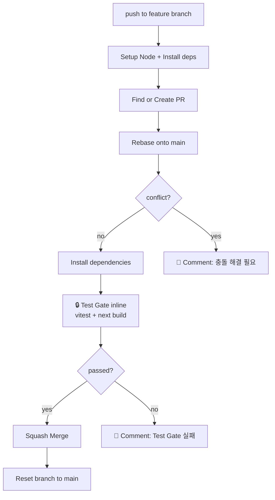

## 갭 (Before)

[Harness Journal 001](/wiki/harness-engineering/harness-journal-001-ci-merge-gate)에서 발견한 라이브 사고:

> moneyflow PR #90이 머지된 시각 15:01:07Z. Test Gate는 그 시각에 *아직 진행 중*. 즉, 게이트는 통과/실패 *결과조차 나오기 전에* 머지가 끝났다. 워크플로 파일을 추가하는 것만으로는 게이트가 작동하지 않는다.

001에서 옵션 3가지를 제안했었다:

| 옵션 | 어떻게 작동 |
|---|---|
| A. GitHub Branch Protection rule | 사용자 GitHub UI 설정 1회 — 외부 의존 |
| B. ai-review.yml polling 추가 | 별도 워크플로의 check를 polling으로 기다림 |
| C. workflow_run 트리거 | 머지 로직을 분리해서 test-gate 성공에만 트리거 |

이 사이클은 *세 옵션 어느 것도 아닌 네 번째 길*을 골랐다. 더 단순한 길이 있었다.

## 만든 환경 (After) — inline test gate

### 핵심 아이디어

**polling 대신 *직접 실행*.** ai-review.yml의 Squash Merge step *바로 앞에* vitest + next build를 *직접 inline으로* 실행하는 step을 추가한다. 검증이 실패하면 step 자체가 fail하고, GitHub Actions의 기본 동작(`이전 step fail → 다음 step skip`)에 의해 Squash Merge가 자동으로 skip된다.

별도 워크플로를 polling으로 *기다릴* 필요가 없다. 자기 자신의 step 의존성이 곧 게이트.

### 왜 이게 polling보다 압도적으로 단순한가

| 항목 | polling 방식 | inline 방식 |
|---|---|---|
| 별도 워크플로의 check runs를 *기다림* | 필요 (10분+ timeout 로직) | 불필요 |
| GITHUB_TOKEN으로 push된 commit에 워크플로 트리거 | 안 됨 (GitHub 보안 기본값) | 무관 |
| rebase 후 새 SHA의 검증 | race condition | 자동 (현재 SHA에서 직접) |
| 무한 루프 위험 | 있음 | 없음 |
| 코드량 | github-script 50+ 라인 | step 3개, ~30 라인 |

별도 워크플로를 *기다리는* 게 아니라 *내가 직접 한다*. AI 시스템 설계의 일반 원칙: **외부 신호에 의존하기보다 자체 검증으로 끝내라.**

### 추가된 step (ai-review.yml의 Squash Merge step 직전)

```yaml
- name: Setup Node.js
  uses: actions/setup-node@v4
  with:
    node-version: '20'
    cache: 'npm'

# ... 기존 Find or Create PR / Rebase / Comment on conflict ...

- name: Install dependencies
  if: steps.sync.outputs.status != 'conflict'
  run: npm ci

- name: 🔒 Test Gate (vitest + build)
  id: test_gate
  if: steps.sync.outputs.status != 'conflict'
  env:
    NEXT_PUBLIC_SUPABASE_URL: https://placeholder.supabase.co
    NEXT_PUBLIC_SUPABASE_ANON_KEY: placeholder-anon-key
  run: |
    echo "::group::vitest"
    npx vitest run
    echo "::endgroup::"
    echo "::group::next build"
    npm run build
    echo "::endgroup::"

- name: Notify on Test Gate failure
  if: failure() && steps.test_gate.outcome == 'failure'
  uses: actions/github-script@v7
  env:
    PR_NUMBER: ${{ steps.pr.outputs.number }}
  with:
    github-token: ${{ secrets.GITHUB_TOKEN }}
    script: |
      if (!process.env.PR_NUMBER) return;
      await github.rest.issues.createComment({
        owner: context.repo.owner,
        repo: context.repo.repo,
        issue_number: parseInt(process.env.PR_NUMBER),
        body: [
          '## ❌ Test Gate 실패 — 자동 머지 차단',
          '',
          '`vitest` 또는 `next build`가 실패했습니다.',
          '워크플로 로그를 확인하고 수정 후 다시 push해주세요.',
        ].join('\n'),
      });
```

`Squash Merge` step의 `if: steps.sync.outputs.status != 'conflict'` 조건은 *암묵적으로 `success() && ...`*로 작동하므로, Test Gate가 fail이면 Squash Merge가 자동 skip된다. 추가 코드 0줄.



## 라이브 사고 #2 — squash merge가 만든 함정

이 사이클에서 *두 번째 라이브 사고*를 만났다. Journal 001의 사고가 *워크플로 자체*에 대한 것이었다면, 이 사고는 *git history*에 대한 것이었다.

### 시간순 사건

```
1. PR #90 (Journal 001) squash merge 완료 → main에 단일 squash commit `7c47a1c`
2. ai-review.yml의 reset branch to main step → origin의 001 브랜치를 main으로 force-push
3. 그러나 *로컬 001 브랜치*는 여전히 squash 전 원본 commit(`ca01436`) + 그 아래 v0.9.12/v0.9.13 commits을 가리킴
4. 002 브랜치를 *로컬 001 위치*에서 checkout -b로 분기 → 002 = ca01436 위 + ai-review.yml 변경
5. 002 push → ai-review.yml 트리거 → rebase onto origin/main → 충돌
6. ai-review.yml이 PR #91에 충돌 코멘트 박고 fail
```

### 진단 명령

```bash
$ git log origin/main --oneline -5
7c47a1c ci: Test Gate 게이트 워크플로 추가 — Harness Journal 001 (#90)  ← squash 후 단일 commit
e95fe75 compound: 2026-04-11 v0.9.11 사이클...

$ git log harness-journal-002-merge-gate-inline --oneline -5
13f8d6c ci(ai-review): inline Test Gate 추가 — Harness Journal 002
ca01436 ci: Test Gate 게이트 워크플로 추가 — Harness Journal 001  ← squash 전 원본
f832b34 feat(data): KRX 공식 데이터 통합...                       ← 로컬에만 있는 commit
5e6e329 feat(portfolio): PM v2 Phase 5 — 신뢰도 4요소 분해         ← 로컬에만 있는 commit
e95fe75 compound: 2026-04-11 v0.9.11 사이클...
```

`merge-base = e95fe75`. main은 `7c47a1c → e95fe75`. 002는 `13f8d6c → ca01436 → f832b34 → 5e6e329 → e95fe75`. 002의 cherry-pick할 commit 중 ca01436이 *이미 main의 squash commit에 포함된 변경*과 충돌.

### 진짜 원인 (메타 메시지)

**AI 자동 squash merge는 *로컬 git 상태와 origin을 갈라놓는다*.** AI가 origin에서 squash merge를 하고 reset branch to main까지 끝내도, *로컬에는 그 변형이 반영되지 않는다*. 사람이 매번 `git fetch origin && git reset --hard origin/main`을 해야 다음 작업이 안전하다.

이 함정은 sole-developer + AI 자동 머지 환경에서 *반드시* 발생한다. 즉, AI가 더 자율적으로 머지할수록 *로컬 git 상태가 origin과 diverge할 가능성이 100%*. 이게 다음 Journal의 또 다른 입력이 됨.

## 회피 패턴 — git worktree

### 왜 worktree인가

해결 방법 후보:
1. `git stash` + `git checkout origin/main` + 작업 + `stash pop` — stash pop 충돌 위험
2. `git reset --hard origin/main` — working tree의 stale changes 손실
3. `git fetch && git rebase origin/main` — 002 commits이 cherry-pick될 때 충돌 (이미 발생)
4. **`git worktree add`로 별도 디렉터리에 깨끗한 분기** — 원본 working tree 영향 0

옵션 4가 유일하게 *원본을 건드리지 않는* 해법. moneyflow의 working tree에는 사용자/다른 세션의 stale changes(worktrees, deleted plans, untracked position-sizer 파일들)가 잔뜩 있었다. 이걸 잃으면 사고.

### 실제 명령

```bash
# 1. 충돌 PR 닫기 (close, comment 포함)
gh pr close 91 --comment "..."

# 2. 별도 디렉터리에 worktree 추가, origin/main에서 새 브랜치 분기
git -C /Users/jominho/Develop/mino-moneyflow worktree add \
  -b harness-journal-002-v2 /tmp/mf-j002 origin/main

# 3. /tmp/mf-j002에서 작업 (원본 working tree 영향 0)
# Write로 ai-review.yml 다시 적용
# git -C /tmp/mf-j002 add + commit + push

# 4. worktree 제거 (작업물은 origin에 push됐으니 안전)
git -C /Users/jominho/Develop/mino-moneyflow worktree remove /tmp/mf-j002 --force
```

worktree는 *AI가 다른 사람/세션의 작업과 충돌하지 않으면서 자신의 작업을 진행할 수 있는 핵심 패턴*이다. 사용자의 stale changes 보존과 내 작업 진행이 동시에 가능.

## 운영 데이터 — dogfooding 성공

### PR #92 (v2) 결과

```
push 시각:           2026-04-11T15:16:44Z (workflow startedAt)
머지 완료 시각:       2026-04-11T15:18:21Z
워크플로 종료 시각:    2026-04-11T15:18:25Z
총 소요 시간:        1분 41초
```

### 워크플로 실행 결과

```
$ gh run list --branch harness-journal-002-v2
[ok] 🔒 Test Gate                    — 24285379211 (test-gate.yml, PR check)
[ok] 🚀 Auto Merge to main           — 24285379227 (ai-review.yml, inline test gate + 머지)
```

**둘 다 success.** 그리고 *결정적으로*:

> 새 ai-review.yml이 *자기 자신의 변경*을 inline test gate로 검증하고 통과한 후 머지를 진행했다.

이게 *완벽한 dogfooding*. 첫 머지에서 inline gate가 작동한다는 것을 *워크플로 자체*가 증명. PR #92의 변경 = ai-review.yml 1개 파일 + 60 라인 추가. 이 PR이 *그 새 워크플로에 의해* 검증됨.

| 사이클 | 검증 게이트 | 머지 결과 |
|---|---|---|
| Journal 001 PR #90 | Test Gate가 *진행 중인 동안* 머지됨 (게이트 무력) | 머지됨 (검증 0) |
| Journal 002 PR #91 | rebase 충돌로 워크플로 fail | close (회피) |
| **Journal 002 PR #92** | **inline test gate 통과 후 머지 (vitest + build 1분 41초)** | **머지됨 (검증 100%)** |

3 PR 만에 게이트가 *실효화*. Compound Engineering의 진짜 의미: 한 사이클의 사고가 다음 사이클의 *정확한 입력*이 된다.

## 배운 것 / 다음 후보

### 핵심 통찰 1 — 외부 신호보다 자체 검증

CI/CD 게이트의 표준 패턴은 *별도 워크플로의 check를 기다리는* 것이다. 그러나 자기 자신의 step 의존성을 활용하면 *기다림 자체가 필요 없다*. 이게 보편적으로 적용 가능한지는 모르지만, 적어도 sole-developer + AI 자동 머지 환경에서는 inline 방식이 *압도적으로* 단순하다.

### 핵심 통찰 2 — AI 자동 squash merge의 git history 함정

AI가 origin에서 squash merge를 하면 *로컬 git 상태와 origin이 갈라진다*. 이건 사람이 *매번* fetch + reset을 하지 않으면 *반드시* 충돌을 만든다. 다음 사이클에서 이걸 자동화할 수 있는 패턴 후보:

| 후보 | 어떻게 작동 |
|---|---|
| pre-push hook | push 전에 자동으로 fetch + check + warning |
| Claude Code post-merge alert | merge 감지 시 사용자에게 reset 권장 |
| ai-review.yml에 reset 안내 메시지 | 머지 후 PR 코멘트로 reset 명령 안내 |
| `git worktree`를 *모든 새 작업의 기본 패턴*으로 | working tree 영향 0 + 깨끗한 origin/main 분기 |

### 핵심 통찰 3 — 라이브 사고가 추측보다 강력하다

Journal 001과 002 모두 *추측이 아닌 라이브 사고*가 다음 사이클의 입력을 만들었다. 첫 사이클에서 모든 걸 완벽하게 설계하려는 본능은 사고를 *지연시키기만* 할 뿐이다. 일찍 작은 사고를 만나는 게 늦게 큰 사고를 만나는 것보다 압도적으로 낫다.

### 다음 후보 (Journal 003 큐)

1. **tarosaju PR #1 후속 처리** — typecheck 위반 카운트 측정 + lint/typecheck strict 승격 검토
2. **moneyflow + tarosaju lint/typecheck 위반 0건 → strict 게이트 승격** — 양쪽 동시 작업
3. **AI 자동 squash merge의 *로컬/origin diverge 함정*에 대한 자동 회피 패턴 도입**
   - 후보 a: Claude Code 세션 시작 시 자동 `git fetch origin && git status`
   - 후보 b: 모든 새 작업을 git worktree로 시작하는 슬래시 커맨드 신설 (`/wt-branch <name>`)
   - 후보 c: ai-review.yml의 머지 후 코멘트에 reset 명령 추가
4. **두 프로젝트 베이스라인 갱신** — Journal 000 베이스라인을 *살아있는 문서*로 만들기 (현재 강점/갭이 변했음)

## 자기 점검

1. *외부 신호에 의존하는 검증* vs *자체 검증*. 내가 운영하는 다른 시스템에서 후자로 전환할 수 있는 부분이 있는가?
2. PR #91이 *닫혀서 다행*이다. 만약 close 안 하고 *수동으로 충돌 해결*했다면 어떤 일이 벌어졌을까? (힌트: 002의 git history가 main과 더 깊이 diverge했을 것)
3. git worktree를 한 번도 써본 적 없다면 — 다음 작업에서 한 번 시도해볼 만한가?
4. AI가 자동 머지하는 환경에서 *로컬 git 상태*는 누구의 책임인가? AI인가 사람인가, 아니면 *훅과 도구*인가?
5. (열린 질문) Journal 003에서 *git worktree를 모든 새 작업의 기본 패턴으로 만드는* 슬래시 커맨드를 도입한다면, 어떤 부작용이 있을 수 있는가?

### 실습 과제

자신의 저장소에서 다음을 시도:

```bash
# 별도 디렉터리에 깨끗한 분기 만들기
git worktree add -b experimental-branch /tmp/exp origin/main

# 거기서 작업
cd /tmp/exp
# ... 변경, commit, push ...

# 끝나면 원본을 건드리지 않고 정리
cd -
git worktree remove /tmp/exp
```

원본 working tree에 stale changes가 있어도 *전혀 영향 없이* 작업이 끝났는지 확인.

## 출처

- 작업 PR
  - 첫 시도: [Mino777/mino-moneyflow#91](https://github.com/Mino777/mino-moneyflow/pull/91) (close — 라이브 사고 #2)
  - **두 번째 시도**: [Mino777/mino-moneyflow#92](https://github.com/Mino777/mino-moneyflow/pull/92) (머지됨, **dogfooding 성공**)
- 입력: [Harness Journal 001 — CI 머지 게이트의 라이브 사고](/wiki/harness-engineering/harness-journal-001-ci-merge-gate)
- 베이스라인: [Harness Journal 000](/wiki/harness-engineering/harness-journal-000-baseline)

### 검증 메모

- 워크플로 실행 시간(1분 41초)은 `gh run view 24285379227 --json conclusion,status,startedAt,updatedAt`의 startedAt/updatedAt 차이로 직접 측정
- PR #92 머지 시각(2026-04-11T15:18:21Z)은 `gh pr list --json mergedAt`로 직접 확인
- 라이브 사고 #2의 git log는 직접 `git log origin/main --oneline`과 `git log harness-journal-002-merge-gate-inline --oneline` 결과를 그대로 인용
- ai-review.yml 코드 인용은 *직접 작성한 코드*. 외부 인용 없음.
- "dogfooding 성공"이라는 표현의 근거: PR #92의 변경이 ai-review.yml 1개 파일이고, 그 PR을 처리한 워크플로가 *그 새 ai-review.yml*이라는 사실. workflow startedAt(15:16:44Z)이 push 직후이고, 검증 통과 후 머지(15:18:21Z)된 것을 시간순으로 확인.
