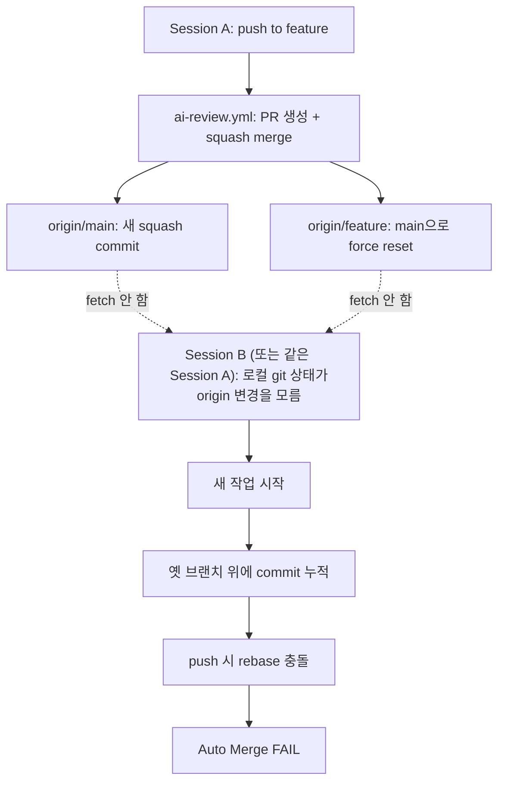

## 갭 (Before)

[Journal 002](/wiki/harness-engineering/harness-journal-002-inline-test-gate)에서 *부수 메시지*로 다음을 박제했었다:

> AI 자동 squash merge는 *로컬 git 상태와 origin을 갈라놓는다*. 사람이 매번 `git fetch origin && git reset --hard origin/main`을 해야 다음 작업이 안전하다.

이건 002의 *부수* 메시지였다. 핵심은 inline test gate였고, squash merge 함정은 그 PR(#91)에서 한 번 발생한 *우연*처럼 보였다. 같은 사고가 다시 발생할 *시간 함수* 형태의 위험이라고는 박제했지만, 그게 *얼마나 빨리 재발할지*는 측정 못 한 상태였다.

답이 나왔다. **같은 사이클 안에서**.

## 라이브 사고 #3 — 같은 함정, 다른 세션, 같은 결과

### 사건 시간순

```
[T+0:00]  Journal 002 PR #92 머지됨 (15:18:21Z)
          → ai-review.yml의 reset branch to main이 origin/002 브랜치를 main으로 동기화
          → 그러나 *다른 세션*의 로컬 git 상태는 그것을 모름

[T+?]     다른 세션이 mino-moneyflow에서 v0.9.14 작업 진행
          → "현재 브랜치가 main이라고 생각" 하지만 사실은 harness-journal-002-merge-gate-inline
          → v0.9.14 commit이 그 브랜치 위에 쌓임
          → v0.9.12, v0.9.13(이미 로컬에만 있던 commits)도 같은 브랜치에 누적

[T+?]     다른 세션이 push → ai-review.yml 트리거
          → Find or Create PR → PR #93 생성
          → Rebase onto main → 충돌 (*Journal 002 PR #91과 동일 사고*)
          → Auto Merge to main: [FAIL]

[T+?]     다른 세션이 사고를 발견
          → 사용자에게 옵션 3가지 제시 + 결정 대기
          → 사용자가 그 메시지를 *나(Journal 002 작성한 세션)에게 전달*
```

### 진단 결과

```bash
$ gh run list --branch harness-journal-002-merge-gate-inline
[FAIL] 🚀 Auto Merge to main      24285480424   ← 라이브 사고 #3
[ok]   🔒 Test Gate                24285480416
[FAIL] 🚀 Auto Merge to main      24285305742   ← 라이브 사고 #2 (Journal 002 PR #91)
[ok]   🔒 Test Gate                24285305746
```

같은 브랜치, 같은 워크플로, 같은 fail 단계 (Comment on conflict). 두 번 발생.

### PR #93의 commits

```
6e5b8c0 feat(trading): 5 GitHub 저장소 통합 — 기관급 분석 강화 1차 — v0.9.14   ← 다른 세션의 새 작업
13f8d6c ci(ai-review): inline Test Gate 추가 — Harness Journal 002       ← 이미 main에 squash로 들어감 (753aa0d)
ca01436 ci: Test Gate 게이트 워크플로 추가 — Harness Journal 001          ← 이미 main에 squash로 들어감 (7c47a1c)
f832b34 feat(data): KRX 공식 데이터 통합 — v0.9.13                       ← 로컬에만 있는 commit
5e6e329 feat(portfolio): PM v2 Phase 5 — 신뢰도 4요소 분해 — v0.9.12      ← 로컬에만 있는 commit
```

이미 squash로 main에 들어간 두 commit(`ca01436`, `13f8d6c`)이 *원본 형태로* 다시 cherry-pick되려 시도하면서 충돌. **정확히 Journal 002 PR #91과 같은 메커니즘**.

## 왜 이게 *우연이 아닌 패턴*인가

같은 사고가 *같은 사이클 안에서* 두 번 발생했다는 것은 통계가 아니다. 환경 구조에 박혀 있는 결함이 *어떤 사람이 작업해도 반드시 발생한다*는 증거다.

### 시스템 분석



이 흐름에서 *사람의 행동 1가지*가 빠진다: **새 작업 시작 전 `git fetch origin && git reset --hard origin/main`**. 이게 빠지면 100% 사고. 

문제는 *사람의 기억력*에 의존하는 가드는 *반드시 실패*한다는 것이다 ([compound-engineering-philosophy](/wiki/harness-engineering/compound-engineering-philosophy) 참조). 사고 발생 확률이 0이 아니라 *시간 함수*. 두 번 발생한 것은 시작에 불과.

## 회피 메커니즘 4가지 — 만들어야 할 것

이 사고를 *시스템 차원에서* 차단하는 메커니즘 후보. 임팩트 + 작업량 비교.

### 후보 A — ai-review.yml의 머지 후 PR 코멘트에 *로컬 정리 안내*

```yaml
# Squash Merge 성공 직후 추가할 step
- name: Notify local sync needed
  if: steps.merge.outputs.merged == 'true'
  uses: actions/github-script@v7
  with:
    script: |
      await github.rest.issues.createComment({
        ...
        body: [
          '## ✅ 머지 완료 — 다음 작업 시작 전 로컬 동기화 필수',
          '',
          '```bash',
          'cd <project-root>',
          'git fetch origin',
          'git checkout main',
          'git reset --hard origin/main',
          '```',
          '',
          '⚠️ 이 단계를 건너뛰면 다음 push에서 rebase 충돌이 발생합니다.',
          '(Harness Journal 002/003의 라이브 사고 사례)',
        ].join('\n'),
      });
```

**임팩트**: 중간 — 사람이 *PR을 보고 안내를 읽어야* 작동
**작업량**: 작음 — ai-review.yml에 step 1개 추가

### 후보 B — AI-AGENT-GUIDE.md에 *세션 시작 패턴* 박기

```markdown
## 세션 시작 시 필수 단계

매 세션 시작 시 (특히 git 상태가 dirty거나 마지막 push 이후 시간이 지났다면):

\`\`\`bash
git fetch origin
git status                          # 현재 브랜치와 origin 비교
# 만약 origin/main이 로컬 main보다 앞서 있다면:
git checkout main
git reset --hard origin/main        # *로컬 작업이 없는 경우만*
\`\`\`

**왜**: AI 자동 머지(ai-review.yml)는 squash merge 후 origin 상태를 변경하지만 *로컬은 모른다*. 새 작업을 옛 브랜치 위에 쌓으면 다음 push에서 100% 충돌. (Harness Journal 003 참조)
```

**임팩트**: 중간 — AI 세션이 자동 로드하지만 *읽고 따르는* 행동 의존
**작업량**: 중간 — 두 프로젝트의 AI-AGENT-GUIDE.md에 동일 섹션 추가

### 후보 C (가장 강력) — `.claude/commands/wt-branch.md` 슬래시 커맨드

```markdown
# /wt-branch — 새 작업을 worktree로 시작하는 안전한 분기

새 작업을 시작할 때 항상 이 커맨드를 사용한다.
*로컬 git 상태와 무관하게* origin/main에서 깨끗한 worktree를 만든다.

## 사용법

\`\`\`
/wt-branch <branch-name>
\`\`\`

## 동작

1. \`git fetch origin\` — 최신 상태 확보
2. \`git worktree add -b <branch-name> /tmp/<project>-<branch> origin/main\`
3. \`cd /tmp/<project>-<branch>\` — 새 작업 디렉터리로 이동
4. 사용자에게 알림: "워킹 디렉터리는 /tmp/...입니다. 작업 종료 후 \`git worktree remove\`로 정리하세요."

## 왜

- 원본 working tree(stale changes 포함)에 영향 0
- 로컬/origin diverge와 무관 (origin/main에서 직접 분기)
- worktree는 작업 종료 후 *제거*되므로 깨끗한 상태 유지
- Journal 002/003의 squash merge 함정을 *구조적으로* 차단

## 부작용 검토

- 두 worktree(원본 + 새 worktree)가 동시에 존재 — 디스크 공간 일시 사용
- 새 worktree는 별도 디렉터리이므로 IDE/에디터가 그쪽을 가리켜야 함
- *모든 새 작업이 이 커맨드를 거치도록* AI 협업 헌장에 명시 필요
```

**임팩트**: **매우 높음** — *행동 자체가 안전한 패턴*이 되므로 기억력 의존 0
**작업량**: 중간 — 슬래시 커맨드 정의 + AI-AGENT-GUIDE 통합 + 양쪽 프로젝트 적용

### 후보 D — post-merge git hook

```bash
# .git/hooks/post-merge
#!/bin/bash
echo "📥 Pulled new changes from origin"
echo "💡 다음 작업 시작 전 'git checkout main && git reset --hard origin/main' 권장"
```

**임팩트**: 낮음 — git pull 후에만 작동, ai-review.yml의 자동 머지에는 트리거되지 않음
**작업량**: 작음 — hook 파일 추가

### 비교

| 후보 | 임팩트 | 작업량 | 사람 행동 의존 |
|---|---|---|---|
| A. ai-review 코멘트 | 중간 | 작음 | **있음** (PR을 봐야 함) |
| B. AI-AGENT-GUIDE 패턴 | 중간 | 중간 | **있음** (AI가 패턴을 *따라야* 함) |
| **C. wt-branch 슬래시 커맨드** | **매우 높음** | 중간 | **없음** (행동 자체가 안전) |
| D. post-merge hook | 낮음 | 작음 | **있음** (메시지를 봐야 함) |

**가장 큰 임팩트는 후보 C**. 다른 후보들은 *사람이 안내를 보고 기억하고 따라야* 작동한다. 반면 wt-branch는 *행동 자체가 안전한 패턴*이라 사고가 발생할 수 없다. Compound Engineering의 일관된 원칙: *행동에 박는 가드 > 기억에 의존하는 가드*.

## 운영 데이터 — 사고 발생 빈도

- Journal 001 → Journal 002 사이: 1번 (PR #91)
- Journal 002 → Journal 003 사이: 1번 (PR #93, 다른 세션)
- **두 사이클 안에 2번**

샘플이 작지만 강력한 신호. 회피 메커니즘 도입 없이 *N 사이클 더 가면* 같은 사고가 *반드시 N번 더* 발생한다고 예측 가능.

### 정리되지 않은 PR

- **PR #93**: open. 충돌 해결 필요. *내가 임의로 cherry-pick할 수 없음* — v0.9.12 cherry-pick 시 CHANGELOG/VERSION/package.json/Sidebar.tsx 4개 파일 충돌 발생, 충돌 해결은 *코드 결정*이라 사용자/다른 세션 영역.

## 배운 것 / 다음 후보

### 핵심 통찰 1 — 두 번 발생하면 패턴

사고가 한 번 발생하면 *우연*일 수 있지만, 같은 사이클 안에서 두 번 발생하면 *시스템 결함*. 통계가 아니라 *환경의 본질*. 회피 메커니즘이 없으면 N번 더 발생.

### 핵심 통찰 2 — 자율 처리의 경계

*AI가 자율적으로 처리할 수 있는 일*과 *사람의 결정이 필요한 일*은 구분되어야 한다. 충돌 해결은 *코드 의도*에 대한 결정이라 자율 영역 밖. 자율 모드라도 *코드 결정*은 임의로 하면 안 된다. *내가 처리할 수 없는 것*은 *사용자에게 알리는 것*도 자율의 일부.

### 핵심 통찰 3 — 행동에 박는 가드 > 기억에 의존하는 가드

후보 C(wt-branch)가 다른 후보들을 압도하는 이유는 *행동 자체가 안전한 패턴*이 되기 때문. 안내·문서·코멘트는 사람이 *읽고 기억해야* 작동한다. 슬래시 커맨드/훅/검증 게이트는 *행동에 박혀 있어서* 기억력 의존 0.

### 다음 후보 (Journal 004 큐)

1. **wt-branch 슬래시 커맨드 구현 + 양쪽 프로젝트 적용** (후보 C)
2. **ai-review.yml에 머지 후 로컬 정리 안내 코멘트 추가** (후보 A) — 후보 C를 보완
3. **AI-AGENT-GUIDE.md 양쪽에 *Squash merge 함정과 회피 패턴* 섹션 추가** (후보 B) — 후보 C/A의 *맥락*을 박제
4. **PR #93 정리 후속 처리 보고** (사용자/다른 세션이 처리한 후 결과 박제)
5. **Journal 000 베이스라인 갱신** — 새 갭으로 *세션 간 git 상태 동기화 부재* 추가

### 회고 한 줄

> *"같은 사고가 두 사이클 안에 두 번 발생했다는 것은 회피 메커니즘이 *추가적인 개선*이 아니라 *전제 조건*이라는 뜻이다. 다음 사이클부터 반드시 후보 C를 도입한다."*

## For AI Agents

**Trigger**: `git rebase` 충돌, `Auto Merge FAIL`, "내 로컬이 왜 origin과 다르지?" 같은 질문 직면 시 / 다중 세션 환경에서 작업 시작 시

**Prerequisites**:
- [Harness Journal 002 — inline test gate](/wiki/harness-engineering/harness-journal-002-inline-test-gate)
- [Harness Journal 004 — /wt-branch 회피 메커니즘](/wiki/harness-engineering/harness-journal-004-wt-branch-command)

**Actionable Steps (함정 회피)**:
1. 새 작업 시작 전 *반드시* `/wt-branch <name>` 슬래시 커맨드 사용 — 행동에 박는 가드
2. 수동 작업이라면 `git fetch origin && git checkout main && git reset --hard origin/main` *먼저*
3. 그 다음에 *새 브랜치* 분기 또는 worktree
4. push 후 ai-review.yml 머지되면 로컬 main은 *자동 동기화되지 않음* — 다음 세션 시작 시 재동기화

**Actionable Steps (사고 이미 발생 시)**:
1. `git log origin/main --oneline -5` 와 현재 브랜치 log 비교 → merge-base 파악
2. cherry-pick 시도 → 충돌 발생 시 *즉시 abort*
3. `git worktree add -b <new-branch> /tmp/... origin/main`로 깨끗한 브랜치 분기
4. *필요한 commit만* cherry-pick (충돌 없을 때만)
5. 충돌이 있는 파일의 변경은 *사용자 결정 영역* — 자율 처리 X, 사용자에게 보고

**Anti-patterns**:
- ❌ squash merge 후 로컬 main 동기화 없이 새 작업 시작
- ❌ 옛 브랜치 위에 새 commit 계속 쌓기
- ❌ cherry-pick 충돌을 *임의로 해결* (코드 의도 결정)
- ❌ 같은 사고가 반복되는데 *회피 메커니즘을 시스템화하지 않음*

---

## 자기 점검

1. *우연*과 *패턴*을 가르는 기준은 무엇인가? (이 엔트리는 *2회 발생*을 패턴으로 박제했다 — 이게 너무 빠른가, 아니면 빠를수록 좋은가?)
2. *행동에 박는 가드*와 *기억에 의존하는 가드*의 차이를 다른 사람에게 한 문장으로 설명할 수 있는가?
3. 내가 *자율로 처리할 수 있는 일*과 *사용자 결정이 필요한 일*의 경계가 어디인가? cherry-pick 충돌 해결은 *어느 쪽*인가? (이 엔트리는 후자라고 결정했다)
4. 회피 메커니즘 4가지 중 후보 C가 가장 강력하다고 결정했는데, *부작용*은 어떤 게 있는가? (작은 작업도 worktree로 분기하는 게 과한지)
5. (열린 질문) Journal 003이 *제안 + 분석*에 멈추고 *구현은 다음 사이클*로 미룬 것이 옳은가? — 자율 모드에서 사용자 승인 없이 두 프로젝트를 동시에 만지는 게 위험했기 때문이지만, 그게 *너무 보수적*은 아닌가?

### 실습 과제

자신의 git 환경에서:

```bash
# 마지막 push 이후 며칠이 지난 시점에 새 작업을 시작한다고 가정하고:
git status                          # 현재 브랜치 확인
git fetch origin
git log HEAD..origin/main --oneline  # 로컬과 origin의 차이
```

origin/main이 로컬 main보다 *얼마나 앞서* 있는가? 그동안 *몇 번* push가 있었는가? 그 동안 *내가 한 번이라도* fetch 없이 새 작업을 시작했다면 — 같은 함정에 빠질 수 있다.

## 출처

- 라이브 사고 #2 (Journal 002 PR #91): [Mino777/mino-moneyflow#91](https://github.com/Mino777/mino-moneyflow/pull/91) (close)
- 라이브 사고 #3 (이번 PR #93): [Mino777/mino-moneyflow#93](https://github.com/Mino777/mino-moneyflow/pull/93) (open, 다른 세션 처리 필요)
- 입력 (Journal 002의 부수 메시지): [Harness Journal 002](/wiki/harness-engineering/harness-journal-002-inline-test-gate)

### 검증 메모

- *두 번째 사고가 다른 세션에서 발생했다*는 사실은 사용자가 직접 메시지로 전달한 정보 + `gh run list` 결과(`24285480424` Auto Merge FAIL + `24285480416` Test Gate ok)로 확인
- PR #93 commits 목록은 `gh pr view 93 --json commits`로 직접 확인
- v0.9.12 cherry-pick 충돌 4개 파일은 `git cherry-pick` 결과 메시지를 그대로 인용
- 회피 메커니즘 4가지는 *제안*. 아직 어느 것도 구현되지 않았음을 명시. 다음 사이클(Journal 004)에서 후보 C부터 구현 예정
- "두 번 발생 = 패턴"이라는 결론은 *해석*이지만, 같은 메커니즘의 두 사고가 같은 사이클 안에 발생한 것은 강한 신호라고 판단
- 운영 데이터 "두 사이클 안에 2번"의 표본은 작음을 명시 — 그러나 환경 구조 분석상 *시간 함수*로 발생할 가능성이 높음
