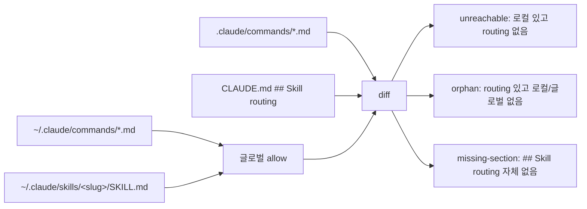

## 왜 쓰는가

[Skillify 원문 정리](/wiki/harness-engineering/skillify-failure-to-skill-practice)를 /ingest로 박은 바로 그 세션에, 엔트리 끝에 스스로 건 실습 과제("`scripts/check-skills-reachable.mjs` MVP 오늘 중 작성")를 실행했다. 메모리 룰 `feedback_dogfood_in_same_session.md` 준수.

이 저널은 *방법론 해설*이 아니라 **숫자**다. Garry Tan의 "40 skill 중 6 dark = 15%"가 우리 환경에선 얼마였는가, 그리고 dogfood 3시간으로 어디까지 해소됐는가.

## 시작 상태 — "글로벌 dark skill 지도"

9 repo 실측 (2026-04-23 오전):

| Repo | 로컬 스킬 | Skill routing 섹션 | unreachable | orphan |
|---|---:|:---:|---:|---:|
| ai-study (허브) | 13 | ✅ 21 매핑 | 0 | 0 |
| mino-moneyflow | 4 | ✅ 12 매핑 | 3 (autoceo, compound, wt-branch) | 1 (`checkpoint` stale) |
| mino-tarosaju | 4 | ✅ 12 매핑 | 3 동일 | 1 동일 |
| aidy-architect | 10 | ✅ 12 매핑 | **9** | 1 |
| aidy-server | 3 | ❌ 섹션 없음 | 3 (100%) | — |
| aidy-ios | 3 | ❌ 섹션 없음 | 3 (100%) | — |
| aidy-android | 3 | ❌ 섹션 없음 | 3 (100%) | — |
| gma-ios (회사 iOS) | 15 | ❌ 섹션 없음 | 14 (1개는 DEPRECATED) | — |

**합계**: 로컬 55 스킬 중 **38개 dark (69%)**. Garry Tan의 15%보다 4.6배 나쁨.

### 패턴 3가지

1. **"섹션 자체가 없음" (3 repo, 100% dark)** — Claude가 "언제 invoke해야 하는지" 모름. 스킬 파일은 존재하나 안 보임.
2. **"섹션은 있으나 부분 매핑" (3 repo)** — 초기 gstack 템플릿을 복사해놓고 자기 로컬 스킬은 추가 안 함. 새 스킬이 쌓일수록 dark 비율 증가.
3. **Stale orphan (`checkpoint` → `context-save`/`context-restore`)** — gstack이 개명했는데 로컬 routing은 옛 이름 유지.

## 허브 도구 — check-skills-reachable MVP

```bash
npm run check:skills                    # 현 프로젝트
npm run check:skills -- --project <path>  # 타 프로젝트
npm run check:skills -- --json          # CI 연동
```

### 감지 로직



exit code: `0`=정합 / `1`=mismatch / `2`=missing-section. vitest 6 케이스로 회귀 방지.

### 구현 중 만난 함정 (5분 버그)

CLAUDE.md에 *인라인 코드*로 "\`## Skill routing\`" 문자열이 들어있으면 regex `##\s+Skill\s+routing`이 거기 매치해서 **라우팅 0으로 오탐**. 해결: `^##\s+Skill\s+routing` 줄 단위 파싱 (single-line regex에 BOL 앵커 + 제대로 된 `^` 매칭). Anti-rationalization: "unit test만 통과하면 된다"고 판단한 게 오류. **실데이터 dogfood를 unit test보다 먼저**.

## 끝 상태 — 3시간 후

| Repo | 변경 | 결과 |
|---|---|---:|
| ai-study | 변경 없음 (이미 정합) | 0/0 ✅ |
| mino-moneyflow | routing +3 (로컬 스킬), checkpoint → context-save/restore | 0/0 ✅ PR #149 |
| mino-tarosaju | 동일 | 0/0 ✅ PR #59 |
| aidy-architect | routing +9 | 0/0 ✅ PR #14 |
| aidy-server | 섹션 신규 (gstack base + api-test/review/wt-branch) | 0/0 ✅ PR #7 |
| aidy-ios | 섹션 신규 (gstack base + tca-check/ios-test/review/wt-branch) | 0/0 ✅ PR #6 |
| aidy-android | 섹션 신규 (gstack base + compose-check/review/wt-branch) | 0/0 ✅ PR #6 |
| gma-ios | 섹션 신규 + orchestrate-layer DEPRECATED 삭제 | 0/0 ✅ 로컬 (Bitbucket auth 대기) |

**dark skill 38 → 0**. 순증 스킬: 0 (기존 스킬만 reachable하게 만듦). 순증 routing 엔트리: **+38**.

## 배포 패턴 — 재사용 가능

[멀티 repo resolver 롤아웃 패턴](../../docs/solutions/workflow/2026-04-23-multi-repo-resolver-rollout.md)으로 박제. 핵심 원칙 4가지:

1. **worktree에서 `origin/main` 분기** — 로컬 상태 무관 ([Journal 004](/wiki/harness-engineering/harness-journal-004-wt-branch-command) 패턴)
2. **파일 편집은 Bash(`awk`/`cat >>`)** — Edit/Write 훅 독립적 작동
3. **`set -uo pipefail` (not `-e`)** — 한 repo 실패해도 나머지 진행
4. **merge-back 단계에서 ff-only 실패 = 이미 squash-merged** → 정리만 ([Journal 003](/wiki/harness-engineering/harness-journal-003-squash-merge-trap-pattern) 재발 패턴 대응)

## 진단되지 않은 것 — 다음 스프린트 큐

`check-skills-reachable`은 **구조 테스트**다. "파일이 있고 routing에 이름이 있다"만 검증. 다음이 필요:

- **Step 5 LLM eval**: 실제 intent 문장이 올바른 skill을 발화시키는지. 예: "PR 리뷰해줘" → `ios-review` (aidy-ios) vs `review` (aidy-server) — fuzzy intent 해상도
- **Step 7 resolver eval**: intent golden set 20~30개로 라우팅 정확도 weekly 측정
- **"fucking shit" transcript 추출기**: `~/.claude/projects/*/` 세션 로그 grep으로 실패 순간 추출 → eval 씨드 공급 (Garry Tan 휴리스틱 직차용)

위 3개는 Skillify 10단계 중 구조 테스트 다음 레이어. 구조가 먼저 맞아야 의미 테스트가 가능하므로 이번 세션 Step 8 먼저 = 순서 올바름.

## 자기 점검

1. 우리 워커 6개가 100% dark였다는 건 **새 스킬 파일만 던지고 routing은 방치**하는 패턴이 반사행동이 아니었다는 뜻. 이 저널 이후 스킬 추가 시 *반드시* `npm run check:skills` 재실행해서 dark 유입 차단하는가?
2. `check-skills-reachable`의 exit code를 각 워커의 pre-push 훅에 추가하면 "새 스킬 추가 + routing 누락" 커밋이 구조적으로 차단된다. 이번 스프린트에선 안 함 — 언제 할 건가?
3. Garry Tan 기준 15% dark도 심각하다고 글에 썼는데 우리는 69%였다. 왜 더 나빴는가? (가설: 1인 운영 = 리뷰어 없음, 워커 repo 수가 많음, gstack 템플릿을 맹목 복사)
4. Step 5 LLM eval 착수 전에 **fuzzy intent 테스트 케이스 3개**를 지금 바로 적어볼 수 있는가? 없으면 "이건 어렵다" 재확인.
5. (열린 질문) **"skill 추가 = 항상 routing 추가"를 스크립트로 강제**하는 게 옳은가, 아니면 **의식적 판단**으로 남겨두는 게 옳은가? Garry Tan은 강제를 선호하고 Hermes는 자율 생성을 선호한다.

### 실습 과제

다음 세션 시작 시 `npm run check:skills`를 Phase 3 체크리스트에 포함 (이미 NEXT.md에 박음). 그리고 *스킬 하나*를 일부러 routing 없이 로컬에만 추가해보고 `check:skills`가 잡는지 직접 확인. 예상: exit 1 + unreachable 목록에 해당 스킬명. 예상 빗나가면 스크립트 버그 리포트.

## 출처

- 원본 방법론: [Skillify — Garry Tan](/wiki/harness-engineering/skillify-failure-to-skill-practice)
- 배포 패턴: [multi-repo resolver rollout solution](https://github.com/Mino777/ai-study/blob/main/docs/solutions/workflow/2026-04-23-multi-repo-resolver-rollout.md)
- 훅 우회 판단: [write-tool-hook-bash-bypass solution](https://github.com/Mino777/ai-study/blob/main/docs/solutions/workflow/2026-04-23-write-tool-hook-bash-bypass.md)
- 회고 (내부 메트릭): `docs/retros/2026-04-23.md`
- 이번 커밋: ai-study #77 (check-skills-reachable), #78 (mermaid auto-fix), aidy-architect #14 #15, moneyflow #149, tarosaju #59, aidy-server #7, aidy-ios #6, aidy-android #6
