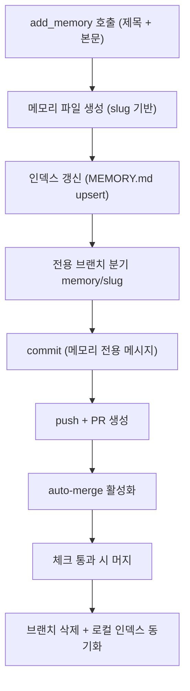

> 하네스 저널 시리즈. 한 RIBs/ReactorKit iOS 개발 하네스의 실제 작업에서 추출한 *익명화된* 전이 가능 패턴. 예시 앱은 `moneyflow`, 플러그인은 `team-harness`, 에이전트 네임스페이스는 `team-harness:`로 일반화한다.

## 문제: 사람이 직접 커밋하면 박제는 휘발한다

에이전트 하네스에서 "메모리"는 세션을 가로질러 살아남는 지식이다. 같은 실수를 두 번 하지 않게 하고, 한 세션이 발견한 함정을 다음 세션이 즉시 회상하게 만드는 장치다. 문제는 *기록 경로의 마찰*이다.

전통적 흐름은 이렇다. 작업 중 교훈을 발견한다 → 메모리 파일(`MEMORY.md`나 별도 노트)을 연다 → 항목을 쓴다 → 인덱스/목차를 손으로 갱신한다 → `git add` → 커밋 메시지를 짠다 → 푸시 → (정책에 따라) PR을 연다 → 리뷰를 기다린다 → 머지한다. 한 줄짜리 교훈을 박제하는 데 8~10단계가 든다.

이 마찰의 결과는 예측 가능하다. **사람도 에이전트도 귀찮아서 안 적는다.** "이건 다음에 적자"가 쌓이고, 세션이 끝나면 컨텍스트와 함께 증발한다. 실제 운영에서 관찰된 실패 모드:

- **세션 로컬 학습의 휘발**: 한 세션이 "이 빌드 캐시는 plugin version bump 없이는 갱신 안 됨"을 깨달아도, 커밋하지 않으면 다음 세션은 같은 30분을 다시 태운다.
- **인덱스 드리프트**: 파일은 추가됐는데 목차(`MEMORY.md` 인덱스)에 안 들어가, JIT 검색이 항목을 surface하지 못한다. 기록은 됐지만 *발견 불가*다 — 박제했으나 죽은 지식.
- **커밋 메시지 노이즈**: 메모리 커밋이 코드 커밋과 섞여 git log가 지저분해지고, 회고 때 "무엇이 학습이었나"를 분리하기 어렵다.
- **충돌**: 여러 세션(맥앱 / 웹 / 다른 터미널)이 동시에 메모리 파일을 손으로 편집하면 머지 충돌이 난다.

핵심은 *용량*이나 *검색 속도*가 아니라 **write 마찰**이다. 박제까지의 단계 수가 곧 박제율의 상한이다.

## add_memory: 단일 트랜잭션 흐름

해법은 박제 전 과정을 MCP 툴 한 번으로 압축하는 것이다. `team-harness:add_memory`를 호출하면 다음이 1트랜잭션으로 완결된다.

호출자(에이전트나 사람) 입장에서는 *제목과 본문 한 덩어리*만 넘긴다. 그 한 번의 호출이:

1. **파일 생성** — 제목에서 slug를 만들어 메모리 디렉토리에 파일을 쓴다.
2. **인덱스 갱신** — 목차(`MEMORY.md`)에 한 줄을 upsert한다. 같은 slug면 덮어쓰고, 새것이면 추가. 인덱스 드리프트가 구조적으로 불가능해진다.
3. **브랜치** — `memory/<slug>` 같은 전용 브랜치를 분기해 메모리 변경을 코드 변경과 격리한다.
4. **commit** — 메모리 전용 메시지로 커밋한다. git log에서 학습이 한눈에 보인다.
5. **PR + auto-merge** — PR을 열고 auto-merge를 켠다. 빌드/린트 체크가 통과하면 사람 개입 없이 머지된다.
6. **정리** — 머지 후 브랜치를 삭제하고 로컬 인덱스를 동기화한다.

마찰은 8~10단계에서 *1단계*로 줄었다. 트레이드오프는 분명하다. **편의를 위해 자동화에 권한을 위임**한다. 이 위임이 안전하려면 두 가지가 필요하다 — 권한 표면을 좁히는 것(다음 섹션)과, 실패를 silent하게 흘리지 않고 즉시 멈추는 것(이 패턴의 실패 모드는 [저널 032](/wiki/harness-engineering/harness-journal-032-memory-automation-failfast-slug-upsert)에서 다룬다: slug 충돌 upsert와 fail-fast가 핵심).

## read/write 권한 분리: 최소 권한 표면

순진하게 구현하면 메모리 MCP 서버 전체가 git push 토큰을 쥐게 된다. 그러면 `search_memory`처럼 *읽기만* 하는 호출에도 토큰이 메모리에 상주한다 — 불필요한 공격 표면이다.

이 하네스의 설계는 경로를 둘로 갈랐다.

| 경로 | 툴 예시 | 토큰 필요? | 비용/지연 |
|------|---------|-----------|-----------|
| **read** | `search_memory`, `harness_status` | 없음 (로컬 인덱스 읽기) | ~1~2ms, 무인증 |
| **write** | `add_memory` (PR 자동화) | git/PR 토큰 (최소 스코프) | 네트워크 + 체크 대기 |

`search_memory`와 `harness_status`는 로컬에 동기화된 인덱스 파일만 읽는다. 네트워크도 인증도 없다. 그래서 *어떤 세션이든, 토큰 설정 없이도* 메모리를 회상할 수 있다. 검색은 무료고 빠르다.

토큰이 필요한 건 `add_memory`의 PR 자동화 부분 *하나뿐*이다. 인증이 필요한 표면이 한 곳으로 좁혀진다. 이는 [MCP 툴의 action-level 인증](/wiki/harness-engineering/mcp-tools-action-level-auth) 패턴과 같은 철학이다 — 서버 단위가 아니라 *액션 단위*로 권한을 부여해, 읽기는 누구나, 쓰기(특히 외부 부작용을 내는 쓰기)만 토큰을 요구한다.

실패 모드 주의: read 경로가 write 경로에 *암묵적으로 의존*하면 분리가 무너진다. 예를 들어 `search_memory`가 "최신 상태를 보장하려면 먼저 pull"을 강제하면, 검색에도 네트워크/토큰이 끌려온다. 분리를 지키려면 search는 *마지막으로 동기화된 로컬 스냅샷*을 그냥 읽고, 동기화는 별도 명령(`harness_pull` 류)으로 빼야 한다. read는 stale을 허용하고 빠르게, write는 정확하게 — 이 비대칭이 분리의 핵심이다.

## self-contained 배포: dist 번들 커밋 → install = 즉시 실행

MCP 서버가 의존성을 런타임에 설치하면 새로운 마찰이 생긴다. 새 세션/새 머신마다 `npm install`이 돌고, 버전이 어긋나고, 네트워크가 없으면 죽는다. 메모리 시스템이 *바로 그 자리에서 의존성 해결로 막히면* 박제 마찰을 줄이려던 목표가 무색해진다.

이 하네스는 빌드 산출물(`dist` 번들)을 플러그인 저장소에 *커밋*한다. install 시점에 추가 빌드가 필요 없다 — 클론/install하면 곧장 실행된다. 트레이드오프:

- **장점**: 0 콜드스타트. 오프라인 동작. 모든 세션이 비트 단위로 동일한 서버를 쓴다(재현성).
- **비용**: 저장소가 커지고, 자산 변경 시 **반드시 version bump + 번들 재빌드 + 재커밋**을 해야 한다. 빠뜨리면 stale 번들이 install돼 "코드는 고쳤는데 동작은 옛날 그대로"인 유령 버그가 난다.

이 trap은 mid-session cutover에서 특히 잘 터진다 — 소스를 고쳤는데 배포된 번들/레지스트리는 갱신 전이라, 같은 세션 안에서 옛 코드가 돈다. version bump를 commit 게이트에 묶어두는 게 방어책이다.

## 팀 공유 효과: 머지된 박제가 전 세션 search로 surface

여기서 복리가 발생한다. `add_memory` → PR → auto-merge가 끝나면, 그 교훈은 *공유 기본 브랜치*에 들어간다. 다음에 어떤 세션이든 `harness_pull`로 동기화하면 새 항목을 로컬 인덱스로 받는다. 그리고 `search_memory`가 그것을 surface한다.

구체적으로:

- **세션 A** (월요일): "moneyflow 풀사이클 QA 진입은 STG seed fixture 복원이 선행돼야 함"을 발견 → `add_memory` 한 번 → 머지.
- **세션 B** (수요일, 다른 머신): QA가 안 켜져서 막힘 → `search_memory "풀사이클 진입 안됨"` → A의 항목이 1~2ms 만에 뜬다. 30분을 절약.

세션들이 *같은 지식 풀*을 공유하기에, 학습이 개인 세션의 컨텍스트 창에 갇히지 않는다. 단, 무한 누적은 그 자체로 함정이다 — 항목이 수백 개가 되면 search가 noise를 surface하고 신호가 묻힌다. 누적을 *발견 지도(discovery map)*로 관리하는 설계는 [메모리 무한 누적 vs JIT 발견 지도](/wiki/context-engineering/memory-unbounded-accumulation-jit-discovery-map)에서 다룬다. 박제는 쉽게, 그러나 누적은 의도적으로.

## ai-study JIT 검색 철학과의 연결

ai-study 위키 자체가 같은 원리로 돈다. 위키는 MDX를 직접 읽는 대신 `npm run search`로 관련 청크만 JIT로 뽑는다(331K → ~800 토큰, 99.8% 절감). 즉 **read 비용을 낮춘다.**

`add_memory`는 그 짝이다 — **write 마찰을 낮춘다.** 지식 시스템이 복리로 돌려면 두 쪽이 다 낮아야 한다:

- write 마찰만 낮으면: 기록은 쌓이는데 찾기 비싸 안 본다 → 죽은 아카이브.
- read 비용만 낮으면: 검색은 빠른데 아무도 안 적어 풀이 빈약하다 → 빈 검색.
- **둘 다 낮으면**: 적기 쉽고 찾기 싸서, 매 세션이 풀을 키우고 매 세션이 풀을 쓴다 → 복리 루프.

### 전이 체크리스트

다른 하네스에 이 패턴을 이식할 때:

1. **박제까지 몇 단계인가?** 5단계 이상이면 자동화 후보다. 한 호출로 압축할 수 있는가?
2. **인덱스 갱신이 호출에 포함되는가?** 파일만 만들고 목차를 손으로 갱신하면 드리프트가 난다. upsert를 트랜잭션에 넣어라.
3. **read와 write 권한이 분리됐는가?** search/status는 무인증 로컬, 토큰은 write 한 곳으로.
4. **read가 write에 암묵 의존하지 않는가?** 검색이 네트워크/pull을 강제하면 분리가 깨진다. stale 허용.
5. **배포가 self-contained인가?** 런타임 install 의존이면 콜드스타트/오프라인/버전 드리프트가 마찰로 되돌아온다. 단 번들 커밋은 version bump 규율과 한 세트다.
6. **실패가 fail-fast인가?** auto-merge가 silent하게 깨진 항목을 머지하면 죽은 박제가 생긴다. slug 충돌·체크 실패는 즉시 멈춰야 한다.

## 자기 점검

- 우리 하네스에서 "교훈 하나 박제"에 지금 몇 단계가 드는가? 그 단계 수가 우리 박제율의 상한이라는 게 체감되는가?
- 메모리 search가 토큰/네트워크를 요구하는가? 요구한다면 read/write가 분리돼 있지 않다는 신호다 — 어디서 새는가?
- 우리 MCP 서버는 런타임 install에 의존하는가, self-contained 번들인가? self-contained라면 version bump를 commit 게이트에 묶었는가?
- write 마찰과 read 비용 중 우리 시스템에서 더 높은 쪽은? 낮은 쪽만 자랑하고 있지는 않은가?
