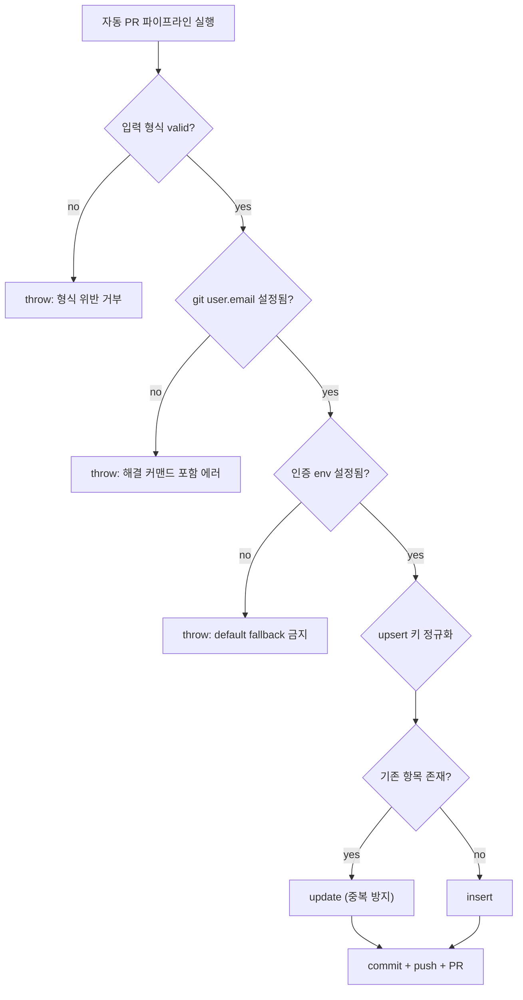

자동 PR 파이프라인을 운영하다 보면 직관과 어긋나는 사실 하나를 배운다. **가장 위험한 실패는 크게 터지는 실패가 아니다.** 크래시는 스택 트레이스를 남기고 워크플로우를 빨간불로 만든다. 타임아웃은 알림을 쏜다. 린트 에러는 PR을 막는다. 이것들은 모두 *시끄럽다*. 시끄러운 실패는 발견되고, 발견된 것은 고쳐진다.

진짜 적은 조용한 실패다. `exit 0` + 빈 응답 + 무변화. 파이프라인은 "성공"으로 표시되고, 알림은 오지 않으며, 며칠 뒤 누군가 "어? 그동안 왜 아무것도 안 쌓였지?" 하고 묻기 전까지 아무도 모른다. 이 저널은 한 RIBs/ReactorKit iOS 개발 하네스에서 실제로 겪은 세 가지 silent fail — git user.email 미설정, 인증 토큰 default fallback, slug 규약 불일치로 인한 upsert 중복 — 을 익명화해 박제한다. 셋 다 *명시적 throw(fail-fast)*와 *형식 강제 검증*으로 입구에서 차단하는 것이 정답이었다.

## 최악 시나리오: 크래시보다 무서운 silent fail

이 하네스에는 메모리/지식을 자동으로 PR로 커밋하는 파이프라인이 있다(관련 흐름은 [하네스 저널 031](/wiki/harness-engineering/harness-journal-031-mcp-memory-auto-pr-pipeline) 참고). 어느 날 "분명히 메모리를 추가했는데 레포에 아무것도 안 올라왔다"는 보고가 들어왔다. 로그를 봤더니 워크플로우는 **녹색**이었다. exit 0. 에러 한 줄 없음.

원인을 추적하니 커밋 단계에서 git이 user.email을 못 찾아 커밋을 만들지 못했는데, 그 실패가 `|| true` 비슷한 관용구에 삼켜져 후속 단계로 그냥 넘어간 것이었다. push할 게 없으니 push도 no-op, PR도 안 생김, 그러나 전체는 성공.

silent fail의 해악을 비용 관점에서 보면 명확하다.

| 실패 모드 | 표면화 시점 | 평균 회복 비용 |
|---|---|---|
| 크래시 (시끄러움) | 즉시 (빨간불) | 낮음 — 스택 트레이스가 위치를 알려줌 |
| 타임아웃 (시끄러움) | 즉시 (알림) | 낮음~중간 |
| **silent fail (조용함)** | **며칠 뒤, 우연히** | **높음 — 어디서 언제 끊겼는지 역추적 필요** |

silent fail이 비싼 이유는 *탐지 지연*이 곧 *디버깅 표면적 확대*이기 때문이다. 즉시 터지면 "방금 바꾼 그것"이 범인이다. 사흘 뒤 발견되면 그 사이의 모든 실행·환경 변화·캐시가 용의선상에 오른다. 그래서 하네스 자동화의 제1 설계 원칙은 단순하다. **무변화는 성공이 아니다. 의도된 변화가 없으면 명시적으로 실패시켜라.**



## 형식 강제 검증: 입구에서 거부

첫 방어선은 파이프라인이 *받아들이는 입력의 모양*을 강제하는 것이다. 자동화 도구는 사람이 손으로 검수하지 않으므로, 잘못된 모양의 입력이 들어오면 그대로 잘못된 산출물을 박제한다.

이 하네스에서는 메모리 엔트리에 두 가지를 강제했다.

1. **slug는 kebab-case 정규식을 통과해야 한다.** `^[a-z0-9]+(-[a-z0-9]+)*$`. 대문자·언더스코어·공백·한글이 있으면 호출 자체를 거부한다. slug는 파일명·URL·upsert 키로 동시에 쓰이므로 여기서 표기가 흔들리면 하류 전체가 흔들린다.
2. **본문은 "Why"와 "How" 라벨을 반드시 포함해야 한다.** 메모리 엔트리가 "무엇을 했다"만 적고 "왜"와 "어떻게 재현하나"를 빼면 미래의 에이전트가 못 쓴다. 그래서 두 라벨이 없으면 검증에서 떨군다.

핵심은 **위반 시 호출을 거부(reject)하는 것**이지, 조용히 보정하는 게 아니라는 점이다. 자동 보정은 매력적으로 보이지만 함정이다 — "kebab이 아니면 자동으로 kebab으로 바꿔주자"는 코드는 `My_Topic`을 `my-topic`으로 고쳐주다가 의도와 다른 정규화를 silent하게 적용해 또 다른 silent fail을 낳는다. 입력 검증의 역할은 *고치는 것*이 아니라 *거절하고 호출자에게 책임을 돌리는 것*이다.

이 형식 강제는 [AI 생성 콘텐츠 품질 게이트](/wiki/evaluation/ai-generated-content-quality-gate)와 같은 철학을 공유한다. LLM이 만든 산출물은 그럴듯하지만 형식이 미묘하게 어긋나기 쉬우므로, 사람의 눈을 거치지 않는 경로일수록 기계적 형식 게이트가 더 빡빡해야 한다.

## fail-fast 1: commit 전 git user.email 검증

silent fail #1의 직접 처방. 커밋을 시도하기 *직전에* `git config user.email`을 읽어, 비어 있으면 거기서 멈춘다. 단, 그냥 멈추기만 하면 다음 사람이 또 헤맨다. 에러 메시지에 **무엇이 잘못됐고 어떻게 고치는지**를 함께 담는다.

```
git user.email이 설정되지 않았습니다. 자동 커밋을 만들 수 없습니다.
다음 명령으로 설정하세요:
  git config user.email "you@example.com"
  git config user.name  "Your Name"
```

이 작은 차이가 회복 비용을 결정한다. "커밋 실패"만 던지면 디버깅이 필요하지만, 원인과 해결 커맨드가 함께 오면 복붙 한 번으로 끝난다. fail-fast의 진짜 가치는 *빨리 멈추는 것*이 아니라 *멈추는 지점에서 회복 경로를 제공하는 것*에 있다.

트레이드오프도 있다. fail-fast는 "그래도 부분적으로라도 진행하면 안 되나?"라는 욕구와 충돌한다. 답은 **자동화 경로에서는 No**다. 사람이 인터랙티브하게 쓰는 도구라면 부분 진행 후 경고가 합리적일 수 있지만, 사람이 안 보는 자동 파이프라인에서 부분 진행은 "절반만 박제된 상태"라는 더 나쁜 결과를 만든다. 자동화는 all-or-nothing이어야 추적 가능하다.

## fail-fast 2: 인증 env의 default값을 제거하라

silent fail #2는 더 음험했다. 인증 토큰을 읽는 코드가 `const token = process.env.AUTH_TOKEN || "default"` 패턴이었다. env가 미설정이면 `"default"`라는 무의미한 값으로 떨어졌고, 그 값으로 인증 시도 → 실패 → 하지만 실패가 또 다른 곳에서 삼켜짐. 결과는 역시 exit 0 + 무변화.

처방은 default fallback을 **제거**하고, 미설정이면 명확한 에러를 throw하는 것이다.

```
필수 환경변수 AUTH_TOKEN이 설정되지 않았습니다.
로컬:   export AUTH_TOKEN=... (또는 .env에 추가)
CI:     레포 Secrets에 AUTH_TOKEN 등록
```

이건 이 하네스 본체의 admin 환경변수 정책과 정확히 같은 원칙이다 — 필수 secret이 미설정이면 *런타임에 throw*한다. "기본값을 주면 친절하다"는 직관은 보안·자동화 맥락에서 거꾸로 작동한다. default값은 "잘못된 상태로도 일단 굴러가게" 만들어 문제를 숨긴다. 인증은 특히 그렇다 — 잘못된 토큰으로 굴러가는 시스템은 *작동하는 것처럼 보이지만 권한 경계가 무너진* 최악의 상태일 수 있다. 행동 레벨에서 인증을 어디서 강제할지에 대한 더 넓은 논의는 [MCP 툴 action-level 인증](/wiki/harness-engineering/mcp-tools-action-level-auth)을 참고하라.

규칙으로 압축하면: **"있으면 좋은 것"에는 default를 주고, "없으면 안 되는 것"에는 절대 default를 주지 마라.** 인증 토큰, git identity, 대상 레포 같은 전제 조건은 후자에 속한다.

## upsert 함정: slug 규약 변경이 legacy 갱신을 막고 중복을 만든다

silent fail #3은 셋 중 가장 미묘했고, 형식적으로는 "에러"조차 아니었다. slug 규약을 underscore(`my_topic`)에서 kebab-case(`my-topic`)로 바꾼 뒤, 기존 항목을 갱신하려던 upsert가 **갱신 대신 새 항목을 계속 만들어냈다.**

upsert는 키 동일성으로 insert와 update를 가른다. 그런데 갱신하려는 대상의 *현재 키*는 `my-topic`(새 규약)인데 저장소에 박제된 *legacy 키*는 `my_topic`(옛 규약)이었다. 두 문자열은 다르므로 upsert는 "기존에 없는 항목"으로 판단해 insert를 수행했다. 결과: 같은 주제가 `my_topic`과 `my-topic` 두 벌로 중복 박제. 크래시도 빨간불도 없으니 완벽한 silent 데이터 손상이었다.

처방은 **upsert 키를 비교하기 직전에 정규화(canonicalize)** 하는 것이다.

- 비교 시점에 양쪽 키를 같은 규약으로 변환한다 (예: underscore → kebab으로 통일).
- 그래야 `my_topic`과 `my-topic`이 같은 canonical 키로 수렴해 update 분기를 탄다.
- 한 번 update가 일어나면 legacy 표기가 새 규약으로 갱신되어 다음부터는 자연히 정합 상태가 된다.

여기서 얻은 더 일반적인 교훈은 **규약을 바꿀 때는 "키로 쓰이는 값"이 어디에 박제돼 있는지 먼저 수색하라**는 것이다. slug가 단순 표시용이면 규약 변경이 무해하지만, slug가 동시에 upsert 키·파일명·URL·연결 그래프의 노드 ID로 쓰이면 규약 변경은 *동일성 판정 로직 전체*에 파급된다. "표기 변경"은 거의 항상 "동일성 변경"을 동반한다.

## 교훈: 자기검증 없는 자동수정 도구는 신뢰하지 마라

세 사례를 관통하는 메타 교훈이 있다. **자동으로 무언가를 고치는 도구는, 자기 출력을 다시 입력으로 넣었을 때 같은 결과가 나오는지(idempotent) 검증되기 전까지 신뢰할 수 없다.**

- 형식 자동 보정(kebab으로 자동 변환)은 의도와 다른 정규화를 silent하게 적용할 수 있다.
- default fallback은 "고쳐주는 것처럼 보이지만" 실제로는 잘못된 상태를 숨긴다.
- 정규화 없는 upsert는 매 실행마다 중복을 silent하게 누적시킨다.

이 셋의 공통점은 *고친다고 주장하지만 자기 결과를 검증하지 않는다*는 점이다. 신뢰할 수 있는 자동화 도구의 조건은 두 가지다. 첫째, **위반은 고치지 말고 거부하라** — 책임을 호출자에게 돌리는 게 silent 보정보다 안전하다. 둘째, 꼭 고쳐야 한다면 **idempotent를 보장하라** — 한 번 고친 결과를 다시 넣어도 변화가 없어야 한다. 그렇지 않으면 매 실행마다 미세한 손상이 silent하게 쌓인다.

자동화 파이프라인 설계의 한 줄 요약: *무변화는 성공이 아니고, 기본값은 친절이 아니며, 보정은 검증 없이는 손상이다.*

## 자기 점검

- 내 자동 파이프라인에서 "exit 0이지만 아무것도 안 한" 실행을 탐지할 방법이 있는가? 무변화를 실패로 간주하는 가드가 있는가?
- 필수 전제 조건(인증·identity·대상)에 default fallback이 숨어 있지 않은가? 미설정 시 해결 커맨드를 담아 throw하는가?
- 키로 쓰이는 값(slug 등)의 표기 규약을 바꿀 때, 그 값이 upsert 키·파일명·URL·그래프 노드 ID로도 쓰이는지 먼저 수색했는가?
- 자동수정 코드는 idempotent한가? 출력을 다시 입력으로 넣어도 같은 결과가 나오는가, 아니면 매 실행마다 미세 손상이 쌓이는가?
